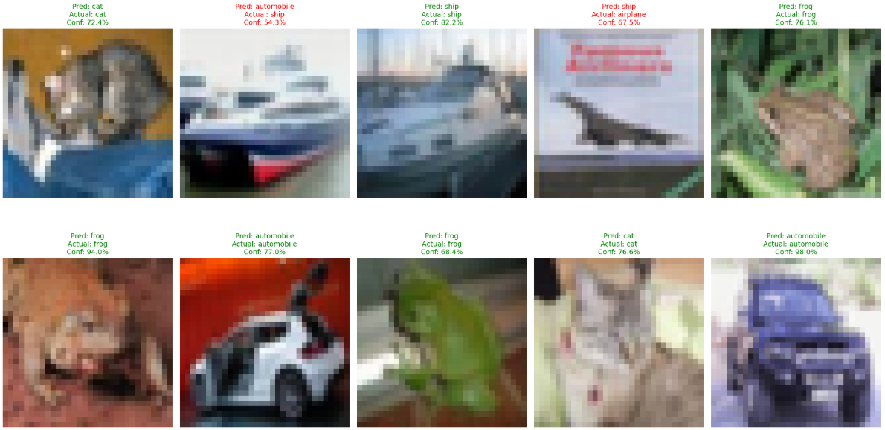

サーバで学習させたようなAIモデルを、エッジコンピュータと言われる限られたリソースの環境下で動作させたいようなことがままあります。

そんな際によく利用される手法が知識蒸留と呼ばれる手法です。

知識蒸留（Knowledge Distillation）とは、巨大で高性能なモデル（ **教師モデル / Teacher Model** ）の持つ知識を、より軽量でコンパクトなモデル（ **生徒モデル / Student Model** ）に継承させる手法のことです。

「精度は高いが計算が重い」モデルの知能を、「軽量で高速に動く」モデルに凝縮することを目的としています。


## 知識蒸留の基本構造

通常の学習では、正解ラベル（Hard Target）のみを学習しますが、知識蒸留では教師モデルが出力する「予測の確率分布（Soft Target）」を利用します。

* **教師モデル（Teacher）** : すでに学習済みの巨大なモデル（例：BERT-Large, GPT-3）。
* **生徒モデル（Student）** : これから学習する軽量なモデル（例：DistilBERT, TinyBERT）。
* **Soft Targets** : 教師モデルが各クラスに対して出力した確率値。


###  なぜ「Soft Target」が重要なのか？

例えば、画像認識で「犬」を分類する場合、教師モデルは以下のような確率を出力します。

* 犬：90%
* 猫：9%
* 車：1%

この「猫である確率が、車である確率よりも高い」という情報は、単なる正解ラベル（犬：100%）からは得られない、 **「クラス間の類似性や概念的な距離」** という重要な知識を含んでいます。生徒モデルはこの情報を手がかりにすることで、少ないパラメータ数でも効率的に学習できるのです。


### 主な手法の種類

知識をどの段階で取り出すかによって、いくつかの手法に分類されます。


#### ① Response-Based Distillation (出力層の蒸留)

最も一般的な手法。教師モデルの最終的な予測値（ロジット）を真似るように学習します。この際、 **Temperature（温度パラメータ）** という変数を使用して確率分布を滑らかにし、小さな確率の差異を強調することが多いです。


#### ② Feature-Based Distillation (中間層の蒸留)

最終結果だけでなく、モデルの「考え方」の途中経過（中間層の出力）を真似させます。生徒モデルの各層が、教師モデルの対応する層と同じような特徴量を抽出できるようにガイドします。


#### ③ Relation-Based Distillation (関係性の蒸留)

個々のデータに対する出力ではなく、「データAとデータBの似ている度合い」といった、データ間の関係性を教師モデルから継承します。


### 4. 知識蒸留のメリット

1. **軽量化・高速化** : 推論速度が劇的に向上し、モバイルデバイスやエッジ端末でも動作可能になります。
2. **精度の維持** : 軽量モデルを一から学習させるよりも、蒸留を用いたほうが高い精度に到達します。
3. **コスト削減** : クラウドサーバーの計算コストや消費電力を抑えることができます。


### 5. 代表的な活用例

* **DistilBERT / TinyBERT** : BERTの性能を維持しつつ、サイズを大幅に削減したモデル。
* **LLMの蒸留** : 巨大なLLM（Llama 3 70Bなど）が生成した高品質なデータを使い、より小さなモデル（Llama 3 8Bなど）を微調整する手法が広く使われています。

## 手法ごとの特徴

知識蒸留には、教師モデルの「どの段階の情報」に注目して学習させるかによって、大きく分けて**3つのパターン（Response-Based / Feature-Based / Relation-Based）**があります。

それぞれの特徴、メリット、および学習の焦点を整理して解説します。


### 1. Response-Based Distillation (出力層の蒸留)

最も一般的でシンプルな手法です。教師モデルが最終的に出した「予測結果（ロジット/確率分布）」を生徒が真似ます。

* **特徴**: 教師モデルの最終出力（Soft Target）を教師データとして使います。
* **学習の焦点**: 「この画像が犬である確率は90%だが、猫である確率も9%ある」といった、**クラス間の類似度**を学びます。
* **メリット**:
* 実装が非常に簡単。
* 教師モデルの内部構造（中間層の数や次元）を知らなくても、出力さえあれば実行できる（ブラックボックスなモデルでも可能）。
* **デメリット**: 中間層で行われている複雑な特徴抽出のプロセスは無視されるため、情報の継承に限界がある。


### 2. Feature-Based Distillation (中間層・特徴量の蒸留)

最終的な答えだけでなく、モデルが「途中で何を考えているか（特徴抽出のプロセス）」を真似させます。

* **特徴**: 中間層（中間特徴マップ）の出力を比較します。
* **学習の焦点**: 「どこにエッジがあるか」「どのようなテクスチャに注目しているか」といった、**情報の処理プロセス**そのものを学びます。
* **メリット**:
* Response-Basedよりも深い知識の継承が可能。
* 生徒モデルの精度がより教師に近づきやすい。
* **デメリット**:
* 教師と生徒で中間層の次元（チャンネル数など）が異なる場合、次元を合わせるための変換層（アダプター）が必要になり、計算が複雑になる。

### 3. Relation-Based Distillation (関係性の蒸留)

個々のデータに対する出力ではなく、「データ同士の関係性」を真似させます。

* **特徴**: 複数のデータ（サンプルA、B、C...）を同時に入力し、教師モデルがそれらをどう関連付けたかを比較します。
* **学習の焦点**: 「データAとデータBは非常に似ているが、Cとは遠い」といった、**データの構造的な配置（類似性マップ）**を学びます。
* **メリット**:
* 個別の値そのものを真似る必要がないため、モデルの構造的な制約を最も受けにくい。
* データの「意味的な空間」を効率的に構築できる。
* **デメリット**:
* バッチ内のデータ間の関係を計算するため、計算コスト（メモリ消費）が高くなる傾向がある。


### 3つのパターンの比較まとめ

| 手法               | 注目する場所   | 何を学ぶか                                 | 実装の難易度          |
| ------------------ | -------------- | ------------------------------------------ | --------------------- |
| **Response** | 最終出力層     | **答えの出し方** (Soft Targets)      | 低 (簡単)             |
| **Feature**  | 中間層         | **情報の見方** (Hidden Features)     | 中 (次元合わせが必要) |
| **Relation** | データ間の関係 | **データの距離感** (Sample Affinity) | 高 (行列計算が複雑)   |

実際の開発現場では、これらを組み合わせて「Response-Based + Feature-Based」のように、複数の損失関数を混ぜて学習させることが一般的です。


## 実際の実装法

上記のResponseの場合での実装法について説明します。
Response-Based Distillationは、知識蒸留の中で最も一般的かつ強力な手法です。
これは、教師モデルの最終出力である「ロジット（Softmax直前の値）」を生徒が模倣する方法です。

### Response-Based Distillation の実装手順

#### 1. 温度パラメータ  による確率分布の平滑化

通常の学習では、Softmax関数によって正解クラスが 1.0 に近く、それ以外が 0 に近い「尖った分布」になります。Response-Basedでは、出力を （Temperature）で割ることで、分布をあえて「なだらか」にします。

* **理由**: なだらかにすることで、教師モデルが持っている「正解以外のクラスとの類似性（例：猫は犬に似ているが、車には似ていない）」という微細な情報（ダークナレッジ）を生徒が受け取りやすくするためです。

#### 2. ソフトターゲットとソフト予測の算出

実装コード内の以下の部分が該当します。

```python
# 教師の出力をなだらかにする（ソフトターゲット）
soft_targets = F.softmax(teacher_logits / T, dim=1)

# 生徒の出力をなだらかにする（ソフト予測）
student_log_soft = F.log_softmax(student_logits / T, dim=1)

```

教師の知識を「正解（ターゲット）」とし、生徒がそれにどれだけ近いかを計算する準備をします。

#### 3. KLダイバージェンス（KL散布度）による誤差計算

2つの確率分布がどれくらい似ているかを測る指標として **KLDivLoss** を使用します。

```python
distill_loss = nn.KLDivLoss(reduction='batchmean')(student_log_soft, soft_targets) * (T * T)

```

* **ポイント**:  を掛けるのは、Softmaxを  で割ったことによって小さくなった勾配のスケールを元に戻し、学習を安定させるための数学的な調整です。

#### 4. 通常の学習ロス（Cross Entropy）との結合

教師の真似をするだけでは、本来の正解ラベル（Hard Target）を疎かにしてしまう可能性があります。そのため、通常のロスと合算します。

```python
loss = alpha * distill_loss + (1. - alpha) * hard_loss

```

* **alpha**: このバランスを調整するハイパーパラメータです。


### 実装の全体像まとめ

Response-Basedの実装手順を整理すると以下のようになります。

1. **Teacherの固定**: `teacher.eval()` で教師モデルを推論モードにする。
2. **ロジットの抽出**: 教師と生徒の両方から Softmax 前の値を取得する。
3. **温度スケーリング**: 両方のロジットを  で割る。
4. **分布の比較**: KLダイバージェンスで「分布の形状の差」を計算。
5. **総合ロスの最小化**: 正解ラベルとの誤差も加えて逆伝播（`loss.backward()`）を行う。


teacher_model, student_modelを事前に構築しておいた状態で、学習を行うコードを示します。

```python
import torch.nn.functional as F

# 知識蒸留用の損失関数（再掲・最適化版）
def distillation_loss_fn(student_logits, teacher_logits, labels, T=3.0, alpha=0.5):
    # 1. Distillation Loss (教師の「振る舞い」を真似る)
    # Tで割ることで確率分布を滑らかにし、小さな差異を強調する
    soft_targets = F.softmax(teacher_logits / T, dim=1)
    student_log_soft = F.log_softmax(student_logits / T, dim=1)
    distill_loss = nn.KLDivLoss(reduction='batchmean')(student_log_soft, soft_targets) * (T * T)

    # 2. Student Loss (「正解」を当てる)
    hard_loss = F.cross_entropy(student_logits, labels)

    # 二つのロスの加重平均
    return alpha * distill_loss + (1. - alpha) * hard_loss

def train_knowledge_distillation(teacher, student, train_loader, test_loader, epochs=10, T=3.0, alpha=0.5):
    device = torch.device("cuda" if torch.cuda.is_available() else "cpu")
    optimizer = torch.optim.Adam(student.parameters(), lr=1e-4)
    
    for epoch in range(epochs):
        student.train()
        teacher.eval() # 教師は常に評価モード
        
        train_loss = 0
        correct = 0
        total = 0
        
        for images, labels in train_loader:
            images, labels = images.to(device), labels.to(device)
            
            # 教師モデルの予測（勾配計算不要）
            with torch.no_grad():
                teacher_logits = teacher(images)
            
            # 生徒モデルの予測
            student_logits = student(images)
            
            # ロスの計算
            loss = distillation_loss_fn(student_logits, teacher_logits, labels, T, alpha)
            
            # バックプロパゲーション
            optimizer.zero_grad()
            loss.backward()
            optimizer.step()
            
            train_loss += loss.item()
            _, predicted = student_logits.max(1)
            total += labels.size(0)
            correct += predicted.eq(labels).sum().item()

        # テスト精度検証
        val_acc = evaluate_model(student, test_loader, device)
        
        print(f"Epoch [{epoch+1}/{epochs}] "
              f"Loss: {train_loss/len(train_loader):.4f} | "
              f"Train Acc: {100.*correct/total:.2f}% | "
              f"Test Acc: {val_acc:.2f}%")

def evaluate_model(model, loader, device):
    model.eval()
    correct = 0
    total = 0
    with torch.no_grad():
        for images, labels in loader:
            images, labels = images.to(device), labels.to(device)
            outputs = model(images)
            _, predicted = outputs.max(1)
            total += labels.size(0)
            correct += predicted.eq(labels).sum().item()
    return 100. * correct / total


# 実行
train_knowledge_distillation(teacher_model, student_model, train_loader, test_loader)

# --- モデルの保存 ---
# 保存先のパスを指定
TEACHER_SAVE_PATH = "teacher_resnet18_cifar10.pth"
STUDENT_SAVE_PATH = "student_custom_cnn_distilled.pth"

# 教師モデルの保存（既に学習済みですが、セットで管理するために保存します）
torch.save(teacher_model.state_dict(), TEACHER_SAVE_PATH)
print(f"Teacher model saved to {TEACHER_SAVE_PATH}")

# 蒸留された生徒モデルの保存
torch.save(student_model.state_dict(), STUDENT_SAVE_PATH)
print(f"Distilled Student model saved to {STUDENT_SAVE_PATH}")
```

学習させた生徒モデルは以下の構成で、先生にはResNet50をチョイスしました。

```python
# 生徒: さらに軽い「カスタムCNN」 (MobileNetV2よりもさらにシンプルに)
student = nn.Sequential(
    nn.Conv2d(3, 16, kernel_size=3, padding=1),
    nn.ReLU(),
    nn.MaxPool2d(2),
    nn.Conv2d(16, 32, kernel_size=3, padding=1),
    nn.ReLU(),
    nn.MaxPool2d(2),
    nn.Flatten(),
    nn.Linear(32 * 8 * 8, 10)
)
```

知識蒸留による学習の経過です。
```
Epoch [1/10] Loss: 2.7949 | Train Acc: 39.32% | Test Acc: 46.89%
Epoch [2/10] Loss: 2.0894 | Train Acc: 50.08% | Test Acc: 51.71%
Epoch [3/10] Loss: 1.8716 | Train Acc: 53.21% | Test Acc: 53.80%
Epoch [4/10] Loss: 1.7370 | Train Acc: 55.53% | Test Acc: 55.51%
Epoch [5/10] Loss: 1.6362 | Train Acc: 57.19% | Test Acc: 56.82%
Epoch [6/10] Loss: 1.5552 | Train Acc: 58.76% | Test Acc: 58.04%
Epoch [7/10] Loss: 1.4866 | Train Acc: 60.00% | Test Acc: 59.82%
Epoch [8/10] Loss: 1.4295 | Train Acc: 61.14% | Test Acc: 60.66%
Epoch [9/10] Loss: 1.3808 | Train Acc: 62.05% | Test Acc: 59.94%
Epoch [10/10] Loss: 1.3385 | Train Acc: 62.99% | Test Acc: 61.51%
```

testで正解率が60%程度。
生徒モデルはかなり小さいCNNなので上出来ではないでしょうか。

生徒モデルを先生を使って学習した結果の推論結果です。




ということで知識蒸留の有効性について確認する実験でした。


