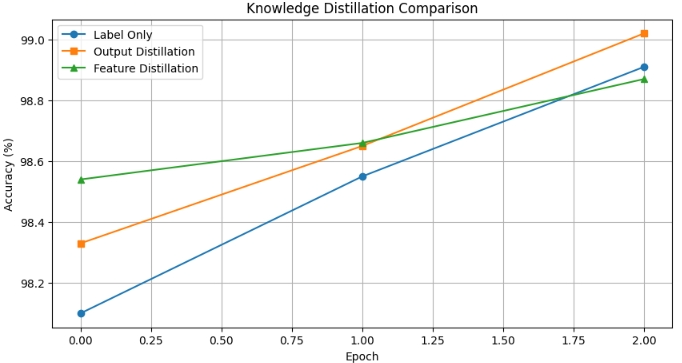
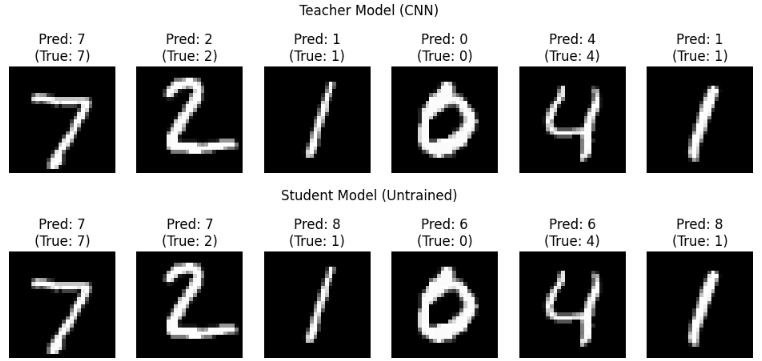

知識蒸留における「出力のみ（Response-based）」と「中間層（Feature-based）」の違いを比較する実験として、**MNIST（手書き数字）の分類タスクを用いた軽量な実験**を行いました。

本試験はGoogle Colabで数分以内に完了することが出来るものです。

## 実験目的
知識蒸留の方法として出力層の蒸留と中間層・特徴量の蒸留があります。
一般的には中間層・特徴量の蒸留の方がより良いとされています。
実際のところどうなのかということを実験してみようと思います。

## 実験の概要
### 実験環境
google colab

### 実験モデル
先生モデルと生徒モデルを以下のように用意します。

1. **教師モデル (Teacher):** 高性能なCNN（例：3層のConv層 + 隠れ層512次元）。
2. **生徒モデル (Student):** 非常にシンプルなMLP（例：1層の隠れ層128次元）。
3. **比較パターン:**

比較パターンは3種類です。
* **Baseline:** 生徒モデルを通常のラベルのみで学習。
* **Pattern A (出力蒸留):** 教師のSoft Target（確率分布）のみを模倣。
* **Pattern B (特徴蒸留):** 教師の中間層（512次元）を生徒の中間層（128次元）で模倣（Regressorを使用）。

### 実験に使うデータセット
MNIST（手書き数字）

### 期待される結果
正解率で比較を行い、おそらくは、以下のような結果になると期待しています。

BaseLine < Pattern A < Pattern B


## Google Colab用 実装コード
今回実験にあたり工夫した内容は以下通りです。

1. 先生・生徒モデルサイズ

小さすぎると、中間層からの特徴量を比較できなくなるため、先生3層に対して生徒2層。
先生側には問題をしっかりと学習してもらうため、epochは8回を設定。
生徒側は先生から直接教えてもらうため、学習のepochは少な目に設定。

2. 表現整合レイヤ

先生モデルと生徒モデルの中間層のサイズが変わるため、揃える必要があります。
→表現整合レイヤとしてregressorを用います。
生徒側の特徴量を、先生側の特徴量にマッピングします。
このネットワークも学習と同時に学習していきます。

3. 特徴量の正規化

教師・生徒で 特徴量のスケールが異なると、MSEがスケール差を学習してしまうことになります。
このため、正規化を行い、スケールを揃えます。
これにより学習が安定化されます。


といったことを意識した上で以下のようにコードを実装しました。
実行することで、学習法ごとの精度の違いを検証できます。

```python
import torch
import torch.nn as nn
import torch.optim as optim
import torch.nn.functional as F
from torchvision import datasets, transforms
from torch.utils.data import DataLoader
import matplotlib.pyplot as plt
import numpy as np
import random

# ===============================
# 1. 再現性・環境設定
# ===============================
seed = 0
torch.manual_seed(seed)
np.random.seed(seed)
random.seed(seed)
torch.backends.cudnn.deterministic = True
torch.backends.cudnn.benchmark = False

device = torch.device("cuda" if torch.cuda.is_available() else "cpu")
print(f"Using device: {device}")

transform = transforms.Compose([
    transforms.ToTensor(),
    transforms.Normalize((0.1307,), (0.3081,))
])

train_loader = DataLoader(
    datasets.MNIST('./data', train=True, download=True, transform=transform),
    batch_size=64, shuffle=True
)
test_loader = DataLoader(
    datasets.MNIST('./data', train=False, transform=transform),
    batch_size=1000
)

# ===============================
# 2. モデル定義
# ===============================

# ---- Teacher (やや厚めCNN) ----
class TeacherModel(nn.Module):
    def __init__(self):
        super().__init__()
        self.features = nn.Sequential(
            nn.Conv2d(1, 32, 3, padding=1), nn.ReLU(),
            nn.Conv2d(32, 64, 3, padding=1), nn.ReLU(),
            nn.MaxPool2d(2),

            nn.Conv2d(64, 128, 3, padding=1), nn.ReLU(),
            nn.MaxPool2d(2)
        )
        self.fc1 = nn.Linear(128 * 7 * 7, 512)
        self.fc2 = nn.Linear(512, 10)

    def forward(self, x):
        x = self.features(x)
        x = x.view(x.size(0), -1)
        feat = F.relu(self.fc1(x))
        logits = self.fc2(feat)
        return logits, feat


# ---- Student (Convベースで表現を近づける) ----
class StudentModel(nn.Module):
    def __init__(self):
        super().__init__()
        self.features = nn.Sequential(
            nn.Conv2d(1, 16, 3, padding=1), nn.ReLU(),
            nn.MaxPool2d(2),

            nn.Conv2d(16, 32, 3, padding=1), nn.ReLU(),
            nn.MaxPool2d(2)
        )
        self.fc1 = nn.Linear(32 * 7 * 7, 128)
        self.fc2 = nn.Linear(128, 10)

    def forward(self, x):
        x = self.features(x)
        x = x.view(x.size(0), -1)
        feat = F.relu(self.fc1(x))
        logits = self.fc2(feat)
        return logits, feat


# ===============================
# 3. 評価関数
# ===============================
def test(model):
    model.eval()
    correct = 0
    with torch.no_grad():
        for data, target in test_loader:
            data, target = data.to(device), target.to(device)
            logits, _ = model(data)
            pred = logits.argmax(dim=1)
            correct += pred.eq(target).sum().item()
    return 100. * correct / len(test_loader.dataset)


# ===============================
# 4. 学習ループ（蒸留切替）
# ===============================
def train_process(teacher, student, mode='none', epochs=5, alpha=0.7):
    student.to(device)
    teacher.eval()

    if mode == 'feature':
        regressor = nn.Sequential(
            nn.Linear(128, 512),
            nn.BatchNorm1d(512)
        ).to(device)
        optimizer = optim.Adam(
            list(student.parameters()) + list(regressor.parameters()), lr=1e-3
        )
    else:
        regressor = None
        optimizer = optim.Adam(student.parameters(), lr=1e-3)

    history = []
    print(f"\n=== Training Mode: {mode} ===")

    for epoch in range(1, epochs + 1):
        student.train()
        for data, target in train_loader:
            data, target = data.to(device), target.to(device)
            optimizer.zero_grad()

            s_logits, s_feat = student(data)
            with torch.no_grad():
                t_logits, t_feat = teacher(data)

            loss_cls = F.cross_entropy(s_logits, target)

            if mode == 'output':
                T = 3.0
                loss_distill = F.kl_div(
                    F.log_softmax(s_logits / T, dim=1),
                    F.softmax(t_logits / T, dim=1),
                    reduction='batchmean'
                ) * (T ** 2)
                loss = alpha * loss_cls + (1 - alpha) * loss_distill

            elif mode == 'feature':
                # ---- Feature正規化付き蒸留 ----
                s_proj = F.normalize(regressor(s_feat), dim=1)
                t_norm = F.normalize(t_feat, dim=1)
                loss_distill = F.mse_loss(s_proj, t_norm)
                loss = alpha * loss_cls + (1 - alpha) * loss_distill

            else:
                loss = loss_cls

            loss.backward()
            optimizer.step()

        acc = test(student)
        history.append(acc)
        print(f"Epoch {epoch}: Test Accuracy = {acc:.2f}%")

    return history


# ===============================
# 5. 実行
# ===============================

# ---- 教師モデル学習 ----
print("\n--- Training Teacher Model ---")
teacher = TeacherModel().to(device)
t_optimizer = optim.Adam(teacher.parameters(), lr=1e-3)

for epoch in range(0, 8):
    teacher.train()
    for data, target in train_loader:
        data, target = data.to(device), target.to(device)
        t_optimizer.zero_grad()
        logits, _ = teacher(data)
        loss = F.cross_entropy(logits, target)
        loss.backward()
        t_optimizer.step()

    print(f"Teacher Epoch {epoch}: Accuracy = {test(teacher):.2f}%")

# ---- Student比較 ----
epochs = 3
history_none = train_process(teacher, StudentModel(), mode='none', epochs=epochs)
history_output = train_process(teacher, StudentModel(), mode='output', epochs=epochs)
history_feature = train_process(teacher, StudentModel(), mode='feature', epochs=epochs)


# ===============================
# 6. 可視化
# ===============================
plt.figure(figsize=(10, 5))
plt.plot(history_none, marker='o', label='Label Only')
plt.plot(history_output, marker='s', label='Output Distillation')
plt.plot(history_feature, marker='^', label='Feature Distillation')
plt.xlabel("Epoch")
plt.ylabel("Accuracy (%)")
plt.title("Knowledge Distillation Comparison")
plt.legend()
plt.grid(True)
plt.show()

```

## 実験結果

1. **Baseline vs Pattern A:** 出力（確率分布）を真似るだけで、生徒モデルは「どの数字がどの数字に似ているか」という教師の判断基準を学び、精度が向上します。
2. **Pattern A vs Pattern B:** 特徴ベースの蒸留は、中間層（抽象的な概念）を直接コピーするため、出力のみよりもさらに収束が早く、高い精度（特にデータが少ない場合）に到達しやすくなります。

__学習ごとのtestの正解率結果__

学習法ごとの学習に使っていないtestデータの正解率の推移を以下に示します。
もう少し差が出てればわかりやすかったですが。。。

中間層・特徴量による知識蒸留が最良となることを期待しましたが、結果は出力を用いた知識蒸留が最良となりました。



結果の考察です。
結論ですが、 **Feature蒸留の効果は「高難度タスク」で顕在化しやすい** 。

過去研究でも：

- CIFAR-10/100
- ImageNet
- Dense Prediction（Segmentation）

では
Feature蒸留 ≥ Output蒸留 になりやすいようです。

一方、
- MNIST
- Fashion-MNIST
- 低解像度・単純分類

では
出力のみによる蒸留が勝つ ケースが非常に多いようです。

結果が分かっていまさらですが、MNISTはタスクとしては簡単すぎて、特徴量を使う知識蒸留を使うほどのタスクではなかった、ということかもしれません。

__絵ごとの推論結果比較__

先生モデルと特徴量の知識蒸留を行った生徒モデルを、同じ数字画像で推論させています。
両方とも正解率が高いので、間違いが出ませんでした。



