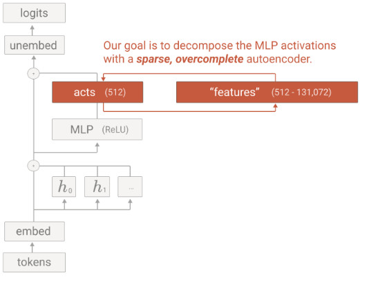
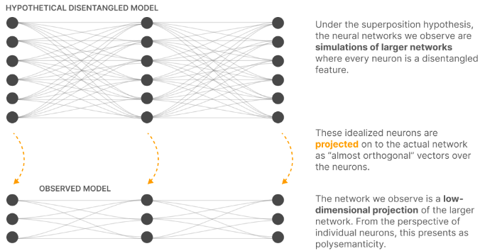

## アブスト
この論文は、**「LLMの内部状態を、人間が理解しやすい“単一の意味を持つ特徴（monosemantic features）”に分解する」** ことを目指した研究です。

### 背景：ニューロンは「多義的」すぎる

通常、LLMの内部は多数のニューロン（あるいは隠れユニット）で構成されています。  
しかし、1つのニューロンはしばしば

- 猫の顔
- 車のフロント
- 人の顔の一部

など、**全く関係ない複数の概念に反応**します。  
このように「1つのニューロンが複数の意味を担う」状態を **polysemantic（多義的）** と呼びます。

多義的だと、人間が「このニューロンは何を表しているか？」を理解するのが難しくなります。

### この論文の狙い：monosemantic（単義的）な特徴を見つける

そこでこの論文では、

> 「ニューロンよりも良い“分析の単位”があるのではないか？」

という仮説を立てます。  
その単位を **feature（特徴）** と呼び、**それぞれのfeatureが1つの概念だけを表す（monosemantic）ように分解する**ことを目指します。

具体的には、

- 1つの層のニューロン活性（例：512次元のベクトル）を入力として
- **スパースオートエンコーダ（sparse autoencoder）** という「辞書学習（dictionary learning）」の手法を使い
- 512次元よりもはるかに多い **4000個以上のfeature** に分解します。

### 得られたfeatureの例

分解して得られたfeatureは、例えば次のような「単一の概念」に対応します。

- DNA配列
- 法律用語
- HTTPリクエスト
- ヘブライ語のテキスト
- 栄養に関する記述

など、**人間が直感的に理解できる概念**が、それぞれ独立したfeatureとして現れます。

### 評価：本当に「より解釈しやすい」のか？

論文では、このfeatureが本当にニューロンより解釈しやすいかを検証しています。

- **ブラインド評価**：人間の評価者に「ニューロンの説明」と「featureの説明」を見せ、どちらが分かりやすいかを点数付けしてもらう。
- **自動解釈（autointerpretability）**：  
  大きなLLMに「このfeatureは何を表しているか？」を説明させ、その説明から元のfeatureの活性をどれだけ予測できるかで、説明の質を測る。

その結果、**featureの方がニューロンよりずっと解釈しやすい**ことが示されています。

## 問題設定

この論文の **Problem Setup（問題設定）** は、ざっくり言うと

> 「LLMの内部状態は高次元すぎて人間には読めないので、  
>  それを“独立した、人間が理解できる部品（feature）”に分解する問題を定義する」

というものです。
もう少し詳しく分解すると、次のような流れになっています。

### 1. 次元の呪い（curse of dimensionality）

- LLMの内部状態は、ニューロン（あるいは隠れユニット）の活性ベクトルとして表現されます。
- モデルが大きくなるほど、この**内部状態の空間（latent space）の次元数が増え、体積が指数的に膨れ上がる**ため、人間が直接理解・探索・列挙することは現実的ではありません。
- 著者らは、この空間を**独立な成分に分解し、それぞれを個別に理解できる形にしない限り、解釈は不可能**だと主張します。

### 2. なぜ「単純な1層Transformer＋MLP」を対象にするのか

- 著者らは、**「attention-only」の1層Transformer**については、以前の論文（A Mathematical Framework for Transformer Circuits）で、内部状態を直接扱わずに解析できる方法を示しました。
- しかし、**MLP層（ReLU活性化付きの全結合層）を含む、ごく標準的な1層Transformer**になると、そのような回避策は使えません。
- このモデルは構造としては非常に単純ですが、**MLPの内部状態を分解しないと、その挙動を本質的に理解できない**ため、
  - 「最も単純な、しかし我々が“深く理解できていない”言語モデル」
  として、この論文の研究対象に選ばれています。

### 3. 解きたい問題：MLP活性を「feature」に分解する

この論文が設定する具体的な問題は：

> 「1層TransformerのMLP層の活性ベクトルを、  
>  人間が解釈可能な“feature”の集合に分解せよ」

というものです。

ここでいう **feature** とは：

- ニューロン活性の線形結合（パターン）として表される
- それぞれが**単一の概念**（例：DNA配列、法律用語、HTTPリクエストなど）に対応する
- 互いに**独立な成分**として扱える

ような「解釈の基本単位」です。

### 4. なぜそれが重要なのか

- もしMLP層の活性を、このような **monosemantic（単義的）なfeature** に分解できれば、
  - 「このfeatureがオンになっているとき、モデルは“DNA配列”を考えている」
  - 「このfeatureを消すと、モデルはDNA関連の出力をしなくなる」
  といった**因果的な理解**が可能になります。
- これにより、LLMの内部状態を「人間が読めるアルゴリズム」に近い形で記述する道が開ける、というのがこの論文のProblem Setupの核心です。

## 提案手法

この論文の提案手法は、ざっくり言うと

> 「LLMの内部状態（MLP層の活性）を、ニューロン単位ではなく、  
>  **“feature”という人間が読める部品の線形結合（分解）として見る」**

### 1. なぜ「分解」が必要なのか

- LLMのMLP層は、例えば512個のニューロンを持つとします。
- しかし、1つのニューロンはしばしば
  - 猫の顔
  - 車のフロント
  - 人の顔の一部
  など、**全く関係ない複数の概念に反応**します（polysemantic）。
- このままでは「このニューロンは何を表しているか？」が分からず、  
  モデルの内部状態を人間が読むことができません。

そこで著者らは、

> 「ニューロンよりも良い“分析の単位”があるのではないか？」

と考えます。それが **feature** です。

### 2. Features as a Decomposition のイメージ

**“Features as a Decomposition”** とは、次のような見方です。

- MLP層の活性ベクトル（例：512次元）を **x** とします。
- この **x** を、多数の **featureベクトル** の線形結合として表します：

  $${ x \approx \sum_{i} f_i \cdot \text{feature}_i }$$

ここで、

- 各 **feature** はニューロン空間上のベクトル（ニューロンの線形結合）です。
- featureの数はニューロン数より**はるかに多い**（例：512ニューロン → 4000以上のfeature）。
- つまり、featureの集合はニューロン空間の **overcomplete basis（過完備基底）** になっています。

このように、

> 「MLPの活性 = featureたちの重み付き和」

と**分解**して見るのが、“Features as a Decomposition” の核心です。

### 3. なぜこの分解が意味を持つのか（superposition との関係）

- 著者らは、以前の論文「Toy Models of Superposition」で、
  - ニューラルネットは**ニューロン数より多くの独立なfeature**を表現しようとする
  - その結果、1つのニューロンが複数のfeatureを“重ね合わせ（superposition）”して表現する
  という現象を理論的に示しました。
- つまり、**ニューロンはfeatureの“混ざり物”**であり、  
  そのままでは人間には読めない。
- そこで、**dictionary learning（スパースオートエンコーダ）** を使って、
  - MLP活性を **少数のfeatureの和** に分解し
  - 各featureが**単一の概念（monosemantic）**に対応するようにする
  というアプローチを取ります。

### 4. 具体的には何をしているか

論文では、1層TransformerのMLP層に対して：

1. MLPの活性ベクトル **x** を入力として、
2. **スパースオートエンコーダ（SAE）** を学習し、
3. **x ≈ W_dec · f** という形で、**f**（feature活性）に分解します。

ここで、

- **f** はスパース（ほとんどの成分が0）で、
- 0でない成分が「その瞬間にオンになっているfeature」を表します。
- 各featureは、例えば
  - DNA配列
  - 法律用語
  - HTTPリクエスト
  - ヘブライ語テキスト
  など、**人間が読める単一の概念**に対応します。

このように、

> 「MLP活性を、monosemanticなfeatureの集合に分解する」

というのが、“Features as a Decomposition” の具体的な内容です。

## 良い分解の定義

この論文では、「MLP活性をfeatureに分解する」とき、**どのような分解が“良い分解”なのか**を、いくつかの基準で定義しています。

主な基準は次の6つです。

### 1. Monosemanticity（単義性）

- **意味**：各featureが**単一の、はっきりした概念**にだけ反応すること。
- **対義語**：polysemantic（多義的）＝1つのニューロンが複数の無関係な概念に反応する状態。
- **例**：
  - 「DNA配列」featureは、DNA配列が出てくるときだけオンになる。
  - 「HTTPリクエスト」featureは、HTTPリクエストっぽいテキストのときだけオンになる。
- **なぜ重要か**：  
  人間が「このfeatureは何を表しているか？」を理解するには、**1つの意味に絞られている**必要があるからです。

### 2. Interpretability（解釈可能性）

- **意味**：学習されたfeatureの**大部分が、人間にとって理解しやすい**こと。
- 論文では：
  - 人間評価者によるブラインド評価
  - LLMによる自動説明（autointerpretability）
  などで、「featureの方がニューロンよりずっと解釈しやすい」ことを定量的に示しています。
- **なぜ重要か**：  
  内部状態を“読む”ことが目的なので、**人間が読める説明がつくfeature**が多数必要です。

### 3. Causal Steerability（因果的な操作可能性）

- **意味**：featureが**“機能的に特定された因果単位”**として使えること。
- つまり：
  - あるfeatureを**強制的にオン**にしたら、モデルの出力がその概念に沿って変化する。
  - あるfeatureを**消す（ablate）**と、その概念に関連する出力が消える。
- **例**：
  - 「base64」featureをオンにすると、モデルがbase64っぽいテキストを生成しやすくなる。
  - 「法律用語」featureを消すと、法律文書の生成がうまくいかなくなる。
- **なぜ重要か**：  
  featureが**単なる説明ではなく、実際に挙動を制御できる因果的なハンドル**になっていないと、真の“内部状態の理解”にはならないからです。

### 4. Universality（普遍性）

- **意味**：**異なるモデル間で、似たfeatureが現れる**こと。
- 例：
  - 小さいモデルで見つかった「DNA feature」が、大きいモデルでも似た形で現れる。
- **なぜ重要か**：  
  もし「この分解はこのモデルだけの特殊事情」だと、**一般性のある理解**にはつながらないからです。

### 5. Feature Splitting（featureの分割・細分化）

- **意味**：オートエンコーダのサイズ（feature数）を増やすと、  
  同じ概念が**より細かい、しかし依然として解釈可能な役割**に分割されること。
- 例：
  - 小さい辞書では「法律用語」という1つのfeatureだったものが、
  - 大きい辞書では「契約書」「判例」「法律条文」など、より細かいfeatureに分かれる。
- **なぜ重要か**：  
  分解が**スケールしても一貫して解釈可能**であること、  
  かつ、**より詳細な概念レベルまで掘り下げられる**ことを示すためです。

### 6. Explanatory Power（説明力）

- **意味**：この分解が、**MLP層の活性の“無視できない部分”を説明できる**こと。
- 具体的には：
  - スパースオートエンコーダによる再構成誤差が小さい
  - featureの活性が、元のMLP活性の大部分を説明している
- **なぜ重要か**：  
  もしfeatureが「ごく一部の特殊ケース」しか説明しないなら、  
  モデル全体の挙動を理解するための基盤としては弱いからです。

## スパースオートエンコーダ

> 「LLMのアーキテクチャ自体を変えて“単義的なニューロン”を作るのではなく、  
>  既存のモデルに対して“後付けのレンズ”として辞書学習（スパースオートエンコーダ）を使うのはなぜか？」

という問いに答えています。

主な理由は次の3つです。

### 1. アーキテクチャ的なスパース化だけでは不十分（Insufficiency）

- 著者らは以前の研究（Toy Models of Superposition）で、  
  「アーキテクチャ的にスパースなモデルを作る」というアプローチ（approach 1）を検討しました。
- しかし、**カウンター例（反例）** を見つけ、
  - ニューロン数を増やしたり、活性をスパースに制限したりするだけでは、
  - **polysemanticity（多義性）を完全には防げない**
  ことを確認しました。
- つまり、「アーキテクチャをいじれば自動的にmonosemanticになる」という期待は**成り立たない**と結論づけています。

### 2. 既存の高性能モデルに適用したい（Applicability）

- 著者らのゴールは、
  - 「特別なアーキテクチャを持つ“解釈用モデル”」を理解することではなく、
  - **人々が実際に使っている、標準的な高性能LLM**を理解することです。
- もし「monosemanticにするためにアーキテクチャを変える」必要があると、
  - GPT-4やClaudeのような**既存の大規模モデル**には適用できません。
- 一方、**辞書学習（スパースオートエンコーダ）は後付けのツール**なので、
  - 既存モデルの重みを変えずに
  - 内部状態を分解・解釈できる
  という利点があります。

### 3. モデルの性能を損なわずに“レンズ”として使える（Flexibility）

- アーキテクチャ変更は、多くの場合
  - モデルの表現力や性能に影響を与えます。
- それに対し、辞書学習は
  - 元のモデルの挙動を変えずに
  - 内部状態を**“別の基底（feature）”で見るレンズ**として機能します。
- つまり、
  - **モデルはそのまま高性能を維持しつつ**
  - **人間はfeatureを通じて内部状態を読む**
  という二重のメリットがあります。

## 成果
この論文の主な研究成果は、ざっくり言うと

> **「LLMの内部状態を、人間が読める“単一の意味を持つfeature”に分解できること」を、具体的な実験で示した**

という点にあります。

もう少し細かく分解すると、次のような成果があります。

### 1. monosemantic（単義的）なfeatureを大量に抽出できた

- 1層TransformerのMLP層（512ニューロン）に対して、**スパースオートエンコーダ（SAE）** を適用。
- 512次元の活性ベクトルを、**4000個以上のfeature** に分解。
- 各featureは、例えば
  - DNA配列
  - 法律用語
  - HTTPリクエスト
  - ヘブライ語テキスト
  - 栄養に関する記述
  など、**単一の概念（monosemantic）** に対応することを示しました。[Transformer Circuits Thread](https://transformer-circuits.pub/2023/monosemantic-features)

### 2. featureはニューロンよりずっと解釈しやすいことを定量的に示した

- **人間によるブラインド評価**：
  - ニューロンの説明とfeatureの説明を評価者に見せ、どちらが分かりやすいかを採点。
  - 結果、**featureの方がニューロンより有意に解釈しやすい**ことが示されました。
- **自動解釈（autointerpretability）**：
  - 大きなLLMに「このfeatureは何を表しているか？」を説明させ、その説明から元のfeatureの活性を予測するタスクを設定。
  - featureの説明が**ニューロンの説明より高い予測性能**を示し、より情報量の多い説明になっていることを確認しました。

これにより、「featureがニューロンより良い“分析の単位”である」という仮説を**定量的に裏付け**ています。

### 3. featureがモデルの挙動に因果的に関わることを示した

- feature活性とロジット出力の関係がほぼ線形である1層モデルを利用し、
  - 特定のfeatureを**強制的にオン**にすると、関連トークンの確率が上がる
  - featureを**消す（ablate）**と、その概念に関連する出力が弱まる
  といった**因果的な操作**を実験。
- 例：
  - 「base64」featureをオンにすると、base64っぽいテキストが生成されやすくなる。
  - 「法律用語」featureを消すと、法律文書の生成がうまくいかなくなる。
- これにより、featureは**単なる説明ではなく、モデルの挙動を実際に制御できる因果的なハンドル**であることを示しました。

### 4. featureの普遍性（universality）を確認した

- 同じハイパーパラメータ・同じデータセットで、**初期化シードだけが異なる2つのモデル（AとB）** を学習。
- 両方に対して同じ辞書学習を行い、featureを比較。
- 結果、**似た概念に対応するfeatureが両モデルに現れる**ことを確認し、
  - featureが「そのモデルだけの特殊事情」ではなく、
  - **ある程度普遍的な構造**として現れることを示しました。

### 5. 辞書サイズを増やすとfeatureが“分割”される（feature splitting）ことを示した

- 辞書サイズ（feature数）を増やすと、
  - 同じ概念が**より細かい、しかし依然として解釈可能な役割**に分割されることを観察。
- 例：
  - 小さい辞書では「法律用語」という1つのfeatureだったものが、
  - 大きい辞書では「契約書」「判例」「法律条文」など、より細かいfeatureに分かれる。
- これにより、**分解がスケールしても一貫して解釈可能**であること、  
  かつ**より詳細な概念レベルまで掘り下げられる**ことを示しました。

### 6. MLP層の活性のかなりの部分を説明できる（explanatory power）

- SAEによる再構成誤差が小さく、
- featureの活性が**MLP層の活性の“無視できない部分”を説明している**ことを確認。
- これにより、feature分解が**モデル全体の挙動を理解するための有効な基盤**になりうることを示しました。

### 7. 実用的な探索インターフェースを公開

- すべてのfeatureについて、
  - どのような入力で活性化するか
  - ロジット出力にどう影響するか
  - ablationするとどうなるか
  などをブラウズできる**インタラクティブな可視化ツール**を公開。[Feature Visualization](https://transformer-circuits.pub/2023/monosemantic-features/vis/index.html)
- これにより、研究者が実際にfeatureを“読む”体験ができるようになり、  
  機構的解釈可能性（mechanistic interpretability）の実践的な基盤を提供しました。

## 引用

本記事の図は以下の論文のものを引用しています。

著者：Trenton Bricken, Adly Templeton, Jonathan Batson, Brian Chen, Adam Jermyn, Tom Conerly, Nicholas Turner, Cem Anil, Carson Denison, Amanda Askell, Robert Lasenby, Yifan Wu, Shailee Jain, Tom Henighan, Deep Ganguli, Christopher Olah, Nicholas Schiefer
所属：Anthropic
報告日：2023年10月6日（Transformer Circuits Thread の公開日より）
タイトル：Towards Monosemanticity: Decomposing Language Models With Dictionary Learning
URL：https://transformer-circuits.pub/2023/monosemantic-features