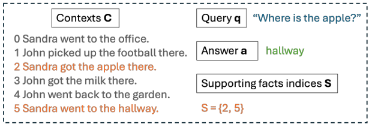
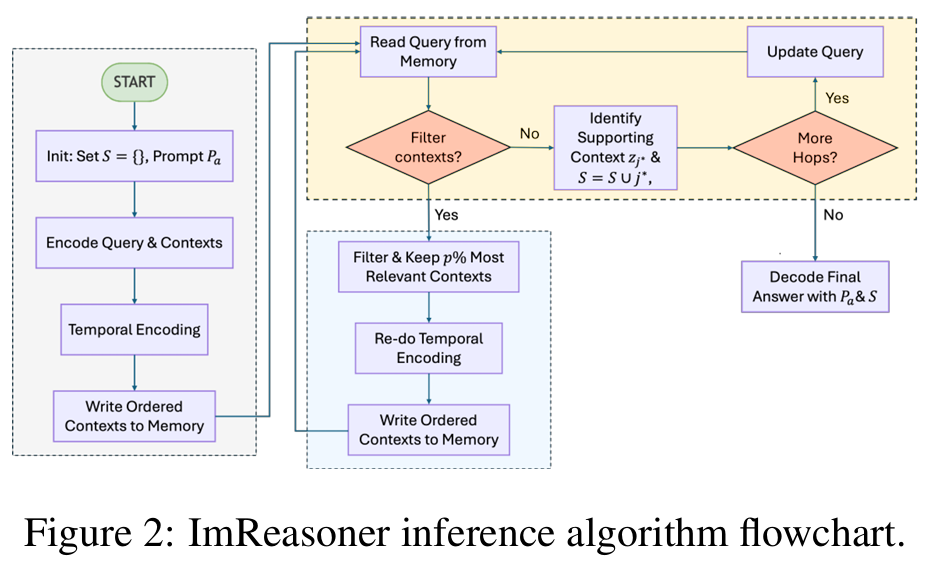
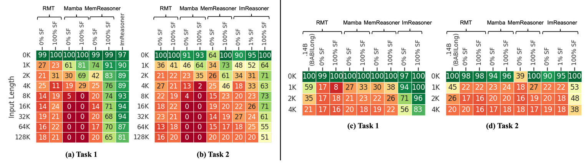

自然言語を扱う最大学会であるACL 2026に採択された論文を追っていました。
テーマはエージェント、クラウド利用の安全性などが多く、トレンディなテーマ多いなーと感じてました。

そんな中、LLMの原理に関する論文もありました。
パッと見てみた論文は[ImReasoner: Improving Memory-based Language Models for Reasoning-in-a-Haystack Tasks](https://aclanthology.org/2026.acl-long.26.pdf)というものです。

本日はこの論文について読んでみました、というものです。

## 概要
**ImReasoner: Improving Memory-based Language Models for Reasoning-in-a-Haystack Tasks** は、**「干し草の中の針」型の推論タスク（reasoning-in-a-haystack）** における、**メモリ拡張型言語モデル（memory-based LLM）の推論性能を改善するためのフレームワーク** に関する論文です。[ACL Anthology](https://aclanthology.org/2026.acl-long.26.pdf)

### 問題設定：なぜ「reasoning-in-a-haystack」が難しいか

- 長い文脈（例：数万トークン）の中に、**ごく少数の関連事実が散在**し、残りは無関係な「干し草」のようなノイズであるようなタスク「reasoning-in-a-haystack」と呼びます。
- 既存のLLMやメモリ拡張モデルは、
  - 構造的な帰納バイアスが弱い
  - 大量のノイズ（distractors）があると、メモリ読み出しが不安定になる
  - 中間ステップの教師信号（どの事実が使われたか）が乏しい
  といった理由で、この種のタスクに苦戦します。

multi-step reasoning＝根拠をつなげていって解答が必要なタスクでは、沢山の文章の中から根拠を見つけ出して、つなげていく必要があります。
この手のタスク例として以下が挙げられています。
`apple`を探そうと思うと、持ち主である`Sandra`がどこに行ったかを見つけないといけないわけですが、この手の根拠と根拠をつなげようと思うと、広い文章から小さなきっかけを探す不毛な作業になっていきます。

### 目的

- **長い・ノイズの多い文脈での多段階推論**を安定化させること。
- **細かい中間ステップの教師信号（どの事実が使われたか）に依存せず**に、推論の汎化性能を高めること。
- 特に「弱い教師信号（答えだけ）」の設定でも、推論性能を大きく改善すること。

### 主な手法

__1. 時間順序を考慮したメモリ（Memory with Temporal Order）__
- 事実の潜在表現（latents）を **GRU** で通し、**事実の時間的な順序**をエンコードします。
- これにより、単なる「集合」ではなく「時系列としてのエピソード」としてメモリを扱えるようにします。

__2. 段階的学習（Staged Training）__
- **表現学習と推論学習を分離**して行うことで、潜在空間の崩壊（collapse）を防ぎます。
  1. **再構成損失（autoencoding）** でまず表現を学習
  2. その後、**答えの再構成（answer reconstruction）** で推論を学習
- これにより、中間ステップの明示的な教師信号なしでも、安定した推論表現が得られます。

__3. 推論時のメモリ更新（Inference-time Memory Update）__
- 推論時に、まず**テキストを「スキミング」して関連性の高い証拠だけを抽出**します。
- 具体的には：
  - **関連度推定（relevance estimation）** でノイズをフィルタリング
  - その後、残った証拠に対して**深い分析・推論**を行う
- これにより、**ノイズの多い長文脈でも、推論に必要な部分だけを効率的に扱う**ことができます。

## 背景・課題

**ImReasoner** の研究背景は、**「長い文脈での多段階推論（multi-step reasoning）」をLLMがうまく扱えない**という問題にあります。[ACL Anthology](https://aclanthology.org/2026.acl-long.26.pdf)

### 研究背景：LLMと長文推論の課題

__1. LLMは長い文脈での多段階推論が苦手__
- LLMは、**依存関係の長いチェーン（dependency chains）** を追うのが難しく、長い文脈の中で「どの事実がどの推論ステップに必要か」を正しく追跡できないことが多いです。
- その結果、**幻覚（hallucination）** や誤った推論が生じやすくなります。

__2. 「reasoning-in-a-haystack」タスクの登場__
- 近年、**BABILong** などのベンチマークで、**「干し草の中の針」型の推論タスク（reasoning-in-a-haystack）** が注目されています。
- ここでは、
  - 文脈が非常に長い（数万トークン）
  - 関連する事実はごく少数
  - 残りは無関係な「干し草」（distractors）
  という設定で、**少数の関連事実だけを使って多段階推論**を行う必要があります。

### 既存手法の限界（何が問題か）

論文では、既存のメモリ拡張型LLM（memory-augmented LLM）や長文推論手法に、主に以下の限界があると指摘しています。[ACL Anthology](https://aclanthology.org/26.pdf)

__1. RMT・Mamba系：テスト分布への依存が強い__
- RMTやMambaなどのモデルは、**テスト分布に近いデータにさらされることに依存**しており、  
  根本的な「汎化」というよりは、**分布の露出に頼った性能**になっていると批判されています。

__2. MemReasonerなど：細かい中間教師信号が必要__
- MemReasonerのようなメモリ拡張LLMは、**「どの事実がどの推論ステップで使われたか」という中間のサポート事実インデックス**を教師信号として必要とします。
- 現実の多くの応用では、**そのような細かい中間ラベルは得られない**ため、実用上の制約が大きいです。

__3. 技術的な2つの大きな問題点__
論文が特に強調しているのは、以下の2点です。

__(a) 大量のノイズ下でのメモリ読み出しの「悪条件化（ill-conditioning）」__
- 長い文脈に大量の無関係なテキスト（distractors）が混ざると、  
  **メモリ読み出し操作が不安定**になり、  
  本当に必要な事実をうまく取り出せない（retrievalが不正確になる）という問題が生じます。

__(b) 弱い教師信号下での「表現の崩壊（representation collapse）」__
- 中間のサポート事実ラベルがない（答えだけの弱い教師信号）状況で学習すると、モデルは**潜在表現が崩壊（collapse）** し、事実の区別がつかなくなる問題が起きます。

>潜在表現（latent representation） は、「モデルが内部で保持している、入力テキストを意味的に要約したベクトル表現」 のことです。
>言い方様々ですが、言葉の内部表現のことと思ってみてもらえればと思います。

### ImReasonerが「解決すべきとした」こと

以上を踏まえ、ImReasonerは以下の問題を解決することを目的としています。[ACL Anthology](https://aclanthology.org/2026.acl-long.26.pdf)

1. **長い・ノイズの多い文脈での多段階推論の性能低下と不安定性**  
   - 特に「reasoning-in-a-haystack」タスクで、大量のdistractorsがあるとメモリ読み出しがうまくいかない問題。

2. **弱い教師信号（答えだけ）の設定でも、推論の汎化性能を高めること**  
   - 中間のサポート事実ラベルなしで、モデルが「どの事実が重要か」を自分で見つけられるようにすること。

3. **メモリ拡張LLMにおける「表現崩壊」と「悪条件化」の回避**  
   - 学習時に潜在表現が崩壊しないようにし、  
   - 推論時にノイズをうまくフィルタして、必要な事実だけを安定して取り出せるようにすること。

## 方法論

**ImReasoner** が行った主な工夫は、大きく以下の2つです。[ACL Anthology](https://aclanthology.org/2026.acl-long.26.pdf)

1. **推論時のメモリ更新（inference-time memory update）**  
2. **段階的学習（staged training）**

そして、これらの工夫は**人間の読解・学習戦略**に着想を得ています。

### 工夫①：推論時のメモリ更新（二段階推論）

__何をしているか__
- 推論時に、まず**文脈全体を「スキミング」して関連度の高い部分だけを抽出**し、その後、**その部分だけに対して深い推論**を行います。
- 具体的には：
  - クエリ（質問）と各事実の潜在表現の**近さ（latent proximity）** を計算
  - 分位関数 $Q_p$ を使って、**上位の関連度を持つ部分だけを残し、残りは捨てる**
  - 2回目のパスでは、**フィルタリングされた部分集合だけ**に対して推論を行う

__着想の根拠：人間の「建設的に応答する読解」__
- この二段階戦略は、**Pressley & Afflerbach (1995)** が提唱した  
  **“constructively responsive reading”**（建設的に応答する読解）に着想を得ています。
- 人間は長い文章を読むとき、
  - まず**ざっと読み（skimming）** して全体像と関連箇所を把握し、
  - その後、**必要な部分だけを深く読む**
  という戦略をとります。
- ImReasonerは、この **「まずスキミングしてノイズを捨て、その後深く読む」** という人間の読解戦略を、メモリ拡張LLMの推論プロセスに組み込んでいます。

### 工夫②：段階的学習（表現学習と推論学習の分離）

__何をしているか__

現論文だとここが結構難しかったです。学習を2stepに分けます。それぞれについては以下のことのようです。

1. 第1段階（約50エポック）で具体的に何をしているか

ImReasonerの第1段階では、**「入力テキストを潜在表現にうまくマッピングする」** ことを目的に、  
**自己符号化（autoencoding）** に近い形で学習を行います。[ACL Anthology](https://aclanthology.org/2026.acl-long.26.pdf)

__具体的な処理イメージ__

1. **入力**  
   - 長い文脈（例：BABILongの長い文章）の中の**各事実（fact）** を、エンコーダで潜在表現（ベクトル）に変換します。

2. **再構成（reconstruction）**  
   - その潜在表現から、**元のテキスト（あるいはその要約）を再生成**します。
   - 損失は「再構成損失（reconstruction loss）」と呼ばれ、  
     **元のテキストと生成されたテキストの差分**を最小化するように学習します。

3. **目的**  
   - この段階では、まだ「答えを当てる」タスクは導入しません。
   - 代わりに、**潜在表現が「元のテキストの意味をきちんと保持しているか」**を重視します。
   - これにより、
     - 異なる事実が**同じ潜在表現に潰れてしまう（representation collapse）**のを防ぎ、
     - メモリに書き込まれる潜在表現が**意味的に区別可能**な状態になります。

要するに、第1段階は  
**「テキスト → 潜在表現 → テキスト」というループを回して、潜在表現の質を高める事前学習**  
に相当します。

__第2段階の「推論タスクに特化した学習」はLLMの文章生成か？__

はい、**LLMの文章生成の一種**と捉えて差し支えありませんが、  
より正確には「**答えの再構成（answer reconstruction）** 」という形で実装されています。[ACL Anthology](https://aclanthology.org/2026.acl-long.26.pdf)

__具体的な処理イメージ__

1. **入力**  
   - 長い文脈（事実の集合）と、クエリ（質問）が与えられます。

2. **メモリ読み出し＋推論**  
   - メモリから関連事実を読み出し、それらを統合して**推論を行います**。

3. **出力（answer reconstruction）**  
   - モデルは、**正解の答えテキストを生成**します。
   - 損失は「答えの再構成損失」であり、**生成された答えと正解の答えの差分**を最小化します。

__LLMの文章生成との関係__

- 技術的には、**デコーダ型LLMの「次トークン予測」** と同じ枠組みです。
- ただし、ImReasonerでは
  - 入力が**長い文脈＋メモリ**、
  - 出力が**推論の結果としての答えテキスト**
  という形で、**「推論タスクに特化した生成」** を行っています。

したがって、

- **「推論タスクに特化した学習」＝「推論の結果としての答えテキストを生成するLLMの学習」**
- これは、一般的なLLMの文章生成と同様の仕組みですが、  
  **目的が「推論の正しさ」にフォーカスされている**点が特徴です。

これにより、**まず表現を安定させ、その後で推論タスクに特化した生成能力を学ぶ**という段階的な設計になっています。[ACL Anthology](https://aclanthology.org/2026.acl-long.26.pdf)

__着想の根拠：人間の「概念的理解」__
- この「まず表現を学び、その後タスクに特化する」という考え方は、  
  **Byrnes (1992)** が議論した **“conceptual understanding”**（概念的理解）に基づいています。
- 人間は、
  - まず**基礎的な概念や表現を身につけ**、
  - その後、それを使って**特定の問題を解く**
  というプロセスをたどります。
- ImReasonerは、この **「概念（表現）を先にしっかり学び、その後推論を学ぶ」** という人間の学習戦略を、  
  モデルの学習プロセスに取り入れています。

### なぜこの工夫が必要だったか（根拠）

論文では、既存のメモリ拡張LLMやTransformerに以下の問題があると指摘しています。[ACL Anthology](https://aclanthology.org/26.pdf)

1. **メモリ操作の「悪条件化（ill-conditioning）」**
   - 大量のノイズ（distractors）があると、メモリ読み出しが不安定になり、必要な事実を取り出せない。
   - → **推論時のフィルタリング**で、まずノイズを捨てることで解決。

2. **弱い教師信号下での「ショートカット行動」と「表現崩壊」**
   - 答えだけの弱い教師信号で学習すると、モデルは**簡単なパターン（ショートカット）** に頼り、潜在表現が崩壊してしまう。
   - → **段階的学習**で、まず表現を安定させてから推論を学ぶことで解決。

3. **順序付きメモリ（ordered memory）の導入**
   - 潜在表現を**GRUで時間順序に沿ってエンコード**し、  
     事実の「時系列としてのエピソード」をメモリに保持します。
   - これにより、**推論チェーンの組み合わせ仮説空間を減らす**（帰納バイアスを与える）効果があります。

そして上記の2段階推論を行うとしているアルゴリズムが以下です。
このアルゴリズムは一つのLLM内部で実施されていることで、この動作を行う上で自然な流れとなるように学習が進められているものとされています。

## 実験

ImReasonerの実験では、**「長い文脈での多段階推論」** と **「弱い教師信号（答えだけ）」** の設定で、  
既存手法を大きく上回る性能を示すことが確認されています。[ACL Anthology](https://aclanthology.org/2026.acl-long.26.pdf)

### 実験で使われたデータセット

__1. bAbI ベンチマーク__
- **bAbI Task 1**：単一ホップ推論（1-step reasoning）
- **bAbI Task 2**：二段階推論（2-hop reasoning）
- 比較的短い文脈での推論能力を評価するために使用。

__2. BABILong__
- bAbIを拡張し、**PG-19**の長い背景テキストを追加したデータセット。
- 文脈長は **0k〜128kトークン**までスケール。
- 「干し草の中の針」型の推論タスク（reasoning-in-a-haystack）を評価。

__3. BABILong-soft（新バリアント）__
- **in-distribution distractors**（真の事実と似たテンプレートのノイズ）を含むバージョン。
- 文脈長は最大 **4kトークン**。
- より「紛らわしい」ノイズ下での推論能力を評価。

### 比較対象（ベースライン）

- **RMT（Recurrent Memory Transformer）**
- **Mamba**
- **MemReasoner**（ImReasonerの前身となるメモリ拡張LLM）

これらとImReasonerを、**弱い教師信号（answer-only）** と**強い教師信号（supporting-facts）** の両方で比較しています。

### 評価指標

- **Accuracy（%）**：  
  推論タスクの正解率を評価指標として使用。

### 主な実験結果

__1. bAbI Task 2（2-hop推論、弱い教師信号）__
- **MemReasoner**：39.5%
- **ImReasoner**：**90%**
- → 弱い教師信号（答えだけ）の設定でも、**2段階推論の精度が大幅に向上**。[ACL Anthology](https://aclanthology.org/2026.acl-long.26.pdf)

__2. BABILong（16kトークン）__
- ベースライン（単純なメモリ読み出し）：**約14%**
- **推論時のフィルタリングだけ**を導入：**82%**
- **段階的学習も組み合わせた ImReasoner**：**94%**
- → 長い文脈（16kトークン）でも、**ノイズをフィルタして推論する効果が非常に大きい**ことが確認されました。[ACL Anthology](https://aclanthology.org/2026.acl-long.26.pdf)

__3. BABILong-soft Task 1（in-distribution distractors）__
- **RMT**：
  - 1kトークン：**59%**
  - 4kトークン：**21%**（大幅に性能低下）
- **ImReasoner**：
  - 1k〜4kトークンまで**ほぼ完璧な精度（near-perfect accuracy）**を維持
- → 真の事実と似たノイズがある場合でも、ImReasonerは**安定して関連事実を選び出せる**ことが示されました。[ACL Anthology](https://aclanthology.org/2026.acl-long.26.pdf)

__4. BABILong-soft Task 2（2-hop推論、in-distribution distractors）__
- 1kトークンを超えると精度は低下するものの、  
  **RMTやMambaなどのベースラインよりは一貫して優れた性能**を示しました。
- → 多段階推論＋紛らわしいノイズは依然として難しい課題ですが、  
  ImReasonerは既存手法より**頑健な推論能力**を持つことが確認されています。

という結果を示すのは以下の図です。
縦軸はトークン数で、Oursにあたる一番右側の手法はトークンが増加しても精度を維持していることが確認されました。

### 実験からわかったこと（まとめ）

1. **弱い教師信号（答えだけ）でも、多段階推論が可能**  
   - bAbI Task 2で90%の精度を達成し、MemReasoner（39.5%）を大きく上回りました。

2. **長い文脈での「干し草の中の針」推論が大幅に改善**  
   - BABILong 16kトークンで、14% → 94% と劇的な改善が見られました。

3. **in-distribution distractors（紛らわしいノイズ）にも強い**  
   - BABILong-softで、RMTが大きく性能を落とす中、ImReasonerはほぼ完璧な精度を維持しました。

4. **128kトークンまでスケール可能だが、多段階推論＋紛らわしいノイズは依然として難題**  
   - 128kトークンまでスケールしても性能を維持できる一方、  
     BABILong-softの2-hopタスクでは精度低下が見られ、  
     これが現在のフレームワークの限界として示されています。[ACL Anthology](https://aclanthology.org/2026.acl-long.26.pdf)

これらにより、ImReasonerは**長い・ノイズの多い文脈での多段階推論を、弱い教師信号の設定で大幅に改善する**ことを実証しているようです。

## 総括

LLMがmulti-step reasoningを行う場合の精度低下を、
以下の2step推論を行うことで

1. 推論時の二段階処理（人間の読解戦略の模倣）

まずスキミングしてノイズを捨て、その後深く読むというconstructively responsive reading に着想を得た二段階推論を導入。
潜在表現の近さに基づく関連度推定＋フィルタリングで、必要な事実だけを残してから推論を行う。

2. 段階的学習（人間の概念的理解の模倣）

まず表現を学び、その後推論を学ぶというconceptual understanding に基づく段階的学習を採用。
第1段階：自己符号化（再構成損失）で潜在表現を安定化  
第2段階：答えの再構成（answer reconstruction）で推論タスクに特化

長い・ノイズの多い文脈での多段階推論を、弱い教師信号（答えだけ）の設定で安定かつ高精度に実現した。

という論文でした。
