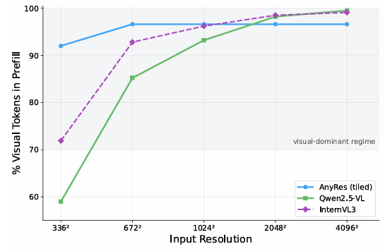
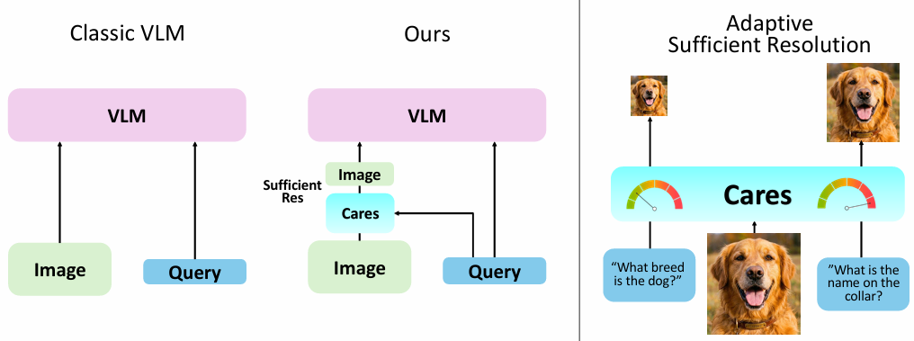
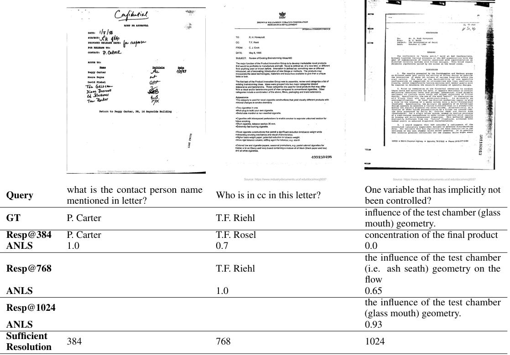
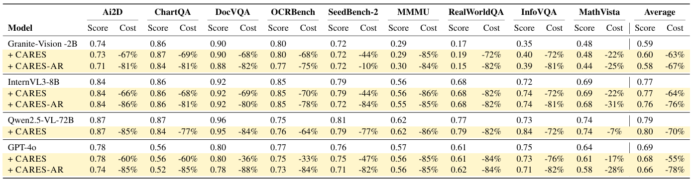

昨日に引き続きACL2026採択論文を読み進めています。
同じく仕組み・原理に関する論文で読んでみたものは[CARES](https://arxiv.org/pdf/2510.19496)です。

ACL2026で採択された **CARES: Context-Aware Resolution Selector for VLMs** は、**「画像と言語の両方を扱う大規模モデル（Vision-Language Models, VLMs）の計算コストとレイテンシを大幅に削減するための軽量な前処理モジュール」** を提案した論文です。

## 概要
ざっとまとめていくとこんな感じでしょうか。Vision-Language Models(以下VLMとします)に関する課題を解決したというものです。

### 問題設定（何を解決したいか）

現在のVLMs（例：CLIP系、LLaVA系など）は、入力画像を**常に高解像度で処理**する傾向があります。  
その結果、

- 入力トークンのうち **97〜99% が視覚トークン** になる
- 計算量とメモリ使用量が非常に大きい
- 推論が遅く、実運用コストが高い

といった問題が生じています。  
多くのタスクでは、画像全体を高解像度で見る必要はなく、**「どの解像度で見れば十分か」は画像と質問の内容に依存する** はず、という観点から、この無駄を減らすことを目指しています。

### 提案手法：CARES の仕組み

CARES は、**「この画像＋この質問に対して、ターゲットVLMがピーク性能に達するのに必要な最小限の解像度はどれか」** を予測する **軽量な前処理VLM** です。

- **モデル規模**: 約 **350Mパラメータ** の比較的小さなモデル
- **役割**: メインの大規模VLMの前に挿入し、  
  「どの解像度で画像を入力すれば十分か」を**画像とテキストの両方を見て**判断する
- **学習**: 離散的な解像度クラスとして学習されるが、推論時には**連続的な解像度を内挿**できる
- **出力**: 「この解像度で十分」と判断した解像度で画像をリサイズし、その画像をメインVLMに渡す

これにより、**メインVLMが処理する視覚トークン数を大幅に削減**しつつ、タスク性能をほぼ維持することを狙っています。

### 主な成果

1. **コンテキストに応じた解像度選択**  
   単純なヒューリスティックではなく、**画像と質問の内容に応じて**必要な解像度を動的に決める点が新しい。

2. **軽量な前処理モジュールとしての設計**  
   350Mパラメータという比較的小さなモデルで、さまざまなターゲットVLMの前に挿入可能な汎用的なモジュールとして設計されている。

3. **計算効率の大幅改善**  
   実験では、**計算量を最大80%削減**しながら、タスク性能をほぼ維持できることを示している。

4. **連続的な解像度内挿**  
   学習は離散クラスで行うが、推論時に連続的な解像度を扱えるため、柔軟な解像度選択が可能。

### 実験結果の概要

- **対象ベンチマーク**: 文書画像と自然画像を含む **5つのマルチモーダルベンチマーク**
- **対象VLM**: 複数のターゲットVLMに対して適用
- **結果**:
  - **計算コストを最大80%削減**
  - タスク性能（精度など）は**ほぼ維持**（多くの設定で性能低下はごくわずか）
  - 異なるVLMに対しても**汎用的に有効**であることを確認

### まとめ

CARES は、**「画像と言語の両方を見て、このタスクにはどの解像度で十分かを軽量なモデルが事前に判断する」** という発想で、  
VLMsの**計算効率とレイテンシを大幅に改善**することを目指した研究です。  
ACL2026でのオーラル採択論文であり、コードも公開されています[arXiv](https://arxiv.org/abs/2510.19496)。

## 背景・課題

この論文が**解決すべきとした課題・事実**は、主に次の2点です[arXiv](https://arxiv.org/abs/2510.19496)。

### 1. 課題：VLMsの「常に高解像度で処理する」ことによる計算・レイテンシの非効率性

現在の大規模VLMsは、入力画像を**常に高解像度で処理**する傾向があります。  
その結果、

- **計算量が非常に大きい**
- **推論が遅い（レイテンシが高い）**
- **実運用コスト（クラウド料金など）が高い**

といった問題が生じています。

論文は、**「多くのタスクでは、画像全体を高解像度で見る必要はない」** という前提に立ち、  
**「この画像＋この質問に対して、どの解像度で見れば十分か」を動的に決める仕組みがない**ことを課題として挙げています。

### 2. 事実：視覚トークンが入力の大部分を占めること

論文が根拠として示している**定量的な事実**は、次の通りです[arXiv](https://arxiv.org/abs/2510.19496)。

- VLMの入力トークンのうち、**視覚トークンが 97〜99% を占める**
- つまり、**ほぼすべての計算コストは画像側に集中している**

この事実から、

- **画像解像度を少し下げるだけで、視覚トークン数が大きく減る**
- したがって、**「必要な最小限の解像度」を選べば、計算コストを大幅に削減できる**

という発想が導かれます。

### 3. 論文が解決すべきとした課題・事実

1. **課題**  
   - VLMsが**常に高解像度で画像を処理**するため、計算・レイテンシ・コストが過大になっている。
   - **画像と質問の内容に応じて、必要な解像度を動的に選ぶ仕組みがない**。

2. **事実**  
   - VLMの入力トークンのうち、**視覚トークンが97〜99%を占める**。  
   - したがって、**解像度選択が計算効率を支配する**。

CARES は、この課題と事実を踏まえ、  
**「軽量な前処理VLMで、画像＋質問を見て最小限の解像度を予測する」** ことで、  
**計算コストを最大80%削減しつつ、タスク性能をほぼ維持する**ことを目指しています[arXiv](https://arxiv.org/abs/2510.19496)。

論文で出されている画像の解像度に応じた視覚トークンの割合は以下のようなもので、まじか！？とびっくりした次第です。

## 論文が取り組んだ工夫点

CARES の問題設定と、それに対応する**具体的な工夫点**を対応付けて整理します。

### 1. 問題設定（何を解決したいか）

__(A) 計算・レイテンシの非効率性__
- **事実**: 現在のVLMsは、入力画像を**常に高解像度で処理**する。
- **結果**:  
  - 視覚トークンが入力トークンの **97〜99%** を占める[arXiv](https://arxiv.org/abs/2510.19496)。  
  - 計算量・メモリ使用量・レイテンシが非常に大きい。
- **課題**:  
  - 「この画像＋この質問に対して、**どの解像度で見れば十分か**」を動的に決める仕組みがない。  
  - 多くのタスクでは高解像度は不要なのに、常に高解像度で処理している。

__(B) コンテキスト依存性の無視__
- **課題**:  
  - 必要な解像度は**画像の内容**と**質問の内容**の両方に依存するはずだが、既存手法は単純なヒューリスティック（例：常に低解像度）か、固定解像度に依存している。

### 2. 具体的な工夫点（問題設定への対応）

__工夫①：軽量な「前処理VLM」としての設計__

- **問題設定への対応**:  
  「どの解像度で十分か」を**画像とテキストの両方を見て**判断する必要がある。
- **工夫内容**:  
  - CARES を **約350Mパラメータの軽量VLM** として設計し、  
    メインVLMの**前段に挿入**する[arXiv](https://arxiv.org/abs/2510.19496)。  
  - 入力: **画像＋質問テキスト**  
  - 出力: 「このタスクに必要な最小限の解像度」の予測
- **効果**:  
  - メインVLMが処理する視覚トークン数を大幅に削減できる。  
  - 計算コストを最大80%削減しつつ、タスク性能をほぼ維持[arXiv](https://arxiv.org/abs/2510.19496)。

__工夫②：コンテキストに応じた解像度選択__

- **問題設定への対応**:  
  必要な解像度は**画像と質問の内容に依存**する。
- **工夫内容**:  
  - CARES は、単純なルールではなく、**画像とテキストの両方を入力として受け取り**、「この組み合わせに対して、ターゲットVLMがピーク性能に達するのに十分な解像度」を予測する。
- **効果**:  
  - 文書画像のように細かい文字が必要な場合と、自然画像の大まかなシーン理解では、**異なる解像度が選ばれる**。  
  - これにより、**無駄な高解像度処理を避けつつ、必要な情報は落とさない**。

__工夫③：離散クラス学習＋連続解像度の内挿__

- **問題設定への対応**:  
  実世界では「この解像度でちょうどよい」という値が連続的に変化するが、  
  学習時には離散的な解像度しかサンプルできない。
- **工夫内容**:  
  - CARES は**離散的な解像度クラス**として学習されるが、  
    推論時には**連続的な解像度を内挿**できるように設計されている[arXiv](https://arxiv.org/abs/2510.19496)。
- **効果**:  
  - 固定の解像度セットに縛られず、**柔軟に解像度を選べる**。  
  - 実運用で「ちょうどよい解像度」を細かく調整できる。

__工夫④：ターゲットVLMへの汎用的な適用__

- **問題設定への対応**:  
  特定のVLMに依存せず、**さまざまなVLMの前処理として使える**ことが望ましい。
- **工夫内容**:  
  - CARES は**独立した前処理モジュール**として設計され、  
    複数のターゲットVLMに対して適用可能な形で評価されている[arXiv](https://arxiv.org/abs/2510.19496)。
- **効果**:  
  - 特定のVLMに依存せず、**一般的なVLMの効率化手法**として提案できる。

__工夫⑤：複数ベンチマークでの検証__

- **問題設定への対応**:  
  「どのタスクでもうまく機能するか」を検証する必要がある。
- **工夫内容**:  
  - **文書画像**と**自然画像**を含む **5つのマルチモーダルベンチマーク**で評価[arXiv](https://arxiv.org/abs/2510.19496)。
- **効果**:  
  - ドメインの異なるタスクでも、**計算削減と性能維持の両立**が示された。

## 実験

CARES の**行った実験**と**実験結果**を、設定と結果に分けてまとめます。

### 1. 実験設定（何をどう評価したか）

__(1) 使用ベンチマーク__
CARES は、**文書画像**と**自然画像**を含む **5つのマルチモーダルベンチマーク**で評価されています[arXiv](https://arxiv.org/abs/2510.19496)。

GitHubリポジトリによると、具体的には以下のベンチマークが使用されています[GitHub](https://github.com/mkimhi/CARES)。

- **TextVQA**（自然画像＋テキストを含む画像に対するQA）
- **DocVQA**（文書画像に対するQA）
- **ChartQA**（チャート・グラフ画像に対するQA）
- **InfographicVQA**（インフォグラフィック画像に対するQA）
- **HME100K**（マルチモーダルQAベンチマーク）

これらは、**細かい文字認識が必要な文書系**と、**自然画像のシーン理解**の両方を含むため、  
解像度選択の影響を多面的に評価できる設計になっています。

__(2) ターゲットVLM（メインのVLM）__
CARES は**前処理モジュール**として設計されているため、  
複数のターゲットVLMに対して適用して評価されています[GitHub](https://github.com/mkimhi/CARES)。

- **HuggingFaceTB/SmolVLM-256M-Instruct**
- **HuggingFaceTB/SmolVLM-500M-Instruct**
- **IBM Granite-Docling**

これらは、**比較的軽量なVLM**から**文書特化型VLM**までを含み、  
CARES の汎用性（さまざまなVLMの前段に使えるか）を検証する意図があります。

__(3) 評価指標__
主な評価指標は次の2つです[GitHub](https://github.com/mkimhi/CARES)。

1. **質問回答精度（Question answering accuracy）**  
   - 各ベンチマークの標準的なQA精度指標（例：TextVQAのAccなど）  
   - CARES を挟んだ場合に、**フル解像度ベースラインと比べて精度がどの程度維持されるか**を評価。

2. **平均解像度処理量（Average resolution processing）**  
   - CARES が選択した解像度に基づき、  
     実際にターゲットVLMが処理した**画像解像度の平均値**や、  
     それに対応する**計算量（FLOPsやトークン数）** を評価。  
   - これにより、**どれだけ計算を削減できたか**を定量化。

### 2. 実験結果（何が示されたか）

__(1) 計算効率の大幅な改善__
- **平均解像度処理量を最大80%削減**  
  CARES を挟むことで、ターゲットVLMが処理する画像解像度（および対応する計算量）を  
  **最大80%削減**できたことが報告されています[arXiv](https://arxiv.org/abs/2510.19496)[GitHub](https://github.com/mkimhi/CARES)。

- これは、**視覚トークン数が入力の97〜99%を占める**という事実を踏まえると、  
  非常に大きな改善です。

__(2) タスク性能のほぼ維持__
- **質問回答精度をフル解像度ベースラインの1%以内に維持**  
  CARES を挟んだ場合でも、  
  **QA精度がフル解像度で処理した場合と比べて1%以内の誤差に収まる**ことが示されています[GitHub](https://github.com/mkimhi/CARES)。

- つまり、**計算コストを大幅に削減しつつ、タスク性能はほぼ変わらない**という結果です。

__(3) ベンチマーク・ターゲットVLMにわたる一貫性__
- 上記の傾向は、  
  - **文書系（DocVQA, ChartQA, InfographicVQA）**  
  - **自然画像系（TextVQA, HME100K）**  
  の両方で確認されています[GitHub](https://github.com/mkimhi/CARES)。

- また、**SmolVLM系**と**IBM Granite-Docling**といった異なるターゲットVLMに対しても、  
  同様に**計算削減と性能維持**が確認されており、  
  CARES が**汎用的な前処理モジュール**として機能することが示されています。

### 3. まとめ：実験と結果の要点

| 項目 | 内容 |
|------|------|
| **ベンチマーク** | TextVQA, DocVQA, ChartQA, InfographicVQA, HME100K（文書＋自然画像） |
| **ターゲットVLM** | SmolVLM-256M-Instruct, SmolVLM-500M-Instruct, IBM Granite-Docling |
| **評価指標** | QA精度、平均解像度処理量（≒計算量） |
| **主な結果** | 平均解像度処理量を最大80%削減しつつ、QA精度をフル解像度ベースラインの1%以内に維持 |
| **結論** | CARES は、多様なVLMとベンチマークにおいて、**計算効率を大幅に改善しつつタスク性能をほぼ維持できる** |

このように、CARES は **「常に高解像度で処理する」という非効率な現状** に対し、  
**コンテキスト依存の解像度選択**によって、  
**計算量を最大80%削減しつつ、QA精度をほぼ維持する**ことを実験的に示しています[arXiv](https://arxiv.org/abs/2510.19496)[GitHub](https://github.com/mkimhi/CARES)。

これも実験の結果と言えるでしょうか。
サイズや質問に対する解像度が異なる画像を入力して、うまく解答できるようになったというものです。

ちょっと面白かったのは、実験結果ですが、ほとんどすべて"Ours"が上回るというような結果ではないということです。
精度は維持程度だが、計算コスト低減という、嬉しいは嬉しいけど、精度だともっと嬉しいのにという結果を載せていることです。

## 結果

