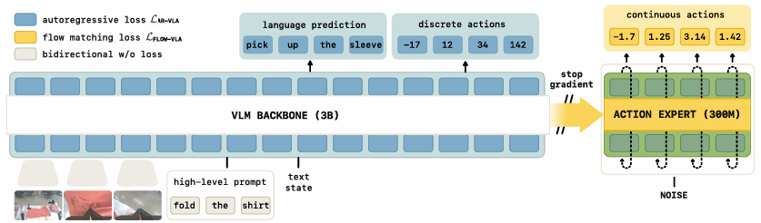
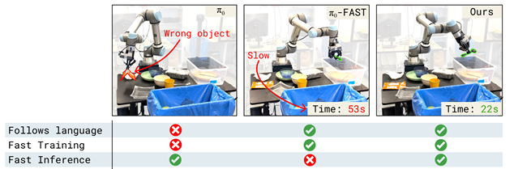
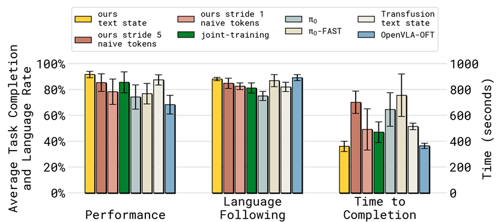

本日はNLP関係の論文を読むということで昨年のNeurIPS　2025年にて再テクされた論文より
"Knowledge Insulating Vision-Language-Action Models: Train Fast, Run Fast, Generalize Better"
について読んでいこうと思います。

本日テーマ：
>Knowledge Insulating Vision-Language-Action Models: Train Fast, Run Fast, Generalize Betterを理解する

## 概要

以下では、当該論文の概要を説明します[NeurIPS Poster](https://neurips.cc/virtual/2025/poster/117079)。

### 1. 論文の基本情報

- **タイトル**:  
  **Knowledge Insulating Vision-Language-Action Models: Train Fast, Run Fast, Generalize Better**
- **著者**: Danny Driess ほか
- **会議**: NeurIPS 2025 Spotlight Poster

### 2. 問題設定（アブストラクト前半）

ポスターページのアブストラクトは、次のように始まっています。

> **Vision-language-action (VLA) models provide a powerful approach to training control policies for physical systems… by combining end-to-end learning with transfer of semantic knowledge from web-scale vision-language model (VLM) training.**  
> **However, the constraints of real-time control are often at odds with the design of VLMs…**

ここから読み取れるポイントは以下の通りです。

- **VLA（Vision-Language-Action）モデル**は、  
  - 物理システム（ロボットなど）の制御ポリシーを学習するための強力な枠組みであり、  
  - エンドツーエンド学習と、Webスケールで事前学習された**VLM（Vision-Language Model）の意味知識の転移**を組み合わせている。
- しかし、**リアルタイム制御の制約**（高速推論・連続値出力など）と、  
  大規模VLMの設計（巨大なパラメータ数・離散トークン出力など）は**しばしば相反する**。

### 3. 具体的な問題点（アブストラクト中盤）

アブストラクトの続きは次のように述べています。

> **In this paper, we study this question in the context of VLAs that include a continuous diffusion or flow matching action expert, showing that naively including such experts significantly harms both training speed and knowledge transfer.**

ここでは、より具体的な設定と問題点が示されています。

- 本研究では、**連続的な拡散モデル（diffusion）やフローマッチング（flow matching）をアクション“専門家”として組み込んだVLAモデル**を対象とする。
- その結果、  
  - **単純にこうしたアクション専門家をVLMに組み込むと、  
    学習速度と知識転移の両方が大きく損なわれる**ことが示されている。

つまり、VLMの豊富な意味知識を活かしつつ、連続制御用のアクション専門家を追加しようとすると、  
**VLM側の知識が壊れたり、学習が遅くなったりする**というトレードオフが生じる、という問題です。

### 4. 提案手法：Knowledge Insulating（アブストラクト後半）

アブストラクトの後半では、提案手法の概要が述べられています。

> **We provide an extensive analysis of various design choices, their impact on performance and knowledge transfer, and propose a technique for insulating the VLM backbone during VLA training that mitigates this issue.**

ここから分かることは：

- 著者らは、**さまざまな設計選択（VLMとアクション専門家の接続方法など）を詳細に分析**し、  
  それらが**性能と知識転移に与える影響**を明らかにしている。
- そのうえで、**VLA学習中にVLMバックボーンを“絶縁（insulating）”する技術**を提案し、  
  上記の問題を**緩和**している。

この「Knowledge Insulating」のアイデアは、  
**VLMの事前学習済み表現を壊さないようにしつつ、連続制御用のアクション専門家をうまく統合する**ための工夫と解釈できます。

### 5. 貢献のまとめ

公式ページの要約では、主な貢献として次の3点が挙げられています[NeurIPS Poster](https://neurips.cc/virtual/2025/poster/117079)。

1. **分析**:  
   - 連続アクション専門家（diffusion / flow matching）をVLMに組み込むと、  
     **学習速度と知識転移の両方が悪化する**ことを示す詳細な分析。
2. **手法**:  
   - VLMバックボーンを**Knowledge Insulating**することで、  
     この悪影響を**軽減**し、**より高速な学習と良好な汎化**を実現する技術を提案。
3. **公開**:  
   - モデル重みなどを含む**オープンソース実装（OpenPI）**を公開。

### 6. 解釈

要約すると、この論文は：

- **大規模VLMの意味知識**と  
- **ロボットなどの連続制御タスク**  
を両立させたいが、そのまま組み合わせると**VLMの知識が壊れてしまう**という問題に直面する。

そこで、**VLMバックボーンを“絶縁”する設計**を採用し、  
- VLMの事前学習済み表現を守りつつ、  
- 連続アクション専門家を効果的に統合することで、  
**「学習が速く、推論も速く、汎化も良い」VLAモデル**を実現している、という内容です。

## 解決したい課題

この論文（**Knowledge Insulating Vision-Language-Action Models: Train Fast, Run Fast, Generalize Better**）が解決しようとしている課題は、大きく分けて次の3つです。

### 1. 「大規模VLMの意味知識」と「リアルタイム連続制御」の設計上の衝突

アブストラクト冒頭では、VLA（Vision-Language-Action）モデルの強みと、そこに潜む矛盾が次のように述べられています。

> **Vision-language-action (VLA) models provide a powerful approach to training control policies for physical systems… by combining end-to-end learning with transfer of semantic knowledge from web-scale vision-language model (VLM) training.**  
> **However, the constraints of real-time control are often at odds with the design of VLMs…**  
> [NeurIPS Poster](https://neurips.cc/virtual/2025/poster/117079)

ここから読み取れる**課題**は：

- VLAモデルは、**Webスケールで事前学習されたVLMの意味知識**を転移することで、物理システム（ロボットなど）の制御ポリシーを強力に学習できる。
- しかし、**リアルタイム制御の制約**（高速推論、連続値出力、低レイテンシなど）と、大規模VLMの設計（巨大パラメータ数、離散トークン出力、高計算コスト）は**本質的に相いれない**。

つまり、**「VLMの豊富な意味知識を活かしたい」** という要求と、**「ロボット制御として実用的な速度・連続性を確保したい」** という要求が、**そのままでは両立しない**という設計上の衝突が、第一の課題です。

### 2. 連続アクション専門家を“素朴に”組み込むと、学習速度と知識転移が悪化する

アブストラクト中盤では、より具体的な問題が示されています。

> **In this paper, we study this question in the context of VLAs that include a continuous diffusion or flow matching action expert, showing that naively including such experts significantly harms both training speed and knowledge transfer.**  
> [NeurIPS Poster](https://neurips.cc/virtual/2025/poster/117079)

ここでの**具体的な課題**は：

- VLAモデルに、**連続的なアクション出力を行う専門家（diffusion / flow matching ベースのアクションモデル）** を組み込むと、  
  - **学習速度（training speed）が遅くなる**  
  - **VLMから転移される意味知識の質が落ちる（knowledge transfer が悪化する）**
- これは、**単純にVLMとアクション専門家を結合するだけではうまくいかない**ことを意味する。

つまり、**「連続制御に適したアクション専門家をVLMに付け足す」** という自然な発想が、**「VLMの事前学習済み表現を壊し、学習を遅くし、知識転移を悪化させる」** という**意図しない副作用**を生んでしまう、というのが第二の課題です。

### 3. VLMバックボーンを壊さずに、連続制御用のアクション専門家を統合する方法がない

アブストラクト後半と要約では、著者らが提案する解決策の方向性が示されています。

> **We provide an extensive analysis of various design choices, their impact on performance and knowledge transfer, and propose a technique for insulating the VLM backbone during VLA training that mitigates this issue.**  
> [NeurIPS Poster](https://neurips.cc/virtual/2025/poster/117079)

ここから読み取れる**第三の課題**は：

- VLA学習において、**VLMバックボーンをどのように扱うか**という設計選択が、  
  性能と知識転移に大きく影響する。
- しかし、**VLMの事前学習済み表現を壊さずに、連続制御用のアクション専門家を統合する一般的な方法**が存在しない。
- その結果、  
  - 学習が遅い  
  - 推論が遅い  
  - 汎化が悪い  
  といった実用上の問題が生じる。

したがって、**「VLMバックボーンを“絶縁”しつつ、連続アクション専門家をうまく統合する技術」** を設計することが、本論文が解決しようとしている**中核的な課題**です。

## 提案手法

ご指定のarXiv版論文（**Knowledge Insulating Vision-Language-Action Models**）では、先述の課題に対して、**「Knowledge Insulation（知識絶縁）」** という具体的な手法を提案しています[arXiv PDF](https://arxiv.org/pdf/2505.23705)。

以下では、PDF本文の記述を引用しながら、**どのように課題を解決しているか**を整理します。

### 1. 課題の再確認（PDFの文脈）

PDFでは、次のような問題意識が示されています（要約）：

- **大規模VLMの意味知識**をロボット制御に転移したいが、  
- **連続アクション専門家（diffusion / flow matching）** を素朴に組み込むと、  
  - VLMバックボーンの知識が**劣化**し、  
  - **学習が遅くなり**、  
  - **汎化も悪くなる**。

この「VLMバックボーンが壊れる」問題を解決するために、**Knowledge Insulation**が提案されています。

### 2. 提案手法の全体像

PDFの「Proposed Method」セクションでは、Knowledge Insulation の枠組みが次のように説明されています。

> **‘knowledge insulation’ involves fine-tuning the VLM backbone with discretized actions (using FAST tokenizer) while simultaneously training an action expert for continuous actions (flow matching) without backpropagating the expert’s gradients into the VLM.**  
> [arXiv PDF](https://arxiv.org/pdf/2505.23705)

ここから分かるポイントは：

- **VLMバックボーン**は、**離散化されたアクション（FASTトークナイザによる離散アクション）** を用いてファインチューニングされる。
- 一方で、**連続アクションを出力するアクション専門家（flow matchingベース）** は、**VLMには勾配を逆伝播させずに**別途学習される。
- つまり、**VLMとアクション専門家を“分離”して学習**し、**VLM側には連続アクション専門家の勾配が入らないようにする**ことで、  
  VLMの事前学習済み表現を**壊さない**設計になっています。

イメージは以下で連続アクションと離散アクションをそのまま勾配伝播させない設計をベースのアイデアとしているとのことです。

### 3. VLMバックボーンの扱い方

VLMバックボーンについては、次のように記述されています。

> **The backbone (initialized from PaliGemma) is trained via next-token prediction to learn robotic representations without disruption.**  
> [arXiv PDF](https://arxiv.org/pdf/2505.23705)

ここから分かること：

- VLMバックボーンは、**PaliGemma**などの事前学習済みVLMで初期化される。
- ロボティクス表現を学ぶ際も、**next-token prediction（次トークン予測）** というVLM本来の学習方式を維持し、**連続アクション専門家の勾配で“破壊”されない**ようにしている。

これにより、**VLMの意味知識を維持したまま、ロボットタスクに適応**させることが可能になります。

### 4. VLMとアクション専門家の接続方法（stop-gradient）

VLMとアクション専門家の接続方法は、**アテンション層＋stop-gradient**で実現されています。

> **The backbone and action expert interact via attention layers, where a ‘stop-gradient operator’ (sg) is applied to the key and value projections of the backbone when attended to by the action expert: ‘Pab sg(Kb(Xb)T)’ and ‘Pab sg(Vb(Xb))’.**  
> [arXiv PDF](https://arxiv.org/pdf/2505.23705)

ここでの仕組みは：

- VLMの出力特徴（key, value）は、**アクション専門家側のアテンション層**から参照される。
- しかし、その際に**stop-gradient演算子（sg）**を適用し、  
  **アクション専門家側の損失がVLMバックボーンに逆伝播しない**ようにしている。
- つまり、  
  - VLMの特徴は **“読まれる”** が、  
  - VLMのパラメータは **“更新されない”** （あるいは、別の損失でのみ更新される）。

これが **「Knowledge Insulation（知識絶縁）」** の核となる設計です。

### 5. 学習速度の改善（「FAST並みに速い」）

学習速度については、次のように述べられています。

> **our method ‘trains as quickly as FAST’ and notes that ‘π0 trains significantly slower, requiring 7.5 times as many training steps to reach a similar performance.’**  
> [arXiv PDF](https://arxiv.org/pdf/2505.23705)

ここから分かること：

- 提案手法は、**FAST（離散アクションベースの既存手法）と同等の学習速度**で動作する。
- 一方、**純粋な拡散モデルベースのπ0**は、  
  **同程度の性能に達するまでに7.5倍の学習ステップ**を必要とする。

つまり、**連続アクション専門家を“素朴に”組み込むと学習が極端に遅くなる**という課題に対し、  
Knowledge Insulation によって**学習速度を大幅に改善**していることが示されています。

### 6. 知識転移と汎化の改善（VLM知識の保持・OOD汎化）

知識転移と汎化については、次のように述べられています。

> **The approach ‘retains VLM knowledge’ and ‘co-training on VLM data is particularly important for this generalization’ to novel objects (OOD Follow Rate).**  
> [arXiv PDF](https://arxiv.org/pdf/2505.23705)

ここから分かること：

- Knowledge Insulation により、**VLMの知識が保持される**。
- さらに、**VLMデータとの共同学習（co-training）** を行うことで、  
  **未知の物体に対するゼロショット汎化（OOD Follow Rate）** が向上する。

これは、**VLMバックボーンを壊さずに連続制御を学習する**ことで、  
- 事前学習済みの意味知識を活かしつつ、  
- 新しい物体や環境にも**強く汎化できる**ことを意味します。

## 実験

以下では、arXiv版論文（**Knowledge Insulating Vision-Language-Action Models**）の実験セクションに基づき、**実験設定**と**実験結果**を引用付きで整理します[arXiv PDF](https://arxiv.org/pdf/2505.23705)。

### 1. 実験設定（タスク・環境・ベースライン）

__1.1 タスクと環境__

PDFでは、実験対象として**多指ハンド・長期操作タスク**と**モバイルマニピュレーションタスク**が挙げられています。

> **The experimental evaluation encompasses dexterous, long-horizon manipulation tasks: ‘table bussing’, ‘shirt-folding’ (bimanual), ‘items in drawer’ (unseen environments), and mobile manipulation tasks like ‘dishes in sink’ (Section 6, Figure 3).**  
> [arXiv PDF](https://arxiv.org/pdf/2505.23705)

具体的には：

- **Dexterous / Long-horizon manipulation**  
  - **table bussing**（テーブル上の食器片付け）  
  - **shirt-folding**（シャツのたたみ、両手操作）  
  - **items in drawer**（引き出し内のアイテム操作、**未見環境**）
- **Mobile manipulation**  
  - **dishes in sink**（シンク内の食器片付け）

また、ベンチマークとして**DROID**および**LIBERO（LIBERO-90, LIBERO-Spatial）** が使用されています。

__1.2 ベースライン__

比較対象となるベースラインは、次のように列挙されています。

> **Baselines evaluated include π0 (flow matching), π0-FAST (autoregressive), OpenVLA-OFT (parallel decoding), Transfusion, and HybridVLA (Section 6).**  
> [arXiv PDF](https://arxiv.org/pdf/2505.23705)

- **π0**: 連続アクションを**flow matching**で学習する拡散モデルベースのVLA。
- **π0-FAST**: 離散アクション（FASTトークナイザ）を用いた**自己回帰モデル**。
- **OpenVLA-OFT**: OpenVLAベースで**並列デコーディング**を行う手法。
- **Transfusion**: 拡散モデルと自己回帰モデルを組み合わせた**ハイブリッド手法**。
- **HybridVLA**: 同様にハイブリッドなVLAアプローチ。

__1.3 評価指標__

使用される評価指標は以下の通りです。

> **Metrics used are task completion/success rate (%), language following rate (%), inference time, and convergence speed in training steps (Figures 4, 5, 6).**  
> [arXiv PDF](https://arxiv.org/pdf/2505.23705)

- **タスク成功率（task success rate）**  
- **言語指示追従率（language following rate）**  
- **推論時間（inference time）**  
- **収束に要する学習ステップ数（convergence speed）**

### 2. 主な実験結果

__2.1 学習速度（Training Speed）__

学習速度については、次の結果が報告されています。

> **The proposed method trains as fast as π0-FAST and 7.5x faster than π0 (Fig 6b).**  
> [arXiv PDF](https://arxiv.org/pdf/2505.23705)

- 提案手法は、**π0-FAST（離散アクション自己回帰モデル）と同等の学習速度**で動作する。
- 一方、**π0（純粋なflow matchingベース）**は、  
  同程度の性能に達するまでに**7.5倍の学習ステップ**を必要とする。

→ **Knowledge Insulation により、連続アクション専門家を組み込みつつ、自己回帰モデル並みの高速学習を実現**していることが示されています。

__2.2 タスク性能（Performance）__

タスク成功率については、次のように述べられています。

> **Highest performance in ‘items in drawer’ and ‘table bussing’ (Fig 4a, 5).**  
> [arXiv PDF](https://arxiv.org/pdf/2505.23705)

- **items in drawer**（未見環境での引き出し操作）および  
  **table bussing**（テーブル片付け）において、  
  提案手法は**ベースライン中最も高い成功率**を達成。
- 特に、**未見環境や長期タスク**において、  
  VLM知識を保持したまま連続制御を学習する利点が発揮されています。

__2.3 Knowledge Insulation の効果（知識保持・言語追従）__

Knowledge Insulation（stop-gradient）の効果については、次の結果が示されています。

> **Stopping gradient flow from the action expert to the backbone (‘knowledge insulation’) prevents corruption of pre-trained VLM weights, significantly improving language following (Fig 4b).**  
> [arXiv PDF](https://arxiv.org/pdf/2505.23705)

- **アクション専門家からVLMバックボーンへの勾配を遮断**することで、  
  **事前学習済みVLMの重みが破壊されるのを防ぎ**、  
  **言語追従率（language following）が大幅に向上**。
- これは、**VLMの意味知識を維持したままロボット制御を学習できる**ことを定量的に示しています。

__2.4 OOD汎化（未知物体への一般化）__

未知物体（Out-of-Distribution, OOD）への汎化については、次のように述べられています。

> **Co-training with VLM data is ‘particularly important’ for generalizing to novel objects (Fig 7).**  
> [arXiv PDF](https://arxiv.org/pdf/2505.23705)

- **VLMデータとの共同学習（co-training）**を行うことで、  
  **未知の物体に対するゼロショット汎化（OOD Follow Rate）**が特に向上。
- Knowledge Insulation によりVLM知識を保持しつつ、  
  VLMデータで追加学習することで、**より強力な一般化能力**が得られることが示されています。

__2.5 SOTA達成（LIBEROベンチマーク）__

LIBEROベンチマークにおける結果は次の通りです。

> **Achieves new SOTA on LIBERO-90 and LIBERO-Spatial (Table 1).**  
> [arXiv PDF](https://arxiv.org/pdf/2505.23705)

- **LIBERO-90**および**LIBERO-Spatial**において、  
  提案手法は**新たなState-of-the-Art（SOTA）**を達成。
- これは、**VLM知識の保持＋連続制御の効率化**という設計が、  
  既存のVLA手法よりも**総合的に優れている**ことを示しています。

### 3. 実験結果のまとめ

論文の実験結果を整理すると、次のようになります。

1. **学習速度**  
   - π0-FASTと同等の高速学習を実現し、  
     π0より**7.5倍速く収束**。

2. **タスク性能**  
   - table bussing, items in drawer などで**最高成功率**を達成。  
   - 特に**未見環境・長期タスク**で優位。

3. **知識保持・言語追従**  
   - Knowledge Insulation により、  
     **VLMバックボーンの事前知識が破壊されず**、  
     **言語追従率が大幅に向上**。

4. **OOD汎化**  
   - VLMデータとのco-trainingにより、  
     **未知物体に対するゼロショット汎化が特に向上**。

5. **SOTA達成**  
   - LIBERO-90, LIBERO-Spatial で**新SOTA**を達成。

これらの結果から、**「VLMバックボーンを絶縁しつつ連続アクション専門家を統合する」**という  
Knowledge Insulation の設計が、**学習速度・性能・知識保持・汎化のすべてにおいて有効**であることが示されています。

論文の図5、この結果が主張する結論の部分です。

## 総括
ここまでの話をまとめていきます。

この論文は、**「大規模VLMの意味知識」と「ロボットの連続制御」を両立させたいが、素朴に組み合わせるとVLMの知識が壊れ、学習も遅くなり、汎化も悪くなる**という問題に取り組んでいます。

**核心のアイデア**は、**Knowledge Insulation（知識絶縁）** です。

- VLMバックボーンは、**離散アクション（FASTトークナイザ）** を用いた**next-token prediction**でファインチューニングし、  
- 連続アクション専門家（flow matching）は、**VLMには勾配を逆伝播させず**、  
  **stop-gradient付きのアテンション**でVLM特徴を参照するだけにします。

これにより、

- **VLMの事前学習済み表現を壊さず**に、  
- **連続制御を高速に学習**でき、  
- **言語追従・OOD汎化・タスク成功率が向上**し、  
- LIBERO-90 / LIBERO-Spatial で**新SOTA**を達成しています。

要するに、**「VLMは知識を提供するだけにし、連続制御は別モジュールに任せる」** という設計で、  
**学習が速く、推論も速く、汎化も良いVLAモデル**を実現した、というのが本論文の総括です。

