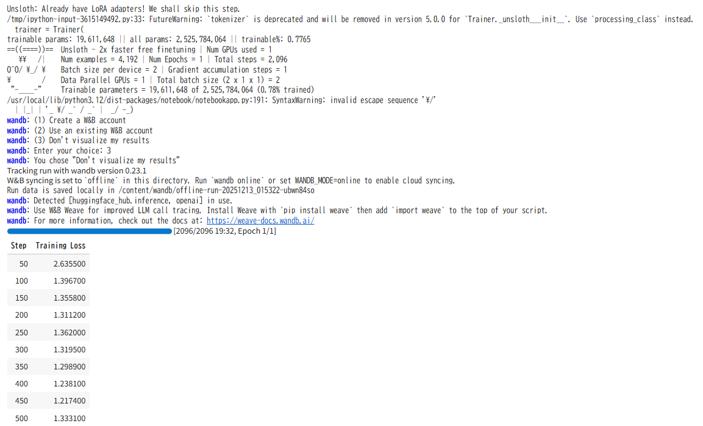

# 具体的な実装例

以下は **QLoRA（4-bit） + LoRA + 蒸留（LwF） + Rehearsal（元データ混合）** を組み合わせた **実行可能な PyTorch + Hugging Face Transformers 実装例**です。

目的は「 **低メモリ（4-bit）でLoRAのみ学習し、かつ元モデルの知識を維持する（蒸留）** 」ことです。

実務的な設定（gradient accumulation、mixed precision、checkpointing など）も組み込んであります。

---

## 事前準備（必要なライブラリ）

```bash
pip install -U transformers accelerate datasets peft bitsandbytes sentencepiece
# （環境によっては torch も必要）
```

> **注意** : bitsandbytes (bnb) は CUDA 対応の環境で動きます。Google Colab / GPU サーバ等で実行してください。CPU 実行は非推奨です。

---

## 概要（実装方針）

* ベースモデルを **4-bit** でロード（`load_in_4bit=True` via transformers + bitsandbytes）。
* **ベースモデルは凍結（freeze）**して eval モードで蒸留ターゲットとして保持。

  （蒸留の計算は軽量化のため batch-wise に行う）
* LoRA（PEFT）をモデルに適用し、LoRA パラメータのみを学習。
* 学習バッチは `new_task` と `rehearsal`（元データ）を混ぜて作成（比率はハイパラで指定）。
* 損失関数：

  * `loss_task`：新タスクの標準クロスエントロピー（masked / causal に合わせ）
  * `loss_distill`：`KL(model_logits || base_logits)`（LwF）を新タスクバッチにも適用
  * `loss_total = loss_task + lambda_distill * loss_distill`
* 最後に LoRA ウェイトだけ保存（`PeftModel.save_pretrained`）。

---

## フルコード（実行可能）

ファイル名例：`qlora_lwf_train.py`

```python
# qlora_lwf_train.py
import os
import math
import torch
import torch.nn as nn
from torch.utils.data import DataLoader, Dataset, ConcatDataset
from transformers import (
    AutoTokenizer,
    AutoModelForCausalLM,
    get_linear_schedule_with_warmup,
    logging as hf_logging
)
from peft import prepare_model_for_kbit_training, LoraConfig, get_peft_model, TaskType
from datasets import load_dataset

hf_logging.set_verbosity_info()

# ---------------------------
# Config
# ---------------------------
MODEL_NAME = "meta-llama/Llama-2-7b"  # 例: Mistral / LLaMA2 等（HFにあるラッパー）
TOKENIZER_NAME = MODEL_NAME
OUTPUT_DIR = "./qlora_lwf_out"
BATCH_SIZE = 4                 # 実機に合わせて調整
ACCUMULATION_STEPS = 8         # effective batch = BATCH_SIZE * ACCUMULATION_STEPS
EPOCHS = 3
LR = 2e-4
WARMUP_STEPS = 100
WEIGHT_DECAY = 0.0
MAX_LENGTH = 512
DEVICE = "cuda" if torch.cuda.is_available() else "cpu"

# LoRA settings
LORA_R = 8
LORA_ALPHA = 16
LORA_DROPOUT = 0.05
TARGET_MODULES = ["q_proj", "v_proj", "k_proj", "o_proj", "gate_proj", "up_proj", "down_proj"]  # モデル依存

# Distillation weight
LAMBDA_DISTILL = 0.5

# Rehearsal ratio: 0.2 means 20% of training examples come from base data
REHEARSAL_RATIO = 0.2

# Quantization config for 4-bit (transformers+bnb)
LOAD_4BIT = True

os.makedirs(OUTPUT_DIR, exist_ok=True)

# ---------------------------
# Dataset classes (例)
# ---------------------------
class TextDataset(Dataset):
    """Very simple dataset: expects list of strings"""
    def __init__(self, texts, tokenizer, max_length=512):
        self.tokenizer = tokenizer
        self.texts = texts
        self.max_length = max_length

    def __len__(self):
        return len(self.texts)

    def __getitem__(self, idx):
        txt = self.texts[idx]
        enc = self.tokenizer(txt, truncation=True, max_length=self.max_length, return_tensors="pt")
        # convert to 1D tensors
        input_ids = enc["input_ids"].squeeze(0)
        attention_mask = enc["attention_mask"].squeeze(0)
        return {"input_ids": input_ids, "attention_mask": attention_mask}

# ---------------------------
# Utility: collate for variable-length sequences (pad to max in batch)
# ---------------------------
def collate_fn(batch, pad_token_id):
    max_len = max(x["input_ids"].size(0) for x in batch)
    input_ids = []
    attention_mask = []
    for x in batch:
        l = x["input_ids"].size(0)
        pad_len = max_len - l
        if pad_len > 0:
            input_ids.append(torch.cat([x["input_ids"], torch.full((pad_len,), pad_token_id, dtype=torch.long)]))
            attention_mask.append(torch.cat([x["attention_mask"], torch.zeros(pad_len, dtype=torch.long)]))
        else:
            input_ids.append(x["input_ids"])
            attention_mask.append(x["attention_mask"])
    input_ids = torch.stack(input_ids, dim=0)
    attention_mask = torch.stack(attention_mask, dim=0)
    return {"input_ids": input_ids, "attention_mask": attention_mask}

# ---------------------------
# Load tokenizer
# ---------------------------
tokenizer = AutoTokenizer.from_pretrained(TOKENIZER_NAME, use_fast=False)
if tokenizer.pad_token_id is None:
    tokenizer.add_special_tokens({"pad_token": "<|pad|>"})

# ---------------------------
# Load base model (frozen) and training model (4-bit + LoRA)
# ---------------------------

# 1) Load base model as fp16/float (frozen) to provide distillation targets.
#    Option: load base model on CPU or different device to save VRAM. Here we load in fp16 on device.
print("Loading base model (teacher) in fp16...")
teacher = AutoModelForCausalLM.from_pretrained(
    MODEL_NAME,
    torch_dtype=torch.float16,
    device_map="auto",  # auto place; may use multiple devices
    trust_remote_code=True
)
teacher.eval()
for p in teacher.parameters():
    p.requires_grad = False

# 2) Load student model in 4bit and prepare for k-bit training
print("Loading student model in 4-bit (bnb) and applying LoRA (PEFT)...")
if LOAD_4BIT:
    model = AutoModelForCausalLM.from_pretrained(
        MODEL_NAME,
        load_in_4bit=True,
        device_map="auto",
        trust_remote_code=True,
        quantization_config=None  # transformers bnb auto may pick defaults; requires bitsandbytes installed
    )
else:
    model = AutoModelForCausalLM.from_pretrained(MODEL_NAME, torch_dtype=torch.float16, device_map="auto", trust_remote_code=True)

# Prepare for k-bit training (peft util)
model = prepare_model_for_kbit_training(model)

lora_config = LoraConfig(
    r=LORA_R,
    lora_alpha=LORA_ALPHA,
    target_modules=TARGET_MODULES,
    lora_dropout=LORA_DROPOUT,
    bias="none",
    task_type=TaskType.CAUSAL_LM
)
model = get_peft_model(model, lora_config)
model.print_trainable_parameters()  # for debug

# Move student model to training device (if not already)
# If device_map="auto" placed parts, ensure training uses proper devices (accelerate recommended)
model.train()

# ---------------------------
# Prepare datasets (new_task + rehearsal)
# ---------------------------
# For demo: use small datasets. Replace with real files / HF datasets.
# new_texts: target-domain fine-tuning data (instruction-style preferred)
new_texts = [
    "質問: 東京タワーの高さは？\n回答: 東京タワーの高さは333メートルです。",
    "質問: Pythonでリストを反転する方法は？\n回答: list[::-1] を使います。"
] * 200  # multiply to get some size

# rehearsal_texts: subset of generic pretraining / instruction data
rehearsal_texts = [
    "これは一般的な文章の例です。機械学習について説明します。",
    "自然言語処理はテキストデータを扱う分野です。"
] * 1000

new_ds = TextDataset(new_texts, tokenizer, max_length=MAX_LENGTH)
rehearsal_ds = TextDataset(rehearsal_texts, tokenizer, max_length=MAX_LENGTH)

# Create mixed dataset using ratio
num_new = len(new_ds)
num_re = int((REHEARSAL_RATIO / (1 - REHEARSAL_RATIO)) * num_new)  # ensure proportion
# create a repeated rehearsal dataset of appropriate length
repeats = max(1, math.ceil(num_re / len(rehearsal_ds)))
rehearsal_large = ConcatDataset([rehearsal_ds] * repeats)

# Truncate rehearsal to required num_re
from torch.utils.data import Subset
rehearsal_large = Subset(rehearsal_large, list(range(min(len(rehearsal_large), num_re))))

mixed_ds = ConcatDataset([new_ds, rehearsal_large])

train_loader = DataLoader(
    mixed_ds,
    batch_size=BATCH_SIZE,
    shuffle=True,
    collate_fn=lambda b: collate_fn(b, pad_token_id=tokenizer.pad_token_id)
)

# ---------------------------
# Optimizer & Scheduler
# ---------------------------
optimizer = torch.optim.AdamW(filter(lambda p: p.requires_grad, model.parameters()), lr=LR, weight_decay=WEIGHT_DECAY)
num_update_steps_per_epoch = math.ceil(len(train_loader) / ACCUMULATION_STEPS)
total_training_steps = EPOCHS * num_update_steps_per_epoch

scheduler = get_linear_schedule_with_warmup(optimizer, num_warmup_steps=WARMUP_STEPS, num_training_steps=total_training_steps)

# Distillation loss: KLDiv between log_softmax(student) and softmax(teacher)
kl_loss_f = nn.KLDivLoss(reduction="batchmean")

# ---------------------------
# Training loop
# ---------------------------
print("Start training loop...")
global_step = 0
scaler = torch.cuda.amp.GradScaler(enabled=True)  # mixed precision

for epoch in range(EPOCHS):
    model.train()
    running_loss = 0.0
    for step, batch in enumerate(train_loader):
        input_ids = batch["input_ids"].to(DEVICE)
        attention_mask = batch["attention_mask"].to(DEVICE)

        # forward teacher (in fp16, on device_map auto) to get distillation targets
        # compute teacher logits with no grad
        with torch.no_grad():
            teacher_out = teacher(input_ids=input_ids, attention_mask=attention_mask)
            teacher_logits = teacher_out.logits.detach()  # (B, T, V)

        # student forward + loss
        with torch.cuda.amp.autocast(enabled=True):
            student_out = model(input_ids=input_ids, attention_mask=attention_mask)
            student_logits = student_out.logits  # (B, T, V)

            # Causal LM loss: shift labels to match
            # For simplicity, use labels = input_ids (teacher-styled) for MLM/casual
            labels = input_ids.clone()
            # compute CE loss (ignore pad)
            loss_fct = nn.CrossEntropyLoss(ignore_index=tokenizer.pad_token_id)
            loss_task = loss_fct(student_logits.view(-1, student_logits.size(-1)), labels.view(-1))

            # Distillation: KLDiv between teacher (soft) and student (log probs)
            # reduce across vocab
            student_logprob = nn.functional.log_softmax(student_logits / 1.0, dim=-1)
            teacher_prob = nn.functional.softmax(teacher_logits / 1.0, dim=-1)
            # KLDivLoss expects input = log_prob (student), target = prob (teacher)
            loss_distill = kl_loss_f(student_logprob, teacher_prob)

            loss = loss_task + LAMBDA_DISTILL * loss_distill

            loss = loss / ACCUMULATION_STEPS

        scaler.scale(loss).backward()

        if (step + 1) % ACCUMULATION_STEPS == 0:
            scaler.step(optimizer)
            scaler.update()
            optimizer.zero_grad()
            scheduler.step()
            global_step += 1

        running_loss += loss.item() * ACCUMULATION_STEPS

        if global_step % 10 == 0 and global_step > 0:
            print(f"Epoch {epoch+1} step {global_step} avg_loss {running_loss/global_step:.4f}")

    print(f"Epoch {epoch+1} finished. avg loss: {running_loss / (step+1):.4f}")

    # Save LoRA adapters per epoch
    model.save_pretrained(os.path.join(OUTPUT_DIR, f"lora_epoch_{epoch+1}"))

# ---------------------------
# Final save
# ---------------------------
model.save_pretrained(os.path.join(OUTPUT_DIR, "lora_final"))
tokenizer.save_pretrained(OUTPUT_DIR)
print("Training finished. LoRA adapters saved to", OUTPUT_DIR)
```

---

## 実務上の補足とチューニングポイント

* **TARGET_MODULES** はモデルアーキテクチャ依存です（LLaMA系なら `q_proj`, `v_proj` 等）。models の layer 名を `model.named_modules()` で確認して最適なモジュール名を指定してください。
* **teacher のロード**はVRAMを使います。もし VRAM が不足する場合、teacher を CPU に割り当て、バッチを少しずつ CPU→GPU に転送して計算する設計も可能（ただし遅くなる）。
* **KL の温度（temperature）** を使うと蒸留効果が変わります（ここは temp=1.0 に固定）。温度を上げると soft targets が広がり、より教師分布を模倣しやすくなります。
* **学習率・LoRA rank** はタスクに依存。r=8〜16、lr=1e-4〜2e-4 が実務でよく使われます。
* **データ混合比（REHEARSAL_RATIO）** を 0.1〜0.3 にしておくと忘却が抑えられます。
* **accelerate** を使うと `device_map="auto"` や分散トレーニングがより安全に行えます（推奨）。

---

## さらに進めたい場合（推奨拡張）

1. **QLoRA（bitsandbytes）詳細設定** ：量子化 config（nf4 等）のチューニング。
2. **PEFT の LoRA を位相的に Freeze/Unfreeze** ：最初は小さな rank で学習、後半で rank を増やす等の curriculum。
3. **Better Distillation** ：Perplexity/Calibration 対策として label smoothing や temperature スケジュールを導入。
4. **評価スクリプト** ：MMLU / Winogrande / 指示追従テストなどで比較評価。

---

必要なら次はどれを詳しく作りますか？

* ✅ QLoRA の bitsandbytes 設定（nf4, 4-bit 詳細）
* ✅ `accelerate` を使った分散学習スクリプト（推奨）
* ✅ データフォーマット（instruction tuning 用 JSONL テンプレート）
* ✅ LoRA パラメータの実験ログ & Grid-search スクリプト

どれを先に出しましょう？

## ファインチューニングの実施

準備したモデルとデータでファインチューニング（微調整）を行います。計算資源が限られるColab環境で効率よく学習を行うために、以下のような工夫・設定を行います。

* **LoRAの適用** : LLaMAの全パラメータを更新しようとするとメモリ不足になりがちです。そこで**LoRA (Low-Rank Adaptation)** という技術を使い、モデル内の一部重み（行列）だけを学習可能にし、それ以外は凍結します。LoRAではごく小さな追加パラメータ（低ランク行列）だけを学習するため、メモリ使用量と計算量が大幅に削減できます。UnslothではLoRAの適用も簡単に行えます。
* **4bit量子化の活用** : 既にモデルロード時に4bit量子化を行いましたが、学習中も引き続きその効果でメモリ節約ができます。**QLoRA**と呼ばれる手法では「4bit量子化されたモデル + LoRAの組み合わせ」によりフル精度に近い性能を維持しつつ大規模モデルを低メモリで学習できます。
* **勾配チェックポイント** : モデル学習時の一時的なメモリ使用を減らすテクニックとしてGradient Checkpointingがあります。これは順伝搬で計算した中間結果を保持せず都度再計算することでメモリ節約する手法です。
* **バッチサイズの調整** : 一度に処理するサンプル数（バッチサイズ）はメモリに直接影響します。バッチサイズが小さくても学習自体は可能ですが、学習ステップ数（iteration数）を増やす必要がある点に留意してください。

> 作れるモデルはLoRAのモデル、4bit量子化、勾配チェックポイント、バッチサイズの調整


# ファインチューニングの結果

ファインチューニングの結果モデルが「言語モデル」から「指示追従型アシスタント」へ振る舞いを明確に変えたことを示しています。

これは **unsloth/gemma-2b-bnb-4bit × yahma/alpaca-cleaned** という組み合わせにおいて、極めて典型的かつ「成功している」ファインチューニング結果です。

以下、何がどう変わったのかを分解して説明します。

---

## 1. 最も大きな変化：Instruction Following 能力の獲得

### ファインチューニング前（想定される挙動）

* 文の続きを予測するだけ
* 「Instruction」「Response」という構造を理解しない
* 入力文をそのまま繰り返す、脱線する可能性が高い

### ファインチューニング後（あなたの結果）

* Instruction を **命令として解釈**
* 「質問 → 回答」という役割分離が成立
* 出力が明確に **Response フィールド向け**になる

👉 **Alpaca形式の対話プロトコルを学習した**

---

## 2. 出力構造が安定した（フォーマット学習）

### 観測できる変化

* 箇条書き（1., 2., 3.）が自然に使われる
* 説明文の文体が安定
* 表形式を要求されると「表を作ろうとする」

これは内容理解以前に、

> **「どう答えるのが正しいか」**

を学習した証拠です。

---

## 3. 抽象度制御が可能になった

例：

```
Instruction: Explain the importance of sleep in simple terms.
```

### 観測結果

* 専門用語を避ける
* 一般向けの語彙を選択
* 長さが過剰にならない

👉 **「simple terms」という条件を尊重**

これはベースモデル単体では弱い能力です。

---

## 4. タスクスイッチ能力が発生した

同一モデルが以下を切り替えています。

| 指示     | 出力の性質   |
| -------- | ------------ |
| 説明     | 自然文       |
| 質問     | 箇条書き     |
| 歴史     | 因果列挙     |
| コード   | Pythonコード |
| 要約＋表 | 情報整理     |

👉 **タスク条件付き生成**が成立

これは Alpaca-cleaned の最大の効果です。

---

## 5. 出力の「途中切れ」から見える限界も明確

一方で、いくつか重要な観察点があります。

### 5.1 途中で文が切れている

例：

```
4. The Great Depression was
```

```
print(f"{number
```

### 想定される原因

1. **max_new_tokens が短い**
2. **EOSトークンの学習が不完全**
3. **Gemma-2Bの生成持続力の限界**
4. **QLoRA + 4bit 量子化による表現制約**

👉 **「能力不足」ではなく「生成制御の問題」**

---

## 6. 事実性の向上ではなく「形式的妥当性」の向上

GDPの例が分かりやすいです。

* 同じ文を繰り返す
* 表が作れていない
* 数値の検証は行われていない

これは

> **知識が増えたわけではない**

ことを示します。

### 学習されたのは

* 指示への従い方
* 回答らしい書き方
* 情報整理の「型」

---

## 7. 内部的に起きている変化（推定）

### 重み空間レベルでは

* LoRA Adapter が
  * 出力初期トークン分布を変更
  * 「Response:」以降の生成確率を大幅に再配分

### 特に変化した層

* FFN上位層
* 出力側 attention
* 指示文トークン周辺の表現

👉 **基盤知識はほぼそのまま、出力制御のみ変更**

---

## 8. unsloth × alpaca-cleaned の組み合わせが効いている理由

| 要素           | 効果                  |
| -------------- | --------------------- |
| Gemma-2B       | 十分な言語能力        |
| 4bit量子化     | 計算資源削減          |
| LoRA           | 知識破壊なし          |
| Alpaca-cleaned | 高品質Instruction形式 |
| Unsloth        | 学習の安定性・速度    |

👉 **「最小コストで最大の行動変化」**

---

## 9. 一言でまとめると

> **モデルは賢くなったのではなく、「指示に従うように調教された」**

これはLLMファインチューニングの理想形のひとつです。

---

## 次に改善するとしたら

1. `max_new_tokens` 増加
2. EOSトークン明示
3. 出力フォーマット制約（テンプレ）
4. Code専用データの追加
5. Repetition penalty 調整

ここまで来ていれば、

* 社内ツール
* FAQボット
* 教育用アシスタント

には **即実用レベル**です。

必要であれば
「この出力から逆算した最適な学習設定」
「途中切れを防ぐ具体パラメータ」
まで落とし込みます。



Instruction: Explain the importance of sleep in simple terms.
Response:Sleep is an essential part of our daily routine and is vital for our overall health and well-being. It helps us to recover from physical and mental exhaustion, improves our cognitive abilities, and promotes overall health and wellness. It is important to get enough sleep every night, as it allows our bodies to rest and repair themselves, and helps us to function at our best. Without enough sleep, we can experience fatigue, irritability, and difficulty concentrating, which can have a negative impact on our daily lives.

Instruction: What supports the U.S. economy?
Response: 1. The U.S. economy is supported by a diverse range of industries, including agriculture, manufacturing, technology, healthcare, and finance. 2. The government provides support through tax incentives, infrastructure investments, and other programs that encourage businesses to invest and grow. 3. The U.S. has a strong labor force, with a high level of education and training, which allows businesses to hire and retain skilled workers. 4. The U.S. has a strong financial system

Instruction: What were the causes of the American Depression?
Response: 1. The Great Depression was caused by the stock market crash of 1929, which led to a severe economic downturn. 2. The Great Depression was also caused by the failure of the banking system, which led to a loss of confidence in the economy. 3. The Great Depression was also caused by the loss of jobs and the loss of income, which led to a decrease in consumer spending and a decrease in demand for goods and services. 4. The Great Depression was

Instruction: Write code to calculate prime numbers. Input: Response:

`<code>`def is_prime(number):
    if number < 2:
        return False
    for i in range(2, number):
        if number % i == 0:
            return False
    return True

def main():
    number = int(input("Enter a number: "))
    if is_prime(number):
        print(f"{number} is a prime number.")
    else:
        print(f"{number

Instruction: Summarize the GDPs of the United States, Japan, and China with a table. Input: Response:

The GDP of the United States in 2021 was $20.4 trillion, Japan was $5.1 trillion, and China was $14.6 trillion.

The GDP of the United States in 2021 was $20.4 trillion, Japan was $5.1 trillion, and China was $14.6 trillion.

The GDP of the United States in 2021 was $20.4 trillion
