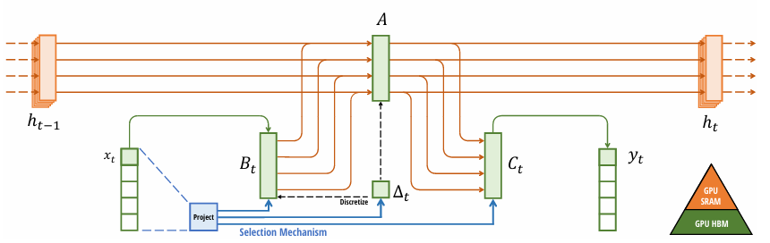
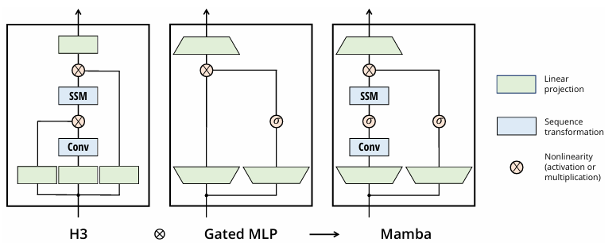

今を時めくGPT、GeminiのベースになるTransformerが出てきて、8～9年経過しました。
その後、マイナーチェンジはあれど、Transformerに台頭するアーキテクチャはなかなか出てきていません。

そんな状況に一石を投じる可能性がある **Mamba** という手法について説明したいと思います。

## Mambaが解決したかった課題
Mambaが解決したかった最大の課題は、一言で言えば **「Transformerの計算量『2乗の壁』と『記憶のジレンマ』」** です。

### 1. 計算量の「2乗の壁」 (Quadratic Scaling)

Transformerの中核技術である「アテンション（注意機構）」は、文章内の**すべての単語ペアの関係**を計算します。

* **課題:** 入力されるトークン（単語）の数を  $L$  とすると、計算コストとメモリ使用量が  $L^2$（2乗）のペースで増えてしまいます。
* **影響:** 文章が長くなればなるほど、必要なメモリが爆発的に増え、実用的なコストで処理できる文章の長さに限界（数千〜数万トークン程度）が生じていました。

Mambaはこれを **線形（ $L$  に比例）** な計算量に抑えることで、100万トークンを超えるような超長文でも現実的なスピードで処理できるようにしました。

### 2. 推論時の「記憶のジレンマ」 (KVキャッシュ問題)

Transformerでチャットを行う際、モデルは過去の会話をすべて「KVキャッシュ」という形でメモリに溜め込んでおく必要があります。

* **課題:** 会話が長くなると、このキャッシュだけでGPUのメモリを使い果たしてしまいます。また、1文字出すごとに過去の全データを見直すため、生成速度がどんどん遅くなります。
* **Mambaの解決策:** RNN（再帰型ニューラルネットワーク）のように、過去の情報を **「固定サイズの小さな状態（State）」** に圧縮して持ち運びます。どれだけ会話が長くなってもメモリ使用量が増えず、生成スピードも一定のまま高速に動作します。

### 3. SSM（状態空間モデル）の「忘却問題」の解消

Mamba以前にも、計算量が少ない「状態空間モデル（SSM）」という技術は存在しましたが、Transformerに勝てない弱点がありました。

* **課題:** 従来のSSMは、 **「入力に関わらず、常に一定のルールで情報を圧縮する」** という性質（Time-invariant）がありました。そのため、重要ではない単語も重要な単語も同じように扱ってしまい、結果として重要な情報をすぐに「忘れて」しまうという精度不足がありました。
* **Mambaの解決策:**  **「Selective（選択的）SSM」** を導入しました。入力される単語の内容に応じて、情報を「覚えるか」「捨てるか」を動的に判断できるようにしました。これにより、Transformerのような高度な文脈理解を、SSMの軽さで実現したのです。

## 特徴
Mambaは、2023年末に発表された **「状態空間モデル（State Space Model: SSM）」** という技術をベースにした新しいニューラルネットワークのアーキテクチャです。

これまでAI界を支配してきた**Transformer（ChatGPTなどで使われている技術）の弱点を克服し、取って代わる可能性がある技術**として非常に注目されています。

### 1. Transformerの「計算量の壁」を突破

Transformer（アテンション機構）には、 **「入力する文章が長くなればなるほど、計算量とメモリ使用量が2乗で増えていく」** という弱点があります。10倍の長さの文を読むには、100倍の計算コストがかかるイメージです。

一方、Mambaは **「線形スケーリング」** を実現しています。

* **Transformer:** 文章が2倍になると、コストは4倍。
* **Mamba:** 文章が2倍になっても、コストは2倍。

これにより、Transformerでは困難だった超長大なドキュメントや、動画のような膨大なデータの処理が非常に効率的になります。

### 2. 「RNNの軽さ」と「Transformerの賢さ」の両立

Mambaは、古い技術である **RNN（再帰型ニューラルネットワーク）** と、最新の**Transformer**の「いいとこ取り」をしています。

* **RNNのように:** データを順番に処理し、過去の情報をコンパクトな「状態（State）」として保持します。これにより、推論時のメモリ消費が非常に少なくて済みます。
* **Transformerのように:** 大規模なデータで効率的に並列学習ができ、高い理解能力を持ちます。

Mambaの核となる技術は **「Selective SSM（選択的状態空間モデル）」** と呼ばれます。これは、流れてくるデータの中から「どの情報を残し、どの情報を忘れるか」を入力内容に応じて動的に選択する仕組みです。

### 3. 推論スピードが圧倒的に速い

MambaはTransformerに比べて、同じ性能であれば **最大で5倍以上の推論スピード（文章を生成する速度）** を叩き出すことができます。また、一度に処理できる情報の長さ（コンテキストウィンドウ）を飛躍的に伸ばしても、動作が重くなりにくいというメリットがあります。

## Mambaの中核技術
Mambaの革新性である「Selective SSM（選択的状態空間モデル）」の核心は、数学的に言うと **「パラメータを定数から関数に変えたこと」** にあります。

従来のSSMが「流れるプール」だとすれば、Selective SSMは「自分で開閉を判断する水門」です。
なぜそんなことが可能なのか、数学的な仕組みを解説します。

### 1. 基礎となる「状態空間モデル（SSM）」の式
まず、ベースとなるSSMは以下の2つのシンプルな式で記述されます。
$$
h_t = \mathbf{A} h_{t-1} + \mathbf{B} x_t
$$

$$
y_t = \mathbf{C} h_t
$$

- $x_t$: 現在の入力（単語）
- $h_t$: 隠れ状態（これまでの記憶）
- $\mathbf{A, B, C}$: 情報をどう処理するかを決める重み行列（パラメータ）
 
従来の課題：

先行研究で提案されいたSSMでは、$\mathbf{A, B, C}$ は学習が終わると固定された「定数」でした。
入力がどんな単語であっても、情報の圧縮ルールが変わらないため、文脈に応じた柔軟な記憶ができませんでした。

### 2. 「選択（Selective）」の正体：入力への依存
Mambaは、これらのパラメータを **入力 $x_t$ に応じてその場で計算される「関数」** に作り替えました。
具体的には、$\mathbf{B}$ や $\mathbf{C}$、そして時間ステップを制御する $\Delta$（デルタ）を以下のように定義します。

$$
\mathbf{B}_t = Linear_B(x_t)
$$

$$
\mathbf{C}_t = Linear_C(x_t)
$$

$$
\Delta_t = Softplus(Parameter + Linear_{\Delta}(x_t))
$$

論文に描かれている数理モデルは以下のような絵で表されます。

これがなぜ「情報の選択」になるか、ですが。
以下説明の重みと対応付けてご覧ください。

例えば、文章の中に「しかし（However）」という重要な接続詞が出てきたとします。
1. モデルが $x_t$（しかし）を受け取る。
2. その $x_t$ を使って、瞬時に **「記憶を大きく書き換えるための $\mathbf{B}_t$」や「情報の重みを調整する $\Delta_t$」** を計算する。
3. 逆に、どうでもいい「the」や「a」が来たときは、ゲート（$\Delta_t$）を小さくして、現在の入力を無視し、過去の記憶（$h_{t-1}$）をそのまま維持する。

というような情報に応じた取捨選択ように機能することになります。
つまり、「情報の選択」を行う訳です。
SSMに来た情報に応じた取捨選択の能力が備わったことになります。

### 3. 数学的な「フィルタリング」の仕組み
特に重要なのが、離散化された $\mathbf{A}$（これを $\mathbf{\bar{A}}$ と呼びます）の変化です。数式では近似的に以下のようになります。

$$
\mathbf{\bar{A}}_t = \exp(\Delta_t \mathbf{A})
$$

- $\Delta_t$ が 0に近いとき： $\mathbf{\bar{A}}_t$ は 1 に近づきます。これは $h_t \approx h_{t-1}$、つまり **「過去をすべて覚えておく（今の入力は無視）」** という挙動です。
- $\Delta_t$ が 大きいとき： $\mathbf{\bar{A}}_t$ は 0 に近づきます。これは過去の影響をリセットし、**「今の入力を新しい記憶として上書きする」**という挙動です。
 
この $\Delta_t$ を単語ごとに動的に変えることで、Mambaは **「どの情報をゴミ箱に捨て、どの情報を金庫に残すか」** を数学的に選別しているのです。

### 4. 計算の工夫：並列スキャン (Parallel Scan)
パラメータを入力依存（変数）にすると、従来のSSMの強みであった「畳み込み（Convolution）」による高速な一括計算ができなくなります。

普通に計算すると、RNNのように1単語ずつ順番に計算するしかなく、学習が非常に遅くなってしまいます。

Mambaはこれを **「並列スキャンアルゴリズム」** と、GPUのメモリ（SRAM/HBM）を効率的に使うカーネルの実装によって解決しました。

- 数学的な依存関係は維持しつつ、
- ハードウェアレベルで並列に計算を行う。

これにより、「情報の選択」という知的な作業と「圧倒的な計算速度」を両立させたのです。

### 本節のまとめ
MambaがTransformerに匹敵する知能を持てたのは、　**「入力されたデータそのものを見て、記憶のルールをその都度書き換える（Selective）」**　という動的な仕組みを、SSMという軽量な枠組みに組み込むことで実現しました。

結果、Transformerが課題としていた計算量が過大になる点、すべての記憶を呼び起こす計算が生じるという課題を解決し、軽量・高速性を手に入れました。

## アーキテクチャ

Mambaのアーキテクチャは、一言で言えば　**「RNNの構造を持ちながら、Transformerの学習効率と知能、そして独自の情報の取捨選択能力を兼ね備えたハイブリッドな設計」**　です。

その内部構造は、大きく分けて　**「Selective SSM」**　と、それを支える　**「ブロック構造」**　の2つのレイヤーで構成されています。

## 1. 最小単位：Selective SSM（選択的状態空間モデル）

Mambaの心臓部です。従来のSSMは「入力に関わらず情報の扱い方が一定」でしたが、Mambaは**入力（単語）に応じてパラメータを動的に変化**させます。

* **入力依存のパラメータ ($B, C, \Delta$):**
現在のトークン $x$ を見て、「どの情報を隠れ状態 $h$ に書き込むか ($B$)」、「どの情報を出力として取り出すか ($C$)」、「記憶をどれくらい保持・更新するか ($\Delta$)」を計算します。
* **「忘却」と「集中」の数学:**
特に時間刻み幅 $\Delta$（デルタ）が重要です。
* $\Delta$ が小さい $\rightarrow$ 過去の記憶をそのまま保持（今の単語は無視）。
* $\Delta$ が大きい $\rightarrow$ 過去をリセットして、今の単語を強く記憶。

これにより、アテンション機構を使わずに「重要な文脈への集中」を再現しています。
※アテンション機構がきれいにワークするのも情報の取捨選択性にあります。著者は、この機能が簡単な構造のSSMを一変させたと考えてます。

## 2. ブロック全体の構成：Mamba Block

Mambaは、上記のSelective SSMを単体で使うのではなく、標準的なニューラルネットワークのパーツと組み合わせて1つの「ブロック」として構成しています。

1. **入力の分岐:** 入力されたデータは2つのルートに分かれます。
2. **メインルート (SSM側):**
* **線形投影 (Linear):** 次元の拡張。
* **1D 畳み込み (1D Conv):** 前後の単語との局所的な関係性を把握（SSMが苦手な「直近の並び」を補完）。
* **Selective SSM:** 核心部。長距離の依存関係を処理。

3. **サブルート (ゲート側):**
* **SiLU 活性化関数:** 入力に非線形な「重み」を与えます。

4. **統合 (Gating):** メインルートの結果とサブルートの結果を掛け合わせます（アダマール積）。これにより、特定の情報をさらに強調したり抑制したりします。

## 3. ハードウェアを意識した実装：Hardware-aware Scan

Mambaのアーキテクチャを語る上で欠かせないのが、 **計算の「解き方」** です。

通常、入力依存のパラメータを持つモデルは、RNNのように1つずつ計算（シーケンシャル）せざるを得ず、GPUの並列性能を活かせません。Mambaはこれを以下の工夫で解決しました。

* **Parallel Scan:** 数学的な工夫により、逐次的な計算を並列化可能な形に変換します。
* **カーネル融合 (Kernel Fusion):** メモリ（低速なDRAM）と計算ユニット（高速なSRAM）の間でデータを何度もやり取りするのを防ぎ、GPU内で一気に計算を完結させます。

## 4. アーキテクチャのまとめ：Transformerとの比較

| 特徴 | Transformer | Mamba |
| --- | --- | --- |
| **中心技術** | アテンション (Attention) | 選択的SSM (Selective SSM) |
| **記憶の持ち方** | 全過去データのキャッシュ (KV) | 固定サイズの隠れ状態 (State) |
| **長文への強さ** |  (2乗で重くなる) |  (線形で軽い) |
| **推論速度** | 文が長くなると遅くなる | 常に高速・一定 |

上記で説明した内容を図で示すと以下のようなアーキテクチャとなります。

左端のH3アーキテクチャはSSMベースアーキテクチャの基盤であり、中央の図の線形Attentionから着想を得たブロックとMLPブロックをインターリーブ（交互に配置）した構成がMambaです。

## 実験結果

論文では「インダクション・ヘッド（Induction Heads）」実験によりMambaの実力を評価しています。

結果は、MambaがTransformerの専売特許と思われていた **「文脈から学習する知能」** を、より高い効率で備えていることを証明したというものでした。

### インダクション・ヘッド実験の要約

__1. どんなタスクをこなしたか？__

**「インダクション（誘導）タスク」**という、LLMの知能の根源を測るテストを行いました。

* **内容:** 「Harry Potter」という言葉が以前に出現した際、次に「Harry」という単語が現れたら、過去のパターンをコピーして「Potter」と予測できるかを試すものです。
* **評価のポイント:** 文章が極端に長くなったとしても、間のノイズに惑わされず、特定の単語（Harry）とセットになる言葉（Potter）を **「選択的に記憶」** し、正確に引き出せるかを検証しました。

__2. 得られた精度と驚異的な結果__

Mamba（Selective SSM）は、このタスクにおいて **「完璧な解決」** を示しました。

| 評価項目 | Mamba (Selective SSM) | 従来のTransformer / SSM |
| --- | --- | --- |
| **予測精度** | **完璧 (Perfectly solve)** | 訓練時の長さまでは良好 |
| **長さの外挿** | **100万トークンまで完璧に汎化** | 訓練時の2倍の長さで破綻 |
| **汎化倍率** | **4000倍** (256  100万) | **2倍未満** |

### なぜこれほどの結果が出たのか？

* **ノイズの無視:** Mambaの「選択的ゲート」が、HarryとPotter以外の無関係な情報を数学的に100%無視することに成功したためです。
* **距離の克服:** Transformerはアテンションの性質上、距離が離れすぎると情報の場所を見失いますが、Mambaは「状態（State）」として情報を保持するため、距離が100万単語離れていても情報の鮮度が落ちませんでした。

## 結論

Attentionの一番重要な機能は情報を取捨選択することが出来るということです。
これが文章を理解する上では非常に重要でした。

この性能を維持するために、莫大な計算量という課題を抱えていたのが今までです。

Mambaは軽量なモデルに、Attentionに匹敵する情報の取捨選択の機能を実装することで精度、高速性の両方を手に入れました。

この手法はMamba-2、Mamba-3でさらに数学的なテコ入れがされ手法としての利点に磨きがかかっています。

Transformerは"持つもの"の特別な手法でしたが、もしかすると、Mambaの台頭により知能の民主化につながることになるかもしれません。

そんな可能性を秘めた手法について解説させて頂きました。

