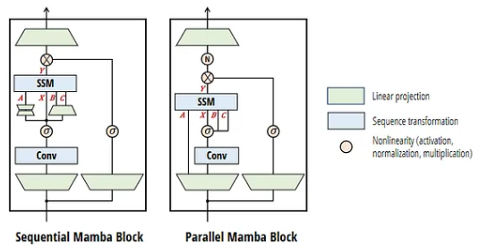

全開Mambaの続きとなるアーキテクチャMamba-2についてです。
Mamba-2は、初代Mambaの成功を受けて2024年5月に発表された次世代のアーキテクチャです。

一言で言えば、**「TransformerとSSM（状態空間モデル）の数学的な共通点を発見し、GPUの性能を限界まで引き出せるように再設計されたモデル」**です。

## 概要

### 1. Mamba-2が解決しようとした課題

初代Mambaは非常に優れたモデルでしたが、実用化と大規模化において以下の3つの大きな課題を抱えていました。

__① GPUの「行列演算ユニット」を活かしきれない__

現代のGPU（NVIDIAのTensor Coreなど）は、巨大な行列同士の掛け算（MatMul）を爆速で行うように設計されています。

* **課題:** 初代Mambaの核心である「並列スキャン」という計算手法は、MatMulとは異なる特殊な処理だったため、ハードウェアの潜在能力を100%引き出すのが困難でした。

__② Transformerとの「理論的な壁」__

SSMとTransformerは全く異なる進化を遂げてきたため、Transformerで成功した数々の知見（マルチヘッド化など）をどう適用すべきかが不明確でした。

* **課題:** 両者のアーキテクチャが分離しているため、ハイブリッドなモデルを作る際の理論的な裏付けが不足していました。

__③ 大規模学習時の効率__

パラメータ数を数千億規模（LLMクラス）に増やした際、初代Mambaの設計ではメモリ制御や計算効率の面でボトルネックが発生する可能性がありました。

### 2. Mamba-2の核心：SSD (Structured State Space Duality)

これらの課題を解決するために導入されたのが、 **SSD（構造化状態空間二重性）** という理論です。

* **「二重性」の発見:** 研究チームは、SSMの計算式に特定の制約（構造）を加えると、それが **「線形アテンション（Linear Attention）」と数学的に全く同じになる** ことを証明しました。
* **ハイブリッドな性質:** これにより、Mamba-2は「ある時はRNNのようにデータを1つずつ処理し、ある時はTransformerのようにデータを一括で処理する」という、状況に応じた最適な計算方法を選べるようになりました。

### 3. Mamba-2の主な特徴と進化点

__① 圧倒的な計算スピード（2〜8倍の高速化）__

SSD理論により、SSMの計算をGPUが得意とする **「行列掛け算」** の形に書き換えることに成功しました。これにより、初代Mambaよりも遥かに高速な学習と推論が可能になりました。

__② 「マルチヘッド」構造の採用__

Transformerの「マルチヘッド・アテンション」にならい、Mamba-2では **「マルチヘッドSSM」** 構造を採用しました。

* **効果:** 異なるヘッドが異なる情報（文法、事実、感情など）を並列で処理できるようになり、情報の表現力が大幅に向上しました。

__③ Transformerとの融合（Jambaなどの登場）__

Mamba-2はTransformerと数学的な「血の繋がり」が証明されたため、 **「Transformer層とMamba層を交互に混ぜる」** といったハイブリッド構成が容易になりました。これにより、Transformerの「高い推論能力」とMambaの「長文への強さ・速さ」をいいとこ取りしたモデルが次々と誕生しています。

## 状態空間モデル
SSM（State Space Model：状態空間モデル）は、もともと制御工学や統計学の世界で長年使われてきた数学的モデルです。

AI（ディープラーニング）の文脈におけるSSMは、 **「RNNのように過去の情報をコンパクトな『状態』にまとめつつ、Transformerのように並列計算ができる」** という、両者のいいとこ取りを目指した仕組みを指します。

その仕組みを3つのステップで紐解いていきましょう。

### 1. 基本的な考え方：情報の「要約」

SSMの本質は、流れてくる膨大なデータをそのまま持っておくのではなく、常に **「今の状態を表す小さなベクトル（隠れ状態 $h$）」** に圧縮して更新し続けることにあります。

* **入力 ($x$):** 今、目に入ってきた単語や信号。
* **状態 ($h$):** これまでの文脈をすべて詰め込んだ「記憶」。
* **出力 ($y$):** 記憶と今の入力を踏まえて、次に予測される値。

### 2. 数学的な仕組み：2つの式

SSMは、以下の2つのシンプルな線形微分方程式（または差分方程式）で表現されます。

1. **状態方程式:** $h'(t) = \mathbf{A}h(t) + \mathbf{B}x(t)$
* 「今の記憶」に「新しい入力」をどう混ぜて、記憶を更新するかを決めます。

2. **出力方程式:** $y(t) = \mathbf{C}h(t)$
* 「蓄積された記憶」から、必要な情報をどう取り出すかを決めます。

この中で最も重要なのが **行列 $\mathbf{A}$** です。これは「過去の情報をどれくらい、どのように忘れるか（あるいは残すか）」を司る「記憶の設計図」です。

### 3. なぜSSMが注目されているのか？

Transformerの「2乗の壁（計算コストが文章の長さの2乗で増える）」という弱点を、SSMは以下の2つの顔を使い分けることで解決します。

__① 推論時は「RNN」の顔（省メモリ・高速）__

データを1つずつ処理し、状態 $h$ だけを更新すればよいため、文章がどれだけ長くなっても**メモリ消費量が増えません**。これは、デバイス上での動作（エッジAI）に非常に適しています。

__② 学習時は「CNN」の顔（並列化）__

数式を工夫（離散化と畳み込みへの変換）することで、RNNのように順番を待たず、**文章全体を一括で並列計算**できます。これにより、Transformerに近い速度で大量のデータを学習できます。

### 4. SSMの進化：Mambaへ

従来のSSMは、行列 $\mathbf{A}, \mathbf{B}, \mathbf{C}$ が入力に関わらず「固定」だったため、複雑な文脈を読み取る力が不足していました。

そこに、 **「入力された単語に応じて、これらの行列をその場で変化させる」** という「選択性（Selectivity）」を導入したのが **Mamba** です。これにより、SSMはついにTransformerに匹敵する「知能」を手に入れました。

## 仕組み

Mamba-2の仕組みと原理は、一言で言えば **「状態空間モデル（SSM）を、GPUが最も得意とする行列計算（MatMul）の形へと数学的に書き換えたこと」** に集約されます。

その核心となる3つの柱を解説します。

### 1. SSD (Structured State Space Duality)：二重性の発見

Mamba-2の最も重要な原理は、 **「状態空間モデル（SSM）」と「アテンション（Attention）」は数学的に同じものである** という「二重性」の証明です。

* **従来の認識:** SSM（RNNに近い）とアテンション（Transformer）は全く別のアルゴリズムだと考えられてきました。
* **Mamba-2の発見:** SSMに「構造（特定の制約）」を加えると、それは **「線形アテンション（Linear Attention）」** と完全に一致します。これを **SSD (Structured State Space Duality)** と呼びます。

### 2. 行列乗算（MatMul）への帰着

初代Mambaの課題は、計算に「並列スキャン」という特殊な処理が必要で、GPUのフルパワーを出しにくい点にありました。Mamba-2ではSSD理論を用いることで、計算プロセスを劇的に変えました。

* **セグメント化された計算:** 長いシーケンスを小さなブロック（セグメント）に分割します。
* **ブロック内は行列計算:** 各ブロックの中では、Transformerと同じように**行列の掛け算**で一気に計算します。
* **ブロック間はSSM:** ブロックを跨ぐ「記憶の受け渡し」だけをSSM（状態の更新）で行います。

これにより、GPUの **Tensor Core（行列演算専用ユニット）** を最大限に活用できるようになり、初代Mamba比で最大8倍という圧倒的な高速化を実現しました。

### 3. マルチヘッド・ステート構造 (Multi-head State)

Transformerの「マルチヘッド・アテンション」の成功を取り入れ、記憶の管理方法を効率化しました。

* **状態の共有:** 初代Mambaでは各入力チャネルが独立した「巨大な記憶」を持っていましたが、Mamba-2では複数のチャネルで **「状態（State）」を共有** する構造（Multi-value, Multi-headに近い概念）を採用しました。
* **メリット:** メモリ使用量を大幅に抑えつつ、モデルの表現力を高めることに成功しました。

### 4. アーキテクチャの全体像

Mamba-2のブロック構造は、従来の「Mambaブロック」よりもシンプルになり、Transformerの構成（正規化やゲートの配置）に近くなっています。

1. **入力の投影:** 入力を複数のヘッドに分ける。
2. **SSDレイヤー:** 行列計算とSSMを組み合わせた中核処理。
3. **ゲートと活性化:** 処理された情報をフィルタリング。
4. **出力の投影:** 元の次元に戻す。

Mamba-1（Sequential）とMamba-2（Parallel）のブロック構造を比較した絵が以下です。

Mamba-2のブロックは、 **「SSMを、Transformerのアテンションレイヤーとほぼ同じデータフローで扱えるように再設計」** されています。これにより、学習時にはTransformerのように一気に計算し、推論時にはSSM（RNN）として省メモリで動くという二面性を、より高効率に実現しています。

__1. 入力投影（Linear Projection）の一本化__

左側のMamba-1では、SSMに入力する前に複数の経路で個別に線形変換（台形のアイコン）を行っています。一方、右側のMamba-2では、入力直後の線形変換が1つにまとめられ、そこから各パラメータ（A, X, B, C）へ枝分かれする形になっています。

工夫の目的: 複数の小さな行列演算を1つの大きな行列演算にまとめることで、GPUの計算効率を最大化しています。

効果: カーネルの起動回数が減り、スループットが向上します。

__2. パラメータ（A, B, C）の生成プロセスの簡略化__

図をよく見ると、SSMに供給されるパラメータ $A, B, C$ の通り道が変わっています。Mamba-1: $A$ や $B, C$ を生成するために、さらに個別の線形層や複雑な変換を通っています。Mamba-2: 最初の投影から直接、あるいは非常にシンプルな経路で $A, B, C$ が取り出されています。工夫のポイント: これは先述の SSD (Structured State Space Duality) 理論に基づいています。$A$ をスカラー（またはシンプルな構造）として扱うことで、複雑な生成ロジックを排除し、アテンションに近いシンプルな行列演算に落とし込めるようにしています。

__3. 非線形処理（N）の位置とノルムの追加__

Mamba-2のブロック上部には新たに 「N（Normalization/Nonlinearity）」 の丸印が追加されています。

工夫の内容: SSMの出力直後にグループ正規化（Group Norm）などを含む処理を導入しています。

背景: これにより、マルチヘッド構造（複数のSSMが並列で動く状態）において、各ヘッドの出力を安定させ、Transformerの「マルチヘッド・アテンション」と同じようなスケーラビリティ（モデルを大きくしても精度が落ちない性質）を確保しています。

## 数学的な根拠
Mamba-2の数学的本質は、SSMを **「1つの巨大な行列計算」として再定義したことにあります。特に、SSD（Structured State Space Duality）理論によって導かれた「半分離行列（Semiseparable Matrices）」** としての定式化が核心です。

### 1. SSMの「行列形態」への書き換え

従来のSSMの離散化式 $h_t = \bar{A}_t h_{t-1} + \bar{B}_t x_t$ を、系列全体（長さ $L$）に対して展開すると、出力 $y = (y_1, y_2, \dots, y_L)^\top$ は入力 $x = (x_1, x_2, \dots, x_L)^\top$ に対して以下の行列 $M$ の積として表現できます。

$$y = Mx$$

この行列 $M$ は以下のような下三角行列の構造を持ちます。

$$M = \begin{pmatrix} 
\bar{C}_1 \bar{B}_1 & 0 & 0 \\
\bar{C}_2 \bar{A}_2 \bar{B}_1 & \bar{C}_2 \bar{B}_2 & 0 \\
\bar{C}_3 \bar{A}_3 \bar{A}_2 \bar{B}_1 & \bar{C}_3 \bar{A}_2 \bar{B}_2 & \bar{C}_3 \bar{B}_3 
\end{pmatrix}$$

この行列の各要素 $M_{ij}$ ($i \ge j$) は、$\bar{C}_i (\prod_{k=j+1}^i \bar{A}_k) \bar{B}_j$ と書けます。これが **1次半分離行列（1-semiseparable matrix）** と呼ばれる構造です。

### 2. SSD理論：アテンションとの等価性

Mamba-2において、$\bar{A}_t$ をスカラー値 $a_t$ （厳密には $e^{\Delta_t A}$）と仮定すると、行列 $M$ の要素は次のように非常にシンプルになります。

$$M_{ij} = \bar{C}_i \bar{B}_j \prod_{k=j+1}^i a_k$$

これをアテンションの形式と比較してみましょう。標準的な線形アテンション（核関数を用いない形式）のスコアは $q_i^\top k_j$ です。Mamba-2の式は、これに **「過去からの減衰率」** を掛け合わせたものと見なせます。

* **$q_i$ (Query):** $\bar{C}_i$
* **$k_j$ (Key):** $\bar{B}_j$
* **Mask / Decay:** $\prod_{k=j+1}^i a_k$

つまり、Mamba-2は **「入力依存の指数減衰マスクを持つ線形アテンション」** を計算していることと同義なのです。

### 3. ブロック行列計算による高速化

Mamba-2が初代より速い最大の理由は、この巨大な行列 $M$ をそのまま計算するのではなく、**ブロック分解**して計算する点にあります。

系列を長さ $Q$ のブロック（セグメント）に分割すると、行列 $M$ は以下のようにブロック行列として表現されます。

1. **ブロック内計算 (Intra-block):** 各ブロック内部の計算は、GPUのTensor Coreを用いた通常の **行列乗算（MatMul）** として処理します。
2. **ブロック間計算 (Inter-block):** ブロックを跨ぐ記憶の伝播だけを、SSMの**再帰（Recurrence）**的な形式で処理します。

$$M = M_{\text{intra}} + M_{\text{inter}}$$

これにより、計算複雑度は系列長 $L$ に対して線形 $O(L)$ を維持しつつ、実効速度は Transformer のような $O(L^2)$ の行列演算に近い並列性を得ることができます。

### 4. 計算の具体ステップ

実際にGPU内部で行われている SSD アルゴリズムのステップは以下の通りです。

1. **入力を分割:** 入力 $x$ をサイズ $B \times L \times D$ からブロック単位に区切る。
2. **ブロック内スキャン:** 各ブロックの終端における「状態（State）」を、並列スキャンで計算する。
3. **ブロック間伝播:** 状態を次のブロックへ引き継ぐ（ここは系列長が短縮されているため極めて速い）。
4. **最終出力の合成:** 各ブロックの入力と引き継がれた状態を組み合わせて、最終的な $y$ を行列演算で一気に算出する。

## 効果
Mamba-2は、Transformerに匹敵する精度を維持しつつ、学習・推論の効率を劇的に向上させたモデルとして高く評価されています。 
主な評価のポイントは以下の通りです。

__1. 処理スピードとスループットの飛躍的向上__

高速な学習: Mamba-2は、初代Mambaと比較して2〜8倍高速に動作します。これは、GPUの行列演算ユニット（Tensor Core）を効率的に利用できる新しいアルゴリズム（SSD）を採用したためです。 
推論の効率性: シーケンス長に対して計算量が線形（Linear）にしか増加しないため、非常に長い文章（数十万〜数百万トークン）でも、Transformerのようにメモリ消費が爆発することなく処理可能です。 

__2. 言語モデルとしてのベンチマーク性能__

同等以上の精度: 2.7B（27億）パラメータのMamba-2を用いた実験では、同様の規模のTransformerモデル（Pythiaなど）を上回る精度（MMLUベンチマーク等）を記録しています。 
情報の保持能力: 状態空間（State Dimension）が初代の16から128へと8倍に拡張されたことで、情報の記憶・再現能力が向上し、複雑な文脈の理解においてTransformerに近い表現力を獲得したと評価されています。

## 総括
Mamba-2はMambaが抱えていた実用性の問題を解決したアーキテクチャです。

解決した課題は
1. GPUアーキテクチャの計算効率向上
2. Transformerの成功事例を数学的にSSMに置き換えた
3. 大規模学習時の効率化を果たした

という面で成功を収めました。

現状は未だTransformerが主流ですが、代替モデルにより、現在Transformer自体が頭打ちになる可能性を解決できないか。
非情に期待がかかります。

## 参考サイト

[著者による解説ブログ](https://tridao.me/blog/2024/mamba2-part1-model/)

[著者によるMambaのブログ](https://yoshishinnze.hatenablog.com/entry/2026/01/25/182406)
