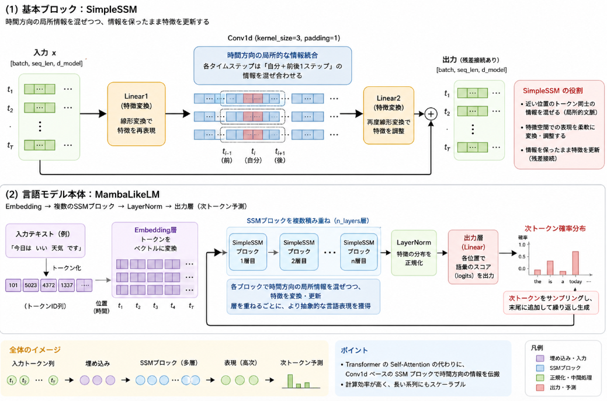

先日の記事では学習データが少なかったので、実力が少し分かりづらかったです。
このため、今度はある程度の分量の学習データで学習してみて、整った文章を出力できるようになるかについて確認しました。

前回記事は以下をご参考下さい。
Mambaのモデルで、少数文章で学習して文章生成が出来るかについて確認する、という内容のものです。

https://yoshishinnze.hatenablog.com/entry/2026/04/26/100821

## 今回実験目的

前回実験ではとりあえず文章をそれっぽく生成する能力を持つことが出来るかについて確認しました。
過去LSTMで同じ実験をやったときは、正直ダメだったので、違いが分かるか程度を期待していました。
結果、それっぽい文章を作れそうということが見れました。

今回は学習用データを増やして、文章生成の能力が確認できるかについて確認します。

## 実装

これまでの内容を踏まえて、Mamba風モデルを組んで学習するまでの手順を整理します。

実際の実装は以下レポジトリをご参考下さい。
https://github.com/Shinichi0713/LLM-fundamental-study/tree/main/llm/mamba/src/mamba_v2

### 1. モデル定義

モデルの全体イメージは以下のような感じです。



__(1) 基本ブロック（SimpleSSM）__

時間方向の畳み込みを使った簡易 SSM ブロックです。
この `SimpleSSM` ブロックは、**「時間方向の局所的な情報を混ぜつつ、情報を保ったまま特徴を更新する」**役割を持っています。

もう少し分解すると、次のような働きがあります。

__1. 時間方向の局所的な情報統合（Conv1d）__

```python
x = x.transpose(1, 2)
x = self.conv(x)
x = x.transpose(1, 2)
```

- 入力 `x` の形状は `[batch, seq_len, d_model]` です。
- `transpose(1, 2)` で `[batch, d_model, seq_len]` にし、`Conv1d` を時間方向（seq_len 方向）にかけます。
- `kernel_size=3, padding=1` なので、各タイムステップは「自分＋前後1ステップ」の情報を混ぜ合わせた値になります。

**働き**:  
- 近い位置のトークン同士の情報を混ぜる（局所的な文脈を捉える）
- RNN や SSM のように「時間方向に情報を伝える」簡易版として機能

__2. 線形変換による特徴の再スケーリング・表現変換__

```python
x = self.linear1(x)
...
x = self.linear2(x)
```

- `linear1` で一度特徴を変換し、Conv で時間方向の混合を行い、`linear2` で再度変換します。
- これにより、単なる Conv ではなく、「どの特徴を強調し、どの特徴を弱めるか」を学習可能な形で調整できます。

**働き**:
- 特徴空間での表現を柔軟に変形する
- モデルがデータに合わせて「どの情報を重視するか」を学習できる

```python
class SimpleSSM(nn.Module):
    def __init__(self, d_model):
        super().__init__()
        self.linear1 = nn.Linear(d_model, d_model)
        self.conv = nn.Conv1d(d_model, d_model, kernel_size=3, padding=1)
        self.linear2 = nn.Linear(d_model, d_model)

    def forward(self, x):
        residual = x
        x = self.linear1(x)

        # SSM 風の時間方向処理
        x = x.transpose(1, 2)
        x = self.conv(x)
        x = x.transpose(1, 2)

        x = self.linear2(x)
        return x + residual
```

__(2) 言語モデル本体（MambaLikeLM）__

Embedding → 複数の SSM ブロック → LayerNorm → 出力層 という構成です。

MambaLikeLM では、この SimpleSSM ブロックを複数積み重ねています。

- 各ブロックが「時間方向の局所情報の混合＋特徴変換」を行う
それを何層も重ねることで、入力トークン列から次トークンを予測するのに必要な表現を段階的に構築する

SSMブロックにより時間方向の情報を少しずつ混ぜながら、層を重ねるごとに抽象的な言語表現を学習していく
という、Transformer の Self-Attention ブロックに似た役割を、Conv ベースで簡易に実現したもの、と捉えることができます。

```python
class MambaLikeLM(nn.Module):
    def __init__(self, vocab_size, tokenizer=None, d_model=512, n_layers=6):
        super().__init__()
        self.embed = nn.Embedding(vocab_size, d_model)
        self.layers = nn.ModuleList([
            SimpleSSM(d_model) for _ in range(n_layers)
        ])
        self.norm = nn.LayerNorm(d_model)
        self.head = nn.Linear(d_model, vocab_size)
        self.device = torch.device("cuda" if torch.cuda.is_available() else "cpu")
        if tokenizer is not None:
            self.tokenizer = tokenizer
        else:
            from transformers import AutoTokenizer
            self.tokenizer = AutoTokenizer.from_pretrained("gpt2")

    def forward(self, x):
        x = self.embed(x)
        for layer in self.layers:
            x = layer(x)
        x = self.norm(x)
        return self.head(x)

    def generate(self, prompt, max_len=50, temperature=0.7):
        self.eval()
        input_ids = self.tokenizer(prompt, return_tensors="pt").input_ids.to(self.device)

        for _ in range(max_len):
            with torch.no_grad():
                logits = self(input_ids)

            next_token_logits = logits[:, -1, :] / temperature
            probs = torch.softmax(next_token_logits, dim=-1)
            next_token = torch.multinomial(probs, num_samples=1)

            input_ids = torch.cat([input_ids, next_token], dim=1)

        return self.tokenizer.decode(input_ids[0])

    def save_model(self, path):
        torch.save(self.state_dict(), path)
        print(f"Model saved to {path}")

    def load_model(self, path, strict=True):
        state_dict = torch.load(path, map_location=self.device)
        self.load_state_dict(state_dict, strict=strict)
        print(f"Model loaded from {path}")
```

### 2. データ準備（Wikipedia風コーパス）
前回は少数文章をひたすら覚えるだけでした。
今回は文章量も確保されている `wikitext-2` を用います。

```python
from datasets import load_dataset
from torch.utils.data import DataLoader

# トークナイザ
tokenizer = AutoTokenizer.from_pretrained("gpt2")
if tokenizer.pad_token is None:
    tokenizer.pad_token = tokenizer.eos_token

# データセット
dataset = load_dataset("wikitext", "wikitext-2-raw-v1", split="train")

def tokenize_function(examples):
    return tokenizer(
        examples["text"],
        truncation=True,
        padding="max_length",
        max_length=128,
    )

tokenized_dataset = dataset.map(
    tokenize_function,
    batched=True,
    remove_columns=dataset.column_names,
)
tokenized_dataset.set_format(type="torch", columns=["input_ids", "attention_mask"])

train_loader = DataLoader(
    tokenized_dataset,
    batch_size=8,
    shuffle=True,
)
```

### 3. 学習ループ

言語モデル（次トークン予測）として学習します。

モデルは、前回Google Colab環境下でメモリ不足に悩まされたので、今回はダイエットします。(512ノードの6層でBERTよりもスモールです)

__工夫点__

- 今回のような事前学習モデル構築で、データ品質にやや不安がある場合、勾配クリッピングをして、学習時の勾配が爆発することを防止すると良いです。

```python
loss.backward()
torch.nn.utils.clip_grad_norm_(model.parameters(), max_norm=1.0)
optimizer.step()
```


```python
import torch.nn as nn

device = torch.device("cuda" if torch.cuda.is_available() else "cpu")

vocab_size = tokenizer.vocab_size
d_model = 512
n_layers = 6

model = MambaLikeLM(
    vocab_size=vocab_size,
    tokenizer=tokenizer,
    d_model=d_model,
    n_layers=n_layers,
).to(device)

optimizer = torch.optim.AdamW(model.parameters(), lr=1e-4)
criterion = nn.CrossEntropyLoss(ignore_index=tokenizer.pad_token_id)

num_epochs = 3
model.train()

for epoch in range(num_epochs):
    total_loss = 0.0
    for step, batch in enumerate(train_loader):
        input_ids = batch["input_ids"].to(device)
        x = input_ids[:, :-1]
        targets = input_ids[:, 1:].contiguous()

        optimizer.zero_grad()
        logits = model(x)

        loss = criterion(
            logits.view(-1, vocab_size),
            targets.view(-1),
        )
        loss.backward()
        torch.nn.utils.clip_grad_norm_(model.parameters(), max_norm=1.0)
        optimizer.step()

        total_loss += loss.item()

        if step % 100 == 0:
            avg_loss = total_loss / (step + 1)
            print(f"Epoch {epoch+1}, Step {step}, Loss: {avg_loss:.4f}")

    avg_epoch_loss = total_loss / len(train_loader)
    print(f"Epoch {epoch+1} finished, Average Loss: {avg_epoch_loss:.4f}")
```


## 学習後テスト
先程の学習コードで3epoch学習させました。


__評価用の問題__

今回お試しするのは以下のプロンプトから後続する文章生成です。

```
prompts = [
    "The history of",
    "In mathematics,",
    "Artificial intelligence is",
]
```

__学習前の出力__

まあ、初めならばこんなものかと。

```
--- Test 1: 'The history of' ---
The history ofredoα tammi Vu failed mountoresc elder appliesventjing695outing 1936 dismay comprehension lousy capable technoDL consequ obst six impatient hur cake Adobeshotsau

--- Test 2: 'In mathematics,' ---
In mathematics, JanIconangs worshipuablyristOp Rao passionately GreenspirationocityVar appreciation Chong concession shops unseenossipduty incre epidemventhversive Industries ))strokeRequ switchedzi

--- Test 3: 'Artificial intelligence is' ---
Artificial intelligence is geometric greater [* remainder Jill Broadcasting Fisheries Britann continentalDIT ECO fide bleach Enriqueforgeupiterヴ categoriesChel lic Tech faithfully drifting Grill Gen�atic Feedback 000000 Memor
```

__学習後の出力__

気合入れて学習するとこんな感じの出力でした。

```
--- Test 1: 'The history of' ---
The history ofoni doors that on 16 , with the earth of the Sun adopted in the Sun @-@ one of a section in the Sun , with his life

--- Test 2: 'In mathematics,' ---
In mathematics, medical on computers , with a was not to the national of his life . The shot to was the Sun , with which is of otherch . 

--- Test 3: 'Artificial intelligence is' ---
Artificial intelligence is of the Sun , with which 1 of Christine of the Sun , with it is of its of other . 
 have been a out . This league
```

うーん。。。
前回よりはよくなったか。
何か"Sun"が出てくる頻度多し。
文章にはなったが、まだきちんとした文脈を抑えたような正しい文章には思えませんね。

## 総括

- Mamba風の簡易SSMブロックを積み重ねたモデルは、**少数データから多数データへ学習量を増やすことで、ランダムな文字列から「文らしい構造」を持つ出力へと改善する**ことが確認できた。
- 一方で、モデル規模や学習データの質・量、アーキテクチャの単純さ（純粋なConvベースSSM）のため、**自然で意味の通る文章生成にはまだ不十分**である。
- 今後の課題として、
  - モデル容量の拡大、
  - より本格的なSSM（Mamba本体）の導入、
  - 学習データの質・量の改善、
  - 長文・文脈理解のための工夫
  などが挙げられる、という位置づけの実験報告になっています。