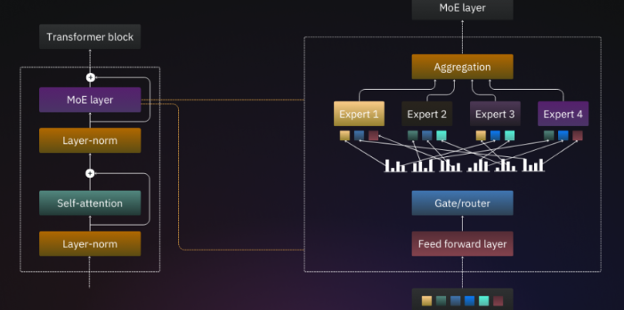

# MoE
MoE (Mixture of Experts) は、特に大規模なニューラルネットワークモデルにおいて、**計算効率を維持しながらモデルのパラメータ数を大幅に増やす**ためのアーキテクチャ（構造）です。

通常のモデルとは異なり、ネットワークの一部を疎（Sparsely Activated）にすることで、巨大なモデルの能力と、比較的速い推論速度を両立させます。


## MoEの概要

MoEモデルは、主に以下の3つの構成要素から成り立っています。

前提となるのが、LLMの知識はFFNが多く抱えている。そして状況に応じた知識を持つエキスパートを適切に選べばもっと良い性能が出せるでしょう、ということです。

エキスパートをゲートで選定して、上位のエキスパートの回答を持ち寄って問題解決しようという考えです。

### 1. エキスパート（Experts）
* **役割**: 特定の入力データやタスクの一部を処理する、独立した**フィードフォワードネットワーク**（通常はTransformer  ブロック内のFFN）。
* **特徴**: MoE層には数十〜数千のエキスパートが存在しますが、**入力されたデータ（トークン）ごとに、そのすべてが使われるわけではありません。**

### 2. ゲート（Gate / Router）
* **役割**: **入力トークン**を分析し、どのエキスパートに処理を委任するかを決定するネットワーク（ルーティング機能）。
* **仕組み**: 通常はシンプルな線形層とSoftmax関数で実装され、各エキスパートに対する**重み（確率）**を出力します。

### 3. 組み合わせ（Combination）
* **役割**: ゲートによって選ばれたエキスパートたちの出力を、それぞれの**重み付け**に従って結合し、MoE層の最終的な出力とします。



## 仕組みと処理の流れ

MoEの処理は、入力されたトークンごとに以下の流れで実行されます。

1.  **入力**: トークン $X$ がMoE層に入力されます。
2.  **ルーティング**: ゲートネットワーク $G$ が $X$ を受け取り、各エキスパート $E_i$ に対する重み $w_i$ を計算します。
    $$
    w_i = \text{Softmax}(G(X))
    $$
3.  **トップK選択**: ゲートは、計算された重み $w_i$ の中から、最も重みの高い**上位 $K$ 個**のエキスパートを選択します。（通常 $K=1$ または $K=2$）
4.  **計算**: 選択された $K$ 個のエキスパートのみが活性化され、処理を行います。
    $$
    Y_i = E_i(X) \quad \text{for } i \in \{\text{Top-}K \text{ experts}\}
    $$
5.  **出力結合**: 最終的なMoE層の出力 $Y$ は、選ばれたエキスパートの出力 $Y_i$ を、対応する重み $w_i$ で線形結合した結果となります。
    $$
    Y = \sum_{i=1}^{\text{Number of Experts}} w_i Y_i
    $$
    （非選択のエキスパート $Y_i$ は $0$ または重み $w_i$ がゼロに近いため、実質的に計算に関与しません）

## MoEを使うメリット

### 1. 巨大なパラメータ数と高い計算効率の両立 (Sparsity)
* **メリット**: MoEモデルは、パラメータの総数が非常に大きい（例: 数千億〜数兆）にもかかわらず、訓練時および推論時に実際に活性化されるのは**ごく一部のエキスパートのみ**です。
* **効果**: モデルの容量（キャパシティ）を大きくして性能を向上させながら、従来の密なモデルと比較して**訓練と推論にかかる計算量（FLOPs）は同等か、わずかな増加に留まります**。

### 2. 高い性能（大規模化による恩恵）
* **メリット**: パラメータ数が増えるほど、特に大規模なデータセットでの訓練において、モデルの性能は向上する傾向があります（スケーリング則）。
* **効果**: MoEは計算コストを抑えつつモデルのキャパシティを劇的に高めるため、**より高品質なタスク性能**を実現します。

### 3. 学習速度の向上
* **メリット**: 必要な計算量が少ないため、特定の時間内でより多くのデータ（ステップ）を処理できます。
* **効果**: 密なモデルと同じ計算リソースを用いる場合、MoEモデルの方が**収束までの時間が短縮**されることがあります。

## 4. 課題点

* **VRAM（メモリ）消費**: 活性化されるのは一部のエキスパートであっても、**すべて**のエキスパートの重みはメモリ上にロードしておく必要があります。そのため、MoEモデルは同等の密なモデルと比較して**非常に多くのVRAM**を要求します。
* **ルーティングの複雑性**: ゲートの設計や、エキスパート間での負荷の偏り（ロードバランシング）を調整するための**追加の損失関数**（ロードバランシングロス）が必要であり、訓練プロセスが密なモデルよりも複雑になります。

## MoEレイヤーのシンプルな実装コード

MoE（Mixture of Experts）レイヤーを簡単に実装するためのPyTorchコードを作成します。

このコードは、MoEの中核要素である「エキスパート（Expert）」、「ゲート（Gate/Router）」、「トップK選択」、「ロードバランシング損失（Auxiliary Loss）」の機能を凝縮して一つのカスタムレイヤー`MoELayer`として表現しています。

### 構成要素

1.  **Expert クラス**: 各トークンを処理するシンプルなフィードフォワードネットワーク（FFN）。
2.  **MoELayer クラス**: ゲートネットワークでトップKのエキスパートを選択し、出力を統合します。また、訓練時にエキスパートの利用度を均一化するための**ロードバランシング損失**も計算します。

<!-- end list -->

```python
import torch
import torch.nn as nn
import torch.nn.functional as F
import random

# デバイス設定
device = torch.device("cuda" if torch.cuda.is_available() else "cpu")
print(f"Using device: {device}")

# ====================================================================
# 1. Expert (エキスパート) クラス
# ====================================================================

class Expert(nn.Module):
    """ MoEにおける個々のフィードフォワードネットワーク（FFN）を担うクラス """
    def __init__(self, dim, hidden_dim):
        super().__init__()
        # シンプルな2層FFN
        self.net = nn.Sequential(
            nn.Linear(dim, hidden_dim),
            nn.ReLU(),
            nn.Linear(hidden_dim, dim)
        )
    
    def forward(self, x):
        return self.net(x)

# ====================================================================
# 2. MoELayer (メイン) クラス
# ====================================================================

class MoELayer(nn.Module):
    """ MoEレイヤー本体: ルーティング、エキスパート選択、出力結合、損失計算を行う """
    def __init__(self, dim, num_experts, top_k):
        """
        :param dim: 入力/出力の次元数 (例: 128)
        :param num_experts: エキスパートの総数 (例: 4)
        :param top_k: 活性化するエキスパートの数 (例: 2)
        """
        super().__init__()
        self.num_experts = num_experts
        self.top_k = top_k
        
        # エキスパート群: num_experts個のExpertモジュールをリスト化
        self.experts = nn.ModuleList([Expert(dim, dim * 2) for _ in range(num_experts)])
        
        # ゲート（ルーター）: トークンを入力として受け取り、num_experts個のlogitを出力
        self.gate = nn.Linear(dim, num_experts)
        
    def forward(self, x):
        # x shape: (batch_size, seq_len, dim)
        original_shape = x.shape
        
        # トークンレベルでの処理のため、(N_tokens, dim) にフラット化
        x = x.view(-1, original_shape[-1])
        N_tokens = x.size(0)
        
        # --- 1. ゲートによるルーティング ---
        # gate_logits: (N_tokens, num_experts)
        gate_logits = self.gate(x)
        gate_weights = F.softmax(gate_logits, dim=-1) # 確率重み
        
        # --- 2. Top-K 選択 ---
        # top_k_weights: 選択されたK個のエキスパートの確率 (N_tokens, top_k)
        # top_k_indices: 選択されたK個のエキスパートのID (N_tokens, top_k)
        top_k_weights, top_k_indices = torch.topk(gate_weights, self.top_k, dim=-1)
        
        # 重みを再正規化 (Top-Kの合計が1になるように)
        top_k_weights = top_k_weights / top_k_weights.sum(dim=-1, keepdim=True)
        
        # 最終的な出力を保持するテンソル
        final_output = torch.zeros_like(x)
        
        # --- 3. ロードバランシング損失の計算 (Auxiliary Loss) ---
        # エキスパートが均等に使われるよう促すための損失項
        
        # a) Expert Usage: 各トークンがどのエキスパートにルーティングされたか (N_tokens, num_experts)
        expert_usage_one_hot = F.one_hot(top_k_indices, num_classes=self.num_experts).sum(dim=1).float()
        
        # b) ルーター確率の平均 (P_i = sum(Prob_i) / N_tokens)
        expert_router_prob = gate_weights.sum(dim=0) / N_tokens
        
        # c) ルーティングされたサンプルの割合 (F_i = sum(Usage_i) / N_tokens)
        expert_fraction_routed = expert_usage_one_hot.sum(dim=0) / N_tokens
        
        # ロードバランシング損失 (最小化すべき値): P_i と F_i の積の合計
        load_balancing_loss = (expert_router_prob * expert_fraction_routed).sum()
        
        # --- 4. Dispatch (転送) と Combination (結合) ---
        
        for k in range(self.top_k):
            expert_index = top_k_indices[:, k] # k番目に選ばれたエキスパートのID
            weight = top_k_weights[:, k]       # k番目に選ばれたエキスパートの重み
            
            for i in range(self.num_experts):
                # 現在のエキスパート i にルーティングされたトークンをマスクで選択
                mask = (expert_index == i) 
                
                if not mask.any():
                    continue
                
                # 選択された入力トークン (N_i, dim)
                expert_input = x[mask]
                
                # エキスパート i で計算
                expert_output = self.experts[i](expert_input)
                
                # ゲート重みを適用し、最終出力に加算
                weighted_output = expert_output * weight[mask].unsqueeze(1)
                final_output[mask] += weighted_output

        # 出力を元の形状に戻す: (batch_size, seq_len, dim)
        final_output = final_output.view(original_shape)
        
        # 最終的な出力と補助損失（ロードバランシングロス）を返す
        return final_output, load_balancing_loss

# ====================================================================
# 3. 使用例
# ====================================================================

# 設定値
DIM = 128         # トークン埋め込み次元
NUM_EXPERTS = 4   # エキスパートの総数
TOP_K = 2         # 活性化するエキスパートの数
BATCH_SIZE = 2
SEQ_LEN = 10

# MoEレイヤーの初期化
moe_layer = MoELayer(DIM, NUM_EXPERTS, TOP_K).to(device)

# ダミー入力データ (例: 2つのシーケンス、各10トークン)
dummy_input = torch.randn(BATCH_SIZE, SEQ_LEN, DIM).to(device)

# 推論実行 (訓練時は aux_loss をメインの損失に加算して使用)
moe_layer.train() # 訓練モード

output, aux_loss = moe_layer(dummy_input)

print("-" * 40)
print("MoE Layer 実行結果:")
print(f"入力形状: {dummy_input.shape}")
print(f"出力形状: {output.shape}")
print(f"ロードバランシング損失 (訓練に加算すべき値): {aux_loss.item():.6f}")

# 損失計算の例
# main_task_loss = some_criterion(output, target)
# total_loss = main_task_loss + 0.01 * aux_loss # 0.01 は MoE損失の重み
```
