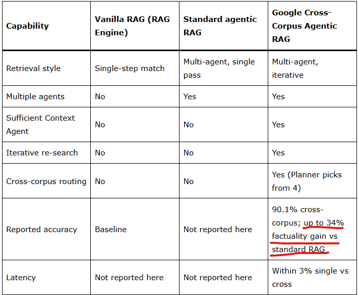
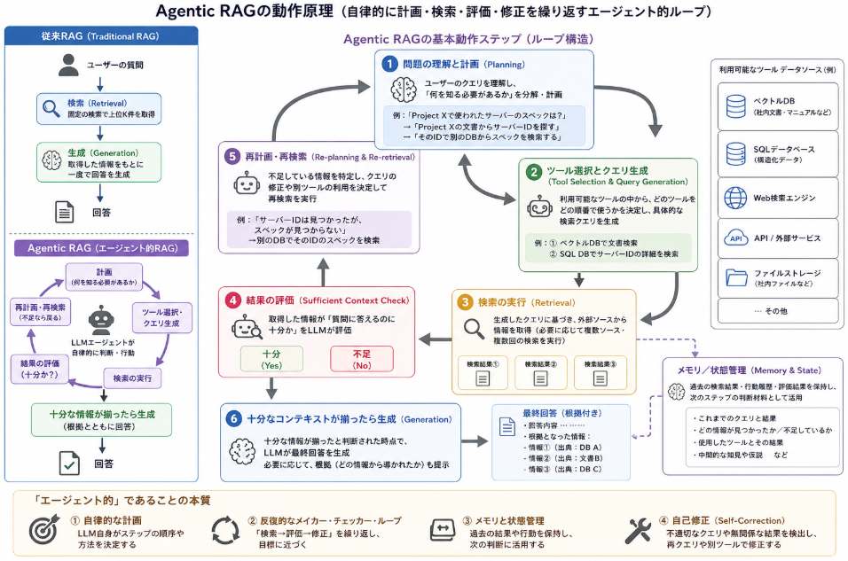

## エージェンティックRAGとは

**Agentic RAG（エージェンティックRAG）** は、**AIエージェントの考え方をRAG（Retrieval-Augmented Generation）に組み込んだ、自律的で動的な検索・生成パイプライン**です。

### 1. Agentic RAGとは何か

- **定義**  
  Agentic RAGは、LLMが**自律的に次のステップを計画しながら外部ソースから情報を取得する**AIパラダイムです[Microsoft AI Agents for Beginners](https://github.com/microsoft/ai-agents-for-beginners/blob/main/05-agentic-rag/README.md)。
- **特徴**
  - **自律的な計画・推論**：LLM自身が「何を検索すべきか」「どのツールを使うか」を判断する。
  - **反復的な検索・生成ループ**：1回の検索で終わらず、結果を評価し、クエリを修正し、必要に応じて再検索する。
  - **メモリと状態管理**：過去の行動や検索結果を保持し、次のステップに活かす。
  - **自己修正（Self-Correction）**：不適切なクエリや無関係な結果を検出し、再クエリや別ツールの利用で修正する[Microsoft AI Agents for Beginners](https://github.com/microsoft/ai-agents-for-beginners/blob/main/05-agentic-rag/README.md)。

IBMはこれを「**AIエージェントを使ってRAGを促進する**」アプローチと説明し、従来のRAGよりも**柔軟性・適応性・精度・スケーラビリティ**が高いとしています[IBM Think](https://www.ibm.com/think/topics/agentic-rag)。

### 2. 従来のRAG（Traditional RAG）との違い

NVIDIAのブログでは、従来RAGとAgentic RAGを以下のように対比しています[NVIDIA Developer Blog](https://developer.nvidia.com/blog/traditional-rag-vs-agentic-rag-why-ai-agents-need-dynamic-knowledge-to-get-smarter)。

| 項目 | 従来のRAG（Traditional RAG） | Agentic RAG |
|------|-----------------------------|-------------|
| **動作の性質** | 静的な「ルックアップ」 | 動的な「推論プロセス」 |
| **ワークフロー** | 単純な「クエリ → 検索 → 生成」の直線パス | エージェントが自律的に計画・反復・修正するループ |
| **データソース** | 単一のベクトルDBや知識ベースに接続することが多い | 複数の外部知識ベースやツールを動的に使い分ける[IBM Think](https://www.ibm.com/think/topics/agentic-rag) |
| **適したタスク** | コスト重視・高速な単純問い合わせ | 複雑な調査・要約・コード修正など、非同期で複雑なタスク[NVIDIA Developer Blog](https://developer.nvidia.com/blog/traditional-rag-vs-agentic-rag-why-ai-agents-need-dynamic-knowledge-to-get-smarter) |
| **精度・信頼性** | プロンプト設計と検索結果に依存（人間が品質を判断） | エージェントが結果を検証し、必要に応じて再検索・修正する |

IBMも、従来RAGが「**反応的でルールベース**」なのに対し、Agentic RAGは「**能動的で知的な問題解決**」を行うと説明しています[IBM Think](https://www.ibm.com/think/topics/agentic-rag)。

### 3. Agentic RAGの典型的なワークフロー（NVIDIAの整理）

NVIDIAはAgentic RAGのワークフローを以下のようにまとめています[NVIDIA Developer Blog](https://developer.nvidia.com/blog/traditional-rag-vs-agentic-rag-why-ai-agents-need-dynamic-knowledge-to-get-smarter)。

1. **データの必要性を特定**（エージェントが「何が足りないか」を判断）
2. **クエリ生成**（エージェントが適切な検索クエリを自ら作成）
3. **動的な知識取得**（クエリエンジンや複数ソースから情報を取得）
4. **プロンプトへのコンテキスト追加**（取得した情報をLLMに渡す）
5. **LLMによる意思決定・生成**（必要なら再検索・修正を繰り返す）

この「**エージェントが能動的に検索戦略を変えながら繰り返す**」点が、従来RAGとの大きな違いです。

### 4. Agentic RAGのメリットとトレードオフ

__メリット__
- **精度向上**：反復的な検索・検証により、ハルシネーションを減らし、より正確な回答が可能[NVIDIA Developer Blog](https://developer.nvidia.com/blog/traditional-rag-vs-agentic-rag-why-ai-agents-need-dynamic-knowledge-to-get-smarter)。
- **複雑な問い合わせへの対応**：複数の知識ベースやツールを跨いだ調査ができる[IBM Think](https://www.ibm.com/think/topics/agentic-rag)。
- **動的な知識への対応**：リアルタイムで変化するデータソースにも適応可能。

Agentic RAGは、 事実性データセット（factuality datasets）において、標準RAGに対して[最大34%の精度向上を達成](https://www.marktechpost.com/2026/06/08/google-research-adds-agentic-rag-to-gemini-enterprise-agent-platform-with-a-sufficient-context-agent-for-multi-hop-queries)。
と評価されています。




__精度向上の理由__

Google Researchのブログでは、Agentic RAGが精度を向上させる理由として、以下の点を挙げています[Google Research Blog](https://research.google/blog/unlocking-dependable-responses-with-gemini-enterprise-agent-platforms-agentic-rag)。

1. **マルチエージェントによる計画・再検索**  
   - クエリを分解し、複数のエージェントが協調して検索・再検索を行う。
   - 情報が複数の「データの島」に分散している場合でも、**十分なコンテキストが見つかるまで検索を続ける**。

2. **Sufficient Context Agent（十分性エージェント）**  
   - 取得した情報が「質問に答えるのに十分か」を評価する専用エージェントを導入。
   - 不足があれば、**追加の検索クエリを生成して再検索**する。

3. **「推測」や「情報不足」を減らす**  
   - 従来RAGでは「最初の検索で情報が見つからない → 推測 or 『情報不足』と回答」になりがち。
   - Agentic RAGでは、**情報があるのに見つけられていないケースを掘り下げる**ことで、事実に基づいた回答率を高める。

このような設計により、**複雑なエンタープライズ問い合わせにおいて、事実性の高い回答を生成できる確率が大幅に向上した**と報告されています[MarkTechPost](https://www.marktechpost.com/2026/06/08/google-research-adds-agentic-rag-to-gemini-enterprise-agent-platform-with-a-sufficient-context-agent-for-multi-hop-queries)。

__トレードオフ__
- **コスト・レイテンシ**：反復的なLLM呼び出しとツール利用により、トークンコストと時間が増加[IBM Think](https://www.ibm.com/think/topics/agentic-rag)。
- **設計の複雑さ**：エージェントの状態管理・エラー処理・マルチエージェント協調など、設計・実装がより高度になる。

## どんなところに使われている？

Google AI（特にGemini Enterprise Agent Platform）では、Agentic RAGの考え方を取り入れたフレームワークが実際に使われています。


### 1. Google ResearchによるAgentic RAGフレームワークの紹介

Google Researchの公式ブログでは、**Gemini Enterprise Agent Platform向けの「Agentic RAGフレームワーク」** を導入したと明記されています[Google Research Blog](https://research.google/blog/unlocking-dependable-responses-with-gemini-enterprise-agent-platforms-agentic-rag)。

- このフレームワークは、**マルチエージェントのワークフロー**で構成され、
- 複雑なエンタープライズ問い合わせを**分解し、反復的に検索して十分なコンテキストを集めてから回答を生成**する仕組みです。
- 従来のRAGでは「情報が足りない」とすぐに諦めてしまうようなケースでも、**エージェントが再検索・再計画を行うことで、より信頼性の高い回答を目指す**設計になっています。

このブログでは、Agentic RAGを「**単一の検索エンジンではなく、組織化された研究部門のようなマルチエージェントRAG**」と表現しています[Google Research Blog](https://research.google/blog/unlocking-dependable-responses-with-gemini-enterprise-agent-platforms-agentic-rag)。

### 2. Gemini Enterprise Agent PlatformのRAG Engineとの関係

Google Cloudの公式ドキュメントでは、**Gemini Enterprise Agent Platformに「RAG Engine」というコンポーネント**が用意されており、LLMのコンテキストをプライベートデータで拡張するためのフレームワークとして位置づけられています[Google Cloud Docs](https://docs.cloud.google.com/gemini-enterprise-agent-platform/build/rag-engine/rag-overview)。

- RAG Engineは、**ベクトルDBや外部データソースから情報を取得し、LLMのプロンプトにコンテキストを追加する**役割を持ちます。
- Google ResearchのAgentic RAGフレームワークは、このRAG Engineを**エージェント的に制御するレイヤー**として機能し、
  - クエリの分解
  - 複数ソースへのルーティング
  - 検索結果の評価と再検索
  といった「Agenticな挙動」を実現しています。

つまり、**Gemini Enterprise Agent Platform上で構築されるエージェントは、RAG EngineをAgentic RAG的に利用できる**ようになっている、と言えます。

### 3. 具体的に何が「Agentic」なのか

Googleの説明によると、Agentic RAGフレームワークでは以下のような挙動が特徴的です[Google Research Blog](https://research.google/blog/unlocking-dependable-responses-with-gemini-enterprise-agent-platforms-agentic-rag)。

1. **クエリの分解と計画**  
   複雑な問い合わせを、複数のサブクエリに分解し、どのデータソースをどの順番で検索するかを計画する。
2. **反復的な検索**  
   一度の検索で十分な情報が得られない場合、**エージェントが自らクエリを修正し、再検索**する。
3. **十分性のチェック**  
   取得した情報が「質問に答えるのに十分か」を評価し、不足があれば追加検索を行う。
4. **マルチエージェント協調**  
   クエリ分解エージェント、検索エージェント、評価エージェントなどが連携し、**組織的な研究チームのように動く**。

これらは、前回説明した「Agentic RAG」の定義（自律的な計画・反復・自己修正）と完全に一致しています。

>__サブクエリ__  
>**サブクエリ（subquery）**は、**「大きな問い合わせを分解した、より小さな問い合わせ」** のことです。
>文脈によって少し意味が変わりますが、ここでは特に**Agentic RAGやRAG全般で使われる「サブクエリ」** に絞って説明します。
>__1. Agentic RAGにおけるサブクエリのイメージ__
>Agentic RAGでは、ユーザーからの**複雑な質問を、LLM（エージェント）が複数の小さな問い合わせに分解**します。この**小さな問い合わせ一つひとつ**が「サブクエリ」です。
>例：  
>ユーザーの質問：「Project Xで使われたサーバーのスペックは？」
>これをAgentic RAGが分解すると：
>- **サブクエリ1**：Project Xの文書から「サーバーID」を探す  
>  （例：`「Project X サーバー ID」` のような検索クエリ）
>- **サブクエリ2**：そのサーバーIDを使って、別のDBから「スペック情報」を検索  
>  （例：`「サーバーID: SVR-123 スペック」`）
>このように、**一つの大きな質問を、複数のサブクエリに分割して順番に実行する**のが、Agentic RAGの特徴です。
>__2. なぜサブクエリが必要なのか__
>- **情報が分散している場合**  
>  1つの検索クエリでは、必要な情報を一度に取り出せないことが多いです。
>- **マルチホップ推論が必要な場合**  
>  「AからBを見つけ、そのBからCを見つける」という**2段階以上の検索**が必要なケース。
>- **Agentic RAGの強み**  
>  LLMが自律的に「どのサブクエリをどの順番で実行するか」を決め、**必要に応じてサブクエリを追加・修正しながら検索を繰り返す**ことで、従来RAGでは取りこぼしていた情報も拾えるようになります。

## Agentic RAGの動作原理

Agentic RAGの動作原理は、**「LLMが自律的に計画しながら、必要に応じて検索を繰り返し、結果を評価・修正する」** というエージェント的なループ構造にあります。

以下、ステップごとに説明します。

### 1. 従来RAGとの比較から見る「何が変わったか」

__従来RAG（Traditional RAG）__
- **クエリ → 検索（Retrieval） → 生成（Generation）** の**単発・直線パス**。
- 一度の検索で得たコンテキストをLLMに渡し、そのまま回答を生成。
- 検索戦略は固定（例：ベクトル類似度上位K件）。

__Agentic RAG__
- **エージェント（LLM）が「何を・どの順番で・何回検索するか」を自律的に決める**。
- 検索結果を評価し、**不足があれば再検索・クエリ修正**を行う。
- 必要に応じて**複数のツールやデータソースを跨いで検索**する。

MicrosoftのAIエージェント入門では、これを「**LLMが自身の推論プロセスを所有し、ステップの順序を自律的に決定する**」パラダイムと説明しています[Microsoft AI Agents for Beginners](https://github.com/microsoft/ai-agents-for-beginners/blob/main/05-agentic-rag/README.md)。

### 2. Agentic RAGの基本動作ステップ

NVIDIAやIBM、Google Researchの説明を統合すると、典型的なAgentic RAGの動作は以下のようなループになります[NVIDIA Developer Blog](https://developer.nvidia.com/blog/traditional-rag-vs-agentic-rag-why-ai-agents-need-dynamic-knowledge-to-get-smarter)[IBM Think](https://www.ibm.com/think/topics/agentic-rag)[Google Research Blog](https://research.google/blog/unlocking-dependable-responses-with-gemini-enterprise-agent-platforms-agentic-rag)。

__ステップ1：問題の理解と計画（Planning）__
- ユーザーのクエリを受け取り、LLMが **「何を知る必要があるか」を分解**します。
- 例：「Project Xで使われたサーバーのスペックは？」  
  → 「Project Xの文書からサーバーIDを探す」「そのIDで別のDBからスペックを検索する」など、**複数のサブタスクに分割**。

__ステップ2：ツール選択とクエリ生成（Tool Selection & Query Generation）__
- 利用可能なツール（ベクトルDB、SQL DB、API、検索エンジンなど）の中から、**どのツールをどの順番で使うかを決定**。
- 各ツールに対して、**具体的な検索クエリを生成**します。
- IBMはこれを「Routing agents」「Query planning agents」などの役割分担で実現すると説明しています[IBM Think](https://www.ibm.com/think/topics/agentic-rag)。

__ステップ3：検索の実行（Retrieval）__
- 生成したクエリに基づき、実際に外部ソースから情報を取得。
- 1回で終わらず、**必要に応じて複数ソース・複数回の検索**を行う。

__ステップ4：結果の評価（Evaluation / Sufficient Context Check）__
- 取得した情報が**「質問に答えるのに十分か」をLLMが評価**します。
- Google Researchは、これを「Sufficient Context Agent」という専用エージェントで行うと説明しています[Google Research Blog](https://research.google/blog/unlocking-dependable-responses-with-gemini-enterprise-agent-platforms-agentic-rag)。
- 不足があれば、**どの情報が足りないかを特定し、ステップ2に戻る**。

__ステップ5：再計画・再検索（Re-planning & Re-retrieval）__
- 評価結果に基づき、**クエリの修正や別ツールの利用を決定**。
- 例：  
  - 「サーバーIDは見つかったが、スペックが見つからない」  
  → 「サーバーIDを使って別のDBを検索する」という新たなサブタスクを追加。

__ステップ6：十分なコンテキストが揃ったら生成（Generation）__
- 十分な情報が揃ったと判断された時点で、**LLMが最終回答を生成**。
- 必要に応じて、**回答の根拠（どの情報から導かれたか）も一緒に提示**。

### 3. 「エージェント的」であることの本質

Microsoftの説明では、Agentic RAGを「エージェント的」たらしめる要素として以下を挙げています[Microsoft AI Agents for Beginners](https://github.com/microsoft/ai-agents-for-beginners/blob/main/05-agentic-rag/README.md)。

1. **自律的な計画（Autonomous Planning）**  
   - 外部から「この順番で検索しろ」と指示されるのではなく、**LLM自身がステップの順序を決める**。

2. **反復的なメイカー・チェッカー・ループ（Iterative Maker-Checker Loops）**  
   - 「検索 → 評価 → 修正」を**ループとして繰り返す**。
   - 一度の失敗で終わらず、**自己修正しながら目標に近づく**。

3. **メモリと状態管理（Memory & State）**  
   - 過去の検索結果や行動を保持し、**次のステップの判断材料にする**。

4. **自己修正（Self-Correction）**  
   - 不適切なクエリや無関係な結果を検出し、**再クエリや別ツールの利用で修正**する。



### 4. 具体例：GoogleのAgentic RAGフレームワーク

Google ResearchのAgentic RAGフレームワーク（Gemini Enterprise Agent Platform向け）は、この原理を**マルチエージェント・ワークフロー**として実装しています[Google Research Blog](https://research.google/blog/unlocking-dependable-responses-with-gemini-enterprise-agent-platforms-agentic-rag)。

- **クエリ分解エージェント**：複雑な問い合わせをサブクエリに分解。
- **検索エージェント**：各サブクエリに対応する検索を実行。
- **Sufficient Context Agent**：取得した情報が十分かどうかを評価。
- **再検索エージェント**：不足があれば、クエリを修正して再検索。

これにより、**「情報があるのに見つけられない」という従来RAGの失敗モードを減らし、事実性の高い回答を生成できる**と報告されています[MarkTechPost](https://www.marktechpost.com/2026/06/08/google-research-adds-agentic-rag-to-gemini-enterprise-agent-platform-with-a-sufficient-context-agent-for-multi-hop-queries)。

## サブクエリ設計

以下では、

1. **サブクエリの設計方針（Agentic RAGでの考え方）**
2. **Graph RAGと組み合わせた場合のサブクエリ具体例**

の順に説明します。

### 1. サブクエリの設計方針（Agentic RAGでの考え方）

Agentic RAGにおけるサブクエリ設計は、**「LLMに質問を分解させ、小さな検索タスクに落とし込む」** ことが基本です。

__1-1. サブクエリ設計の基本ステップ__

1. **質問の理解と分解（Planning）**
   - LLMに「この質問を答えるには、どんな情報が必要か？」を考えさせる。
   - 例：  
     - 質問：「Project Xで使われたサーバーのスペックは？」  
     - 必要な情報：
       - Project Xの文書から「サーバーID」を特定
       - そのサーバーIDを使って「スペック情報」を検索

2. **サブクエリの生成（Subquery Generation）**
   - 必要な情報ごとに、**具体的な検索クエリ（自然言語 or 構造化クエリ）**を生成。
   - 例：
     - サブクエリ1：`「Project X サーバー ID」`
     - サブクエリ2：`「サーバーID: SVR-123 スペック」`

3. **ツールへのマッピング（Tool Mapping）**
   - 各サブクエリを、どのツール（ベクトルDB、Graph DB、APIなど）に投げるかを決める。
   - 例：
     - サブクエリ1 → 社内文書のベクトルDB
     - サブクエリ2 → サーバー管理DB（SQL or API）

4. **実行順序の決定（Execution Order）**
   - 依存関係に基づき、**どのサブクエリを先に実行するか**を決める。
   - 上記例では、「サーバーID」が先に必要なので、サブクエリ1 → サブクエリ2の順。

5. **評価と再計画（Evaluation & Re-planning）**
   - 各サブクエリの結果を評価し、不足があれば**新しいサブクエリを追加**する。
   - 例：サーバーIDが見つからなかった → 「Project X ハードウェア構成」で再検索、など。

__1-2. サブクエリ設計のコツ__

- **粒度を小さく保つ**  
  1つのサブクエリで「複数のことを同時にやろうとしない」。
- **依存関係を明確にする**  
  「Aの結果を使ってBを検索する」といった依存関係をLLMに意識させる。
- **ツールごとのクエリ形式を意識する**  
  - ベクトルDB：自然言語クエリ（例：`「GraphRAGとPythonの関係」`）
  - Graph DB：ノード名や関係性を意識したクエリ（例：`「GraphRAG」ノードから「utilizes」関係を辿る`）
  - SQL DB：構造化クエリ（例：`SELECT spec FROM servers WHERE id = 'SVR-123'`）

### 2. Graph RAGと組み合わせた場合のサブクエリ例

Graph RAGでは、**「ノード検索 → グラフ探索（エッジを辿る）」**が基本フローです。  
Agentic RAGと組み合わせる場合、**サブクエリは「どのノードを起点に、どの方向にグラフを探索するか」を指示するもの**になります。

__2-1. Graph RAG向けサブクエリの設計パターン__

__パターンA：中心ノードを特定するサブクエリ__

**目的**：質問に関連する「中心ノード（ハブ）」を見つける。

- 質問：「GraphRAGとPythonの関係は？」
- サブクエリ例：
  - `「GraphRAG」ノードを検索`
  - `「Python」ノードを検索`

**実装イメージ（LLMへの指示プロンプト）**  
```text
ユーザーの質問: 「GraphRAGとPythonの関係は？」

この質問に答えるために、GraphRAGのナレッジグラフから関連する中心ノードを特定したい。
以下の形式で、検索すべきノード名を列挙せよ。

[出力形式]
- ノード名1
- ノード名2
...
```

LLMの出力例：
```text
- GraphRAG
- Python
```

これをGraph RAGの `search_graph_nodes` 関数に渡して、ベクトル類似度でノードを検索します。

__パターンB：グラフ探索の方向を決めるサブクエリ__

**目的**：中心ノードから「どの関係（エッジ）を辿るか」を決める。

- 質問：「GraphRAGとPythonの関係は？」
- すでに「GraphRAG」「Python」ノードが見つかっている前提。

**サブクエリ例（LLMへの指示）**  
```text
現在、ナレッジグラフ上で以下のノードがヒットしています。
- GraphRAG
- Python

ユーザーの質問「GraphRAGとPythonの関係は？」に答えるために、
GraphRAGノードからどのような関係（エッジ）を辿るべきか、関係の種類を列挙せよ。

[出力形式]
- 関係名1
- 関係名2
...
```

LLMの出力例：
```text
- utilizes
- is a library of
```

これをGraph RAGの探索関数に渡し、  
`graph_db.successors("GraphRAG")` や `graph_db.predecessors("Python")` から、  
関係名が `"utilizes"` や `"is a library of"` のエッジだけを抽出します。

__パターンC：マルチホップ探索のためのサブクエリ__

**目的**：2ホップ以上離れたノード間の関係を明らかにする。

- 質問：「GraphRAGとPythonの関係は？」
- グラフ構造：  
  `GraphRAG -> utilizes -> NetworkX -> is a library of -> Python`

**サブクエリ例（LLMへの指示）**  
```text
ユーザーの質問「GraphRAGとPythonの関係は？」に答えるために、
ナレッジグラフ上で「GraphRAG」ノードから「Python」ノードに到達する経路を探索したい。

以下の形式で、探索すべき関係のシーケンスを提案せよ。

[出力形式]
- 開始ノード: GraphRAG
  - 辿る関係1: [関係名]
  - 辿る関係2: [関係名]
  ...
- 開始ノード: Python
  - 辿る関係1: [関係名]
  ...
```

LLMの出力例：
```text
- 開始ノード: GraphRAG
  - 辿る関係1: utilizes
- 開始ノード: NetworkX
  - 辿る関係1: is a library of
```

これを元に、Graph RAGの探索関数で  
1. `GraphRAG` → `utilizes` → `NetworkX`  
2. `NetworkX` → `is a library of` → `Python`  
という**マルチホップ経路**を自動的に探索します。

__2-2. 実装イメージ（コードスニペット）__

Graph RAG + Agentic RAG のサブクエリ設計を、簡易コードで示すと以下のようになります。

```python
def plan_subqueries_for_graphrag(question, llm):
    """
    LLMを使って、GraphRAG向けのサブクエリ（ノード検索・関係探索）を計画する
    """
    prompt = f"""
ユーザーの質問: {question}

この質問に答えるために、GraphRAGのナレッジグラフから情報を取得したい。
以下の2種類のサブクエリを計画せよ。

1. 検索すべき中心ノード名（例: GraphRAG, Python）
2. 探索すべき関係の種類（例: utilizes, is a library of）

[出力形式]
中心ノード:
- ノード名1
- ノード名2
...

探索関係:
- 関係名1
- 関係名2
...
"""
    outputs = llm(prompt, max_new_tokens=200, temperature=0.0)
    text = outputs[0]["generated_text"]
    
    # 簡易パース（実際は正規表現やJSON出力推奨）
    lines = text.strip().split("\n")
    nodes = []
    relations = []
    section = None
    
    for line in lines:
        line = line.strip()
        if "中心ノード:" in line:
            section = "nodes"
        elif "探索関係:" in line:
            section = "relations"
        elif line.startswith("- "):
            item = line[2:].strip()
            if section == "nodes":
                nodes.append(item)
            elif section == "relations":
                relations.append(item)
    
    return nodes, relations

# 使用例
question = "GraphRAGとPythonの関係は？"
nodes_to_search, relations_to_follow = plan_subqueries_for_graphrag(question, llm)

print("検索すべきノード:", nodes_to_search)
print("辿るべき関係:", relations_to_follow)

# これをGraphRAGの検索・探索関数に渡す
# search_graph_nodes(nodes_to_search, ...)
# retrieve_subgraph_from_nodes(nodes_to_search, relations=relations_to_follow, ...)
```


