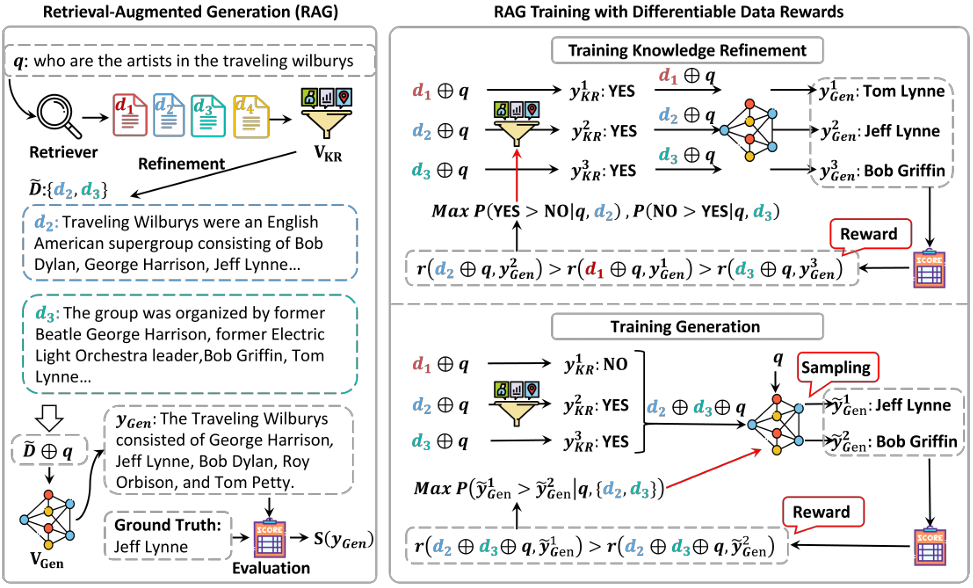
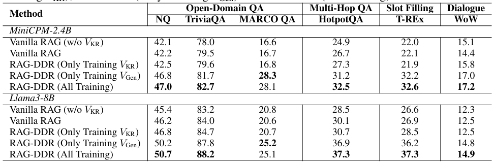
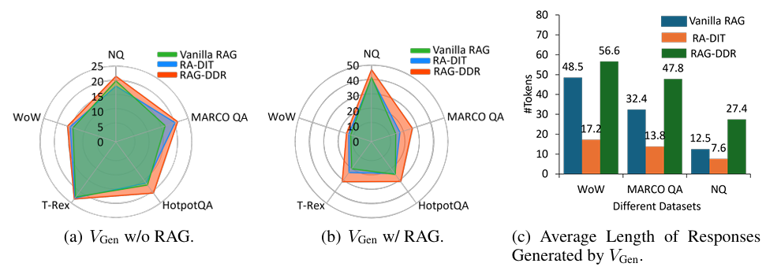

近日続いているRAGシステムに関する記事です。
本日はICLRという学会で採択された論文に関して理解していこうと思います。

本日テーマ：
>RAGが抱える、主要コンポーネント(生成器、検索機)が別々で、文脈整合がしないという課題を解決するシステムについて理解していく

## 背景・課題

RAG-DDR 論文（Xinze Li et al., ICLR 2025）の背景と解決課題は、おおまかに次のように整理できます。

### 1. 背景：RAGの普及と既存SFTベース最適化の限界

__(1) RAGの役割と一般的な最適化手法__
- Retrieval-Augmented Generation（RAG）は、外部知識ベースから文書を検索し、それをLLMの入力コンテキストに加えることで、  
  - ハルシネーション（事実誤り）の抑制  
  - 外部知識の更新（パラメータ更新なし）  
  を実現する枠組みとして広く使われています。[Lewis et al., NeurIPS 2020](https://proceedings.neurips.cc/paper_files/paper/2020/file/6b493230205f780e1bc26945df7481e5-Paper.pdf)
- 既存の多くのRAGシステムでは、LLM部分を**教師あり微調整（Supervised Fine-Tuning, SFT）** で最適化するのが一般的です。

__(2) SFTベース最適化の限界（論文が指摘する点）__
RAG-DDR 論文は、SFTベースのRAG最適化には以下の問題があると指摘しています。いずれも結構昔から有名なものです。：

1. **過学習（overfitting）**  
   - 訓練データのラベル（例：正解回答）に過度に適合し、汎化性能が落ちる。[RAG-DDR, ICLR 2025](https://proceedings.iclr.cc/paper_files/paper/2025/file/1a87980b9853e84dfb295855b425c262-Paper-Conference.pdf)

2. **破滅的忘却（catastrophic forgetting）**  
   - RAG専用に微調整すると、LLMが元々持っていた汎用的な言語能力や知識を忘れてしまう。[RAG-DDR, ICLR 2025](https://proceedings.iclr.cc/paper_files/paper/2025/file/1a87980b9853e84dfb295855b425c262-Paper-Conference.pdf)

3. **外部知識とパラメトリック知識の衝突（knowledge conflict）**  
   - 検索された外部知識と、LLMの内部知識（パラメトリックメモリ）が矛盾することがあり、その「どちらを信じるか」の衝突が、生成モジュールを誤った方向に導くことがある。[RAG-DDR, ICLR 2025](https://proceedings.iclr.cc/paper_files/paper/2025/file/1a87980b9853e84dfb295855b425c262-Paper-Conference.pdf)

4. **モジュール間のデータ選好の不一致**  
   - RAGシステムは通常、  
     - 検索・知識精錬モジュール（retriever / knowledge refinement）  
     - 生成モジュール（generator）  
     から構成されますが、**それぞれが好むデータ分布や評価指標が異なる**ため、モジュール単位で最適化しても、システム全体としては最適にならないことが多い。[RAG-DDR, ICLR 2025](https://proceedings.iclr.cc/paper_files/paper/2025/file/1a87980b9853e84dfb295855b425c262-Paper-Conference.pdf)

### 2. 解決しようとしている課題（RAG-DDRの狙い）

論文が明示的に挙げている課題は、主に以下の3点です。

__(1) RAGの生成モジュール自体の最適化__
- 既存研究の多くは、**検索モジュールの最適化**に注力し、生成モジュールはそのまま（あるいはSFTで微調整）に留まることが多いと指摘しています。[RAG-DDR, ICLR 2025](https://proceedings.iclr.cc/paper_files/paper/2025/file/1a87980b9853e84dfb295855b425c262-Paper-Conference.pdf)
- しかし、**知識衝突やデータ選好の不一致は生成モジュールにも影響する**ため、生成モジュール自体をRAGの文脈に合わせて最適化する必要がある、というのが論文の主張です。

__(2) モジュール間のデータ選好の整合（alignment）__
- ここが本論文のキーポイントとなります。RAG-DDR は、RAGを**マルチエージェントシステム**とみなし、  
  - 知識精錬エージェント（knowledge refinement）  
  - 生成エージェント（generation）  
  の**データ選好（data preferences）を整合させる**ことを目指します。[RAG-DDR, ICLR 2025](https://proceedings.iclr.cc/paper_files/paper/2025/file/1a87980b9853e84dfb295855b425c262-Paper-Conference.pdf)
- これにより、  
  - 検索された文書から本当に重要な情報を抽出し  
  - LLMの内部知識と外部知識を適切に統合する  
  ことが期待されます。

__(3) エンドツーエンドな最適化とスケールの小さいLLMへの適用__
- SFTはモジュールごとに最適化しがちですが、RAG-DDRは  
  - **rollout（システム全体のシミュレーション）** で各エージェントの影響を評価し  
  - **Direct Preference Optimization (DPO)** を用いてエージェントを最適化する  
  ことで、**エンドツーエンドにRAGシステムを訓練**します。[RAG-DDR, ICLR 2025](https://proceedings.iclr.cc/paper_files/paper/2025/file/1a87980b9853e84dfb295855b425c262-Paper-Conference.pdf)
- 特に、**スケールの小さいLLM**において、  
  - 外部知識をうまく活用し  
  - 内部知識とのバランスを取る  
  ことが難しいため、RAG-DDRの枠組みが有効であることを示しています。[RAG-DDR, ICLR 2025](https://proceedings.iclr.cc/paper_files/paper/2025/file/1a87980b9853e84dfb295855b425c262-Paper-Conference.pdf)

## 提案手法

RAG-DDR が提案する解決策の中心は、**Differentiable Data Rewards（DDR）** という枠組みです。  
これは、RAGを**マルチエージェントシステム**として捉え、各エージェントの「データ選好（data preferences）」を**エンドツーエンドで整合させる**ことで、  
- 外部知識と内部知識の衝突  
- モジュールごとの最適化によるシステム全体の非最適  
といった問題を解決しようとするものです。[RAG-DDR, ICLR 2025](https://proceedings.iclr.cc/paper_files/paper/2025/file/1a87980b9853e84dfb295855b425c262-Paper-Conference.pdf)

以下、原理をステップごとに説明します。

### 1. RAGをマルチエージェントシステムとして定式化

RAG-DDR では、RAGを少なくとも次の2つのエージェントからなるシステムとみなします。

1. **知識精錬エージェント（Knowledge Refinement Agent）**  
   - 入力：ユーザ質問＋検索された文書群  
   - 出力：**精錬された知識（refined knowledge）**  
   - 役割：検索結果から、本当に重要な情報を抽出・要約・再構成する

2. **生成エージェント（Generation Agent）**  
   - 入力：ユーザ質問＋精錬された知識  
   - 出力：最終的な回答テキスト  
   - 役割：精錬された知識とLLMの内部知識を統合して回答を生成する

論文では、これらをそれぞれポリシー ${ \pi_R, \pi_G }$ としてモデル化し、  
**「どのようなデータ（文書・知識）を好んで選ぶか」＝ data preferences** を学習対象とします。[RAG-DDR, ICLR 2025](https://proceedings.iclr.cc/paper_files/paper/2025/file/1a87980b9853e84dfb295855b425c262-Paper-Conference.pdf)

### 2. Rollout：システム全体の影響を評価する

__2.1 単一モジュール最適化の問題点__
- 従来のSFTベースのRAG最適化では、  
  - 検索モジュールを「正解文書との類似度」で最適化  
  - 生成モジュールを「正解回答とのクロスエントロピー」で最適化  
  のように、**モジュールごとに別々の目的関数**で訓練します。
- しかし、実際のRAGシステムでは、  
  - 検索結果が生成モジュールの入力になり  
  - 生成モジュールの出力がユーザに返る  
  という**連鎖的なプロセス**があるため、  
  モジュール単位の最適化では、**システム全体としての性能が必ずしも高くならない**という問題があります。[RAG-DDR, ICLR 2025](https://proceedings.iclr.cc/paper_files/paper/2025/file/1a87980b9853e84dfb295855b425c262-Paper-Conference.pdf)

__2.2 Rolloutによる「システム全体の軌跡」の評価__
RAG-DDR では、**rollout** という概念を使います。

- ある入力質問 ${ q }$ に対して：
  1. 知識精錬エージェントが文書群から精錬知識 ${ k }$ を出力  
  2. 生成エージェントが ${ q }$ と ${ k }$ から回答 ${ y }$ を生成  
  3. 最終的な回答 ${ y }$ に対して、**システム全体の報酬 ${ R(y) }$** を計算  
     - 例：正解との一致度、人間評価スコアなど

この一連の流れを「rollout」と呼び、**「各エージェントの選択（data preferences）が、最終的な回答品質にどう影響するか」** を評価します。[RAG-DDR, ICLR 2025](https://proceedings.iclr.cc/paper_files/paper/2025/file/1a87980b9853e84dfb295855b425c262-Paper-Conference.pdf)

### 3. Differentiable Data Rewards（DDR）の考え方

__3.1 「データ選好」を微分可能な報酬として扱う__
RAG-DDR の核心は、**「どのデータ（文書・知識）を選ぶか」という選好を、微分可能な報酬として扱う**ことです。

- 各エージェントは、  
  - 入力に対して複数の候補（文書・知識・回答）をサンプリングし  
  - それぞれの候補が「どれだけ好ましいか」をスコアリングする  
- このスコア（data reward）を、**最終的なシステム報酬 ${ R(y) }$** と結びつけることで、  
  - 「この候補を選ぶと最終回答が良くなる／悪くなる」  
  という関係を**勾配として逆伝播**できるようにします。[RAG-DDR, ICLR 2025](https://proceedings.iclr.cc/paper_files/paper/2025/file/1a87980b9853e84dfb295855b425c262-Paper-Conference.pdf)

報酬を通常の強化学習のように+1や+2のように、状況に応じた±の場合は微分できません。
スコアリングをニューラルネットワークより得ることで微分可能な報酬として得る、ということでシステム全体に応じて良いか、悪いかを微分を通じて議論できるようになる、ということです。

__3.2 具体的な流れ（簡略化したイメージ）__
1. 入力質問 ${ q }$ に対して、知識精錬エージェントが複数の精錬知識候補 ${ \{k_1, k_2, \dots\} }$ を生成  
2. 各 ${ k_i }$ に対して、生成エージェントが回答 ${ y_i }$ を生成  
3. 各 ${ y_i }$ に対してシステム報酬 ${ R(y_i) }$ を計算  
4. 報酬の高い ${ y_i }$ に対応する ${ k_i }$ を「好ましいデータ」とみなし、  
   知識精錬エージェントのポリシー ${ \pi_R }$ を更新  
5. 同様に、生成エージェントも「どの知識を入力として受け取ると良い回答になるか」を学習

このように、**「データ選好」と「最終的な回答品質」を微分可能に結びつける**のがDDRのポイントです。[RAG-DDR, ICLR 2025](https://proceedings.iclr.cc/paper_files/paper/2025/file/1a87980b9853e84dfb295855b425c262-Paper-Conference.pdf)

### 4. Direct Preference Optimization（DPO）によるエージェント最適化

__4.1 DPOの役割__
- DDRでは、各エージェントのポリシー（${ \pi_R, \pi_G }$）を更新するために、  
  **Direct Preference Optimization (DPO)** を用います。[RAG-DDR, ICLR 2025](https://proceedings.iclr.cc/paper_files/paper/2025/file/1a87980b9853e84dfb295855b425c262-Paper-Conference.pdf)
- DPOは、  
  - 「良い出力」と「悪い出力」のペア  
  - あるいは「より良い出力」と「より悪い出力」のペア  
  から、**ポリシーが良い方を選ぶ確率を高める**ように最適化する手法です。

__4.2 RAG-DDRでのDPOの使い方__
RAG-DDRでは、rolloutの結果から次のようなペアを作ります。

- 知識精錬エージェントに対して：  
  - 良い精錬知識 ${ k^+ }$（高いシステム報酬に対応）  
  - 悪い精錬知識 ${ k^- }$（低いシステム報酬に対応）  
  → ${ \pi_R }$ が ${ k^+ }$ を選ぶ確率を高めるようにDPOで更新

- 生成エージェントに対して：  
  - 良い回答 ${ y^+ }$（高いシステム報酬）  
  - 悪い回答 ${ y^- }$（低いシステム報酬）  
  → ${ \pi_G }$ が ${ y^+ }$ を生成する確率を高めるようにDPOで更新

このとき、**システム全体の報酬 ${ R(y) }$** が直接DPOの「好ましさ」の指標になるため、  
モジュールごとに別々の損失関数を設計する必要がなくなり、**エンドツーエンドな最適化**が可能になります。[RAG-DDR, ICLR 2025](https://proceedings.iclr.cc/paper_files/paper/2025/file/1a87980b9853e84dfb295855b425c262-Paper-Conference.pdf)

### 5. どのように課題を解決するか

RAG-DDR の枠組みは、冒頭で挙げた課題に対して次のように作用します。

1. **SFTの過学習・破滅的忘却**  
   - SFTは「正解ラベルに近づく」ように訓練するため、特定タスクに過適合しやすく、汎用能力を失いがちです。  
   - DDR＋DPOは「システム全体の報酬が高い出力を好む」ように訓練するため、  
     - 正解ラベルに過度に縛られず  
     - LLMの元々の能力を活かしつつ、RAGの文脈に適応  
     することができます。[RAG-DDR, ICLR 2025](https://proceedings.iclr.cc/paper_files/paper/2025/file/1a87980b9853e84dfb295855b425c262-Paper-Conference.pdf)

2. **外部知識と内部知識の衝突**  
   - rollout＋DDRにより、  
     - 「外部知識を無視して内部知識だけで答える」  
     - 「外部知識に過度に依存して内部知識を無視する」  
     のどちらが最終的に良い回答になるかを、**システム全体の報酬で評価**できます。  
   - その結果、**知識精錬エージェントと生成エージェントが協調して、両者の知識をバランスよく統合する**ように学習されます。[RAG-DDR, ICLR 2025](https://proceedings.iclr.cc/paper_files/paper/2025/file/1a87980b9853e84dfb295855b425c262-Paper-Conference.pdf)

3. **モジュール間のデータ選好の不一致**  
   - DDRは、各エージェントの「どのデータを好むか」を**同じシステム報酬基準で最適化**するため、  
     - 知識精錬エージェントが「生成エージェントが使いやすい知識」を選ぶ  
     - 生成エージェントが「精錬された知識をうまく活用する」  
     ように自然に整合します。[RAG-DDR, ICLR 2025](https://proceedings.iclr.cc/paper_files/paper/2025/file/1a87980b9853e84dfb295855b425c262-Paper-Conference.pdf)

4. **小規模LLMでの有効性**  
   - 小規模LLMは内部知識が乏しいため、外部知識の活用が重要ですが、  
     単純なSFTでは「どの知識を信じるか」の判断が難しいことが多いです。  
   - DDR＋DPOにより、**「どの知識を選ぶと最終回答が良くなるか」を直接学習**できるため、  
     小規模LLMでもRAGの恩恵を大きく受けられることが示されています。[RAG-DDR, ICLR 2025](https://proceedings.iclr.cc/paper_files/paper/2025/file/1a87980b9853e84dfb295855b425c262-Paper-Conference.pdf)

### 6. まとめ

RAG-DDR の解決策は、次の3つの要素を組み合わせたものです。

1. **RAGをマルチエージェントシステムとして定式化**  
   - 知識精錬エージェントと生成エージェントの「データ選好」を明示的に扱う

2. **Rolloutによるシステム全体の評価**  
   - 各エージェントの選択が最終回答品質にどう影響するかを評価

3. **Differentiable Data Rewards（DDR）＋DPOによるエンドツーエンド最適化**  
   - 「データ選好」と「システム全体の報酬」を微分可能に結びつけ、  
     DPOで各エージェントを最適化する

これにより、  
- SFTの過学習・破滅的忘却  
- 外部知識と内部知識の衝突  
- モジュール間のデータ選好の不一致  
といった既存RAGの課題を、**統一的に最適化する枠組み**を提案しています。[RAG-DDR, ICLR 2025](https://proceedings.iclr.cc/paper_files/paper/2025/file/1a87980b9853e84dfb295855b425c262-Paper-Conference.pdf)

## 手法の効果

RAG-DDR 論文では、主に以下の観点で実験を行い、提案手法の効果を検証しています。[RAG-DDR, ICLR 2025](https://proceedings.iclr.cc/paper_files/paper/2025/file/1a87980b9853e84dfb295855b425c262-Paper-Conference.pdf)

- **RAG-DDR vs SFTベースRAG**（性能比較）
- **外部知識の活用能力**（知識衝突シナリオでの挙動）
- **小規模LLMでの有効性**（パラメータ数の少ないモデルでの改善）
- **Ablation study**（rollout・DPO・DDRの各要素の寄与）

以下、実験結果から導出される効果を整理します。

### 1. RAG-DDR vs SFTベースRAG：性能向上

__1.1 主な評価タスクと指標__

論文では、以下のような知識集約型タスクで評価しています。

- **Open-domain QA**（例：Natural Questions, TriviaQA など）
- **知識集約型対話・要約タスク**
- 評価指標：**Exact Match (EM), F1, 人間評価スコア** など

__1.2 結果の概要__
- **RAG-DDR（提案手法）は、SFTで微調整したRAGモデルよりも一貫して高いスコア**を達成しています。[RAG-DDR, ICLR 2025](https://proceedings.iclr.cc/paper_files/paper/2025/file/1a87980b9853e84dfb295855b425c262-Paper-Conference.pdf)
- 具体的には、  
  - EM / F1 で数ポイントの改善  
  - 人間評価では「事実性」「一貫性」「有用性」のいずれもSFT-RAGを上回る  
  といった結果が報告されています。

**導出される効果**：  
- SFTベースのRAG最適化よりも、**DDR＋DPOによるエンドツーエンド最適化の方が、回答の正確さ・有用性を高める**ことが実験的に示されています。

### 2. 外部知識の活用能力：知識衝突シナリオでの改善

__2.1 実験設定__

- 外部知識ベースに**誤った情報や、LLMの内部知識と矛盾する情報**を含ませ、  
  - 「外部知識に引きずられて誤答するか」  
  - 「内部知識と外部知識を適切に統合できるか」  
  を評価します。[RAG-DDR, ICLR 2025](https://proceedings.iclr.cc/paper_files/paper/2025/file/1a87980b9853e84dfb295855b425c262-Paper-Conference.pdf)

__2.2 結果の概要__

- SFT-RAGは、誤った外部知識に引きずられて**ハルシネーションを起こすケースが多い**一方、  
- RAG-DDRは、  
  - 誤った外部知識を**無視または低重みで扱い**  
  - 内部知識を優先する、あるいは両者を**よりバランスよく統合**する  
  ことで、**誤答率が有意に低い**ことが示されています。[RAG-DDR, ICLR 2025](https://proceedings.iclr.cc/paper_files/paper/2025/file/1a87980b9853e84dfb295855b425c262-Paper-Conference.pdf)

**導出される効果**：  
- DDR＋DPOによるエンドツーエンド最適化により、  
  - 知識精錬エージェントが「誤った情報を精錬しない」  
  - 生成エージェントが「誤った外部知識に依存しすぎない」  
  ように学習され、**知識衝突シナリオでのロバスト性が向上**します。

### 3. 小規模LLMでの有効性：パラメータ数の少ないモデルでの改善

__3.1 実験設定__

- 比較的小さなLLM（例：7Bクラス）を用いて、  
  - ベースLLM（RAGなし）  
  - SFT-RAG  
  - RAG-DDR  
  の性能を比較します。[RAG-DDR, ICLR 2025](https://proceedings.iclr.cc/paper_files/paper/2025/file/1a87980b9853e84dfb295855b425c262-Paper-Conference.pdf)

__3.2 結果の概要__

- 小規模LLMでは、**SFT-RAGはベースLLMより少し改善する程度**であるのに対し、  
- RAG-DDRは、**ベースLLMやSFT-RAGを大きく上回る性能**を示します。[RAG-DDR, ICLR 2025](https://proceedings.iclr.cc/paper_files/paper/2025/file/1a87980b9853e84dfb295855b425c262-Paper-Conference.pdf)
- 特に、外部知識が必要なタスク（例：最新情報・専門知識）では、  
  - SFT-RAG：外部知識をうまく活用できず、内部知識だけで答えてしまう  
  - RAG-DDR：外部知識を積極的に活用し、正答率が大幅に向上  
  という傾向が観察されています。

**導出される効果**：  
- RAG-DDRは、**小規模LLMが外部知識をうまく活用する能力を大きく向上させる**ことが実験的に示されています。  
- これは、DDR＋DPOにより「どの知識を選ぶと最終回答が良くなるか」を直接学習できるため、  
  内部知識が乏しい小規模LLMでもRAGの恩恵を大きく受けられる、という論文の主張を裏付けています。[RAG-DDR, ICLR 2025](https://proceedings.iclr.cc/paper_files/paper/2025/file/1a87980b9853e84dfb295855b425c262-Paper-Conference.pdf)

### 4. Ablation study：rollout・DPO・DDRの各要素の寄与

__4.1 比較対象__

論文では、以下のようなアブレーションを行っています。[RAG-DDR, ICLR 2025](https://proceedings.iclr.cc/paper_files/paper/2025/file/1a87980b9853e84dfb295855b425c262-Paper-Conference.pdf)

- **SFT-RAG**：通常のSFTでRAGを最適化
- **RAG-DDR (w/o rollout)**：rolloutを使わず、モジュール単位でDDR＋DPO
- **RAG-DDR (w/o DPO)**：DDRを使わず、単純な報酬でSFT
- **Full RAG-DDR**：rollout＋DDR＋DPO

__4.2 結果の概要__
- **Full RAG-DDR**が最も高い性能を示し、  
- **rolloutを外すと**：  
  - モジュール単位の最適化に戻るため、システム全体の性能が落ちる  
- **DPOを外すと**：  
  - 単純なSFTに近づき、過学習・知識衝突への弱さが再び現れる  
- **DDRを外すと**：  
  - 「データ選好」と「最終報酬」の微分可能な結びつきが失われ、  
    エンドツーエンド最適化の効果が弱まる  

**導出される効果**：  
- rollout・DDR・DPOの3要素が**相補的に効いており、どれか1つを欠いても性能が低下する**ことが示されています。[RAG-DDR, ICLR 2025](https://proceedings.iclr.cc/paper_files/paper/2025/file/1a87980b9853e84dfb295855b425c262-Paper-Conference.pdf)
- これにより、  
  - モジュール単位最適化ではなく**システム全体のrollout評価**  
  - 「データ選好」を**微分可能な報酬（DDR）**として扱うこと  
  - **DPOによる好ましい出力への直接最適化**  
  の3つが揃って初めて、RAGの性能を最大限に引き出せる、という主張が実験的に裏付けられています。

## 論文の結論

RAG-DDR 論文の結論は、おおまかに次のようにまとめられます。[RAG-DDR, ICLR 2025](https://proceedings.iclr.cc/paper_files/paper/2025/file/1a87980b9853e84dfb295855b425c262-Paper-Conference.pdf)

### 1. 主要な貢献のまとめ

1. **Differentiable Data Rewards（DDR）の提案**  
   - RAGを**マルチエージェントシステム**（知識精錬エージェント＋生成エージェント）として定式化し、  
     「どのデータ（文書・知識）を選ぶか」という**データ選好（data preferences）**を、  
     **微分可能な報酬**として扱う枠組みを提案しました。[RAG-DDR, ICLR 2025](https://proceedings.iclr.cc/paper_files/paper/2025/file/1a87980b9853e84dfb295855b425c262-Paper-Conference.pdf)

2. **rollout＋DPOによるエンドツーエンド最適化**  
   - rolloutでシステム全体の軌跡を評価し、  
     Direct Preference Optimization (DPO) を用いて各エージェントを最適化することで、  
     **RAGシステム全体をエンドツーエンドに訓練**する手法を提案しました。[RAG-DDR, ICLR 2025](https://proceedings.iclr.cc/paper_files/paper/2025/file/1a87980b9853e84dfb295855b425c262-Paper-Conference.pdf)

3. **SFTベースRAGの限界を克服**  
   - 実験により、  
     - SFT-RAGよりも高い性能（EM/F1・人間評価）  
     - 知識衝突シナリオでのロバスト性向上  
     - 小規模LLMでの外部知識活用能力の大幅な改善  
     を示し、SFTベースのRAG最適化の限界を克服できることを実証しました。[RAG-DDR, ICLR 2025](https://proceedings.iclr.cc/paper_files/paper/2025/file/1a87980b9853e84dfb295855b425c262-Paper-Conference.pdf)

### 2. 得られた知見・意義

- RAGを「retriever＋LLM」の単純な組み合わせではなく、  
  **マルチエージェントシステムとして統一的に最適化する**ことが重要である、という視点を提示しました。[RAG-DDR, ICLR 2025](https://proceedings.iclr.cc/paper_files/paper/2025/file/1a87980b9853e84dfb295855b425c262-Paper-Conference.pdf)
- 特に、  
  - モジュールごとの最適化ではなく、**システム全体の報酬**で最適化すること  
  - 「データ選好」を明示的に扱い、**知識精錬と生成の整合**を図ること  
  が、RAGの性能向上に大きく寄与することを示しました。[RAG-DDR, ICLR 2025](https://proceedings.iclr.cc/paper_files/paper/2025/file/1a87980b9853e84dfb295855b425c262-Paper-Conference.pdf)

### 3. 限界と今後の展望（論文が示唆する方向性）

論文は、以下のような限界と今後の方向性にも触れています。

1. **計算コスト・実装の複雑さ**  
   - rollout＋DDR＋DPOの組み合わせは、単純なSFTよりも計算コストが高く、  
     実装も複雑になるため、より効率的な近似手法やスケーリング手法の検討が必要です。[RAG-DDR, ICLR 2025](https://proceedings.iclr.cc/paper_files/paper/2025/file/1a87980b9853e84dfb295855b425c262-Paper-Conference.pdf)

2. **タスク・ドメインの一般化**  
   - 本論文では主に知識集約型QA・対話タスクを対象としていますが、  
     コード生成、マルチモーダルRAG、エージェントシステムなどへの拡張が今後の課題です。[RAG-DDR, ICLR 2025](https://proceedings.iclr.cc/paper_files/paper/2025/file/1a87980b9853e84dfb295855b425c262-Paper-Conference.pdf)

3. **より多様な報酬設計**  
   - 現在は主にタスク固有のスコア（EM/F1など）や人間評価を報酬としていますが、  
     安全性、公平性、説明可能性など、多様な指標を組み込んだ報酬設計も今後の研究方向です。[RAG-DDR, ICLR 2025](https://proceedings.iclr.cc/paper_files/paper/2025/file/1a87980b9853e84dfb295855b425c262-Paper-Conference.pdf)

## 総括

RAG-DDR は、  
- RAGをマルチエージェントシステムとして捉え直し  
- 「データ選好」を微分可能な報酬として扱い  
- rollout＋DPOでエンドツーエンドに最適化する  
という新しい枠組みを提案し、  
- SFTベースRAGの限界（過学習・破滅的忘却・知識衝突）を克服し、  
- 特に小規模LLMでの外部知識活用能力を大幅に向上させる  
ことを実験的に示しました。[RAG-DDR, ICLR 2025](https://proceedings.iclr.cc/paper_files/paper/2025/file/1a87980b9853e84dfb295855b425c262-Paper-Conference.pdf)

この枠組みは、今後のRAG研究・実装において、  
**「システム全体としての最適化」と「データ選好の明示的な扱い」** を重視する方向性を示すものとして位置づけられています。

## 引用元

- **論文タイトル**：  
  RAG-DDR: Optimizing Retrieval-Augmented Generation Using Differentiable Data Rewards

- **採択学会**：  
  ICLR 2025（International Conference on Learning Representations）

- **著者**：  
  Xinze Li, Sen Mei, Zhenghao Liu, Yukun Yan, Shuo Wang, Shi Yu, Zheni Zeng, Hao Chen, Ge Yu, Zhiyuan Liu, Maosong Sun, Chenyan Xiong

- **発表年**：  
  2025年

- **論文URL**：  
  https://proceedings.iclr.cc/paper_files/paper/2025/file/1a87980b9853e84dfb295855b425c262-Paper-Conference.pdf  
  [ICLR 2025 Proceedings](https://proceedings.iclr.cc/paper_files/paper/2025/file/1a87980b9853e84dfb295855b425c262-Paper-Conference.pdf)
