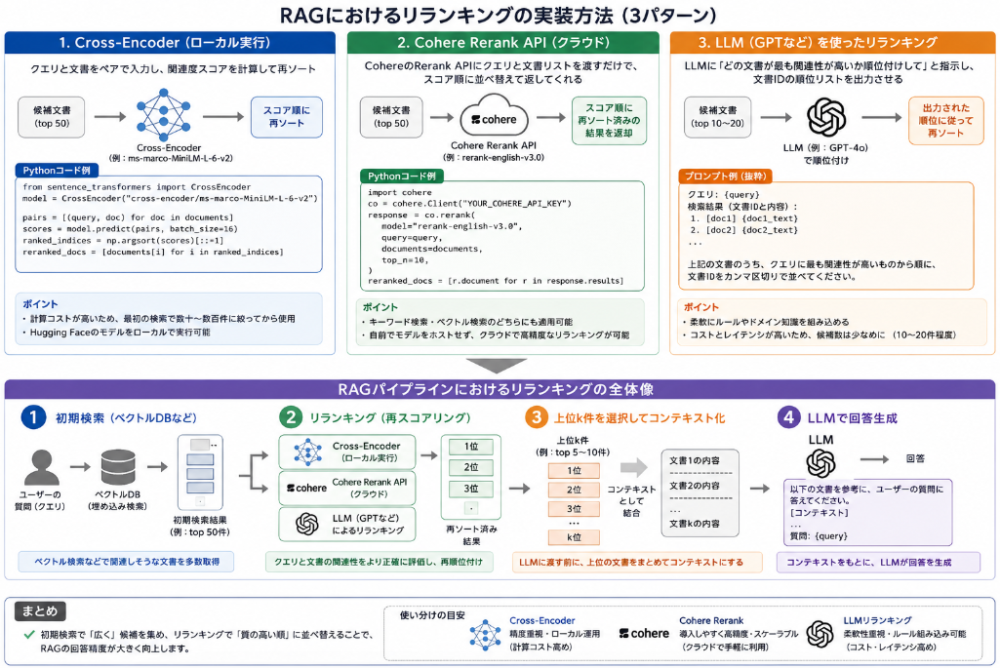

RAGを行う中で重要な機能に**リランキング（reranking）** があります。
実はRAGは検索した後もエンベディングモデルを使って再度埋め込み表現を再計算していたりします。
著者も検索だけではダメなの？と考えてました。

今日のテーマ：
>なぜRAGにリランキングが必要なのか？

## リランキングとは
RAG（Retrieval-Augmented Generation）における**リランキング** とは、**「一度取得した文書候補を、クエリとの関連度に基づいて再度並べ替え、上位の文書を選び直す処理」** のことです。

### 1. なぜリランキングが必要なのか

RAGでは通常、以下のような流れで文書を取得します。

1. **Retriever（検索器）**  
   - ベクトル検索（embeddingのコサイン類似度など）やキーワード検索（BM25など）で、大量の文書から候補を絞り込む。
2. **Reranker（リランキングモデル）**  
   - その候補群に対して、より精密な「クエリと文書の関連度スコア」を計算し、順位を入れ替える。
3. **Generator（LLM）**  
   - リランキング後の上位k件をLLMに渡し、回答を生成する。

Retrieverだけだと、

- ベクトル検索は高速だが、意味的な類似度が粗い
- キーワード検索は表層的な一致に偏りがち

といった問題があります。  
その結果、「一見関連しそうだが、実は微妙な文書」が上位に来てしまうことがあります。

そこで、**リランキング**を挟むことで、

- 「本当にクエリに合っている文書」を上位に寄せる
- 「ノイズになりそうな文書」を下位に落とす

という調整を行い、LLMに渡す文書の質を高めます。

### 2. リランキングの典型的な手法

代表的なリランキングの方法は、主に以下の2種類です。

__(1) クロスエンコーダ型のニューラルリランカー__

- **BERT系のクロスエンコーダモデル**（例：`cross-encoder/ms-marco-MiniLM-L-6-v2` など）を使う。
- クエリと文書をペアで入力し、「関連度スコア」を直接出力する。
- メリット：
  - クエリと文書の相互作用をモデル内部で計算するため、**精度が高い**。
- デメリット：
  - すべての候補ペアについて順次スコア計算が必要で、**計算コストが高い**。
  - そのため、最初のRetrieverで候補を数十〜数百件に絞った後に適用するのが一般的です。

__(2) 再スコアリング型（Re‑scoring）__

- ベクトル検索のスコアに加えて、別の特徴量（例：キーワード一致度、メタデータ、ドメイン特化のルールなど）を組み合わせて、**総合スコア**を再計算する。
- ニューラルモデルを使わない軽量な方法も含まれます。
- メリット：
  - 実装が比較的シンプルで、計算負荷が低い。
- デメリット：
  - ニューラルリランカーほどの高い精度は出にくい。

### 3. リランキングがもたらす効果

- **回答精度の向上**  
  LLMに渡す文書の質が上がるため、生成される回答の正確性・関連性が高まります。
- **ノイズ文書の抑制**  
  関連性の低い文書を下位に落とすことで、LLMが誤った情報を「補強」してしまうリスクを減らせます。
- **トークン使用量の削減**  
  上位k件だけをLLMに渡すため、kを小さくしても精度を維持しやすくなり、結果としてトークンコストを抑えられます。


### 4. 実務上の注意点

- **計算コストとのトレードオフ**  
  リランキングは精度を上げる一方で、計算時間・コストが増えます。  
  そのため、**「最初のRetrieverでどれだけ候補を絞るか」** と **「リランキングのモデル規模」** のバランス設計が重要です。
- **モデル選定**  
  ドメイン（医療、法律、技術文書など）に応じて、適切なリランキングモデルを選ぶ必要があります。汎用モデルでも一定の効果はありますが、専用にファインチューニングされたモデルを使うとさらに精度が上がります。


まとめると、RAGにおけるリランキングは、

> 「最初の検索でざっくり取ってきた候補を、より精密な関連度計算で並べ替え、LLMに渡す文書の質を高めるステップ」

であり、RAGの精度を大きく左右する重要なコンポーネントです。

## なぜ必要か

RAG（Retrieval-Augmented Generation）において**リランキングが必要な理由**は、主に以下の3点に集約されます。

1. **初期検索（ベクトル検索）だけでは「クエリと文書の微妙な関係」を十分に捉えられない**  
2. **LLMに渡すコンテキストは「質の高い少数の文書」に絞る必要がある**  
3. **RAGの元論文でも示されるように、「検索の質」が生成の質に直結する**

以下、公式論文と解説記事を引用しながら説明します。

### 1. RAGの元論文が示す「検索の重要性」

LewisらによるRAGの元論文  
**“Retrieval-Augmented Generation for Knowledge-Intensive NLP Tasks”**（arXiv:2005.11401）では、RAGを

> “models which combine pre-trained parametric and non-parametric memory for language generation”  
> （事前学習済みのパラメトリックメモリと非パラメトリックメモリを組み合わせた生成モデル）

と定義し、**外部知識（Wikipediaなど）を検索してLLMに渡す**ことで、知識集約型タスクでSOTAを達成したと報告しています[arXiv](https://arxiv.org/abs/2005.11401)。

この論文では、RAGの性能は

- **Retriever（検索器）がどれだけ適切な文書を取ってこられるか**
- **Generator（LLM）がその文書をどれだけうまく利用できるか**

の両方に依存することが示されています。  
つまり、**「検索の質」がRAG全体の精度を決める**という前提があります。

### 2. ベクトル検索（bi-encoder）の限界とリランキングの必要性

多くのRAGシステムでは、最初の検索に**bi-encoder型のベクトル検索**を使います。

- クエリと文書を**別々に**エンコードしてベクトル化
- コサイン類似度などで類似度を計算

しかし、この方式には次のような限界があります。

__(1) 情報の圧縮による「ニュアンスの喪失」__

Towards Data Scienceの記事では、bi-encoderについて次のように指摘しています。

> “bi-encoders … encode queries and documents independently into fixed-size vectors. This architecture ‘throws away the possibility of interaction signals’ because the model must compress all semantics into a single vector before comparison occurs.”  
> （bi-encoderはクエリと文書を独立に固定次元ベクトルにエンコードする。このアーキテクチャは、比較を行う前にすべての意味を単一のベクトルに圧縮しなければならず、**クエリと文書の相互作用の信号を捨ててしまう**）[Towards Data Science](https://towardsdatascience.com/advanced-rag-retrieval-cross-encoders-reranking)

つまり、**「クエリと文書の細かい関係」を事前に計算できない**ため、

- 論理的な矛盾（例：クエリ「安いホテル」 vs 文書「1泊500ドル」）
- 微妙な言い換え（「cheap」と「budget」が同じ意味かどうか）

といった**トークンレベルの相互作用**を十分に評価できません。

__(2) 検索結果が「まあまあ」止まりになる__

同じ記事では、RAGの結果が

> “the results are *okay* but not *great*”

であるとき、**埋め込みモデルを変えるよりも「リランキングステップを追加する」方が有効**だと述べています[Towards Data Science](https://towardsdatascience.com/advanced-rag-retrieval-cross-encoders-reranking)。

つまり、**初期検索だけでは「本当に最適な文書」を上位に持ってこれない**ため、  
追加の「再評価ステップ」としてリランキングが必要になります。

### 3. LLMのコンテキスト制限と「Lost in the Middle」

PineconeのRAG解説記事では、リランキングが必要なもう一つの理由として、**LLMのコンテキストウィンドウと想起能力の問題**を挙げています。

> “Because of this information loss, we often see that the top three (for example) vector search documents will miss relevant information. We cannot use context stuffing because this reduces the LLM’s *recall* performance — note that this is the LLM recall, which is different from the retrieval recall we have been discussing so far.”  
> （この情報損失のため、ベクトル検索の上位3件などに本当に必要な情報が含まれないことが多い。一方で、コンテキストを詰め込みすぎるとLLMの想起性能が低下する）[Pinecone](https://www.pinecone.io/learn/series/rag/rerankers)

さらに同記事は、

- ベクトル検索は高速だが、**情報の圧縮により精度に限界がある**
- LLMに大量の文書を渡すと、**“Lost in the Middle”**現象（文書の位置によって想起能力が落ちる）が起きる
- したがって、**「高速な検索で候補を多めに取り、高精度なリランキングで少数の最適な文書に絞る」** 二段階検索（Two-Stage Retrieval）が不可欠

と説明しています[Pinecone](https://www.pinecone.io/learn/series/rag/rerankers)。

### 4. クロスエンコーダによるリランキングの効果

リランキングの代表的な手法として、**クロスエンコーダ（cross-encoder）**があります。

Towards Data Scienceの記事では、クロスエンコーダについて次のように説明されています。

> “Cross-encoders improve retrieval by concatenating the query and document into a single input sequence, allowing for ‘full self-attention across ALL tokens.’ This enables the model to build abstract relationships, perform contradiction detection, and capture semantic equivalence more effectively than bi-encoders.”  
> （クロスエンコーダは、クエリと文書を一つの入力系列として結合し、**すべてのトークン間で自己注意を働かせる**ことで検索を改善する。これにより、抽象的な関係の構築、矛盾検出、意味的等価性の把握をbi-encoderより効果的に行える）[Towards Data Science](https://towardsdatascience.com/advanced-rag-retrieval-cross-encoders-reranking)

つまり、

- **bi-encoder（ベクトル検索）** ：高速・スケーラブルだが、精度に限界
- **cross-encoder（リランキング）** ：低速だが、クエリと文書を同時に読むため**高精度**

という特性があり、  
RAGでは

1. bi-encoderで**候補を多めに（高リコールで）取得**
2. cross-encoderで**上位候補を再スコアリングし、最適な少数に絞る**

という**二段階パイプライン**が推奨されています[Towards Data Science](https://towardsdatascience.com/advanced-rag-retrieval-cross-encoders-reranking)[Pinecone](https://www.pinecone.io/learn/series/rag/rerankers)。

## 実現法

RAGにおけるリランキングを**具体的に実装する方法**は、大きく分けて次の3パターンがよく使われます。

1. **Sentence TransformersのCross-Encoderを使う（ローカル実行）**
2. **Cohere Rerank APIなど外部サービスを使う（クラウド）**
3. **LLMそのものを使ってリランキングする（GPTなど）**

以下、それぞれについてPythonコードの骨格とRAGパイプラインへの組み込み方を説明します。



### 1. Sentence TransformersのCross-Encoderを使う方法

__概要__
- **Cross-Encoder**は、クエリと文書を**一つの入力系列として同時に処理**し、関連度スコアを出すモデルです。
- 代表的なモデル：`cross-encoder/ms-marco-MiniLM-L-6-v2`（MS MARCOで学習された検索向けモデル）[Hugging Face](https://huggingface.co/cross-encoder)。

__パイプラインの流れ__
1. ベクトルDBなどで**初期検索**（例：top 50）
2. Cross-Encoderで**クエリ×各候補文書のペアをスコアリング**
3. スコア順に**再ソート**
4. 上位k件をLLMに渡す

__Pythonコード例__

```python
from sentence_transformers import CrossEncoder
import numpy as np

# 1. モデル読み込み
model = CrossEncoder("cross-encoder/ms-marco-MiniLM-L-6-v2")

# 2. 初期検索結果（例：ベクトル検索で取ってきた上位50件）
query = "RAGにおけるリランキングの実装方法"
documents = [
    "RAGではまずベクトル検索で候補を取得し、その後クロスエンコーダで再ランク付けします。",
    "リランキングはRAGの精度を大きく向上させる重要なステップです。",
    "LLMに渡すコンテキストは、リランキングで質の高い少数に絞るのが良いです。",
    # ... 他47件
]

# 3. クエリ×文書ペアを作成
pairs = [(query, doc) for doc in documents]

# 4. スコア計算（バッチ推奨）
scores = model.predict(pairs, batch_size=16)

# 5. スコア順にソート
ranked_indices = np.argsort(scores)[::-1]  # 降順
reranked_docs = [documents[i] for i in ranked_indices]

# 6. 上位k件をLLMに渡す
top_k = 5
context_for_llm = "\n\n".join(reranked_docs[:top_k])
```

__ポイント__
- Cross-Encoderは**計算コストが高い**ので、最初の検索で候補を数十〜数百件に絞ってから使うのが基本です[Sentence Transformers Docs](https://www.sbert.net/examples/cross_encoder/applications/README.html)。
- モデルはHugging Face Hubから簡単にロードできます[Hugging Face](https://huggingface.co/cross-encoder)。

### 2. Cohere Rerank APIを使う方法

__概要__
- Cohereの**Rerankエンドポイント**は、クエリと文書リストを渡すと、**関連度スコア順に並べ替えて返す**APIです[Cohere Docs](https://docs.cohere.com/docs/reranking-with-cohere)。
- 自前でモデルをホストせずに、クラウドサービスとして利用できます。

__パイプラインの流れ__
1. ベクトル検索などで**候補文書リスト**を取得
2. Cohere Rerank APIに `query` と `documents` を送信
3. 返ってきた**スコア順の結果**をLLMに渡す

__Pythonコード例__

```python
import cohere

# APIキーは環境変数などから取得
co = cohere.Client("YOUR_COHERE_API_KEY")

# 初期検索結果（例：ベクトル検索でtop 50）
query = "RAGにおけるリランキングの実装方法"
documents = [
    "RAGではまずベクトル検索で候補を取得し、その後クロスエンコーダで再ランク付けします。",
    "リランキングはRAGの精度を大きく向上させる重要なステップです。",
    # ... 他48件
]

# Rerank API呼び出し
response = co.rerank(
    model="rerank-english-v3.0",  # モデル名は最新のものを指定
    query=query,
    documents=documents,
    top_n=10,  # 上位何件を返すか
)

# スコア順に並んだ結果を取得
reranked_docs = [r.document for r in response.results]

# LLMに渡すコンテキスト
context_for_llm = "\n\n".join(reranked_docs)
```

__ポイント__
- Cohere Rerankは**キーワード検索・ベクトル検索のどちらにも適用可能**で、既存の検索システムの上に「セマンティックなブースト」をかける用途に適しています[Cohere Docs](https://docs.cohere.com/docs/reranking-with-cohere)。
- AWSやAzure Cosmos DBとの連携例も公式に公開されています[AWS Blog](https://aws.amazon.com/blogs/machine-learning/improve-rag-performance-using-cohere-rerank)[Microsoft Community Hub](https://techcommunity.microsoft.com/blog/azuredevcommunityblog/advanced-rag-with-azure-cosmos-db-and-cohere-rerank-3-5/4412392)。

### 3. LLM（GPTなど）を使ったリランキング

__概要__
- LLM自身に「**このクエリに対して、どの文書が最も関連性が高いか順位付けして**」と指示する方法です。
- OpenAIのCookbookでも、GPTを使ってリランキングを行う例が紹介されています[OpenAI Cookbook](https://developers.openai.com/cookbook/examples/search_reranking_with_cross-encoders)。

__パイプラインの流れ__
1. 初期検索で候補文書リストを取得
2. LLMに「クエリと文書リスト」を渡し、**文書IDの順位リスト**を出力させる
3. その順位に従って文書を並べ替え、LLMに再度渡す（あるいはそのまま回答生成）

__プロンプト例__

```text
あなたは検索結果のリランキング専門モデルです。

クエリ: {query}

検索結果（文書IDと内容）:
1. [doc1] {doc1_text}
2. [doc2] {doc2_text}
...
10. [doc10] {doc10_text}

上記の文書のうち、クエリに最も関連性が高いものから順に、
文書IDをカンマ区切りで並べてください。
例: doc3, doc1, doc7, ...

出力:
```

__Pythonコード例（OpenAI API利用）__

```python
from openai import OpenAI

client = OpenAI()

query = "RAGにおけるリランキングの実装方法"
docs = {
    "doc1": "RAGではまずベクトル検索で候補を取得し、その後クロスエンコーダで再ランク付けします。",
    "doc2": "リランキングはRAGの精度を大きく向上させる重要なステップです。",
    # ...
}

prompt = f"""
あなたは検索結果のリランキング専門モデルです。

クエリ: {query}

検索結果（文書IDと内容）:
""" + "\n".join([f"{i+1}. [{id}] {text}" for i, (id, text) in enumerate(docs.items())]) + """

上記の文書のうち、クエリに最も関連性が高いものから順に、
文書IDをカンマ区切りで並べてください。
例: doc3, doc1, doc7, ...

出力:
"""

response = client.chat.completions.create(
    model="gpt-4o",
    messages=[{"role": "user", "content": prompt}],
)

# 出力例: "doc2, doc1, doc3, ..."
ranked_ids = [id.strip() for id in response.choices[0].message.content.split(",")]
reranked_docs = [docs[id] for id in ranked_ids]
```

__ポイント__
- LLMベースのリランキングは**非常に柔軟**で、ドメイン知識やビジネスルール（例：新しい文書を優先、特定サイトを優先など）を組み込めます。
- 一方で**コストとレイテンシが高い**ため、候補数は少なめ（10〜20件程度）に抑えるのが現実的です。

### 4. RAGパイプラインへの組み込み例（疑似コード）

最後に、典型的なRAGパイプラインにリランキングを組み込む全体像を示します。

```python
# 1. 初期検索（ベクトルDBなど）
query = "ユーザーの質問"
initial_results = vector_db.similarity_search(query, k=50)

# 2. リランキング（例：Cross-Encoder）
pairs = [(query, doc.page_content) for doc in initial_results]
scores = cross_encoder_model.predict(pairs)
ranked_indices = np.argsort(scores)[::-1]
reranked_docs = [initial_results[i] for i in ranked_indices]

# 3. 上位k件をLLMに渡す
top_k_docs = reranked_docs[:10]
context = "\n\n".join([doc.page_content for doc in top_k_docs])

# 4. LLMで回答生成
prompt = f"""
以下の文書を参考に、ユーザーの質問に答えてください。

文書:
{context}

質問:
{query}
"""
response = llm.generate(prompt)
```

## 総括
LLMのハルシネーションを防ぐためにも、LLMが知らない知識を与えるということが必要です。
そんな知識を与える仕組みの中に、よりよい情報を選択する方法があると、より正確な解答が期待できるようになります。

- RAGでは、**「高速な初期検索＋高精度なリランキング」** という二段階パイプラインが事実上の標準。
- リランキングを入れることで、
  - LLMに渡す文書の**質**が上がり，
  - ノイズ文書を減らし，
  - コンテキスト長を抑えつつ精度を維持できる。
- 実装は、Cross-Encoder・Cohere Rerank・LLMベースなど、  
  環境やコスト制約に応じて選べばよい。

