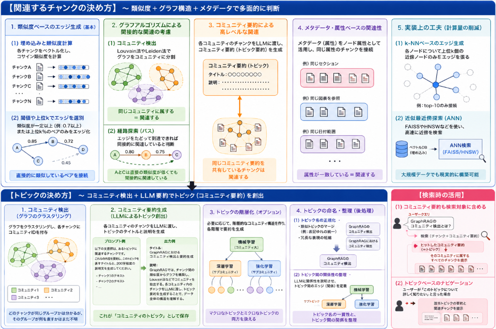

先日より話しているRAGシリーズです。
[GraphRAGは因果関係を情報DB](https://yoshishinnze.hatenablog.com/entry/2026/06/01/043000)から取得する上で、単純な検索型のRAGより高い検索性能を示します。

検索に必要な情報を保持するDBについては、違いがつくのでしょうか。

本日テーマ：
>情報DBを作成する上で、GraphDBはどのような違いが生じるか。について整理しました。

## 検索型RAGとの違い

GraphRAGは、**「データベース構築（インデックス構築）の段階」で従来のRAGと大きく異なる**設計になっています。主な違いを整理します。

### 1. 目的の違い：検索 vs 構造理解

__従来のRAG（検索型）__
- 目的：**「クエリに最も関連するチャンクを素早く見つける」**こと。
- データベース構築：
  - 文書をチャンクに分割
  - 各チャンクを埋め込み、**フラットなベクトルインデックス**に保存
- 検索時：
  - クエリの埋め込みと**k-NN検索**でtop-kチャンクを取得
  - LLMに渡して回答生成

→ **「どのチャンクがクエリに近いか」だけを見る**設計。

__GraphRAG__
- 目的：**「データ全体の構造（トピック・関係性）を理解し、その上で推論する」** こと。
- データベース構築：
  - チャンキング＋埋め込みは同じ
  - さらに**チャンク間の類似度からグラフを構築**
  - グラフをクラスタリングして**コミュニティ（トピック）を抽出**
  - 各コミュニティ内のチャンクから**要約を生成**（コミュニティ要約）
- 検索時：
  - クエリに対して、**コミュニティ要約やチャンクを検索**
  - LLMが**グラフ構造（トピック間の関係）を考慮**して回答生成

→ **「データ全体の構造を事前に理解しておく」**設計[Microsoft Research](https://www.microsoft.com/en-us/research/blog/introducing-graphrag-unlocking-llm-reasoning-on-complex-private-data/)。

### 2. データベース構築時の処理の違い

__(1) グラフ構築（Graph Construction）__

- **従来のRAG**：  
  - チャンクは**独立したドキュメント**として扱われ、相互関係は基本的に考慮されない。
- **GraphRAG**：  
  - 各チャンクを**ノード**とし、類似度が高いチャンク同士を**エッジ**で結ぶ。  
  - これにより、**「どのチャンクがどのチャンクと関連しているか」というネットワーク**が構築される。

__(2) コミュニティ検出（Community Detection）__

- **従来のRAG**：  
  - コミュニティ検出は行わない（あるとしても検索時の後処理レベル）。
- **GraphRAG**：  
  - グラフをクラスタリングアルゴリズム（例：Louvain法、Leiden法）で**トピックごとのコミュニティに分割**。  
  - 各コミュニティは「関連するチャンクの集合」として扱われる。

__(3) コミュニティ要約生成（Community Summarization）__

- **従来のRAG**：  
  - 要約は基本的に**検索時にLLMが行う**（あるいは事前要約は別処理）。
- **GraphRAG**：  
  - 各コミュニティ内のチャンクをLLMに渡し、**コミュニティ全体の要約**を生成。  
  - この要約も**検索対象の一部**としてインデックスに保存される。

__(4) メタデータ・属性の付与__

- **従来のRAG**：  
  - メタデータ（セクション、日付など）は**フィルタリングやブースト**に使われることが多い。
- **GraphRAG**：  
  - メタデータは**ノード属性**としてグラフに組み込まれ、  
    - コミュニティ検出時の特徴量  
    - 検索時のフィルタリング  
    の両方に活用される。

### 3. インデックスの構造の違い

__従来のRAGのインデックス__
- **フラットなベクトルインデックス**：
  - 各チャンクが独立したエントリ
  - クエリに対して**k-NN検索**でtop-kを取得
- 構造はシンプルで、**検索速度は速い**が、**文書間の関係性は考慮されない**。

__GraphRAGのインデックス__
- **グラフ構造＋（場合によっては）ベクトルインデックス**：
  - ノード：チャンク、コミュニティ要約など
  - エッジ：チャンク間の類似関係、コミュニティ間の関係など
  - コミュニティ要約も**検索対象のノード**として保存
- 構造は複雑だが、**「トピック単位」「関係性単位」での検索・推論**が可能。

### 4. 検索・推論時の挙動の違い

__従来のRAG__
- 検索：  
  - クエリに近いチャンクを**個別に**取得。
- 推論：  
  - LLMは**渡されたチャンクの内容だけ**を見て回答生成。  
  - 文書間の関係性や全体構造は**基本的に考慮されない**。

__GraphRAG__
- 検索：  
  - クエリに対して、**チャンクとコミュニティ要約の両方**を検索。  
  - グラフ構造をたどって、**関連するコミュニティやチャンク**も探索できる。
- 推論：  
  - LLMは**コミュニティ要約やグラフ構造**を参照し、  
    - 「どのトピックが関連しているか」  
    - 「トピック間の関係はどうなっているか」  
    を考慮して回答生成できる。

→ **「点（チャンク）の集合」を見るか、「ネットワーク（グラフ）全体」を見るか**の違い。

### 5. コスト・複雑さの違い

__従来のRAG__
- 構築コスト：比較的低い（チャンキング＋埋め込みのみ）
- 検索コスト：低い（k-NN検索のみ）
- 実装難易度：比較的低い

__GraphRAG__
- 構築コスト：高い  
  - グラフ構築、コミュニティ検出、要約生成など**追加処理が多い**
- 検索コスト：やや高い  
  - グラフ探索やコミュニティ単位の検索が必要
- 実装難易度：高い  
  - グラフアルゴリズム、LLMによる要約、インデックス設計などが必要

### 6. 向き不向き

__従来のRAGが向くケース__
- 文書が**独立した事実の集合**である場合（FAQ、マニュアルなど）
- **単一の事実**を素早く検索したい場合
- コストや実装のシンプルさを重視する場合

__GraphRAGが向くケース__
- 文書間に**複雑な関係性**がある場合（研究論文、企業の内部文書、会話ログなど）
- **全体像やトピック間の関係**を理解したい場合
- 「なぜ？」「どのように関連している？」といった**推論的な質問**が多い場合

## 関連するかの決め方

GraphRAGにおける「関連するチャンク」の決め方は、**基本的には類似度ベース**ですが、それだけではなく、**グラフアルゴリズムやコミュニティ検出**も組み合わせて決めます。具体的な流れを整理します。

### 1. 類似度ベースのエッジ生成（基本）

__(1) チャンク間の類似度計算__

- 各チャンクを埋め込みモデルでベクトル化します。
- すべてのチャンクペア（または近傍に限定）について、**コサイン類似度**などを計算します。

```python
# 疑似コード例
for i, emb_i in enumerate(embeddings):
    for j, emb_j in enumerate(embeddings):
        if i == j:
            continue
        sim = cosine_similarity(emb_i, emb_j)
        if sim > threshold:
            add_edge(i, j, weight=sim)
```

__(2) 閾値（Threshold）によるエッジの選別__

- **類似度が一定以上**のペアだけをエッジとして結びます。
- 閾値の設定例：
  - 固定値（例：0.7以上）
  - 上位k％（例：類似度が上位10％のペアのみ）
- 閾値が低すぎると**グラフが密になりすぎ**、高すぎると**グラフが分断されすぎ**るため、バランスが重要です。

→ これが「**類似度が一定以上なら関連する**」という基本的な処理です。

### 2. グラフアルゴリズムによる「間接的な関連」の考慮

類似度だけでなく、**グラフの構造**も使って「関連するチャンク」を決めます。

__(1) コミュニティ検出（Community Detection）__

- Louvain法、Leiden法、Girvan–Newman法などの**クラスタリングアルゴリズム**で、グラフを**トピックごとのコミュニティ**に分割します。
- 同じコミュニティに属するチャンクは、**直接的には類似度が低くても、共通のトピックでつながっている**と見なされます。

→ 「**同じコミュニティに属している＝関連する**」という判断が加わります。

__(2) 経路探索（Path Finding）__

- あるチャンクから別のチャンクへ、**エッジをたどって到達できるか**を確認します。
- 例：
  - チャンクA → チャンクB（類似度0.8）  
  - チャンクB → チャンクC（類似度0.75）  
  - ならば、AとCは**間接的に関連している**と見なす。

→ 「**類似度の連鎖**」によって、直接の類似度が低くても**グラフ上でつながっていれば関連**と判断できます。

### 3. コミュニティ要約による「高レベルな関連」の定義

GraphRAGでは、各コミュニティ内のチャンクをLLMに渡して**コミュニティ要約**を生成します[Microsoft Research](https://www.microsoft.com/en-us/research/blog/introducing-graphrag-unlocking-llm-reasoning-on-complex-private-data/)。

- コミュニティ要約は、**そのトピック全体の要約**として扱われます。
- 検索時には、
  - クエリに対して**コミュニティ要約そのもの**を検索対象に含める
  - コミュニティ要約がヒットした場合、**そのコミュニティに属するすべてのチャンク**を関連文書として扱う

→ 「**同じコミュニティ要約を共有しているチャンクは関連する**」という、より高レベルな関連性の定義が加わります。

### 4. メタデータ・属性ベースの関連性

GraphRAGでは、メタデータも**ノード属性**としてグラフに組み込まれます。

- 例：
  - 同じセクションに属するチャンク
  - 同じ図表を参照するチャンク
  - 同じ日付範囲のチャンク
- これらの属性に基づいて、
  - **属性が同じチャンク同士をエッジで結ぶ**
  - コミュニティ検出時の特徴量として使う

→ 「**メタデータが一致している＝関連する**」というルールも追加できます。

### 5. 実装上の工夫（近傍探索で計算量を抑える）

全チャンク同士の類似度を計算すると、**計算量がO(n²)**になり現実的でない場合があります。そのため、実際には以下のような工夫をします。

__(1) k-NNベースのエッジ生成__

- 各チャンクについて、**上位k個の最近傍チャンク**だけをエッジとして結びます。
- 例：各ノードについて**top-10の類似チャンク**にのみエッジを張る。

__(2) 近似最近傍探索（ANN）__

- FAISSやHNSWなどの**近似最近傍探索**を使い、高速に近傍を求める。
- これにより、大規模データでも現実的な時間でグラフ構築が可能になります。

## トピックの決め方

GraphRAGにおける「コミュニティのトピック」は、**グラフのクラスタリング結果をLLMに渡して要約させる**ことで創出します。具体的な流れを整理します。

### 1. コミュニティ検出（グラフのクラスタリング）

まず、チャンク間の類似度から構築したグラフを**クラスタリングアルゴリズム**で分割し、「コミュニティ」を抽出します。

__代表的なアルゴリズム__
- **Louvain法**：モジュラリティ最大化に基づく高速なコミュニティ検出[Wikipedia](https://en.wikipedia.org/wiki/Louvain_method)  
- **Leiden法**：Louvain法の改良版で、より安定した結果を出す[Nature Methods](https://www.nature.com/articles/s41592-019-0686-2)  
- **Girvan–Newman法**：エッジのbetweenness centralityに基づく分割  
- その他：スペクトラルクラスタリング、Label Propagationなど

__出力__
- 各チャンクに「コミュニティID」が付与される  
- 例：コミュニティ1に属するチャンク群、コミュニティ2に属するチャンク群、…

この段階では、**「どのチャンクが同じグループか」は分かるが、そのグループが何を表すか（トピック名）はまだ不明**です。

### 2. コミュニティ要約生成（LLMによるトピック創出）

次に、各コミュニティに属するチャンクをLLMに渡し、**コミュニティ全体の要約（トピック説明）** を生成させます。

__プロンプトの例__
```text
以下の文書群は、あるトピックに関連するチャンクです。
これらの内容を要約し、このトピックを表すタイトルと、
200字程度の説明文を生成してください。

チャンク:
- [チャンク1のテキスト]
- [チャンク2のテキスト]
- ...
```

__出力例__
- **タイトル**：GraphRAGにおけるコミュニティ検出と要約生成  
- **説明文**：GraphRAGでは、チャンク間の類似度からグラフを構築し、Louvain法などでコミュニティを抽出する。各コミュニティ内のチャンクをLLMに渡し、トピック要約を生成することで、データ全体の構造を理解する。

→ これが **「コミュニティのトピック」** としてインデックスに保存されます。

### 3. トピックの階層化（オプション）

大規模なデータセットでは、**階層的なコミュニティ構造**を作ることもあります。

__例__
1. 第1段階：大きなコミュニティ（例：「機械学習」）
2. 第2段階：その中のサブコミュニティ（例：「深層学習」「強化学習」）
3. 各階層ごとにLLMで要約を生成

これにより、**マクロなトピックとミクロなトピック**の両方を扱えるようになります。

### 4. トピックの命名・整理（後処理）

LLMが生成したトピック名は、場合によっては冗長だったり一貫性がなかったりします。そのため、以下のような後処理を行うことがあります。

__(1) トピック名の正規化__
- 類似したトピック名をマージ（例：「GraphRAGのコミュニティ検出」と「GraphRAGにおけるコミュニティ抽出」を統合）
- 冗長な表現を短縮（例：「〜についての説明」を削除）

__(2) トピック間の関係性の整理__
- LLMに「これらのトピックの関係を説明して」と指示し、**トピック間のエッジ（関係）** を定義する
- 例：「深層学習」は「機械学習」のサブトピックである、など

### 5. 検索時の活用

__(1) コミュニティ要約を検索対象に含める__
- クエリに対して、**チャンクだけでなくコミュニティ要約も検索**します。
- コミュニティ要約がヒットした場合、そのコミュニティに属するチャンク群を**まとめて関連文書**として扱います。

__(2) トピックベースのナビゲーション__
- ユーザーが「このトピックについて詳しく知りたい」と言った場合、該当トピックのコミュニティ要約と関連チャンクを提示する、といった使い方も可能です。

## まとめ
本日の重要なポイントはここでしょうか。
Graph RAGのためのデータベースを作成する際にはトピックの選定と、テーマごとに関係があることを見抜くことが重要なポイントとなります。

### 関連するチャンクの決め方

1. **類似度ベース**：埋め込み類似度が高いチャンク同士をエッジで結び、「直接関連」と見なす。  
2. **グラフアルゴリズム**：コミュニティ検出で同じグループに入ったチャンクを「関連」と見なす。経路探索で間接的につながるチャンクも関連と判断。  
3. **コミュニティ要約**：LLMで生成したコミュニティ要約がヒットしたら、そのコミュニティ内の全チャンクを関連文書として扱う。  
4. **メタデータ**：同じセクション・図表・日付などのチャンクを関連と見なす。  
5. **計算量対策**：k-NNや近似最近傍探索（ANN）でエッジ生成を効率化。

### トピックの決め方

1. **クラスタリング**：グラフをクラスタリングしてコミュニティ（チャンクのグループ）を抽出。  
2. **LLM要約**：各コミュニティ内のチャンクをLLMに渡し、タイトル＋説明文のトピック要約を生成。  
3. **階層化・整理**：大規模データでは階層構造を作り、トピック名を正規化・統合。  
4. **検索活用**：コミュニティ要約も検索対象に含め、ヒットしたコミュニティのチャンク群をまとめて利用。


