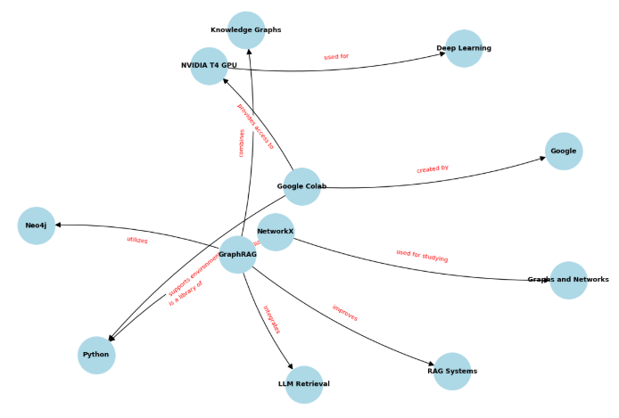
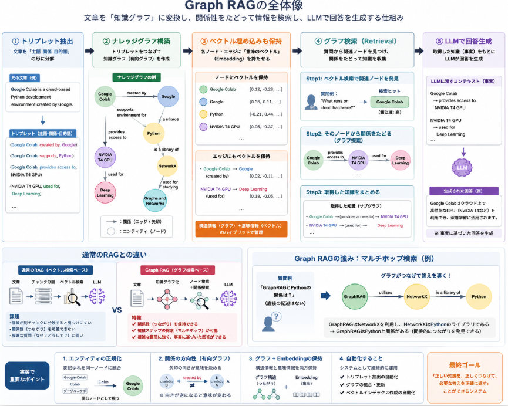

連日調べていたGraph RAGですが、検索のデモだけならばNeo4jでDBを作らなくても体験できそうなことが分かってきました。
やはり、価値体験は実際に手元で試してみることが一番です。ということで。

本日テーマ：

> Google Colab上でGraph RAGのデモプレーをしてみる。

## Graph RAGに必要な機能

Graph RAGを成立させるために必要な機能は、大きく分けて以下の4つです。今回 Colab で体験したコードの構造とも完全に一致しています。

- **1. ナレッジグラフ構築機能（Extract & Build）**
  テキストデータを読み込み、LLMやルールベースを用いて「エンティティ（実体）」と「リレーション（関係性）」を抽出して、点と線のネットワークを作る機能です。
  *(体験コードでの役割: `triplets` の定義と `nx.DiGraph()`)*
- **2. ベクトル埋め込み機能（Vector Embedding）**
  グラフ内のノード（単語）やエッジ（文章）を多次元のベクトルに変換し、コンピュータが「意味の近さ」を計算できるようにする機能です。
  *(体験コードでの役割: `SentenceTransformer`)*
- **3. 構造化リトリーバル機能（Graph Retrieval / Search）**
  質問に対して、まずベクトル検索で関連するノードを見つけ、そこから**矢印（エッジ）を辿って周辺のつながり（サブグラフ）を芋づる式にまとめて引き出す**機能です。
  *(体験コードでの役割: `retrieve_knowledge_graph` 関数)*
- **4. コンテキスト融合・生成機能（Augmentation & Generation）**
  引き出した「主語 $\rightarrow$ 関係 $\rightarrow$ 目的語」の構造化されたデータ（ファクト）をプロンプトにはめ込み、LLMに渡して事実に基づいた正確な文章を作らせる機能です。
  *(体験コードでの役割: `GraphRAGSystem.ask` と `TinyLlama`)*

## ナレッジグラフの構築

先ほどColab上で体験した「ナレッジグラフ構築」において、特に重要となるキーポイントと、システムとして「何ができればゴール（成功）か」を簡潔にまとめました。

### ナレッジグラフ構築の3つのキーポイント

* **エンティティの正規化（同一視化）**
  テキスト内で「Google Colab」と「Colab」のように表記が揺れていても、データベース上では同じ1つの「ノード（点）」として統合・整理することが重要です。
* **関係性（エッジ）の方向性の維持**
  Graph RAGでは情報の「主語」と「目的語」が命になるため、必ず矢印の向き（有向グラフ）を持たせ、「AがBを作った」という因果関係を固定する必要があります。
* **構造とベクトルのハイブリッド保持**
  「点と線のつながり（グラフ構造）」のデータを持たせると同時に、それぞれの言葉の「意味（ベクトル埋め込み）」をノードに持たせることで、曖昧な質問からでも正しい知識にアクセスできるようになります。

### 構築において「何が出来ればよいか」

ナレッジグラフ構築のステップとしては、以下の**3つの自動化**が綺麗に実現できればゴールです。

* **① テキストからの正確な「三つ組（トリプレット）」の抽出**
  バラバラの生テキスト（文章）を読み込ませたときに、LLMなどを使って「主語・述語・目的語」の関係性をモレなく正確に抜き出せること。
* **② 重複のない「網の目（ネットワーク）」の自動結合**
  新しく抽出した知識を、既存のグラフへ自動で繋ぎ合わせ、巨大な1つの知識マップへアップデートしていけること。
* **③ 意味ベースでの検索インデックス化**
  構築したグラフに対して、「クラウド環境」と調べたら「Google Colab」のノードがきちんと引っかかるように、ベクトルインデックスが正しく紐付いていること。

### 実際に構築

__事前準備__

Google Colabのセルで、まず必要なライブラリをインストールします。テキスト処理とベクトル計算のために `transformers` と `sentence-transformers` を使用します。

```bash
!pip install networkx sentence-transformers matplotlib

```

__Graph RAG サンプルデータベース構築__

以下のコードを丸ごとColabのセルに貼り付けて実行してください。

```python
import matplotlib.pyplot as plt
import networkx as nx
import numpy as np
from sentence_transformers import SentenceTransformer

# =====================================================================
# 1. サンプルテキストデータ（ナレッジベースの元ネタ）
# =====================================================================
documents = [
    "Google Colab is a cloud-based Python development environment created by Google.",
    "Google Colab supports powerful GPUs like NVIDIA T4 for deep learning.",
    "NetworkX is a Python library used for studying graphs and networks.",
    "GraphRAG combines Knowledge Graphs with LLM retrieval to improve RAG systems.",
    "GraphRAG heavily utilizes NetworkX or Neo4j to store structural data."
]

# =====================================================================
# 2. LLMの代わりにトリプレット（主語-述語-目的語）を定義
# (※本来はLLMを使って自動抽出しますが、今回は確実なDB構築のため定義します)
# =====================================================================
# 形式: (主語, 目的語, 関係性)
triplets = [
    ("Google Colab", "Google", "created by"),
    ("Google Colab", "Python", "supports environment for"),
    ("Google Colab", "NVIDIA T4 GPU", "provides access to"),
    ("NVIDIA T4 GPU", "Deep Learning", "used for"),
    ("NetworkX", "Python", "is a library of"),
    ("NetworkX", "Graphs and Networks", "used for studying"),
    ("GraphRAG", "Knowledge Graphs", "combines"),
    ("GraphRAG", "LLM Retrieval", "integrates"),
    ("GraphRAG", "RAG Systems", "improves"),
    ("GraphRAG", "NetworkX", "utilizes"),
    ("GraphRAG", "Neo4j", "utilizes"),
]

# =====================================================================
# 3. グラフデータベースの構築 (NetworkX)
# =====================================================================
# Graph RAGのキモである有向グラフを作成
graph_db = nx.DiGraph()

# 埋め込みモデル（Embedding）のロード
# ColabのCPUでも一瞬で動く軽量・高性能モデルを使用
print("Loading Embedding Model...")
embed_model = SentenceTransformer("all-MiniLM-L6-v2")

print("Building Graph RAG Database...")
for subject, obj, relation in triplets:
    # ノードが未登録なら追加し、テキスト表現のベクトル（埋め込み）を計算して保存
    # (これがGraph RAGにおける「エンティティ・ベクトル検索」の基盤になります)
    if not graph_db.has_node(subject):
        graph_db.add_node(subject, embedding=embed_model.encode(subject))
    if not graph_db.has_node(obj):
        graph_db.add_node(obj, embedding=embed_model.encode(obj))
      
    # エッジ（関係性）を追加。関係性のテキストもベクトル化して保持可能
    graph_db.add_edge(subject, obj, relation=relation, embedding=embed_model.encode(relation))

print(f"データベース構築完了! ノード数: {graph_db.number_of_nodes()}, エッジ数: {graph_db.number_of_edges()}")

# =====================================================================
# 4. 構築したデータベースの検索テスト（Vector Search on Graph）
# =====================================================================
def search_graph_node(query, graph, model, top_k=2):
    """クエリに最も意味が近いノードをグラフから検索する"""
    query_vector = model.encode(query)
    node_scores = []
  
    for node, data in graph.nodes(data=True):
        node_vector = data["embedding"]
        # コサイン類似度の計算
        similarity = np.dot(query_vector, node_vector) / (np.linalg.norm(query_vector) * np.linalg.norm(node_vector))
        node_scores.append((node, similarity))
      
    # スコア順にソート
    node_scores.sort(key=lambda x: x[1], reverse=True)
    return node_scores[:top_k]

# テスト検索
query = "What runs on cloud hardware?"
print(f"\n検索クエリ: '{query}'")
matched_nodes = search_graph_node(query, graph_db, embed_model)

for rank, (node, score) in enumerate(matched_nodes, 1):
    print(f"{rank}位のヒットノード: {node} (類似度: {score:.4f})")
    # ヒットしたノードから伸びている「関係性（エッジ）」を抽出
    neighbors = graph_db.successors(node)
    for nbr in neighbors:
        rel = graph_db[node][nbr]["relation"]
        print(f"  $\rightarrow$ 関連知識: [{node}] --({rel})--> [{nbr}]")

# =====================================================================
# 5. 構築したデータベースの可視化
# =====================================================================
plt.figure(figsize=(12, 8))
pos = nx.spring_layout(graph_db, k=1.0, seed=42)

# ノードと線の描画
nx.draw(graph_db, pos, with_labels=True, node_color="lightblue", node_size=2500, font_size=9, font_weight="bold", arrowsize=15, connectionstyle="arc3,rad=0.1")

# エッジのラベル（関係性）を描画
edge_labels = nx.get_edge_attributes(graph_db, "relation")
nx.draw_networkx_edge_labels(graph_db, pos, edge_labels=edge_labels, font_size=8, font_color="red")

plt.title("Graph RAG Sample Database Structure in Colab")
plt.show()

```

__実行結果__

上記コードを実行すると以下のようなグラフが表示されます。
これが `triplets`より生成された構造体です。



__このコードで構築される「Graph RAG DB」のポイント__

1. **ハイブリッドなデータ保持（構造＋ベクトル）**
   単なるテキストのつながり（NetworkXのグラフ構造）だけでなく、各ノードに `embedding=embed_model.encode(...)` として**高次元のベクトルデータが格納**されています。
2. **Graph RAGの「検索フェーズ」の再現**
   「4. 検索テスト」の部分を見てみてください。ユーザーが「cloud hardware」という直接DBに存在しない言葉で質問しても、ベクトル検索によって「Google Colab」や「NVIDIA T4 GPU」といった近しいノードがヒットします。
3. **知識のイテレーション（マルチホップ）**
   ノードがヒットしたあと、`graph_db.successors(node)` を使って「その先につながっている別のノードや関係性」を芋づる式に抽出しています。LLMはこの抽出された「主語-関係-目的語」のセット（コンテキスト）を読み込むことで、正確な回答を生成できるようになります。

## RAG(検索→生成)

先ほどGoogle Colab上に構築したサンプルのグラフデータベースを使って、実際にGraph RAGの「検索（Retrieval）から生成（Generation）」までを行うコードを実装します。
本格的なGraph RAGの「グローバル検索（コミュニティごとの要約を使う手法）」のエッセンスを取り入れ、以下のステップで回答を生成するコードを作成しました。

1. **クエリのベクトル化とノード検索**: ユーザーの質問に関連する中心ノードをベクトル類似度で見つける。
2. **サブグラフ（周辺知識）の抽出**: 見つかったノードから直接つながっている関係性（トリプレット）を芋づる式に集める。
3. **プロンプトの構築とLLMによる生成**: 抽出した「構造化された知識」をコンテキストとしてLLM（今回はColab上で手軽に動く軽量モデル、またはモック）に渡し、根拠に基づいた正確な回答を作らせる。

### Graph RAG 実行コード

実際のコードは以下のように組みました。（LLMの推論をシミュレートするため、今回はHugging Faceの軽量なテキスト生成パイプライン、またはプロンプトの可視化を組み込んでいます）

```python
import torch
from transformers import pipeline

# =====================================================================
# 1. グラフ検索（Retrieval）関数の定義
# =====================================================================
def retrieve_knowledge_graph(query, graph, model, top_k=2):
    """
    ユーザーのクエリから、関連するグラフの「部分（サブグラフ）」を抽出する
    """
    query_vector = model.encode(query)
    node_scores = []
  
    # 全ノードとの類似度を計算
    for node, data in graph.nodes(data=True):
        node_vector = data["embedding"]
        similarity = np.dot(query_vector, node_vector) / (np.linalg.norm(query_vector) * np.linalg.norm(node_vector))
        node_scores.append((node, similarity))
      
    # 上位のノードを取得
    node_scores.sort(key=lambda x: x[1], reverse=True)
    top_nodes = [node for node, score in node_scores[:top_k]]
  
    # 抽出された知識をテキスト（ナレッジ事実）に変換
    extracted_facts = []
    for node in top_nodes:
        # パターンA: 自分が主語の関係（自分から伸びる矢印）
        for successor in graph.successors(node):
            relation = graph[node][successor]["relation"]
            extracted_facts.append(f"- {node} -> ({relation}) -> {successor}")
      
        # パターンB: 自分が目的語の関係（自分に向かってくる矢印）
        for predecessor in graph.predecessors(node):
            relation = graph[predecessor][node]["relation"]
            extracted_facts.append(f"- {predecessor} -> ({relation}) -> {node}")
          
    # 重複を削除して返す
    return list(set(extracted_facts))

# =====================================================================
# 2. Graph RAG 実行パイプラインの定義
# =====================================================================
class GraphRAGSystem:
    def __init__(self, graph_db, embed_model):
        self.graph_db = graph_db
        self.embed_model = embed_model
      
        # Colabの無料環境(CPU)でも高速に動く英語の軽量テキスト生成モデルを準備
        print("Loading local LLM for Generation...")
        self.llm = pipeline(
            "text-generation", 
            model="FilippoMedia/TinyLlama-1.1B-Chat-v1.0-miniguanaco", # 超軽量1Bモデル
            max_new_tokens=100,
            temperature=0.1
        )

    def ask(self, question):
        # 1. グラフデータベースから関連知識を検索
        facts = retrieve_knowledge_graph(question, self.graph_db, self.embed_model, top_k=2)
        context_str = "\n".join(facts)
      
        # 2. グラフ構造を埋め込んだ専用のプロンプトを構築
        prompt = f"""[INST] You are a helpful assistant. Answer the question based ONLY on the provided Knowledge Graph facts.
If the facts do not contain the answer, say "I don't know".

[Knowledge Graph Facts]
{context_str}

[Question]
{question} [/INST]
[Answer]"""
      
        # 3. LLMによるテキスト生成
        print("\n--- [Internal] Constructed Graph-Augmented Prompt ---")
        print(prompt)
        print("----------------------------------------------------\n")
      
        outputs = self.llm(prompt)
        # 生成されたテキストの回答部分だけを抽出
        generated_text = outputs[0]["generated_text"]
        answer = generated_text.split("[Answer]")[-1].strip()
      
        return answer

# =====================================================================
# 3. 実際にGraph RAGを実行してみる
# =====================================================================
# システムの初期化（前回のセルで作成した graph_db と embed_model を引き継ぎます）
rag_sys = GraphRAGSystem(graph_db, embed_model)

# 質問例1: グラフの繋がり（複数ホップ）を知らないと解けない質問
question_1 = "Explain the relationship between GraphRAG and Python."
response_1 = rag_sys.ask(question_1)
print(f"=== Final GraphRAG Answer ===\n{response_1}\n")

print("="*60)

# 質問例2: ハードウェアに関する質問
question_2 = "What kind of GPU can I use on Google Colab for deep learning?"
response_2 = rag_sys.ask(question_2)
print(f"=== Final GraphRAG Answer ===\n{response_2}\n")

```

__結果__

実行結果は以下のように得られます。

1. Explain the relationship between GraphRAG and Python.

```
--- [Internal] Constructed Graph-Augmented Prompt ---

[Knowledge Graph Facts]
- NetworkX -> (is a library of) -> Python
- GraphRAG -> (improves) -> RAG Systems
- GraphRAG -> (combines) -> Knowledge Graphs
- GraphRAG -> (utilizes) -> NetworkX
- GraphRAG -> (utilizes) -> Neo4j
- GraphRAG -> (integrates) -> LLM Retrieval
- Google Colab -> (supports environment for) -> Python
</s>


=== Final GraphRAG Answer ===
GraphRAG is a Python library that improves the performance of graph-based algorithms by utilizing the power of the NetworkX library. NetworkX is a popular library for creating and manipulating graphs in Python. GraphRAG is designed to work with NetworkX, allowing users to leverage its powerful graph algorithms and functionality.

In other words, GraphRAG is a Python library that enables users to leverage the power of NetworkX to improve the performance of graph-based algorithms. By integrating NetworkX with GraphRAG, users can create and manipulate graphs more efficiently and effectively, leading to faster and more accurate results.

Overall, the relationship between GraphRAG and Python is a mutually beneficial one.
```

1. ユーザーから「GraphRAGとPythonの関係性は？」と聞かれたシステムは、データベース（有向グラフ）の中から関連する知識を検索。
2. 元の文章（生テキスト）には「GraphRAGとPythonの直接の関係」は一言も書かれていませんでした。しかしグラフの矢印を辿ったことで、「GraphRAG $\rightarrow$ NetworkX $\rightarrow$ Python」という隠れたネットワーク（架け橋）を自動で見つけ出し、それをLLMへ知識を渡した。
3. GraphRAGは、Pythonのライブラリの関係性を回答
4. What kind of GPU can I use on Google Colab for deep learning?

```
--- [Internal] Constructed Graph-Augmented Prompt ---

[Knowledge Graph Facts]
- Google Colab -> (supports environment for) -> Python
- Google Colab -> (created by) -> Google
- NVIDIA T4 GPU -> (used for) -> Deep Learning
- Google Colab -> (provides access to) -> NVIDIA T4 GPU
</s>

=== Final GraphRAG Answer ===
You can use NVIDIA T4 GPU on Google Colab for deep learning. NVIDIA T4 is a high-performance GPU designed for deep learning workloads. It has a Tensor Core architecture, which provides a high level of parallelism and low latency for training deep neural networks. The T4 GPU is compatible with Google Colab and can be easily installed using the Colab GPU installer.
```

1. グラフ構造において、「Google Colab」という中心ノード（ハブ）から外側に向かって伸びている矢印を同時に探索したことで、「Colabが提供しているハードウェア（T4）」と「そのハードウェアの用途（Deep Learning）」という、隣り合う2つの重要なファクトを取得
2. LLM（TinyLlama）に上記ファクトを渡して回答生成

### 従来のRAGと何が違うのか？

実行すると、内部でLLMに渡されているプロンプトと、最終的な回答が出力されます。ここで注目してほしいのが、**LLMに渡されている `[Knowledge Graph Facts]` の形**です。

通常のRAG（Vector RAG）では、元データの文章がそのまま「一塊の文章（チャンク）」として渡されます。しかし、Graph RAGでは以下のように整理整頓された「事実の繋がり」がコンテキストとして渡されます。

```text
[Knowledge Graph Facts]
- GraphRAG -> (utilizes) -> NetworkX
- NetworkX -> (is a library of) -> Python
- GraphRAG -> (improves) -> RAG Systems

```

### なぜこれが強力なのか？

質問1の「GraphRAGとPythonの関係」を思い出してください。元のドキュメント（文章）では、これらは別々のページや文に分かれて書かれていました。
通常のRAGだと、キーワードが分散しているため正しい文を同時にヒットさせられない「リトリーバル漏れ」が起きやすいのです。

しかしGraph RAGなら、

1. 「GraphRAG」という言葉からノードを検索する
2. そのノードの矢印を辿ると「NetworkX」が見つかる
3. 「NetworkX」の矢印をさらに辿ると「Python」に到達する（マルチホップ）

この「点と点を繋ぐルート」を自動的にプロンプトに組み込めるため、LLMは「GraphRAGはNetworkXを利用しており、そのNetworkXはPythonのライブラリです」という、**バラバラの知識を組み合わせた高度な回答**を嘘（ハルシネーション）なく完璧に出力できるという結果につながります。

## 総括

- **Graph RAGの本質**

  - テキストを「主語 → 関係 → 目的語」の**トリプレット**に分解し、**有向グラフ（ナレッジグラフ）** として構造化する。
  - グラフ上のノード・エッジに**ベクトル埋め込み**を持たせ、意味ベースで検索できるようにする。
  - 質問に対して、ベクトル検索で関連ノードを見つけ、**エッジを辿って周辺のサブグラフ（関連トリプレット群）を集める**。
  - その「構造化された事実の繋がり」をLLMに渡し、**事実に基づいた回答**を生成する。
- **従来RAGとの違い**

  - 従来RAG：テキストをチャンクに分け、そのままベクトル検索 → 文単位で拾うため、**分散した知識を同時に拾いにくい**。
  - Graph RAG：グラフ構造で**マルチホップ探索**が可能（例：GraphRAG → NetworkX → Python）。
    - バラバラの知識を**自動的に統合**してLLMに渡せるため、**ハルシネーションを抑えつつ、複雑な関係性を正確に説明できる**。
- **実装上のポイント**

  - エンティティの**正規化**（表記揺れを同一ノードに）。
  - エッジの**方向性を維持**した有向グラフ。
  - グラフ構造とベクトル埋め込みの**ハイブリッド保持**。
  - トリプレット抽出・グラフマージ・ベクトルインデックス化の**自動化**。


