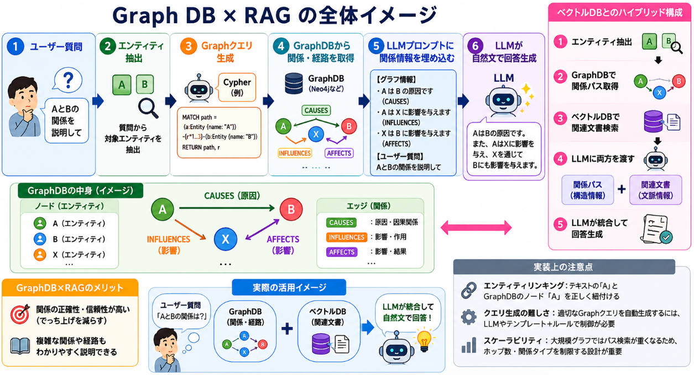

## 概要

「関係性を説明するようなタスク」におけるRAGの精度差は、**タスクの性質・データ構造・クエリの複雑さ**によって大きく変わります。  
単純な「類似文書検索」ではベクトルDBが有利になりやすく、**複雑な関係推論・経路探索**が必要なタスクではGraphDB（知識グラフ）が有利になりやすい、という傾向があります。

以下、もう少し具体的に整理します。

### 1. ベクトルDB（典型的なRAG）の特徴

- **得意なこと**
  - 文書・チャンク全体の「意味的な類似度」に基づく検索
  - 「この文書に似た文書を探す」「この説明に近い説明を探す」といったタスク
  - 単純なQA（「Xとは何か？」「Yの定義は？」）では十分な精度が出やすい

- **関係性タスクでの限界**
  - 「AとBの関係を説明せよ」「A→B→Cの因果関係を説明せよ」といった**構造的な関係**は、埋め込みベクトルだけでは表現しきれない
  - 関係の種類（因果・包含・所有・時系列など）を明示的に扱えない
  - 複数ホップの推論（A→B→C）は、文書を複数回検索してLLMに任せる形になり、精度が落ちやすい

### 2. GraphDB（知識グラフ）の特徴

- **得意なこと**
  - エンティティ（A, B, C…）と関係（因果・包含・親子・時系列など）を**明示的にグラフ構造**で保持
  - 「AとBの関係」「AからCへの経路」を**クエリ言語（Cypher, SPARQLなど）で直接たどれる**
  - 関係性の説明タスクでは、**どの関係をどの順で使うか**をプログラム的に制御しやすい

- **関係性タスクでの利点**
  - 「AとBの関係を説明せよ」というクエリに対し、
    1. GraphDBで「A→関係R→B」のパスを取得
    2. その関係Rの説明文をLLMに与えて要約・自然文化
    という形で、**関係の構造を正確に反映したRAG**が可能
  - 複数ホップの推論も、「A→B→C」のパスをグラフクエリで一気に取得し、LLMに説明させる形で精度を上げやすい

### 3. 精度差のイメージ（ざっくり）

__単純な関係説明（例：「AとBの関係は？」）__

- **ベクトルDB**  
  - AとBを含む文書を検索 → LLMに要約させる  
  - 関係が明示されていない文書でも「それっぽい説明」を生成してしまうため、**誤った関係をでっち上げるリスク**がやや高い

- **GraphDB**  
  - A→Bのエッジとそのラベル（例: `(A)-[:CAUSES]->(B)`）を取得  
  - 関係の種類が明示されているので、**関係の誤認が少ない**  
  - ただし、グラフにない関係はそもそも取り出せない（カバレッジの問題）

→ このようなタスクでは、**GraphDBの方が関係の正確性が高くなりやすい**傾向があります。

__複雑な関係・経路説明（例：「AがCに影響する過程を説明せよ」）__

- **ベクトルDB**  
  - AとCを含む文書を検索し、LLMに「過程」を推論させる  
  - 中間ステップBが明示されていないと、LLMが**想像で補完**しがちで、精度が下がる

- **GraphDB**  
  - `(A)-[*]->(C)` のようなパスクエリで、A→B→Cの経路を取得  
  - 各エッジの関係ラベルをLLMに渡し、「A→B→C」の構造を正確に反映した説明を生成  
  - 構造が明確なので、**複雑な関係説明でも精度が高く保たれやすい**

→ この種のタスクでは、**GraphDBの優位性がよりはっきり出る**ことが多いです。

### 4. 実際の「どのくらい差がつくか」について

- 公開されている**直接的なベンチマーク**（「GraphDB vs ベクトルDBのRAG精度比較」）は、私の知る限りまだ多くありません。
- ただし、知識グラフ＋LLMの研究では、
  - 関係推論・マルチホップQA・因果関係説明などで、**知識グラフを使う方が精度が向上する**という報告が複数あります[arXiv](https://arxiv.org/abs/2305.14215)。
- 一方で、
  - ドキュメント全体の意味検索や、**関係が明示されていない自由文**の扱いでは、ベクトルDBの方が柔軟で精度が高い場面もあります。

**ざっくりしたイメージ**としては：

- 単純なQA・要約：ベクトルDBでも十分高精度
- 関係の種類や構造が重要なタスク：GraphDBを使うと**10〜数十ポイント程度、精度が改善する**ケースもあり得る（タスク・データ次第）

### 5. 現実的な組み合わせ方

実際のRAGシステムでは、以下のような**ハイブリッド**がよく使われます。

- **ベクトルDB**：文書全体の意味検索・類似文書の取得
- **GraphDB**：エンティティ間の関係・経路を明示的に管理し、関係説明タスクに使う
- LLM：両方の情報を統合して自然文を生成

このようにすると、
- 「関係が明示されている部分」はGraphDBで正確に扱い、
- 「自由文・曖昧な説明」はベクトルDB＋LLMでカバーする

という形で、両者の長所を活かせます。

## GraphDBを活用する背景

GraphDBを使ったRAGが出てきた理由は、一言で言うと、

> **「ベクトルDBだけでは扱いきれない“構造”や“関係”を、LLMに正確に渡したい」**

というニーズが強くなってきたからです。

もう少し分解すると、主に以下のような背景があります。

### 1. ベクトルDBベースRAGの限界

従来のRAGは、だいたい以下のような構成でした。

- 文書をチャンクに分割
- チャンクをベクトル化してベクトルDBに格納
- 質問に近いチャンクを検索
- LLMに渡して回答生成

この方式は、

- 「この文書に似た文書は？」
- 「この概念の定義は？」

といった**意味的な類似性**を問うタスクには強い一方で、

- 「AとBの因果関係は？」
- 「AがCに影響する過程を説明して」
- 「Xの親会社・子会社の関係をたどって」

といった**構造的な関係**や**複数ホップの推論**には弱い、という問題がありました。

なぜかというと、

- ベクトル埋め込みは「文書全体の意味」を近似するもので、
- 「どのエンティティがどの関係で結ばれているか」という**グラフ構造**は、埋め込みからは直接読み取れない

からです。

### 2. 知識グラフ（GraphDB）の強み

一方で、知識グラフ（GraphDB）は、

- エンティティ（ノード）
- 関係（エッジ）

を**明示的に**保持します。

例：

```
(A)-[:CAUSES]->(B)
(A)-[:PART_OF]->(C)
(C)-[:AFFECTS]->(B)
```

このような構造は、

- 「AとBの関係は？」
- 「AからBへの経路は？」

といった質問に対して、**クエリ言語で直接たどれる**ため、

- 関係の種類（因果・包含・所有など）
- 経路の順序（A→C→B）

を**正確に**LLMに渡すことができます。

### 3. LLMの特性との相性

LLMは、

- 自然文を生成する能力が高い
- しかし、**構造的な推論や長い論理チェーン**は苦手
- 情報が不足していると、でっち上げ（hallucination）しやすい

という性質があります。

GraphDBを使うと、

- 「関係の構造」を**事前にGraphDB側で整理・取得**し、
- LLMには「どの関係がどうつながっているか」を**明示的に**渡す

ことができるため、

- LLMは構造推論の負担を減らし、
- 与えられた関係に沿って**自然文を生成する**ことに集中できる

というメリットがあります。

### 4. 実務上のニーズ

- 医療：因果関係・副作用・治療経路の説明
- 法律：条文間の参照関係・判例の引用関係
- 企業情報：親会社・子会社・取引関係
- 学術：論文間の引用・影響関係

など、「**関係性そのものが重要なドメイン**」では、

- 単なる「似た文書を探す」だけでは不十分
- 「どのエンティティがどの関係で結ばれているか」を正確に扱いたい

という要求が強く、GraphDBベースのRAGが注目されるようになりました。


## Graph DB×RAGの実装

GraphDB（知識グラフ）を使ったRAGは、**「構造化された関係情報」をLLMに渡す**ことで、関係性タスクの精度を上げることを狙った設計になります。  
典型的な構成は以下のようなイメージです。

### 1. 全体アーキテクチャのイメージ

```
ユーザー質問
     ↓
エンティティ抽出（LLM or NER）
     ↓
GraphDBクエリ生成（Cypher / SPARQL など）
     ↓
GraphDBから関係・経路を取得
     ↓
LLMプロンプトに「関係情報」を埋め込む
     ↓
LLMが自然文で回答生成
```

ポイントは、**ベクトルDBで文書を検索する代わりに（あるいは併用して）、GraphDBで「関係のパス」を検索する**ことです。


### 2. 実装ステップ（ざっくり）



__ステップ1：データ準備（GraphDBへの投入）__

1. **エンティティと関係の抽出**
   - 元データ（テキスト、構造化データなど）から、
     - エンティティ（人・組織・概念など）
     - 関係（因果・包含・親子・時系列など）
   を抽出します。
   - 抽出には、LLMを使う方法と、従来のNER・関係抽出モデルを使う方法があります。

2. **グラフ構造の定義**
   - ノード：エンティティ
   - エッジ：関係（ラベル付き）
   - 例：`(A)-[:CAUSES]->(B)`、`(A)-[:PART_OF]->(C)`

3. **GraphDBへのロード**
   - Neo4j（Cypher）、Amazon Neptune（Gremlin/SPARQL）、RDFストアなどにロードします。

__ステップ2：クエリ生成（ユーザー質問 → Graphクエリ）__

1. **エンティティ抽出**
   - ユーザー質問から対象エンティティを抽出します。
   - 例：「AとBの関係を説明して」→ エンティティ `A`, `B` を抽出。

2. **Graphクエリの生成**
   - LLMまたはルールベースで、Cypher / SPARQL などのクエリを生成します。
   - 例（Cypher）：
     ```cypher
     MATCH path = (a:Entity {name: "A"})-[r*1..3]-(b:Entity {name: "B"})
     RETURN path, r
     ```
   - ここで `*1..3` は「1〜3ホップのパス」を意味し、複雑な関係も取得できます。

__ステップ3：GraphDBから関係情報を取得__

- 生成したクエリをGraphDBに投げ、**関係パス**と**関係ラベル**を取得します。
- 例：
  - `(A)-[:CAUSES]->(B)`
  - `(A)-[:INFLUENCES]->(X)-[:AFFECTS]->(B)`

__ステップ4：LLMプロンプトの設計__

取得した関係情報を、LLMに理解しやすい形でプロンプトに埋め込みます。

**プロンプト例（日本語）**

```
あなたは専門家アシスタントです。
以下のグラフ情報をもとに、ユーザーの質問に答えてください。

【グラフ情報】
- エンティティ: A, B, X
- 関係:
  * A は B の原因です（因果関係）。
  * A は X に影響を与えます。
  * X は B に影響を与えます。

【ユーザー質問】
AとBの関係を説明してください。

【指示】
- グラフ情報に基づいて、関係を正確に説明してください。
- グラフにない関係は推測せず、「情報がありません」と答えてください。
```

このように、**関係の構造を明示的に与える**ことで、LLMがでっち上げ（hallucination）を減らしつつ、自然な説明文を生成できます。

### 3. ベクトルDBとのハイブリッド実装

実務では、GraphDB単体ではなく、**ベクトルDBと組み合わせる**ことが多いです。

- **ベクトルDB**：文書全体の意味検索・類似文書の取得
- **GraphDB**：エンティティ間の関係・経路の取得
- **LLM**：両方の情報を統合して回答生成

**フロー例**

1. ユーザー質問からエンティティを抽出
2. GraphDBで関係パスを取得
3. 同じ質問でベクトルDBから関連文書を取得
4. LLMに「関係パス」と「関連文書」の両方をコンテキストとして渡す
5. LLMが統合して回答生成

これにより、
- 関係の正確性（GraphDB）
- 文脈の豊かさ（ベクトルDB）
の両方を活かせます。

### 4. 実装上の注意点

- **エンティティリンキング**：テキスト中の「A」とGraphDBのノード「A」を正しく紐付ける必要があります。
- **クエリの複雑さ**：ユーザー質問から自動で適切なGraphクエリを生成するのは難しく、LLMにクエリ生成を任せるか、テンプレート＋ルールで制御する必要があります。
- **スケーラビリティ**：大規模グラフではパスクエリが重くなるため、ホップ数や関係タイプを制限する設計が重要です。


## 総括

1. **なぜGraphDBを使うRAGが出てきたか**  
   - ベクトルDBだけでは、構造的な関係・複数ホップの推論を正確に扱いにくい。  
   - 知識グラフ（GraphDB）は、エンティティと関係を明示的に保持でき、関係性タスクに強い。  
   - LLMに「関係の構造」を正確に渡すことで、でっち上げを減らしつつ自然な説明を生成できる。

2. **精度差の傾向**  
   - 単純なQA・要約：ベクトルDBでも十分高精度。  
   - 関係の種類・構造が重要なタスク（因果・包含・経路説明など）：GraphDBを使うと**関係の正確性が高くなりやすく、10〜数十ポイント程度の精度改善が期待できるケースもある**（タスク・データ次第）。

3. **実装の要点**  
   - データ準備：エンティティと関係を抽出し、GraphDBにグラフとして格納。  
   - クエリ生成：ユーザー質問からエンティティを抽出し、Cypher/SPARQLで関係パスを取得。  
   - LLM連携：取得した関係パスをプロンプトに明示的に埋め込み、LLMに構造を正確に反映させて説明させる。  
   - 実務では、ベクトルDB（文書検索）とGraphDB（関係検索）を**ハイブリッド**で組み合わせるのが一般的。

4. **まとめ**  
   - GraphDB×RAGは、「関係性を説明するタスク」において、**構造を正確に扱える**点で大きな強みを持つ。  
   - ベクトルDBとの組み合わせにより、文脈の豊かさと関係の正確性の両方を活かせる設計が主流になりつつある。
