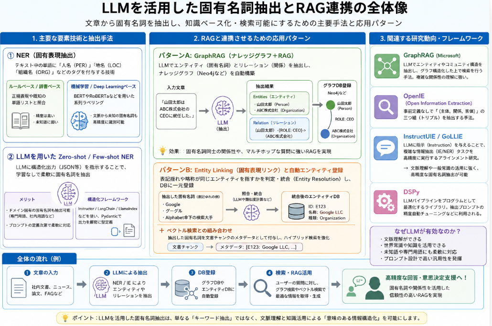

企業の中でLLM活用で一番普及したのは、情報検索を行う[エージェンティックRAG](https://yoshishinnze.hatenablog.com/entry/2026/06/16/043000)をはじめとする[RAG](https://yoshishinnze.hatenablog.com/entry/2026/06/03/043000)でしょう。
そんなRAGの典型的なユースケースである「社内ナレッジベースの活用」や「組織固有の情報をLLMに反映させる」という目的は、まさに「組織特有の固有名詞」をうまく扱うことに依存しています。

本日テーマ：
>固有名詞のような学習データにない情報をRAGで使えるようにするにはどうすべきか

## 従来技術
まず公開されている従来技術について説明していきます。

### 1. RAGと固有表現（NER）の関係

__NERで組織名・固有名詞を抽出し、メタデータとして利用する__

RAGの検索部分では、文書をベクトル化して類似度検索するだけでなく、**Named Entity Recognition（NER）** で抽出した組織名・人物名・プロジェクト名などを**メタデータ**として付与し、検索時にフィルタリングやブーストに使うのが一般的です。

- Progress社の記事では、RAGパイプラインの取り込み時にNERを自動実行し、**組織（organizations）** を含む16種類のエンティティを抽出してインデックスにメタデータとして格納することで、  
  - 組織名・プロジェクト名などで**正確なフィルタリング**  
  - 組織名がクエリに含まれる場合の**ブースト**  
  を可能にしていると説明されています[Progress](https://www.progress.com/blogs/what-is-named-entity-recognition-(ner)-in-rag)。

- GraphRAGのドキュメントでは、  
  - SpaCyなどの従来モデルに加え、**GliNER**やLLMを使った**任意のエンティティタイプの抽出**  
  - エンティティリンキング（Entity Linking）や曖昧性解消（Entity Disambiguation）で、組織名などの固有名詞を**一意のIDに紐づける**  
  ことで、組織固有の固有名詞を正確に扱う方法が紹介されています[GraphRAG](https://graphrag.com/reference/preparation/ner)。

> つまり、**「組織特有の固有名詞」をNERで抽出 → インデックスにメタデータとして格納 → 検索時にフィルタ・ブースト**という流れで、RAGの検索精度を高めることができます。

### 2. 固有表現を「検索の橋渡し」として使う研究

__Bridge Evidence論文：固有表現が複数ステップ検索を支える__

Zennの記事では、論文『Bridge Evidence: Static Retrieval Utility Does Not Predict Causal Utility in Multi-Step Agentic Search』を紹介し、**RAGエージェントが複数ステップで検索する際に、固有表現（組織名・人物名・作品名など）が「橋渡し」として重要**であることを示しています[Zenn](https://zenn.dev/sonder01/articles/rag-bridge-evidence-causal-utility)。

- ポイント：
  - 元の質問に似ていないし、答えも直接含んでいない文書でも、**「次の検索に必要な固有表現」**（例：組織名、プロジェクト名）が含まれていれば、それを経由して最終的な回答に到達できる。
  - こうした「橋渡し文書」は、従来の類似度指標（Recall@kなど）では評価されにくいが、**複数ステップの検索エージェントでは約3割程度がこのタイプ**であると報告されています。
  - 特に「識別力の高い固有表現」が含まれる文書は、そうでない文書に比べて**次の検索クエリにその表現が採用される確率が約4倍高い**という結果も示されています。

> この研究は、**「組織特有の固有名詞」をうまく扱うことで、複雑な質問（例：『A社のBプロジェクトで、C部長が決めた方針は？』）を、複数ステップの検索で解く能力が向上する**ことを示唆しています。

>__橋渡しとは__  
>「橋渡し」とは、**RAGエージェントが複数ステップで検索する際に、「直接の答えではないが、次の検索ステップに必要な固有表現（組織名・人物名・作品名など）を提供する文書」** を指します。
>もう少し噛み砕いて説明します。
>__1. 従来のRAGの考え方__  
>通常のRAGでは、
>- 「質問に似ている文書」
>- 「その文書だけで答えを出せる文書」
>を「良い文書」とみなして検索します。
>たとえば、
> 「A社のBプロジェクトで、C部長が決めた方針は？」
>という質問に対して、
>- 「A社のBプロジェクトの設計方針」という文書を引いてきて、その中にC部長の方針が書いてあれば、それで完結。
>というイメージです。
>__2. 「橋渡し文書」とは何か__  
>一方、「橋渡し文書（bridge evidence）」は、
>- **質問にあまり似ていない**
>- **答えそのものも書いていない**
>にもかかわらず、
>- **次の検索ステップに必要な「組織名」「人物名」「プロジェクト名」などの固有表現**が含まれている文書
>を指します。
>例：
>- 質問：「A社のBプロジェクトで、C部長が決めた方針は？」
>- 1回目の検索で見つかる文書：
>  - 「A社のBプロジェクトの概要」  
>    → C部長の方針は書いていないが、  
>      「BプロジェクトはD部とE部の共同プロジェクトで、C部長が統括している」という情報が含まれている。
>- この文書から、
>  - 「C部長」「D部」「E部」といった**固有表現**が得られる。
>- 2回目の検索では、
>  - 「C部長」「D部」「E部」などを含むクエリで検索し、ようやく「C部長の方針が書かれた文書」に到達する。
>このとき、1回目の文書は**答えそのものは含んでいない**が、  
>**次の検索に必要な固有表現を提供して「橋渡し」をしている**ので、「橋渡し文書」と呼ばれます。
>__3. なぜ「橋渡し」が重要か__
>Bridge Evidence論文の検証によると[Zenn](https://zenn.dev/sonder01/articles/rag-bridge-evidence-causal-utility)：
>- 因果的に有用な文書のうち、**約3割程度がこの「橋渡し文書」** に該当する。
>- しかし、従来の「質問との類似度」や「その文書だけで答えを出せるか」という評価指標では、こうした文書は**低スコアになりがちで、見落とされやすい**。
>つまり、
>- **固有表現（組織名・人物名・プロジェクト名など）を「検索の橋渡し」として積極的に評価・活用する**ことで、複雑な質問（Multi-hop QA）に対するRAGエージェントの性能を大きく改善できる、というのが「橋渡し」の考え方です。


### 3. 組織固有の固有名詞をRAGで扱うための実装・設計のポイント

__(1) 取り込み時にNERを実行し、メタデータを付与__

- 文書取り込み時に、組織名・プロジェクト名・部署名・製品名などの**組織固有の固有名詞**をNERで抽出し、  
  - ベクトル埋め込みとは別に、**メタデータフィールド**として保存  
  - 必要に応じて**カスタムエンティティタイプ**（例：`内部プロジェクト名`、`社内システム名`）を定義  
  することで、検索時に「この組織名を含む文書だけを対象にする」といった**正確なフィルタリング**が可能になります[Progress](https://www.progress.com/blogs/what-is-named-entity-recognition-(ner)-in-rag)。

__(2) クエリ側でもNERを使い、検索を最適化__

- ユーザーの質問からもNERで組織名などを抽出し、  
  - ベクトル検索クエリに加えて、**メタデータフィルタ**（例：`organization: "A社" AND project: "Bプロジェクト"`）を適用  
  - 必要に応じて、**クエリ拡張**（例：組織名の略称・正式名称の両方を検索対象に含める）  
  を行うことで、組織特有の固有名詞に特化した検索が可能になります。

__(3) エンティティリンキング・曖昧性解消__

- GraphRAGのドキュメントが示すように、**エンティティリンキング**（同じ組織名を一意のIDに紐づける）や**曖昧性解消**（同じ名称でも文脈で別組織を指す場合の区別）を組み合わせることで、  
  - 「うちの会社の『Aプロジェクト』」と「他社の『Aプロジェクト』」を混同しない  
  - 略称・旧称・正式名称を同一エンティティとして扱う  
  といった、組織特有の固有名詞の扱いを精密化できます[GraphRAG](https://graphrag.com/reference/preparation/ner)。

__(4) 複数ステップRAGエージェントでの「橋渡し」戦略__

- Bridge Evidence論文の知見を踏まえると、  
  - 1回の検索で完結させず、**複数ステップの検索エージェント**を設計  
  - 各ステップで「新しい固有表現（組織名・プロジェクト名など）を獲得したか」を評価し、**次の検索クエリに反映**  
  することで、組織特有の固有名詞を「検索の橋渡し」として活用できます[Zenn](https://zenn.dev/sonder01/articles/rag-bridge-evidence-causal-utility)。

### 4. 参考になりそうな記事・研究まとめ

- **RAGにおけるNERの役割**
  - Progress: [What Is Named Entity Recognition (NER) in RAG?](https://www.progress.com/blogs/what-is-named-entity-recognition-(ner)-in-rag)  
    → RAGパイプラインでNERを自動実行し、組織名などをメタデータとして検索に活用する方法を解説。
  - GraphRAG: [Named Entity Recognition](https://graphrag.com/reference/preparation/ner)  
    → GliNERやLLMを使った柔軟なエンティティ抽出、エンティティリンキング・曖昧性解消の説明。

- **固有表現を「橋渡し」として使うRAGエージェントの研究**
  - Zenn記事: [RAGの「関連度が高い文書」は本当に役立つ？検索エージェントで因果検証](https://zenn.dev/sonder01/articles/rag-bridge-evidence-causal-utility)  
    → Bridge Evidence論文の解説。固有表現（組織名など）が複数ステップ検索で重要な役割を果たすことを示す。

- **RAG全般と組織固有ナレッジの活用**
  - IBM: [RAG（検索拡張生成）とは](https://www.ibm.com/jp-ja/think/topics/retrieval-augmented-generation)  
    → RAGが「組織固有のデータ」や「最新の社内情報」をLLMに反映させる仕組みであることを説明。
  - JAPAN AI Lab: [RAGで社内ナレッジを活用する方法とは？](https://japan-ai.co.jp/media/7296)  
    → 社内文書・FAQ・マニュアルをRAGで検索し、組織固有の知識をLLMに反映する具体例。

## 固有名詞を認識させる方法

### 固有名詞を認識させるには？
前節の項2の事実から、固有名詞の概念が理解できるような文章が与えられればLLMは固有名詞を理解した解答を行うことが出来ます。
もう少し整理すると以下のように言えます。

LLMは、「定義や説明の文章」をプロンプトとして与えられれば、その概念を一時的に“理解”して扱うことができる、という性質があります。
近年のRAGやプロンプトエンジニアリングの応用例でも、「定義文書をRAGで検索 → LLMに渡す → LLMがその定義に基づいて回答する」というパターンは非常に一般的です。

ただし、いくつか注意点もあります。

__1. 「認識できる」の意味__

LLMは、定義文書をその場で読んで理解し、その内容に基づいて回答を生成することはできます。
しかし、その定義がモデルの内部パラメータとして“学習”されるわけではないので、次回の会話で同じ定義を自動的に覚えているとは限りません（RAGを使わない限り）。


つまり、「定義文書を与えれば、その場では認識して扱える」が、「永続的に知識として定着する」とは限らない、という理解が正確です。

__2. 定義の質・量・与え方による精度の違い__

定義が曖昧・不十分な場合、LLMは誤解やハルシネーションを起こしやすくなります。
定義が長すぎる場合、LLMのコンテキストウィンドウを圧迫し、重要な部分が切り捨てられることがあります。
定義の与え方（プロンプト設計） が悪いと、LLMが定義をうまく活用できません。

そのため、RAGでは、
- 定義文書を適切な長さのチャンクに分割
- 検索で必要な部分だけをLLMに渡す
- プロンプトで「この定義を根拠にして説明してください」と明示する
といった工夫が重要になります。

### 固有名詞を自動で抽出できないか

RAGシステムを実際に構築する場合、文章量が非常に多いため、使える知識にマニュアルで対応するには負荷が大きいです。
このためどこまで自動でできるかが重要になります。


自然言語処理（NLP）の分野において、テキストから人名・地名・組織名・製品名などの固有名詞を自動抽出し、データベース（ナレッジグラフやベクトルDB）へ反映させる取り組みは非常に活発に研究・実用化されています。

RAG（Retrieval-Augmented Generation）システムにこれを組み込むアプローチ、関連する標準手法、そして最新の研究動向について整理して解説します。

### 方法一覧

__1. 主要な要素技術と抽出手法__

文章から固有名詞を特定して抽出する処理は、NLPでは主に**NER（固有表現抽出）** や **NERD（固有表現抽出・曖昧さ回避・リンク）** という枠組みで扱われます。

__① NER（Named Entity Recognition: 固有表現抽出）__

テキスト中の単語に「人名（PER）」「地名（LOC）」「組織名（ORG）」などのタグを付与する基盤技術です。

* **ルールベース / 辞書ベース:** 正規表現や既知の単語リストと照合。精度は高いものの、未知語に弱い。
* **機械学習 / Deep Learningベース:** SpaCy、Transformers（BERTやRoBERTaなど）を用いた系列ラベル付け（Sequence Labeling）。文脈から未知の固有名詞も高精度に識別可能。

__② LLMを用いたZero-shot / Few-shot NER__

近年最も汎用性が高いアプローチです。LLMに対して構造化出力（JSON等）を指示することで、固有のモデル学習なしで柔軟に固有名詞やそのタイプを抽出できます。

* **メリット:** ドメイン固有の固有名詞（専門用語、社内用語等）も、プロンプトの定義次第で臨機応変に切り出せる。
* **構造化フレームワーク:** Instructor, LangChain, LlamaIndex などを利用して、LLMの入出力をPydanticスキーマで厳密に型定義する手法が主流です。

__2. RAGと連携させるための応用パターン__

単に「固有名詞を抜き出す」だけでなく、「DBに登録してRAGで検索可能にする」ためのシステム構成には、大きく分けて以下のパターンがあります。

__パターンA: GraphRAG（ナレッジグラフ＋RAG）__

Microsoftが提案した**GraphRAG**に代表されるように、LLMを用いてテキストから「エンティティ（固有名詞）」と「エンティティ間の関係（リレーション）」を同時に抽出し、ナレッジグラフ（Neo4jなど）を自動構築する手法です。

```
[入力文章] "山田太郎はABC株式会社のCEOに就任した。"
    ↓ (LLMによる抽出)
[Entities]  山田太郎 (Person), ABC株式会社 (Organization)
[Relation]  (山田太郎) -[ROLE: CEO]-> (ABC株式会社)
    ↓
[DB登録]   Neo4j などのグラフDBへ自動ノード・エッジ登録

```

* **効果:** ベクトル検索だけでは拾いきれない「固有名詞同士の複雑な関係性」や「マルチホップな質問（Aの関連会社のB製品は何か？など）」に強いRAGを構築できます。

__パターンB: Entity Linking（固有表現リンク）と自動エンティティ登録__

抽出した固有名詞が「すでにDBに存在する既存の固有名詞と同じものを指しているか（表記揺れや略称）」を判定・統合（Entity Resolution / Disambiguation）しながらDB登録する手法です。

* 例: 「Google」「グーグル」「Alphabet傘下の検索大手」が同一の概念であることを判定し、同一のID/ノードに割り当てる。
* **ベクトル検索との組み合わせ:** 抽出した固有名詞をメタデータとして文書チャンクに付与（Metadata Filtering）し、ハイブリッド検索を強化する。

__3. 関連する研究動向・フレームワーク__

| 分野・アプローチ | 概要・代表的な研究・ツール |
| --- | --- |
| **GraphRAG (Microsoft)** | LLMを用いてテキストからエンティティとコミュニティ構造を抽出し、グラフ構造化した上で検索を行う手法。 |
| **OpenIE (Open Information Extraction)** | 事前定義なしで「(主体, 関係, 客体)」の三つ組（トリプル）を抽出する手法。 |
| **InstructUIE / GoLLIE** | LLMに対し、指示（Instruction）を与えることで複雑な情報抽出（IE/NER）タスクを高精度に行わせるアラインメント研究。 |
| **DSPy** | LLMパイプラインをプログラムとして最適化するライブラリ。抽出プロンプトの精度自動チューニング等に利用される。 |



3つ目が一番精度が良いかもしれません。
普及例が一番多いようですし、GraphRAGやDSPyはあくまで統計の範囲から出れない手法でしょう。
固有名詞は文脈や、一般的に知っている言葉かを判定できることが重要だと思います。
この意味では知識ベースとして機能するLLMを用いるということが一番現実解かつ最適解かもしれません。

過去のGPT3.5や4であれば精度に難がありましたが、最近ならば問題なくなっているでしょう。

InstructUIE / GoLLIEというのはLLMを用いて文脈を理解しながら固有名詞を抽出する研究です。

はい、**InstructUIE**と**GoLLIE**はいずれも**研究論文として公開されている手法**です。

以下、それぞれの論文情報と概要を整理します。

>__InstructUIE__
>__論文情報__
>- **タイトル**:  
>  **InstructUIE: Multi-task Instruction Tuning for Unified Information Extraction**
>- **著者**:  
>  Xiao Wang, Weikang Zhou, Can Zu, Han Xia, Tianze Chen, Yuansen Zhang, Rui Zheng, Junjie Ye, Qi Zhang, Tao Gui, et al.
>- **公開年**: 2023年
>- **プレプリント**: arXiv:2304.08085  
>  → [arXiv:2304.08085](https://arxiv.org/abs/2304.08085)
>- **GitHub**:  
>  → [BeyonderXX/InstructUIE](https://github.com/BeyonderXX/InstructUIE)
>__概要__
>- **目的**:  
>  情報抽出（Named Entity Recognition, Relation Extraction, Event Extraction など）を**統一的なテキスト→テキスト形式**で扱い、**マルチタスクのInstruction Tuning**によって高性能化するフレームワーク。
>- **特徴**:
>  - **IE INSTRUCTIONS**という、32の多様なIEデータセットを統一フォーマットに変換したベンチマークを構築。
>  - Flan-T5などのモデルをInstruction Tuningし、**教師あり設定ではBERTと同等、ゼロショット設定では既存モデルを大きく上回る性能**を達成。
>- **位置づけ**:  
>  「LLMにInstruction Tuningを施して、情報抽出タスクを統一して扱う」という、**Universal Information Extraction（UIE）系の代表的な研究**の一つです。

>__GoLLIE__  
>__論文情報__  
>- **タイトル**:  
>  **GoLLIE: Annotation Guidelines improve Zero-Shot Information-Extraction**
>- **著者**:  
>  Oscar Sainz, Iker García-Ferrero, Rodrigo Agerri, Oier Lopez de Lacalle, German Rigau, Eneko Agirre
>- **公開年**: 2023年（プレプリント）、2024年 ICLR 採択
>- **プレプリント**: arXiv:2310.03668  
>  → [arXiv:2310.03668](https://arxiv.org/abs/2310.03668)
>- **ICLR 2024 論文ページ**:  
>  → [OpenReview: GoLLIE](https://openreview.net/forum?id=Y3wpuxd7u9)
>- **GitHub（LLM4IE関連リポジトリ内）**:  
>  → [Awesome-LLM4IE-Papers](https://github.com/quqxui/Awesome-LLM4IE-Papers) 内で紹介
>__概要__
>- **目的**:  
>  アノテーションガイドライン（ラベル定義やタスク仕様）を**コード形式（Pythonクラス）で表現**し、LLM（特にCode-LLaMA）を**ガイドラインに従うように学習**させることで、**ゼロショット情報抽出性能を向上**させる。
>- **特徴**:
>  - IEタスクのスキーマやガイドラインを**Pythonクラス＋docstring**として表現。
>  - Code-LLMの構造化生成能力を活かし、**見たことのないスキーマに対してもガイドラインに従って抽出**できる。
>  - ゼロショット設定で、既存のUIE系モデル（InstructUIEなど）と比較して高い性能を示す。
>- **位置づけ**:  
>  「**ガイドラインに忠実なLLMによる情報抽出**」という、**Generative Information Extraction（生成型IE）** の代表的研究の一つです。

## 総括

本日は組織固有の固有名詞を理解した上でナレッジを基にしたタスクを行うようにする上で必要となる固有名詞を与える方法と、固有名詞を抽出する方法について調査しました。

結局実現するためには、LLMに与えられる形の知識情報を作ることが重要ということになります。
但し、組織にある文章は莫大なので、自動化が欠かせません。
そんな中複数の手法が考えられますが、固有名詞を認識するという面ではLLMを用いることがベストだと思います。

というようなことをまとめた本日でした。

