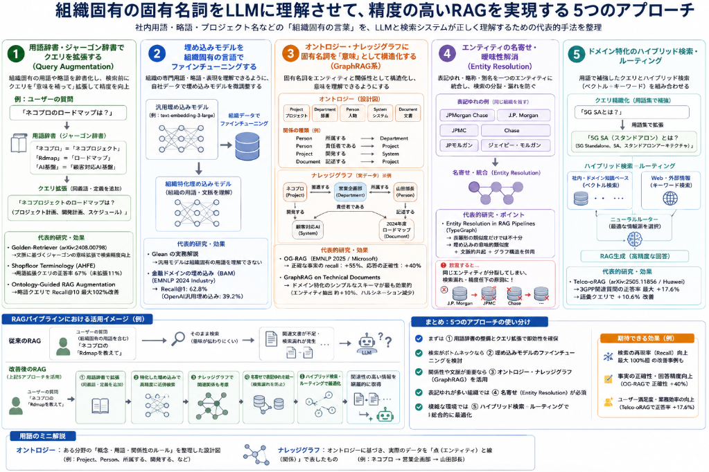

先日話をした[RAGで固有名詞の対応を出来るようにするという話](https://yoshishinnze.hatenablog.com/entry/2026/09/04/043000)について、続編を本日扱っていこうと思います。

前回扱ったことは文章を入力してから自動で固有名詞を抽出する方法についてでした。
今回は抽出した文章から固有名詞の意味を橋渡しするより良い表現にするにはどうべきかということについて調査・検討していきます。

## 従来技術
組織固有の固有名詞（社内用語・略語・プロジェクト名など）をLLMに理解させて、精度の高いRAGを実現する工夫について調べてみました。
いくつかの研究・解説文献が存在します。

見ていると **5つのアプローチ** に整理できます。以下、代表的な文献とともに解説します。

### 1. 用語辞書・ジャーゴン辞書でクエリを拡張する（Query Augmentation）

最も直接的なアプローチは、**組織固有の用語を辞書化し、検索前にクエリを「意味を補って」拡張する**方法です。

__代表的研究：Golden-Retriever__
- **論文**: Golden-Retriever: High-Fidelity Agentic Retrieval Augmented Generation for Industrial Knowledge Base（arXiv:2408.00798、Western Digital）
- **内容**:  
  検索の前に「リフレクションベースの質問拡張」ステップを導入し、ジャーゴン（専門用語）を特定し、文脈に基づいてその意味を明確化し、質問を拡張する手法です。<source-chip title="arXiv" url="https://arxiv.org/html/2408.00798" />
- 具体的には、入力質問中のすべてのジャーゴンや略語を抽出・列挙し、事前定義したリストと照合して文脈を判定し、ジャーゴン辞書に問い合わせて拡張された定義や説明を取得することで、曖昧さを解消して検索精度を大きく向上させています。<source-chip title="arXiv" url="https://arxiv.org/html/2408.00798" />

__関連研究：現場用語のアライメント__
- **論文**: Shopfloor Terminology for Retrieval-Augmented Generation (RAG)（AHFE）
- **内容**:  
  作業者が使う口語的・現場固有の用語が、技術文書の標準用語と異なることで検索失敗が起きる問題に対処し、キュレーション(※1)した同義語で拡張したクエリと通常のクエリを比較した研究です。<source-chip title="AHFE" url="https://openaccess.cms-conferences.org/publications/book/978-1-964867-75-5/article/978-1-964867-75-5_186" />
- 結果として、用語で拡張したクエリは平均67%の正答率を達成したのに対し、拡張しないクエリはわずか11%だったと報告しており、用語アライメントの重要性を定量的に示しています。<source-chip title="AHFE" url="https://openaccess.cms-conferences.org/publications/book/978-1-964867-75-5/article/978-1-964867-75-5_186" />

※1 キュレーション：
  情報を集めて、選別し、整理し、使いやすい形に整えることです。
  RAGや社内ナレッジの文脈では、単にデータを大量に集めるだけではなく、「どの情報を使うべきか」「どう整理すべきか」「どれを正しい情報として扱うか」を人間や仕組みで整備することを指します。

効果あることは分かってるのですが、自動でより良い文章にするという主眼なので。
但し、効果を数値で示してくれたことはありがたいです。

__関連研究：略語（頭字語）ギャップの解消__
- **リポジトリ/論文**: Ontology-Guided RAG Augmentation（"Closing the acronym gap"）
- **内容**:  
  コーパス規模の略語オントロジーを多段階の抽出・曖昧性解消で構築し、クエリ時（QTA）と取り込み時（ITE）の2箇所で検索を拡張する手法です。<source-chip title="GitHub" url="https://github.com/granludo/onthology-guided-RAG-augmentation" />
- 略語クエリでRecall@10が最大102%改善するという大きな効果が報告されています。<source-chip title="GitHub" url="https://github.com/granludo/onthology-guided-RAG-augmentation" />

### 2. 埋め込みモデルを組織固有の言語でファインチューニングする

汎用の埋め込みモデルは、組織固有の用語を理解できないため、**自社データで埋め込みモデルをファインチューニングする**アプローチです。

__実務解説：Glean のケース__
- **記事**: Fine-Tuning Embedding Models for Enterprise RAG: Lessons from Glean
- **内容**:  
  どの組織も独自の用語、略語、プロジェクト名、言語パターンを発展させており、汎用の埋め込みモデルは特別な学習なしにはそれらを理解できないという課題を指摘しています。<source-chip title="Jason Liu" url="https://jxnl.co/writing/2025/03/06/fine-tuning-embedding-models-for-enterprise-rag-lessons-from-glean/" />

__研究：金融ドメインの埋め込み（BAM embeddings）__
- **論文**: Greenback Bears and Fiscal Hawks: Finance is a Jungle and Text Embeddings Must Adapt（EMNLP 2024 Industry）
- **内容**:  
  1,430万件のクエリ-パッセージのペアでファインチューニングした金融特化の埋め込みBAMは、テスト集合でRecall@1が62.8%を達成し、OpenAIの最良の汎用埋め込みの39.2%を上回ったと報告しています。<source-chip title="ACL Anthology" url="https://aclanthology.org/2024.emnlp-industry.26.pdf" />

検索精度を向上させていい文章と引き合わせるという方法です。
LLMだけの底上げではないということでノミネートですが、検索がボトムネックの場合に取りえる方法です。

### 3. オントロジー・ナレッジグラフに固有名詞を「意味」として構造化する（[GraphRAG系](https://yoshishinnze.hatenablog.com/entry/2026/06/12/043000)）

固有名詞を単なる文字列ではなく、**エンティティ＋関係性としてナレッジグラフやオントロジー(※2)に構造化**することで、意味を理解させるアプローチです。

__研究：OG-RAG（オントロジーグラウンディング）__
- **論文**: OG-RAG: Ontology-Grounded Retrieval-Augmented Generation（EMNLP 2025 / Microsoft Research）
- **内容**:  
  ドメイン固有のオントロジーに検索プロセスをアンカーすることでLLMの応答を強化する手法で、ドキュメントをハイパーグラフとして表現し、クエリに対して最小限のハイパーエッジ集合を取得するものです。<source-chip title="ACL Anthology" url="https://aclanthology.org/2025.emnlp-main.1674/" />
- 評価では、正確な事実のrecallを55%、応答の正確性を40%向上させたと報告されています。<source-chip title="ACL Anthology" url="https://aclanthology.org/2025.emnlp-main.1674/" />

__研究：GraphRAGのスキーマ設計の影響__
- **論文**: GraphRAG on Technical Documents – Impact of Knowledge Graph Schema
- **内容**:  
  ドメインに関連したナレッジグラフのスキーマが、専門用語が豊富な技術レポートに対するMicrosoft GraphRAGの結果に与える影響を検証した研究です。<source-chip title="Dagstuhl" url="https://drops.dagstuhl.de/storage/08tgdk/tgdk-vol003/tgdk-vol003-issue002/html/TGDK.3.2.3/TGDK.3.2.3.html" />
- ドメイン特化のシンプルなスキーマが他の選択肢より約10%多くエンティティを抽出し、最も事実的に正確でハルシネーションの少ない回答を生成したと示しています。<source-chip title="Dagstuhl" url="https://drops.dagstuhl.de/storage/08tgdk/tgdk-vol003/tgdk-vol003-issue002/html/TGDK.3.2.3/TGDK.3.2.3.html" />

>※2 オントロジー：
>**オントロジー**とは、簡単に言うと、**ある分野で使う「概念・用語・関係性のルール」を整理した設計図**です。
>RAGやナレッジグラフの文脈では、「この固有名詞は何の種類なのか」「何と何がどう関係するのか」を、LLMや検索システムが扱いやすい形で定義するものです。
>__1. 直感的に言うと「社内用語の分類表＋関係ルール」__
>たとえば、社内RAGで次のような言葉を扱いたいとします。
>- ネコプロジェクト
>- 営業企画部
>- 山田部長
>- 顧客対応AI
>- 2024年度ロードマップ
>人間ならなんとなく、
>- 「ネコプロジェクト」はプロジェクト名
>- 「営業企画部」は部署名
>- 「山田部長」は人物
>- 「顧客対応AI」は製品・システム
>- 「2024年度ロードマップ」は文書
>と分かります。
>しかし、システムにはそれを明示してあげる必要があります。そこで、オントロジーでは例えばこう定義します。
```text
エンティティの種類:
- Project
- Department
- Person
- System
- Document

関係の種類:
- Project は Department によって推進される
- Person は Department に所属する
- Person は Project の責任者である
- Document は Project について記述する
- System は Project によって開発される
```
>これがオントロジーです。
>__2. ナレッジグラフとの違い__
>よく混同されるのが、**オントロジー**と**ナレッジグラフ**です。
>ざっくり言うと、
>| 用語 | 役割 |
>|---|---|
>| オントロジー | どんな種類のものがあり、どう関係できるかを決める「設計図」 |
>| ナレッジグラフ | 実際のデータを、点と線で表したもの |
>例えるなら、
>- **オントロジー**：データベースの設計書、ER図、分類ルール
>- **ナレッジグラフ**：その設計に従って入れた実データ
>です。


### 4. エンティティの名寄せ・曖昧性解消（Entity Resolution）

同じ組織・固有名詞が表記ゆれで複数に分裂すると検索が壊れるため、**それらを一つのエンティティに統合する**アプローチです。

__解説：Entity Resolution in RAG Pipelines__
- **記事**: Entity Resolution in RAG Pipelines（TypeGraph）
- **内容**:  
  「JPMorgan Chase」「J.P. Morgan」「JPMC」「Chase」など、明らかに同じ組織を指す複数の異なるノードがグラフ内に存在してしまうという「エンティティ断片化」の問題を扱っています。<source-chip title="TypeGraph" url="https://typegraph.ai/blog/entity-resolution-rag-knowledge-graph" />
- 対策として、表層形の類似度だけでなく、埋め込みベースの意味的類似度、文脈的共起、グラフの構造的特徴を組み合わせる必要があると述べています。<source-chip title="TypeGraph" url="https://typegraph.ai/blog/entity-resolution-rag-knowledge-graph" />

この事実は結構重要と感じます。
というのは呼び名の揺れがある場合に検索精度が低下することになる。
このため、事前に固有名詞を理解して統一する必要があるし、実際の検索時にも同一用語を検索時に統一された代表する用語に変換する必要があるということになります。

### 5. ドメイン特化のハイブリッド検索・ルーティング

組織固有の用語を含む質問に対し、**用語で補強したクエリとハイブリッド検索（ベクトル＋キーワード）を組み合わせる**アプローチです。

__研究：Telco-oRAG（通信ドメイン）__
- **論文**: Telco-oRAG: Optimizing Retrieval-augmented Generation for Telecom Queries（arXiv:2505.11856、Huawei）
- **内容**:  
  3GPPドメイン特化の検索とWeb検索を組み合わせたハイブリッド検索戦略に、用語集で補強したクエリ精緻化とニューラルルーターを組み込んだフレームワークです。<source-chip title="arXiv" url="https://arxiv.org/pdf/2505.11856" />
- 3GPP関連の質問の正答率を最大17.6%向上させ、語彙クエリで10.6%の改善を達成したと報告しています。<source-chip title="arXiv" url="https://arxiv.org/pdf/2505.11856" />

### まとめ：アプローチ別の整理

ここまで出てきた手段について整理します。




| アプローチ | 代表文献 | 特徴 |
|---|---|---|
| ① 用語辞書でクエリ拡張 | Golden-Retriever, Shopfloor Terminology | 検索前にジャーゴンの定義を注入。実装が比較的容易 |
| ② 埋め込みのファインチューニング | Glean, BAM embeddings | 自社言語を埋め込みモデルに学習。効果大だがデータ・コスト要 |
| ③ オントロジー/グラフ構造化 | OG-RAG, GraphRAG schema | 固有名詞を意味・関係として構造化。事実性・多段推論に強い |
| ④ エンティティ名寄せ | Entity Resolution (TypeGraph) | 表記ゆれを統合し検索の断片化を防ぐ |
| ⑤ ハイブリッド検索・ルーティング | Telco-oRAG | 用語補強＋ベクトル/キーワード検索の併用 |

### 選定のポイント

- **手軽に始めたい** → ①の用語辞書によるクエリ拡張（Golden-Retriever方式）。再インデックス不要で効果も高い。
- **検索精度を根本から上げたい** → ②埋め込みのファインチューニング。
- **固有名詞の「意味・関係」まで扱い、複雑な質問に答えたい** → ③オントロジー/GraphRAG。
- **表記ゆれが多い組織名を扱う** → ④エンティティ名寄せ。

実務では、**①（用語辞書）＋④（名寄せ）を土台に、必要に応じて②や③を追加する**のが現実的な組み合わせです。

## ベストペアの考察

手段は色々あるということは分かりました。
RAGはシステムでしょう。
ですから、先述の手法から相性の良い手法を組み合わせて精度を追求するとどうなるかについても考察してみます。
結論から言うと、最も実装がお手軽で汎用的に効果が出やすく、かつ他の手法とも独立して掛け合わせやすいペアは、

> **① 用語辞書・ジャーゴン辞書によるクエリ拡張**  
> ×  
> **④ エンティティの名寄せ・曖昧性解消**

だと思います。

実装をしっかり頑張って、**「複雑な関係性をたどる質問」まで含めて最高精度を狙う場合**は、

> **③ オントロジー・ナレッジグラフ**  
> ×  
> **④ エンティティの名寄せ・曖昧性解消**

が最有力です。

整理するとこんな感じでしょうか。

| 目的 | 最も有力なペア |
|---|---|
| まずRAG全体の検索精度を安定して上げたい | **① クエリ拡張 × ④ 名寄せ** |
| 組織内の複雑な関係性までたどりたい | **③ GraphRAG × ④ 名寄せ** |
| 大量データ・高頻度検索で検索基盤を根本強化したい | **② 埋め込みFT × ④ 名寄せ** |

### 1. ① クエリ拡張 × ④ 名寄せ

__なぜこのペアが強いか__

この2つは、RAGにおける**別々の失敗原因**を潰します。

__① クエリ拡張が解決する問題__

ユーザーがこう聞くとします。

> 「NPJの最新方針を教えて」

でも、社内文書にはこう書かれているかもしれません。

> 「ネコプロジェクトにおける2025年度の運用方針」

この場合、`NPJ` と `ネコプロジェクト` が同じだと分からないと、検索に失敗します。

そこで①では、クエリをこう補強します。

```text
元の質問:
NPJの最新方針を教えて

拡張後:
NPJ、正式名称: ネコプロジェクト。
ネコプロジェクトは顧客対応AI導入に関する社内プロジェクト。
このプロジェクトの最新方針を検索する。
```

つまり①は、**ユーザーの質問側を賢くする方法**です。

__④ 名寄せが解決する問題__

一方で、社内文書側には表記ゆれがあります。

```text
NPJ
Neko PJ
ネコPJ
ネコプロジェクト
顧客対応AI導入PJ
```

これらが全部バラバラに扱われると、検索結果が分散します。

そこで④では、これらを同じエンティティとして統一します。

```text
代表名: ネコプロジェクト
別名:
- NPJ
- Neko PJ
- ネコPJ
- 顧客対応AI導入PJ
```

つまり④は、**データ側・エンティティ側をきれいにする方法**です。

__この2つを組み合わせると何が起きるか__

①だけだと、クエリは改善されますが、文書側の表記ゆれが残ります。

④だけだと、文書側は整理されますが、ユーザーが略称や口語で聞いたときに取りこぼす可能性があります。

しかし、①と④を組み合わせると、

```text
ユーザー質問:
NPJの最新方針を教えて

① クエリ拡張:
NPJ = ネコプロジェクト と補足

④ 名寄せ:
NPJ / ネコPJ / Neko PJ / ネコプロジェクト を同一エンティティとして扱う

検索:
ネコプロジェクトに関する文書群を広く正確に取得

生成:
取得文書を根拠に回答
```

という流れになります。

このため、**ユーザー側の言い方の揺れ**と**文書側の表記ゆれ**の両方に対応できます。

__2. このペアが「独立して効く」と考えられる理由__

①と④は、似ているようで効いている場所が違います。

| 手法 | 効く場所 | 解決する問題 |
|---|---|---|
| ① クエリ拡張 | 検索前の質問処理 | ユーザーの質問が短い・略語・曖昧 |
| ④ 名寄せ | インデックス・エンティティ管理 | 文書内の表記ゆれ・別名・略称の分裂 |

つまり、

- ①は「**質問を正規化・補強する**」
- ④は「**知識ベース内の固有名詞を統一する**」

という役割です。

この2つは重複が少なく、**掛け合わせたときに効果が足し算以上になりやすい**です。

__3. 具体例__

__何もしない場合__

質問：

```text
LHの障害対応方針は？
```

文書には以下のように書かれている。

```text
Lighthouse CRM刷新プロジェクトにおける障害対応方針
```

汎用RAGは、`LH` と `Lighthouse CRM刷新プロジェクト` が同じだと分からない可能性があります。

__① クエリ拡張を入れる__

```text
LHとは、Lighthouse CRM刷新プロジェクトの略称。
営業部門のCRM基盤刷新を目的とした社内プロジェクト。
このプロジェクトの障害対応方針を検索する。
```

これで検索語が豊かになります。

__④ 名寄せを入れる__

```text
代表エンティティ:
Lighthouse CRM刷新プロジェクト

別名:
- LH
- Lighthouse
- CRM Lighthouse
- ライトハウスPJ
```

これで、文書側の表記ゆれも吸収できます。

__結果__

```text
LH
↓
Lighthouse CRM刷新プロジェクト
↓
関連文書を取得
↓
障害対応方針を回答
```

このように、**検索前の理解**と**検索対象側の整理**が両方効きます。

### 2.  ③ オントロジー構築 × ④ 名寄せ

もし質問が単純な用語検索ではなく、次のようなものなら、①×④だけでは足りない場合があります。

> 「ネコプロジェクトの意思決定に関わった部署と、その決定が影響したシステムを教えて」

この場合、必要なのは単なる検索ではなく、

```text
ネコプロジェクト
  ├─ 関係部署: 営業企画部
  ├─ 責任者: 山田部長
  ├─ 関連会議: 第5回推進会議
  ├─ 決定事項: 顧客対応AIを先行導入
  └─ 影響システム: CRM基盤
```

のような**関係性の探索**です。
ここで効くのが③のオントロジー・ナレッジグラフです。
GraphRAGでは④の名寄せが非常に重要です。
なぜなら、もしグラフ内で次のように分裂していたら、

```text
ネコプロジェクト
ネコPJ
NPJ
Neko Project
```

グラフの関係も分裂してしまいます。

```text
ネコプロジェクト --責任者--> 山田部長
NPJ --関連部署--> 営業企画部
Neko Project --関連システム--> CRM基盤
```

この状態では、関係を正しくたどれません。

そのため、③ GraphRAGを使うなら、④ 名寄せはほぼ必須です。

## 総括

組織固有の固有名詞を含むRAGでは、主な課題は **「LLMや検索器が、その言葉の意味・別名・関係性を知らないこと」** です。

### 主な課題

固有名詞に関わるRAGの課題を整理します。

| 課題 | 内容 |
|---|---|
| 1. 用語の意味不明 | `NPJ` や `LH` などの略語・社内用語をLLMが理解できない |
| 2. 表記ゆれ | `ネコプロジェクト`、`NPJ`、`Neko PJ` などが別物として扱われる |
| 3. 検索漏れ | ユーザーの呼び方と文書中の呼び方が違うと、関連文書を取れない |
| 4. 関係性を追えない | 人物・部署・プロジェクト・文書・意思決定のつながりを扱いにくい |
| 5. 汎用埋め込みの限界 | 一般的なEmbeddingモデルは社内固有語の意味を十分に表現できない |

### おすすめ対応策

__最初にやるべき対応__

> **① 用語辞書によるクエリ拡張 × ④ エンティティ名寄せ**

これが最も現実的で効果が出やすいです。

- 用語辞書で、略語や社内用語の意味を補う
- 名寄せで、同じ固有名詞の表記ゆれを統一する
- 検索時には代表名・別名・定義を使って検索する

例：

```text
NPJ → ネコプロジェクト
別名: NPJ, ネコPJ, Neko PJ
意味: 顧客対応AI導入に関する社内プロジェクト
```

__高度化する場合__

複雑な質問まで扱うなら、

> **③ オントロジー・GraphRAG × ④ エンティティ名寄せ**

が有効です。

- 固有名詞を「単語」ではなく「エンティティ」として扱う
- 部署・人物・プロジェクト・文書・意思決定の関係をグラフ化する
- ただし、名寄せが不十分だとグラフが分裂して精度が落ちる

__結論__

固有名詞対応RAGでまず重要なのは、

1. **固有名詞を抽出する**
2. **同じ意味の表記を名寄せする**
3. **代表名・別名・定義を用語辞書化する**
4. **検索時にその定義でクエリを拡張する**

ことです。

最短で効果を出すなら、

> **用語辞書によるクエリ拡張 × エンティティ名寄せ**

が第一候補です。  
その上で、関係性まで扱いたい場合に **GraphRAG** を追加するのがよいと考えます。

