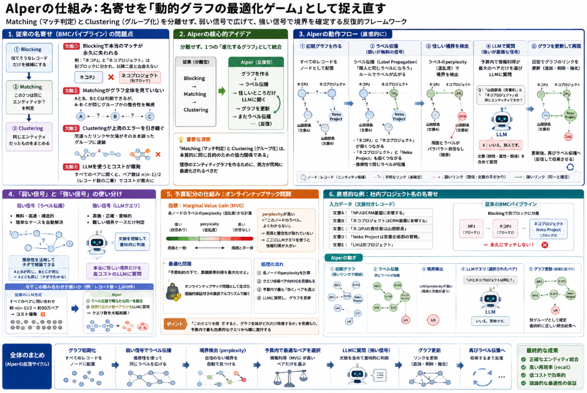

名寄せは英語でEitity Resolutionと呼ばれ、NLP界隈では根強い人気を持つテーマです。
そんな名寄せは知財特許のシステムなどで実装されている手法はあるのですが、精度的には今一つということが現状でした。(但し、LLMがここまで発達した現時点では解決可能な問題になってる可能性があります)

そんな名寄せに関する論文について紹介します。
論文は査読もなく、香港の大学生が出したプレプリントなので割引になりそうですが、現場のシステムを作る上ではアイデアとして使えるかもと感じました。

## 論文概要

### 論文プロフィール

**タイトル**: Adaptive Graph Refinement and Label Propagation with LLMs for Cost-Effective Entity Resolution

**著者**: 
- Hongtao Wang（Hong Kong Baptist University）
- Renchi Yang（Hong Kong Baptist University）
- Haoran Zheng
- Xiangyu Ke

**公開形態**: arXiv Preprint（Technical Report）

**公開日**: 2026年5月25日

**報告した国際学会**: プレプリントのみ

### どんな論文か

__解決しようとしている問題__

従来のEntity Resolution（名寄せ）は、以下の3段階パイプライン（BMC: Blocking → Matching → Clustering）が主流でした。

1. **Blocking**: 似たレコードだけを候補に絞る
2. **Matching**: ペアが同一エンティティか判定
3. **Clustering**: 同一エンティティをグループ化

しかし、この分離型パイプラインには重大な問題があります。

- **Blockingの失敗で本当のマッチが永久に失われる**（recall ceiling）
- **Matchingがグラフ全体の構造を無視して「盲目的」に判定**
- **Clusteringが、上流のエラー（欠落エッジ・ノイズリンク）を引き継ぐ**
- **LLMを使う場合も、すべてのペアに問い合わせるとコストが膨大**

__提案手法：Alper__

この論文では **Alper（Adaptive Label Propagation for Entity Resolution）** というフレームワークを提案しています。

**核心的なアイデア**は：

```text
「名寄せは、進化するグラフ上の動的最適化問題として扱う」
```

つまり、blocking → matching → clustering を分離せず、**グラフ構造とラベルを反復的に同時に精緻化**します。

具体的には：

| 要素 | 内容 |
|---|---|
| **弱いが無料の信号** | グラフの構造的推移性（transitivity）によるラベル伝播 |
| **強いが高価な信号** | LLMによるペアワイズクエリ |
| **統合方法** | 確率的ラベル伝播 + オンラインナップサック問題として予算配分を最適化 |
| **LLMの役割** | 単なる判定器ではなく、トップ候補から最適マッチを選ぶ「推論器」として機能 |

__重要な技術的貢献__

1. **動的グラフ精緻化**: 静的なblockingではなく、グラフを反復的に更新して欠落リンクを回復

2. **適応的信号選択**: 
   - ラベルのperplexityから **marginal value gain (MVG)** を計算
   - 情報利得が最大になるクエリを貪欲に選択
   - 理論的保証（provable theoretical guarantees）付きの貪欲アルゴリズム

3. **コスト効率**: 
   - 「簡単なケース」は推移性で解決
   - 「難しいケース」だけLLMに問い合わせ
   - 予算制約の下で累積限界利得を最大化

__実験結果__

8つの実世界ベンチマークデータセットで検証し、

- **BatchER**
- **LLM-CER**

などの最先端手法を上回る性能を示しました。特に、エンティティ分散が高い複雑なデータセットで優位性が顕著です。

### 社内RAGとの関連性

この論文は、私たちの議論している「社内固有名詞の自動名寄せ」に直接活かせる知見を持っています。

| 論文の知見 | 社内RAGへの応用 |
|---|---|
| 静的blockingのrecall ceiling問題 | 社内略称・別名を辞書だけでマッチさせる限界 |
| 推移性を使った「簡単ケース」の自動解決 | 「NPJ→ネコプロジェクト→ネコPJ」のような連鎖的統合 |
| LLMクエリの予算最適化 | APIコストを抑えつつ名寄せ精度を最大化 |
| グラフ構造の動的精緻化 | 新文書が追加されてもKGを更新しながら名寄せ |

## 提案手法

Alperの仕組みを、**名寄せを"動的グラフの最適化ゲーム"として捉え直したフレームワーク**として解説します。

### 1. 従来の名寄せが抱えていた問題

今までの名寄せは、だいたいこんな3段階で行われていました。

```
① Blocking（候補絞り込み）
    「似てそうなレコードだけを候補にする」
           ↓
② Matching（ペア判定）
    「この2つは同じエンティティか？」を判定
           ↓
③ Clustering（グループ化）
    「同じエンティティだったものをまとめる」
```

__この方法の欠陥__

__欠陥①：Blockingで「本当のマッチ」が永久に失われる__

Blockingは「似たものだけを残す」フィルタですが、**一度除外されたレコードは二度と後続ステージに現れません**。

```
例：
「ネコプロジェクト」と「ネコ PJ」は文字列が少し違うので
Blockingで別ブロックに分かれてしまう
→ その後どんなに高性能なLLMを使っても、
   この2つが同じものだと気づけない！
```

これが **「recall ceiling（再現率の天井）」** です。

__欠陥②：Matchingが「グラフ全体」を見ていない__

Matchingは1ペアずつ独立に判定します。つまり、

```
「AとBは同じ？」
「BとCは同じ？」
```

は判定できるが、

```
「A-B-Cが全部同じグループか？」
```

という**全体の整合性**を無視します。

__欠陥③：Clusteringが「上流のエラー」を引き継ぐ__

Matchingで間違ったリンクや欠落したリンクがあると、Clusteringはそのまま誤ったグループを作ります。**エラーが連鎖的に伝播**します。

__欠陥④：LLMを使うとコストが爆発__

すべてのペアにLLMで「同じ？」と聞くと、ペア数がレコード数の二乗に増えるため、コストが膨大になります。

### 2. Alperの核心的アイデア

Alperはこの3段階を**分離せず、1つの「進化するグラフ」として統合**します。

```
従来：Blocking → Matching → Clustering（分離型）
Alper：グラフを作り → ラベルを伝播させ → 怪しいところだけLLMに聞く
        → グラフを更新 → またラベル伝播 → …（反復型）
```

__重要な洞察__

> **「Matching（マッチ判定）とClustering（グループ化）は、本質的に同じ目的のための協力関係である」**

理想のエンティティグラフを作るために、両方が同時に最適化されるべきだ、という考え方です。

### 3. Alperの動作フロー（直感的に）

__ステップ①：初期グラフを作る__

すべてのレコードをノードとして配置します。

```
[ネコPJ] ---?--- [ネコプロジェクト] ---?--- [Neko Project]
    |                |                      |
    ?                ?                      ?
[山田部長]        [山田部長]             [山田部長]
```

`?` は「まだ不明なリンク」です。

__ステップ②：「弱いが無料の信号」でラベル伝播__

**ラベル伝播（Label Propagation）** を使います。

> 「隣人と同じラベルになろう」というルールで、グラフ上をラベルが広がっていく

例えば：
- 「ネコPJ」と「ネコプロジェクト」が少し似ていて弱いリンクがある
- 「ネコプロジェクト」と「Neko Project」も弱いリンクがある
- ラベル伝播で「ネコPJ → ネコプロジェクト → Neko Project」に同じラベルが伝わる

これは**推移性（transitivity）** を使った「タダでできる推論」です。

```
AとBが同じ、BとCが同じ → AとCも同じ（タダでわかる）
```

__ステップ③：「怪しい境界」を検出__

ラベル伝播後、**「このノードのラベル、本当に合ってる？」** という怪しい場所を見つけます。

判定基準は **「ラベルのperplexity（混乱度）」**：
- 周囲のノードとラベルが一致していれば「自信あり」
- 周囲とラベルがバラバラなら「自信なし（境界）」

__ステップ④：「強いが高価な信号」（LLM）を使う__

予算（クエリ回数の上限）がある中で、**情報利得が最大になるペアだけ**を選んでLLMに問い合わせます。

```
LLMへの問い合わせ例：
「ネコPJ（文脈：CRM基盤に影響）と
 Neko Project（文脈：CRM基盤に影響）は
 同じエンティティですか？」
```

__ステップ⑤：グラフを更新して再開__

LLMの回答でグラフのリンクを更新（追加・削除・強化）し、**ステップ②に戻る**。
これを繰り返すことで、グラフが徐々に「正しい形」に近づいていきます。

### 4. 「弱い信号」と「強い信号」の使い分け

| 信号 | 特徴 | 使い道 |
|---|---|---|
| **弱い信号**（ラベル伝播） | 無料・高速・構造的 | 「簡単なケース」を自動解決 |
| **強い信号**（LLMクエリ） | 高価・正確・意味的 | 「難しい境界ケース」だけ判定 |

__なぜこの組み合わせが強いか__

```
例：1000件のレコードがあるとする

従来のLLM方式：
  すべてのペアに問い合わせ → 約50万ペア → LLMコスト爆発

Alper：
  ① ラベル伝播で「明らかに同じグループ」を自動統合
     → 残りは境界付近の少数ペアのみ
  ② LLMは「本当に怪しいペア」だけに集中
     → クエリ数を大幅削減
```

### 5. 予算配分の仕組み：オンラインナップサック問題

AlperはLLMクエリの予算を **「どのペアに使うと最も効果的か」** を数学的に最適化します。

__指標：Marginal Value Gain (MVG)__

各ノードの **ラベルのperplexity（混乱度）** から計算します。

```
perplexityが高い = 「このノードのラベル、よくわからない」
→ 周囲と整合性が取れていない
→ ここにLLMクエリを使うと情報利得が大きい
```

__最適化問題__

> **「予算制約の下で、累積限界利得を最大化せよ」**

これを **オンラインナップサック問題（Online Knapsack Problem）** として定式化し、**理論的保証付きの貪欲アルゴリズム**で解きます。

つまり：
- 「このクエリを投下すると、グラフ全体がどれだけ改善するか」を見積もる
- 予算内で最も「効く」クエリから順に実行

### 6. 直感的な例で見るAlperの動き

__社内プロジェクト名の名寄せを想像してください__

```
文書A：「NPJはCRM基盤に影響する」
文書B：「ネコプロジェクトはCRM基盤に影響する」
文書C：「ネコPJの責任者は山田部長」
文書D：「Neko Projectは営業企画部の管轄」
文書E：「LHは別プロジェクト」
```

__従来のBMCパイプライン__

```
Blocking：「NPJ」と「ネコPJ」は文字列が違うので別ブロック
→ 永久にマッチしない！
```

__Alperの場合__

```
初期グラフ：
[NPJ] [ネコプロジェクト] [ネコPJ] [Neko Project] [LH]

① 文脈埋め込みで弱いリンクを作成
   [NPJ]--弱--[ネコプロジェクト]--弱--[ネコPJ]--弱--[Neko Project]

② ラベル伝播
   → NPJ, ネコプロジェクト, ネコPJ, Neko Project に同じラベルが広がる

③ 怪しい境界を検出
   → [LH]は周囲と文脈が違う（CRM基盤に関係ない）
   → [LH]のperplexityが高い

④ LLMクエリ（予算内で効果的なものを選択）
   「LHとネコプロジェクトは同じ？」
   → LLM：「いいえ、LHはLighthouse CRM刷新の略で別物」

⑤ グラフ更新
   → [LH]は別グループとして確定
   → [NPJ, ネコプロジェクト, ネコPJ, Neko Project]は統合
```

### 7. なぜAlperが有効か（まとめ）

| 従来の問題 | Alperの解決策 |
|---|---|
| Blockingでマッチが永久消失 | **動的グラフ更新**でリンクを回復 |
| MatchingとClusteringが分離 | **統合的最適化**で相互に改善 |
| LLMコストが膨大 | **予算制約付き最適化**で効率的に使用 |
| エラーが連鎖伝播 | **反復的精緻化**で段階的に修正 |
| グラフ全体を無視 | **ラベル伝播**で構造情報を活用 |

### 一言でまとめると

> **Alperは「タダでできる推論（ラベル伝播）で大部分を解決し、高価なLLMは「本当に必要な怪しいケース」だけに集中させる。しかも、どこにLLMを使うかを数学的に最適化する」**

これが、コストを抑えつつ名寄せ精度を最大化するAlperの本質です。



## 総括
論文読んだ所感をまとめます。

### 長所

__1. Blockingの「recall ceiling」を打破できる__

従来の静的Blockingでは、別ブロックに分かれたレコードは永久にマッチしませんでした。Alperは動的にグラフを更新するため、**推移性を通じて間接的にリンクを回復**できます。

```
例：
NPJ → ネコプロジェクト（直接リンクなし）
ネコプロジェクト → ネコPJ（弱いリンクあり）
→ ラベル伝播で NPJ と ネコPJ が同じグループに！
```

__2. LLMコストを大幅に削減できる__

すべてのペアにLLMを使うのではなく、**「情報利得が最大になる怪しいケース」だけ**に集中します。予算制約付き最適化（Online Knapsack Problem）により、限られたクエリ数で最大の効果を得られます。

__3. MatchingとClusteringを統合的に最適化__

分離型パイプラインでは、MatchingのエラーがClusteringに連鎍伝播します。Alperは**両者を協調的に最適化**するため、エラーの連鎖を抑制できます。

__4. 理論的保証がある__

貪欲アルゴリズムによる信号選択には**provable theoretical guarantees（証明可能な理論的保証）** があります。つまり、「この方法で選んだクエリは、予算内で最適に近い」という数学的な根拠があります。

__5. dirty ER（重複データ内の名寄せ）に特に強い__

単一の汚いデータセット内での名寄せ（deduplication）は、従来手法より難易度が高い問題設定ですが、Alperは主張上はこの **「最も難しい設定」で優位性を示しています**。


### 欠点・限界

__1. 初期グラフの品質に依存する__

Alperは「弱いリンク」からスタートしますが、**初期の埋め込みや類似度計算が悪いと、ラベル伝播も誤った方向に進みます**。初期グラフ構築の品質が結果に大きく影響します。

__2. 反復処理の計算コスト__

ラベル伝播とグラフ更新を繰り返すため、**大規模データセットでは計算量が増加**します。論文では8つのベンチマークで検証されていますが、数百万件規模のデータでのスケーラビリティは未明確です。

__3. LLMの「強い信号」が依然として必要__

予算を最適化しても、**「難しい境界ケース」にはLLMが不可欠**です。LLMの品質（モデルの性能）がそのまま名寄せ精度に影響します。


__長所・欠点のまとめ表__

| 観点 | 長所 | 欠点 |
|---|---|---|
| **精度** | Blockingのrecall ceilingを打破 | 初期グラフ品質に依存 |
| **コスト** | LLMクエリを予算内で最適化 | LLM自体は依然高価 |
| **理論** | 数学的保証あり | 実装の複雑さが増す |
| **適用範囲** | dirty ERに特に強い | マルチソース統合は未対応 |
| **スケーラビリティ** | タダの推論で大部分を処理 | 反復処理の計算コスト |
| **信頼性** | 8データセットで検証済み | arXiv Preprint（未査読） |

文字通りのフレームワークの一つとして面白いアイデアだったと思いました。
但し、記載の通り用いるモデルの精度に引っ張られ、反復計算×LLMの計算が必要になるのでコストは莫大です。
反復計算も差分を調整する段階になった場合、どこでストップするかも課題になりそうと感じました。


