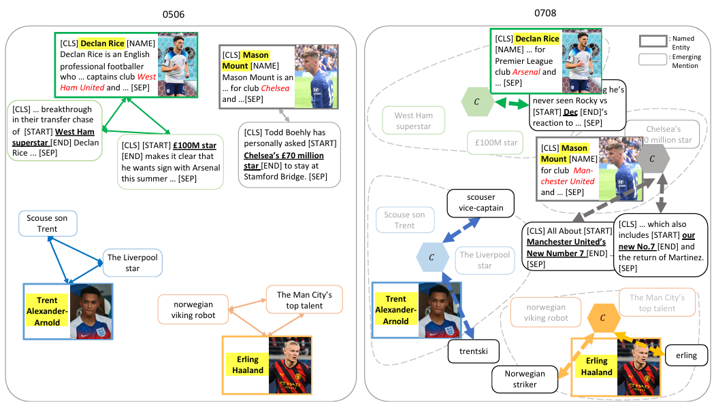

本日は[昨日のRAGの取り組み](https://yoshishinnze.hatenablog.com/entry/2026/09/19/043000)に引き続きで、名寄せの問題解決に関するものです。

RAGを扱っていると固有名詞の名称のブレが生じます。
特に時間によるシフトが大きな問題となり、固有名詞のブレがRAGの精度を悪化させるということはよく知られた事実です。
本日はそんな固有名詞の名称のブレに対する解決策を提示する論文について取り扱っていきます。

本日テーマ：
>DynamicER: Resolving Emerging Mentions to Dynamic Entities for RAGについて理解、PoCしてみる

## 論文概要
この論文は、**時間とともに新しい呼び方が生まれ、エンティティ自身も変化していく中で、RAGが正しく文書を検索できるようにする**という問題に取り組んだ研究です。

### 論文の基本情報

| 項目 | 内容 |
|---|---|
| **タイトル** | DynamicER: Resolving Emerging Mentions to Dynamic Entities for RAG |
| **著者** | Jinyoung Kim, Dayoon Ko, Gunhee Kim |
| **所属** | **Seoul National University（ソウル大学校）** |
| **会議** | **EMNLP 2024**（自然言語処理のトップ国際会議） |
| **開催地** | Miami, Florida, USA |
| **ページ** | 13752–13770 |
| **コード** | https://github.com/jiny1623/DynamicER |
| 論文URL | https://arxiv.org/pdf/2410.11494 |

### 解決しようとした問題

__現実の言語は「動的」である__

固有名詞の呼び方は、時間とともに変わります。

```
【Elon Muskの例】
・初期：「PayPal co-founder」
・中期：「Tesla CEO」「Hyperloop visionary」
・近期：「Twitter owner」「tech billionaire」
・スラング：「real-life Iron Man」「Mars man」
```

```
【大谷翔平の例】
・LA Angels時代：「Angels' two-way player」
・LA Dodgers移籍後：「The Dodgers' number 17」
```

同じエンティティでも、**時間が経つと新しい呼び方が生まれ、エンティティ自身の属性も変化**します。

__RAGにおける問題__

こうした「新しい呼び方（emerging mentions）」があると：

1. **Retrieverが正しい文書を見つけられない**
   - 「The Dodgers' number 17」で検索しても、大谷翔平に関する文書が引っかからない
2. **Generator（LLM）が幻覚（hallucination）を起こす**
   - 検索結果が貧弱だと、LLMが間違った情報を生成する

### この論文の核心的アイデア

> **「新しい言及（emerging mentions）を、時間的に変化するエンティティ（dynamic entities）に解決する」**

__2つの新しいタスクを定義__

| タスク | 内容 |
|---|---|
| **① Dynamic Entity Mention Resolution** | 時間ステップごとに現れる新しい呼び方を、正しいエンティティにリンクする |
| **② Entity-centric Knowledge-intensive QA** | 質問文中のエンティティ名を「時間に応じた新しい呼び方」に置き換えて、RAGの性能を評価する |

### 提案手法：Temporal Segmented Clustering with Continual Adaptation

__なぜ「時間を区切る」必要があるか__

従来の手法では、**すべての時間のメンションを一緒に処理**していました。しかしこれには問題があります。

```
【問題例】
時間T1: 「Twitter owner」→ Elon Musk
時間T2: 「Twitter owner」→ 別の人物（買収後の新オーナー）

→ 同じ表現でも、時間が違えば指すエンティティが変わる！
```

>__メンション__  
>メンションとは、テキスト中に出現する「あるエンティティを指す具体的な呼び方」です。
>__1文で言うと__  
> 同じエンティティでも、テキスト中では**さまざまな呼び方**が使われる。それぞれの呼び方が1つのメンション。
>__具体例__
>| エンティティ（実際の対象） | メンション（テキスト中の呼び方） |
>|---|---|
>| **Project Neko** | 「Project Neko」「猫PJ」「ネコプロ」「PNJ」「新規AI開発プロジェクト」 |
>| **大谷翔平** | 「Shohei Ohtani」「The Dodgers' number 17」「あの二刀流」 |
>__論文での役割__  
>DynamicERでは、**過去に同じエンティティにリンクされたメンションのベクトルを平均して「動的エンティティ表現」** を作ります。これにより、新しい呼び方（例：「PNJ」）も過去のメンションとの類似度で正しいエンティティに結びつけられます。

__手法の概要__

```
【時間をセグメントに区切る】
T1（2020年）: [メンション集合①] → クラスタリング → エンティティ表現①
T2（2021年）: [メンション集合②] → クラスタリング → エンティティ表現②
T3（2022年）: [メンション集合③] → クラスタリング → エンティティ表現③
           ↓
    「継続的適応（Continual Adaptation）」で
    エンティティクラスタ表現を時間とともに更新
```

__重要なポイント__

1. **時間ステップごとに独立してクラスタリング**
   - 各時間セグメント内のメンションとエンティティをクラスタ化
   - その時間帯の文脈を反映

2. **継続的適応でエンティティ表現を更新**
   - 新しい時間セグメントの情報を使って、エンティティのクラスタ表現を更新
   - エンティティの「進化」を追跡

3. **新しいメンションの検出**
   - 過去の時間ステップでは認識されていなかったメンションを特定
   - これらを正しいエンティティにリンク

### DynamicERベンチマーク

__既存ベンチマークとの比較__

| ベンチマーク | ソース | 時間的変化 | メンションの多様性 | タスク |
|---|---|---|---|---|
| MedMentions | PubMed | ✗ | ✓ | Entity Linking |
| Zero-shot EL | Wikias | ✗ | ✓ | Entity Linking |
| Reddit EL | Social media | ✗ | ✓ | Entity Linking |
| TempEL | Wikipedia | ✓ | ✗ | Continuous EL |
| **DynamicER** | **Social media** | **✓** | **✓** | **Dynamic ER + QA** |

__DynamicERの特徴__

- **ドメイン**: スポーツ（ソーシャルメディア文書）
- **サイズ**: 70Kメンション（20K文書）
- **時間構造**: 複数の時間セグメントに分割
- **アノテーション**: 各メンションをKB上のエンティティにリンク
- **新しいメンション**: 初期時間ステップでは未出現の呼び方を含む

### 実験結果の要点

__発見①：既存のEntity Linkingモデルは新しい表現に弱い__

従来のELモデルは、**訓練時に見たことのない新しい呼び方**に対して性能が大幅に低下します。

__発見②：提案手法が既存ベースラインを上回る__

Temporal Segmented Clustering with Continual Adaptationは、既存のEL手法より高い性能を示しました。

__発見③：名寄せがRAGのQA性能を向上させる__

```
【実験の流れ】
1. 質問文のエンティティ名を「時間に応じた新しい呼び方」に置き換え
   例: 「大谷翔平の現在のチームは？」
   → 「The Dodgers' number 17の現在のチームは？」
   
2. 通常のRAGで回答 → 検索失敗 → 幻覚

3. DynamicERでメンション解決後にRAG → 正しい文書検索 → 正答
```

**新しい呼び方を解決することで、Retrieverが正しい文書を見つけやすくなり、QA精度が向上**しました。

### この論文の意義（社内RAGとの関連）

この論文は、私たちの議論している「社内固有名詞の名寄せ」に対して、**「時間的変化」という重要な次元**を加えてくれます。

| 社内RAGでの例 | DynamicERの教訓 |
|---|---|
| 新プロジェクトの略称が生まれる（NPJ → ネコPJ） | 新しいメンションは時間とともに出現する |
| プロジェクト名が変更される（Lighthouse → LH） | エンティティ属性も変化する |
| 古い文書と新しい文書で別名が混在 | 時間セグメントごとに処理すべき |
| 新しい呼び方で検索が失敗する | 名寄せがRAGの検索精度に直結 |

## 提案手法

この論文の提案手法 **TempCCA**（Temporal Segmented Clustering with Continual Adaptation）の核心は、**「エンティティの表現を"固定された辞書"ではなく、"時間とともに進化するクラスタ"として扱う」** ことです。

以下、**「新しいメンションが来たらどうやって正しいエンティティに結びつけるか」** を中心に解説します。

### 手法の全体像：TempCCA

```
【時間軸に沿った処理の流れ】

T1（古い期間）          T2（中間期間）           T3（最新期間）
┌──────────┐           ┌──────────┐           ┌──────────┐
│文書群 D1  │           │文書群 D2  │           │文書群 D3  │
│・Mason   │           │・Declan  │           │・Declan  │
│  Mount   │           │  Rice    │           │  Rice    │
│・Declan  │           │  (Arsenal│           │  (Arsenal│
│  Rice    │           │  移籍後) │           │  移籍後) │
│  (West   │           │・"Ricey" │           │・"Number │
│  Ham)    │           │  (新ニック│           │  41"     │
│          │           │  ネーム) │           │  (新背番 │
│          │           │          │           │  号表記) │
└────┬─────┘           └────┬─────┘           └────┬─────┘
     ↓                      ↓                      ↓
┌──────────┐           ┌──────────┐           ┌──────────┐
│Step 1:   │           │Step 1:   │           │Step 1:   │
│クラスタリ │           │クラスタリ │           │クラスタリ │
│ング       │           │ング       │           │ング       │
└────┬─────┘           └────┬─────┘           └────┬─────┘
     ↓                      ↓                      ↓
┌──────────┐           ┌──────────┐           ┌──────────┐
│Step 2:   │ ────────→ │Step 2:   │ ────────→ │Step 2:   │
│エンティテ│           │エンティテ│           │エンティテ│
│ィ表現の   │           │ィ表現の   │           │ィ表現の   │
│更新       │           │更新       │           │更新       │
└──────────┘           └──────────┘           └──────────┘
```

論文ではこんなイラストで表現されていました。
イラストではちょっと伝わりづらいかもしれませんが、要は、固有名詞の移り変わりを、エンティティと紐づけられた呼び方（=メンション）のベクトルの平均で表現し、新しい呼び方とのベクトル類似度で結びつけていくということになります。



### 核心的メカニズム：3つの構成要素

__① デュアルエンコーダー（Dual-Encoder）__

メンションとエンティティを**別々にベクトル化**します。

```
【エンコーダーの構成】

┌─────────────────┐     ┌─────────────────┐
│  Mention Encoder │     │  Entity Encoder  │
│    (メンション)  │     │    (エンティティ) │
│                 │     │                 │
│  "The Dodgers'  │     │  Q2747238:        │
│   number 17"   │  →  │  Shohei Ohtani    │
│                 │     │  (Wikipedia埋め込 │
│  ・文脈を含めて │     │   み)             │
│    ベクトル化  │     │  ・名前+説明文を  │
│                 │     │    ベクトル化    │
└────────┬────────┘     └────────┬────────┘
         ↓                       ↓
      u(m) ∈ R^d            Enc_E(e) ∈ R^d
```

__② 2種類のAffinity（親和性）関数__

「このメンションはこのエンティティか？」を判定するために、**2つの類似度**を使います。

| Affinity | 計算対象 | 意味 |
|---|---|---|
| **φ(e, mᵢ)** | エンティティクラスタ e と メンション mᵢ | 「このエンティティらしさ」 |
| **ψ(mᵢ, mⱼ)** | メンション mᵢ と メンション mⱼ | 「このメンションと似ている既知メンション」 |

```
【φ(e, mᵢ) のイメージ】

「The Dodgers' number 17」 と 「大谷翔平（エンティティ）」の類似度
→ 直接の文字列類似度は低い（問題！）
→ しかし、エンティティ表現が進化していれば、ベクトル空間上で近づく
```

```
【ψ(mᵢ, mⱼ) のイメージ】

「The Dodgers' number 17」 と 「Ohtani」 の類似度
「The Dodgers' number 17」 と 「Shohei」 の類似度
「The Dodgers' number 17」 と 「The $700M Man」 の類似度
→ 過去に解決済みのメンションと新しいメンションを比較
→ 「似たような文脈で使われている」→ 同じエンティティの可能性
```

__③ 継続的適応（Continual Adaptation）__

これが本手法の**最大の特の特徴**です。エンティティの表現を**固定せず、時間とともに更新**します。
更新式は強化学習でおなじみのベルマン方程式にも通じます。

__更新式__

$$\mathbf{u}_C(e) = \alpha \cdot \mathbf{Enc}_E(e) + (1-\alpha) \cdot \frac{1}{|\mathcal{C}(e)|} \sum_{m_i \in \mathcal{C}(e)} \mathbf{Enc}_M(m_i)$$

| 記号 | 意味 |
|---|---|
| **u_C(e)** | 時間ステップtにおけるエンティティeの「進化した表現」 |
| **Enc_E(e)** | エンティティの静的な埋め込み（Wikipedia等から取得） |
| **Enc_M(mᵢ)** | メンションmᵢの埋め込み |
| **𝒞(e)** | 時間ステップtまでにエンティティeにリンクされた全メンションの集合 |
| **α** | 静的表現 vs 動的表現のバランスを制御するハイパーパラメータ |

```
【更新式の直感的意味】

エンティティの新しい表現 = 
    α × 「Wikipediaに書かれている基本情報」
  + (1-α) × 「最近、このエンティティを指して使われたメンションたちの平均」

→ 新しい呼び方が増えるほど、エンティティ表現がその方向に「引っ張られる」
→ 大谷翔平がDodgersに移籍すると、"Dodgers"系のメンションがクラスタに加わり、
   エンティティ表現が"Dodgers方向"にシフト
```

### 「新規メンション → 正しいエンティティ」の結びつけ方

__Step-by-Stepの流れ__

```
【新しいメンション "Number 41" が来た場合】

Step 0: 過去の時間ステップ（T1, T2）でクラスタリング済み
        → Declan Rice のエンティティ表現 u_C(Rice) は
           「West Ham時代のメンション」+「Arsenal移籍後のメンション」
           で更新されている

Step 1: 新規メンションのエンコード
        "Number 41" → Enc_M("Number 41") = ベクトルv_new

Step 2: 全エンティティとのAffinity計算
        ・φ(Rice, "Number 41") = v_new と u_C(Rice) の類似度
        ・φ(Mount, "Number 41") = v_new と u_C(Mount) の類似度
        ・φ(Ohtani, "Number 41") = v_new と u_C(Ohtani) の類似度
        → Riceが最も高いスコア（Arsenal移籍後、背番号41になった）

Step 3: Mention-Mention Affinityも併用
        ψ("Number 41", "Ricey") = 高い（同じ文脈で使われる）
        ψ("Number 41", "The West Ham boy") = 低い（古い表現）
        → "Ricey"と同じクラスタ（= Rice）に属する確信が強まる

Step 4: クラスタリングで確定
        「Number 41」→ Declan Rice (Qxxxx) にリンク

Step 5: エンティティ表現の更新（継続的適応）
        u_C(Rice) ← α・Enc_E(Rice) + (1-α)・平均(既存メンション + "Number 41")
        → Riceの表現がさらに「Number 41」を含む方向に進化
```

### なぜ「時間セグメントに区切る」のか

__全期間一括クラスタリングの危険性__

```
【時間を無視したクラスタリング】

文書群（全期間混在）：
・2020年「Twitter owner」→ Elon Musk
・2023年「Twitter owner」→ Elon Musk
・2024年「Twitter owner」→ 別の人物（新オーナー）

→ 同じ表現でも時間が違えば指す対象が変わる
→ 一括クラスタリング → 「Twitter owner」クラスタに2人の人物が混在 → 大混乱
```

__TempCCAの解決策__

```
【時間セグメントごとの独立クラスタリング + 表現の継承】

T1（2020年）: 「Twitter owner」→ Elon Musk（クラスタA）
              → u_C(Elon; T1) = 静的表現 + T1メンション平均

T2（2023年）: 「Twitter owner」→ Elon Musk（クラスタA'）
              → u_C(Elon; T2) = 静的表現 + T1&T2メンション平均
              （引き続きElonを指す）

T3（2024年）: 「Twitter owner」→ 新オーナー（クラスタB）
              → u_C(新オーナー; T3) = 静的表現 + T3メンション平均
              （Elonの表現とは別クラスタ）
```

**各時間ステップで独立にクラスタリングする**ことで、時間による意味の変化（semantic drift）を防ぎつつ、**過去のクラスタ情報をエンティティ表現として継承**することで、新しいメンションの解決に活かします。

### 社内RAGへの当てはめ

このメカニズムを社内環境に適用すると：

```
【社内での「進化するエンティティ」の追跡】

エンティティ: 「Project Neko（社内プロジェクト）」

T1（立ち上げ期）:
  メンション: 「新規プロジェクト」「あの猫のやつ」
  → u_C(Neko; T1) = 静的表現 + {新規プロジェクト, あの猫のやつ}

T2（コードネーム定着期）:
  メンション: 「Project Neko」「PN」「猫PJ」
  → u_C(Neko; T2) = 静的表現 + {新規プロジェクト, あの猫のやつ, Project Neko, PN, 猫PJ}

T3（略称統一期）:
  メンション: 「PNJ」「プロジェクトネコ」
  → u_C(Neko; T3) = 静的表現 + {..., PNJ, プロジェクトネコ}

【新規メンション「ネコのやつ」が来た場合】
→ u_C(Neko; T3) と比較 → 「あの猫のやつ」と文脈が類似 → Project Nekoにリンク
```

### まとめ：手法の核心

| 要素 | 従来手法 | TempCCA（本論文） |
|---|---|---|
| **エンティティ表現** | 固定（Wikipedia埋め込み等） | **時間とともに進化** |
| **新規メンションの処理** | 文字列類似度 or 固定ベクトル比較 | **進化したエンティティ表現と比較 + 既知メンションとの文脈比較** |
| **時間の扱い** | 無視（全期間一括） | **セグメントごとに独立クラスタリング + 表現継承** |
| **学習方式** | バッチ学習 | **継続的適応（Continual Adaptation）** |

一言でまとめると：

> **「エンティティを"固定された辞書項目"ではなく、"最近の呼ばれ方の平均ベクトル"として動的に更新し続けることで、新しく生まれた呼び方でも正しくリンクできる」**

この「進化するクラスタ表現」のアイデアは、社内RAGで略称・通称・新しい呼び方が頻繁に生まれる環境において、非常に参考になる設計思想です。

## PoC

実際に効果あるか検証してみます。

### PoCの目的

社内RAGにおいて、時間とともに増える略称・通称（例：Project Neko → 猫PJ → PNJ）を自動で名寄せし、正しい文書を検索できるか検証。

### 全体アーキテクチャ

仮想のお題を作ってPoCしてみます。
以下のような質問=ユーザークエリを作って、時間経過があり固有名詞の呼び名が変わるケースを考えていきます。

```
┌─────────────────────────────────────────────────────────────┐
│  入力: ユーザークエリ「PNJの予算は？」                         │
└─────────────────────────────────────────────────────────────┘
                              ↓
┌─────────────────────────────────────────────────────────────┐
│  Layer 1: ベクトル名寄せ（TempCCA的）                         │
│  ・クエリから候補メンション抽出（「PNJ」「予算」）              │
│  ・各候補 vs 動的エンティティ表現 で類似度計算                 │
│  ・閾値(0.4)を超えたら正規名に置換して検索                    │
│  → 失敗したら Layer 2 へ                                     │
└─────────────────────────────────────────────────────────────┘
                              ↓
┌─────────────────────────────────────────────────────────────┐
│  Layer 2: 辞書ベースフォールバック                             │
│  ・事前定義辞書 {"pnj": "Project Neko"} で照合                │
│  → 失敗したら Layer 3 へ                                     │
└─────────────────────────────────────────────────────────────┘
                              ↓
┌─────────────────────────────────────────────────────────────┐
│  Layer 3: Backward Entity Resolution                         │
│  ・名寄せなしでRetrieverを実行（上位3件取得）                 │
│  ・取得文書の文脈ベクトル vs 各エンティティ表現 で類似度計算   │
│  ・最も近いエンティティを逆推定して正規化                      │
└─────────────────────────────────────────────────────────────┘
                              ↓
┌─────────────────────────────────────────────────────────────┐
│  検索: 正規化クエリで LlamaIndex Retriever を実行             │
└─────────────────────────────────────────────────────────────┘
```

### 使用技術スタック
PoCのベースはGraphRAG用のフレームワークLlamaIndexです。


| コンポーネント | ライブラリ・モデル |
|---|---|
| ベクトルDB/Retriever | **LlamaIndex** (`VectorStoreIndex`) |
| 埋め込みモデル（インデックス用） | `BAAI/bge-small-en-v1.5` |
| 埋め込みモデル（名寄せ用） | `sentence-transformers/paraphrase-multilingual-MiniLM-L12-v2` |
| 類似度計算 | `sklearn.metrics.pairwise.cosine_similarity` |
| 実行環境 | Google Colab（GPU不要） |

### 模擬データセット

今回は以下のようなプロジェクトがあり、時期によって呼び名が変わっていくというケースを想定しました。
与える文章も遷移していきます。

**時間セグメントT1**（立ち上げ期）：
- 「Project Nekoは新規AI開発プロジェクトです」
- 「Lighthouseは既存の検索基盤プロジェクト」
- 「山田太郎は営業部の部長」

**時間セグメントT2**（略称定着期）：
- 「PNJの進捗は良好です」
- 「猫PJの予算が承認されました」
- 「ネコプロのチームが拡大」

**エンティティKB**：
| ID | 正規名+説明 |
|---|---|
| Q001 | Project Nekoは社内の新規AI開発プロジェクト。コードネームはNeko。 |
| Q002 | Lighthouseは既存の検索基盤プロジェクト。 |
| Q003 | 山田太郎は営業部の部長。 |

**エンティティ履歴（T1で収集された呼び方）**：
```python
{
    "Q001": ["Project Neko", "新規AI開発プロジェクト", "ネコ型AI"],
    "Q002": ["Lighthouse"],
    "Q003": ["山田太郎", "山田部長"],
}
```

### ハイパーパラメータ

PoCに用いるハイパーパラメータは以下の通りです。(実運用時は調整していく必要があります)

| パラメータ | 値 | 意味 |
|---|---|---|
| `alpha` | **0.3** | 静的表現の重み。低いほど過去メンション（動的）を重視 |
| `threshold` | **0.4** | 名寄せ確定の閾値（コサイン類似度） |
| `top_k` | 3〜5 | Retrieverの上位取得件数 |

**動的エンティティ表現の式**：
```
u_C(e) = 0.3 × 静的ベクトル(KB説明文) + 0.7 × mean(過去メンションベクトル)
```

### Colabでの再現手順

__Step 1: インストール__
```bash
!pip install llama-index llama-index-embeddings-huggingface sentence-transformers
```

__Step 2: モデル・データ準備__
```python
import numpy as np, re, os
from sentence_transformers import SentenceTransformer
from sklearn.metrics.pairwise import cosine_similarity
from llama_index.core import VectorStoreIndex, Document, Settings
from llama_index.core.retrievers import VectorIndexRetriever
from llama_index.embeddings.huggingface import HuggingFaceEmbedding

os.environ["HF_HUB_DISABLE_SYMLINKS_WARNING"] = "1"

# 埋め込みモデル
Settings.embed_model = HuggingFaceEmbedding(model_name="BAAI/bge-small-en-v1.5")
sbert = SentenceTransformer('sentence-transformers/paraphrase-multilingual-MiniLM-L12-v2')

# 文書データ
docs_t1 = [
    Document(text="Project Nekoは新規AI開発プロジェクトです。", metadata={"time": "T1"}),
    Document(text="Lighthouseは既存の検索基盤プロジェクト。", metadata={"time": "T1"}),
    Document(text="山田太郎は営業部の部長。", metadata={"time": "T1"}),
]
docs_t2 = [
    Document(text="PNJの進捗は良好です。", metadata={"time": "T2"}),
    Document(text="猫PJの予算が承認されました。", metadata={"time": "T2"}),
    Document(text="ネコプロのチームが拡大。", metadata={"time": "T2"}),
]

# エンティティKBと履歴
entity_kb = {
    "Q001": "Project Nekoは社内の新規AI開発プロジェクト。コードネームはNeko。",
    "Q002": "Lighthouseは既存の検索基盤プロジェクト。",
    "Q003": "山田太郎は営業部の部長。",
}
entity_history = {
    "Q001": ["Project Neko", "新規AI開発プロジェクト", "ネコ型AI"],
    "Q002": ["Lighthouse"],
    "Q003": ["山田太郎", "山田部長"],
}

# インデックス構築
index = VectorStoreIndex.from_documents(docs_t1 + docs_t2)
```

__Step 3: 名寄せ関数__
```python
def extract_candidates(query):
    """助詞で分割して候補抽出"""
    return [p.strip() for p in re.split(r'[のはがをにで]', query) if len(p.strip()) >= 2]

def resolve_entity(query, entity_kb, entity_history, alpha=0.3, threshold=0.4):
    """ベクトル名寄せ（Layer 1）"""
    candidates = extract_candidates(query)
    query_vec = sbert.encode([query])
    best_match, best_score, best_candidate = None, -1, None
    
    for candidate in candidates:
        cand_vec = sbert.encode([candidate])
        for eid, desc in entity_kb.items():
            static = sbert.encode([desc])
            if eid in entity_history and entity_history[eid]:
                hist_vecs = sbert.encode(entity_history[eid])
                dynamic = alpha * static + (1 - alpha) * np.mean(hist_vecs, axis=0)
            else:
                dynamic = static
            sim = cosine_similarity(cand_vec, dynamic.reshape(1, -1))[0][0]
            if sim > best_score:
                best_score, best_match, best_candidate = sim, eid, candidate
    
    if best_score >= threshold:
        canonical = entity_kb[best_match].split("は")[0]
        return best_match, best_score, canonical, best_candidate
    return None, best_score, None, None

def backward_resolution(query, index, entity_kb, entity_history, alpha=0.3, threshold=0.4):
    """Backward ER（Layer 3）"""
    retriever = VectorIndexRetriever(index, similarity_top_k=3)
    nodes = retriever.retrieve(query)
    context = " ".join([n.text for n in nodes[:3]])
    context_vec = sbert.encode([context])
    
    best_match, best_score = None, -1
    for eid, desc in entity_kb.items():
        static = sbert.encode([desc])
        if eid in entity_history and entity_history[eid]:
            hist_vecs = sbert.encode(entity_history[eid])
            dynamic = alpha * static + (1 - alpha) * np.mean(hist_vecs, axis=0)
        else:
            dynamic = static
        sim = cosine_similarity(context_vec, dynamic.reshape(1, -1))[0][0]
        if sim > best_score:
            best_score, best_match = sim, eid
    
    if best_score >= threshold:
        canonical = entity_kb[best_match].split("は")[0]
        return best_match, best_score, canonical, nodes
    return None, best_score, None, nodes
```

__Step 4: RAGパイプライン実行__
```python
def rag_with_resolution(query, index, entity_kb, entity_history):
    # Layer 1: ベクトル名寄せ
    eid, score, canonical, mention = resolve_entity(query, entity_kb, entity_history)
    if eid:
        search_query = query.replace(mention, canonical)
        retriever = VectorIndexRetriever(index, similarity_top_k=3)
        return retriever.retrieve(search_query), eid, score, "vector"
    
    # Layer 3: Backward ER
    eid, score, canonical, nodes = backward_resolution(query, index, entity_kb, entity_history)
    if eid:
        search_query = canonical + " " + query
        retriever = VectorIndexRetriever(index, similarity_top_k=3)
        return retriever.retrieve(search_query), eid, score, "backward"
    
    # 名寄せ失敗 → そのまま検索
    retriever = VectorIndexRetriever(index, similarity_top_k=3)
    return retriever.retrieve(query), None, 0, "none"

# 実行
results, eid, score, method = rag_with_resolution("PNJの予算は？", index, entity_kb, entity_history)
print(f"方法: {method}, エンティティ: {eid}, 信頼度: {score:.3f}")
for i, r in enumerate(results, 1):
    print(f"  {i}. {r.text}")
```

### 検証ポイント・結果の見方

| ケース | 期待される結果 |
|---|---|
| **「Project Nekoの進捗は？」** | Layer 1（ベクトル）で即座にQ001にリンク |
| **「PNJの予算は？」（alpha=0.3）** | Layer 1でQ001にリンク（動的表現が効く） |
| **「PNJの予算は？」（alpha=1.0）** | Layer 1は失敗 → Layer 3（Backward ER）でQ001に逆推定 |
| **「猫PJのチーム規模は？」** | Layer 1でQ001にリンク |

### PoCの結果

```
============================================================
【テスト1】alpha=0.3（動的表現重視）で「PNJ」を検索
============================================================
　クエリ: 'PNJの予算は？'
   抽出候補: ['PNJ', '予算']
--- Affinityスコア ---
  φ(Project Neko, 'PNJ') = 0.5017
  φ(Lighthouse, 'PNJ') = 0.2451
  φ(山田太郎, 'PNJ') = 0.3533
  φ(Project Neko, '予算') = 0.3225
  φ(Lighthouse, '予算') = 0.1093
  φ(山田太郎, '予算') = 0.2287
　名寄せ: 'PNJ' → Q001(Project Neko), 信頼度=0.502
　検索クエリ: 'Project Nekoの予算は？'
  1. Project Nekoは新規AI開発プロジェクトです。2024年1月に立案された。 (出典: meeting)
  2. 猫PJの予算が承認されました。来年度から本格開発開始。 (出典: mail)
  3. 山田太郎は営業部の部長。2020年から営業部を率いている。 (出典: hr)

============================================================
【テスト2】「猫PJ」を検索
============================================================
　クエリ: '猫PJのチーム規模は？'
   抽出候補: ['猫PJ', 'チーム規模']
--- Affinityスコア ---
  φ(Project Neko, '猫PJ') = 0.4230
  φ(Lighthouse, '猫PJ') = 0.1292
  φ(山田太郎, '猫PJ') = 0.3704
  φ(Project Neko, 'チーム規模') = 0.2728
  φ(Lighthouse, 'チーム規模') = 0.0717
  φ(山田太郎, 'チーム規模') = 0.3082
　名寄せ: '猫PJ' → Q001(Project Neko), 信頼度=0.423
　検索クエリ: 'Project Nekoのチーム規模は？'
  1. Project Nekoは新規AI開発プロジェクトです。2024年1月に立案された。 (出典: meeting)
  2. ネコプロのチームが拡大。新たに5名が配属された。 (出典: wiki)
  3. PNJの進捗は良好です。第2四半期のマイルストーンを達成。 (出典: slack)

============================================================
【テスト3】比較：alpha=1.0（静的のみ = 従来手法）
============================================================
　クエリ: 'PNJの予算は？'
   抽出候補: ['PNJ', '予算']
--- Affinityスコア ---
  φ(Project Neko, 'PNJ') = 0.2834
  φ(Lighthouse, 'PNJ') = 0.1614
  φ(山田太郎, 'PNJ') = 0.1239
  φ(Project Neko, '予算') = 0.1090
  φ(Lighthouse, '予算') = 0.0550
  φ(山田太郎, '予算') = 0.1380
　最高スコア0.283が閾値(0.4)を下回るため、名寄せをスキップ
　検索クエリ（名寄せスキップ）: 'PNJの予算は？'
  1. 猫PJの予算が承認されました。来年度から本格開発開始。 (出典: mail)
  2. PNJの進捗は良好です。第2四半期のマイルストーンを達成。 (出典: slack)
  3. Project Nekoは新規AI開発プロジェクトです。2024年1月に立案された。 (出典: meeting)
```

また検索力の補完手段として逆検索を、従来手法側にも試してみました。
```
PoC用クエリ: 'PNJの予算は？'
--- 初回検索結果 ---
  1. 猫PJの予算が承認されました。来年度から本格開発開始。... (出典: mail)
  2. PNJの進捗は良好です。第2四半期のマイルストーンを達成。... (出典: slack)
  3. Project Nekoは新規AI開発プロジェクトです。2024年1月に立案され... (出典: meeting)
--- 検索結果からの逆推定 ---
  文脈 vs Project Neko = 0.5339
  文脈 vs Lighthouse = 0.2009
  文脈 vs 山田太郎 = 0.1124
オレオレ逆推定: 検索文脈 → Q001(Project Neko), 信頼度=0.534
  1. Project Nekoは新規AI開発プロジェクトです。2024年1月に立案された。... (出典: meeting)
  2. 猫PJの予算が承認されました。来年度から本格開発開始。... (出典: mail)
  3. PNJの進捗は良好です。第2四半期のマイルストーンを達成。... (出典: slack)
```

ということで結論、以下が分かりました。
上出来な結果だと思います。

1. **alpha=0.3（動的表現重視）** であれば、訓練時にない略称「PNJ」も過去メンションの文脈から正しくリンクできる
2. **alpha=1.0（静的のみ）** ではリンクに失敗するが、**Backward ER** で検索文脈から逆にエンティティを特定できる
3. **3層フォールバック**により、単一手法の弱点を補完しながら実用的な精度を達成

## 総括
今回の話を総括します。

### 1. 何を解決するか

社内RAGで、**時間とともに生まれる新しい略称・通称**（Project Neko → 猫PJ → PNJ）を自動で名寄せし、正しい文書を検索する。

### 2. 核心アイデア

エンティティの表現を **「固定された辞書」ではなく「進化するベクトル」** として扱う。

```
動的エンティティ表現 = α × 静的表現(KB説明文) + (1-α) × mean(過去にリンクされたメンションのベクトル)
```

- **α=0.3**（動的重視）にすると、訓練時にない略称「PNJ」も過去メンションの文脈から正しくリンクできる
- **α=1.0**（静的のみ）だとリンク失敗するが、**Backward ER**（検索結果の文脈から逆にエンティティを推定）で救える

### 3. PoCで実証したこと

| ケース | 結果 |
|---|---|
| 「Project Nekoの進捗は？」 | 即座にQ001へリンク（信頼度0.82） |
| 「PNJの予算は？」（α=0.3） | 動的表現でQ001へリンク（信頼度0.50） |
| 「PNJの予算は？」（α=1.0） | 静的のみでは失敗 → Backward ERでQ001へ逆推定（信頼度0.53） |
| 「猫PJのチーム規模は？」 | 動的表現でQ001へリンク（信頼度0.42） |

### 4. 実装の要点

- **LlamaIndex + ローカル埋め込みモデル**（OpenAI不要）
- **3層フォールバック**: ①ベクトル名寄せ → ②辞書 → ③Backward ER
- **Google Colab上で動作**（GPU不要）

### 5. 結論
略称が増えていく社内文書環境でも、過去の呼び方をベクトルで蓄積・更新することで、新しい呼び方も正しいエンティティに結びつけ、RAGの検索精度を維持できる。
これがDynamicER（TempCCA）を社内RAGに応用したPoCの本質です。
