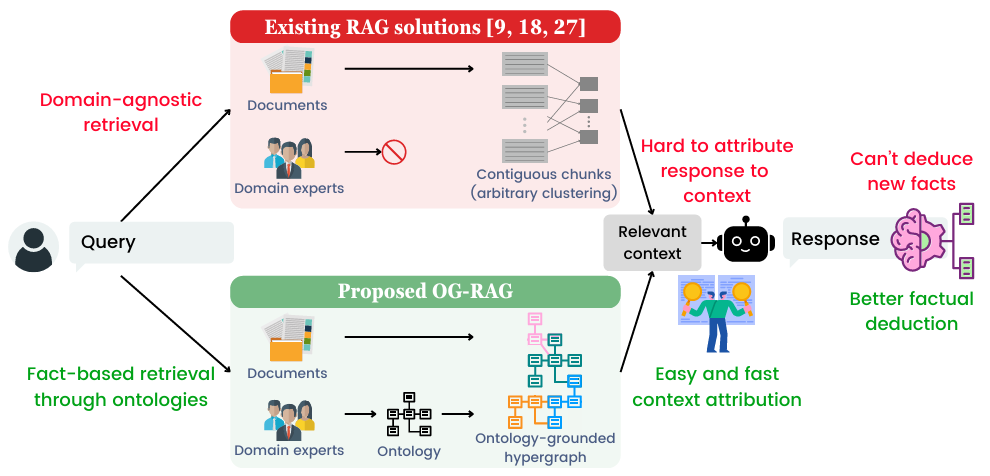

## オントロジーとは

### ひとことで言うと

**オントロジー + GraphRAG** は、  
固有名詞を単なる文字列として検索するのではなく、

> **「これは何者か」＋「何とどう関係しているか」**

をグラフ構造にして、その関係をたどりながらRAGする手法です。

### 通常のRAGとの違い

通常のRAGは、主にこうです。

```text
質問
↓
似ている文章チャンクを検索
↓
LLMが回答
```

一方、オントロジー + GraphRAGはこうです。

```text
質問
↓
固有名詞を特定
↓
その固有名詞の種類・別名・関係先をグラフで探索
↓
関係する文書・根拠を取得
↓
LLMが回答
```

GraphRAGは、文書からエンティティや関係を抽出してナレッジグラフを作り、その構造を使ってRAGを行う考え方です。MicrosoftのGraphRAGも、入力文書から知識グラフを作り、コミュニティ要約などを使って検索・回答を強化する方式として説明されています。<source-chip title="Microsoft GraphRAG" url="https://microsoft.github.io/graphrag/" />

### オントロジーの役割

オントロジーは、グラフを作るための**設計図**です。

例えば、社内RAGならこう定義します。

```text
エンティティ種別:
- Project
- Department
- Person
- System
- Document
- Meeting
- Decision

関係:
- Person belongs_to Department
- Person owns Project
- Department participates_in Project
- Meeting discusses Project
- Decision made_in Meeting
- Decision affects System
```

これにより、LLMや検索システムは、

```text
ネコプロジェクト = Project
営業企画部 = Department
山田部長 = Person
CRM基盤 = System
```

のように、固有名詞を意味付きで扱えます。

### 具体例

質問：

```text
ネコプロジェクトの意思決定に関わった部署と、影響を受けたシステムを教えて
```

通常RAGだと、「ネコプロジェクト」に似た文章を探すだけです。

オントロジー + GraphRAGでは、次のようにたどれます。

```text
ネコプロジェクト
  ├─ discussed_in → 第5回推進会議
  │      └─ made_decision → 顧客対応AIを先行導入
  │              └─ affects → CRM基盤
  ├─ participated_by → 営業企画部
  └─ participated_by → 情報システム部
```

そのうえで、関連する議事録・設計書・決定資料をRAGで取得し、回答を生成します。

### この手法の強み

特に強いのは、次のような質問です。

- 「このプロジェクトに関係する部署は？」
- 「この意思決定はどのシステムに影響したか？」
- 「この人が関わったプロジェクトは？」
- 「この略称は何を指すか？」
- 「複数文書にまたがる経緯を説明して」

つまり、**1つの文書だけでは答えにくく、複数の固有名詞の関係をたどる必要がある質問**に強いです。

OG-RAGという研究では、ドメイン固有のオントロジーに検索を結び付けることで、通常のRAGより正確な文脈を作ることを狙っています。論文では、オントロジーで整理されたドメイン知識を使い、事実のrecallや回答正確性の改善が報告されています。<source-chip title="OG-RAG" url="https://arxiv.org/abs/2412.15235" />

引用されている論文で書かれていることではこうなります。
"従来RAGは、検索した文章チャンクにそのまま書かれている内容を答えるのは得意だが、複数の事実や関係を組み合わせて、新しい結論を導くのは苦手"

従来RAGでは文章の内容をそのまま使うことが限界となっている訳ですが、オントロジーのあるグラフRAGを行うことで

"検索された根拠・オントロジー・ナレッジグラフ上の関係から、根拠付きで結論を導くこと"

が出来る訳です。
特に与えられた事実に基づく推論に関しては近年のLLMの進化のおかげで、もしかすると人間以上では？というレベルで実現できるようになっています。



## オントロジーの情報の読取り方

LLMはオントロジー・ナレッジグラフをどのように読み解いているか、という点について気になります。
ずばり、**LLMがオントロジーやグラフを“そのまま脳内で読む”のではなく、RAGシステムがグラフ情報を「LLMが読める事実リスト・パス・要約」に変換**して渡しています。

### 全体像

オントロジー + GraphRAGでは、だいたい次の流れで答えを導きます。

```text
1. オントロジーで概念・関係を定義する
   ↓
2. 文書からエンティティと関係を抽出する
   ↓
3. ナレッジグラフまたはハイパーグラフを作る
   ↓
4. 質問中の固有名詞をグラフ上のノードに対応づける
   ↓
5. 関連ノード・関係・パスを取得する
   ↓
6. 取得した事実をLLMに渡す
   ↓
7. LLMが複数の事実を組み合わせて回答する
```

つまり、**推論の材料をグラフが整理し、最終的な文章化と一部の論理接続をLLMが行う**という役割分担です。

### 1. オントロジーは「読み取りルール」として使われる

オントロジーは、LLMに対して次のような読み取りルールを与えます。

```text
Project
Department
Person
System
Decision

Person は Department に所属する
Person は Project の責任者になれる
Decision は Meeting で決定される
Decision は System に影響する
Project は Department によって推進される
```

OG-RAG論文では、オントロジーを「ドメイン固有の概念と関係の形式的表現」として検索過程に組み込み、文書中の情報をオントロジーに沿った形式へ変換しています。具体的には、GPT-4oに文書チャンクとオントロジーを与え、オントロジーに合う値を埋めさせて、検索に適した構造化形式へ変換しています。<source-chip title="ACL Anthology" url="https://aclanthology.org/2025.emnlp-main.1674.pdf" />

### 2. 文書は「事実ブロック」に変換される

通常のRAGでは、文書は文章チャンクのまま検索されます。

一方、OG-RAGでは文書を次のような構造に変換します。

```text
Subject: ネコプロジェクト
Attribute: 責任者
Value: 山田部長

Subject: ネコプロジェクト
Attribute: 影響システム
Value: CRM基盤

Subject: 山田部長
Attribute: 所属部署
Value: 営業企画部
```

OG-RAGでは、このような情報を「factual block」として扱い、さらにそれをハイパーグラフに変換します。論文では、ハイパーノードをキー・バリュー形式の情報、ハイパーエッジを複数のハイパーノードを結ぶ「検証可能な事実」として定義しています。<source-chip title="ACL Anthology" url="https://aclanthology.org/2025.emnlp-main.1674.pdf" />

### 3. 質問をグラフ上のノードに対応づける

例えば質問がこうだとします。

```text
山田部長が責任を持つプロジェクトは、どのシステムに影響しますか？
```

RAGシステムは、質問中の重要語をグラフ上の要素に対応づけます。

```text
山田部長 → Person
責任を持つ → Project の責任者関係
影響する → affects / impact 関係
システム → System
```

OG-RAGでは、質問とハイパーノードの類似度を計算し、質問に関連するノードを探します。具体的には、エンティティ＋属性のキー部分と質問の類似度、または値部分と質問の類似度を使って、関連ハイパーノードを選びます。<source-chip title="ACL Anthology" url="https://aclanthology.org/2025.emnlp-main.1674.pdf" />

### 4. グラフから関連する事実を取得する

ここが通常RAGとの大きな違いです。

通常RAGは、

```text
質問に似ている文章
```

を取ります。

GraphRAG/OG-RAGは、

```text
質問に関係するノード
そのノードに接続する関係
その関係で結ばれた別ノード
その周辺の事実
```

を取ります。

OG-RAGでは、関連ノードをなるべく少ないハイパーエッジで覆うように、関連事実の集合を選びます。つまり、質問に必要な複数の事実を、冗長になりすぎない形でLLMに渡す設計です。<source-chip title="ACL Anthology" url="https://aclanthology.org/2025.emnlp-main.1674.pdf" />

### 5. LLMには「グラフそのもの」ではなく「事実リスト」として渡される

重要なのはここです。

LLMは、グラフDBの内部構造を直接読むわけではありません。

最終的には、次のような形でLLMに渡されます。

```text
Context:
1. 山田部長はネコプロジェクトの責任者である。
2. ネコプロジェクトはCRM基盤に影響する。
3. 山田部長は営業企画部に所属する。

Question:
山田部長が責任を持つプロジェクトは、どのシステムに影響しますか？
```

OG-RAGの付録では、LLMへのプロンプトとして「以下の文脈を使って質問に答えよ」とし、その文脈は「辞書形式の有効な事実リスト」として提供される、と説明されています。<source-chip title="ACL Anthology" url="https://aclanthology.org/2025.emnlp-main.1674.pdf" />

### 6. 文書に直接書かれていない答えはどう導かれるか

例えば、文書に直接こうは書かれていないとします。

```text
山田部長が責任を持つプロジェクトはCRM基盤に影響する。
```

しかし、グラフには次の2つの事実があります。

```text
山田部長 --責任者--> ネコプロジェクト
ネコプロジェクト --影響する--> CRM基盤
```

この2つをつなぐと、

```text
山田部長
→ 責任者である
→ ネコプロジェクト
→ 影響する
→ CRM基盤
```

となります。

したがって答えは、

```text
山田部長が責任を持つネコプロジェクトは、CRM基盤に影響します。
```

となります。

これが、論文でいう **deduce**、つまり「事実と関係を組み合わせて導出する」という意味です。

### 7. LLMだけが推論しているわけではない

ここは誤解しやすいです。

オントロジー + GraphRAGにおける推論は、LLMだけの能力ではありません。

実際には、次のような分担です。

| 部分 | 役割 |
|---|---|
| オントロジー | どんな概念・関係があり得るかを定義する |
| 情報抽出LLM | 文書からエンティティ・関係を抽出する |
| グラフ/ハイパーグラフ | 事実同士の接続を保持する |
| Retriever | 質問に必要なノード・関係・事実を選ぶ |
| LLM | 取得された事実を読んで、論理的につなぎ、回答文にする |

つまり、

> **グラフが推論経路を狭め、LLMがその経路を文章として説明する**

という構造です。

OG-RAG論文でも、従来RAGは構造化されたドメイン知識を十分に扱えず文脈生成が不十分になる一方、OG-RAGはオントロジーで接地されたハイパーグラフ検索により、事実ベースの推論を支援すると説明されています。<source-chip title="ACL Anthology" url="https://aclanthology.org/2025.emnlp-main.1674/" />

### 8. Microsoft GraphRAGの場合

Microsoft GraphRAG系では、文書からエンティティ知識グラフを作り、そのグラフに対してコミュニティ検出を行い、コミュニティごとの要約を生成します。クエリ時には、グローバル検索ではコミュニティ要約を使い、ローカル検索では特定エンティティの近傍ノードや関連概念を展開してLLMのコンテキストに入れます。<source-chip title="Microsoft GraphRAG" url="https://microsoft.github.io/graphrag/" />

つまり、Microsoft GraphRAGでは、

```text
エンティティ抽出
↓
関係抽出
↓
グラフ構築
↓
コミュニティ要約
↓
質問に応じて関連要約・近傍関係を取得
↓
LLMが回答
```

という流れです。

GraphRAGの元論文でも、LLMを使って文書からエンティティ知識グラフを作り、密接に関連するエンティティ群ごとにコミュニティ要約を事前生成し、質問時にはそれらの要約を使って部分回答を作り、最後に統合回答を作ると説明されています。<source-chip title="GraphRAG" url="https://graphrag.com/appendices/research/2404.16130/" />

### 9. 具体例で見る「導出」

文書A：

```text
ネコプロジェクトは営業企画部と情報システム部が推進している。
```

文書B：

```text
第5回推進会議で、顧客対応AIをCRM基盤に先行導入することが決定された。
```

文書C：

```text
第5回推進会議はネコプロジェクトの定例会議である。
```

これをオントロジーに従ってグラフ化すると、

```text
ネコプロジェクト --推進部署--> 営業企画部
ネコプロジェクト --推進部署--> 情報システム部
ネコプロジェクト --会議--> 第5回推進会議
第5回推進会議 --決定事項--> 顧客対応AIの先行導入
顧客対応AIの先行導入 --影響先--> CRM基盤
```

質問：

```text
ネコプロジェクトの意思決定に関わった部署と、影響を受けるシステムは？
```

GraphRAGは、

```text
ネコプロジェクト
→ 推進部署
→ 営業企画部 / 情報システム部

ネコプロジェクト
→ 会議
→ 第5回推進会議
→ 決定事項
→ 顧客対応AIの先行導入
→ 影響先
→ CRM基盤
```

という経路を含む事実を取得します。

LLMはそれを読んで、

```text
ネコプロジェクトには営業企画部と情報システム部が関わっています。
また、第5回推進会議で顧客対応AIのCRM基盤への先行導入が決定されているため、影響を受けるシステムはCRM基盤です。
```

と答えます。
この答えは、1つの文書に直接書かれていなくても、複数文書の事実をグラフ経由でつないで導出されています。


