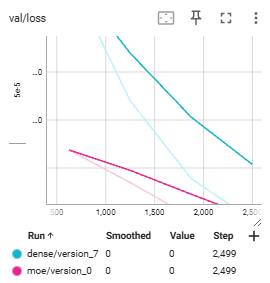
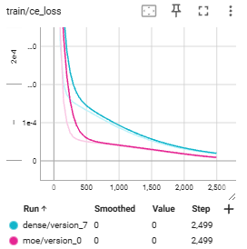
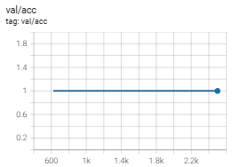

# puropose

investigate the technique of structing LLM.

## LLM architecuture

In this time, I make **Sparse BERT-style Encoder** that utilizes a **Hybrid Sparse Attention** mechanism combined with  **Rotary Positional Embeddings (RoPE)** .

Here is a concise explanation of the key components:

### 1. Hybrid Sparse Attention

Unlike standard "Full Attention" where every token attends to every other token (**$O(T^2)$** complexity), this model uses two types of sparse connectivity:

* **Local Window Attention:** Each token only attends to its immediate neighbors within a fixed `window` size.
* **Global Attention:** Specific tokens (defined by a `global_mask`) can attend to all tokens, and all tokens can attend to them. This allows long-range information flow even with a sparse structure.

### 2. Rotary Positional Embeddings (RoPE)

Instead of using traditional absolute or relative position biases, the model applies  **RoPE** . It rotates the Query (**$Q$**) and Key (**$K$**) vectors in complex space based on their sequence positions. This allows the model to capture relative distances between tokens naturally and generalize better to different sequence lengths.

### 3. BERT-style Masked Language Model (MLM)

The code defines a `SparseRoPEBertForMaskedLM` class, which includes:

* **Encoder Stack:** Multiple layers of sparse attention and Feed-Forward Networks (FFN).
* **MLM Head:** A specialized output head (Linear -> GELU -> LayerNorm -> Linear) designed to predict masked tokens, following the BERT architecture.
* **Weight Tying:** The input embedding weights are shared with the output decoder weights to reduce parameters and improve training stability.

### 4. Implementation Details

* **`unfold_kv`:** A utility function that efficiently extracts local sliding windows using PyTorch's `unfold` operation.
* **Visualization:** The code includes a plotting utility to visualize the attention map, showing the "diagonal" local window pattern plus "cross-shaped" lines representing the global tokens.

Would you like me to explain how to modify the `global_mask` to implement a specific pattern, such as "BigBird" or "Longformer" styles?

The process of train is shown as below, maybe, which is convergible status. the resutl is show "new_architecture" in this repository.

after training proceeds, the shift of loss become at a degree constant.

## MoE
I investigated Mixture of Experts (MoE), a highly anticipated technology known for enhancing the expressive capabilities and versatility of models.

## Experiment Summary: Evaluating Performance Gains through Mixture of Experts (MoE)

### 1. Objective and Hypothesis

The goal of this experiment was to verify the performance gap between a standard **Dense model** and a **Mixture of Experts (MoE) model** under conditions where data is heterogeneous. The hypothesis is that MoE can avoid "representation interference" by using conditional computation and specialized experts for different task types.

### 2. Experimental Design

The models were tasked with solving a mix of four distinct problem types to simulate a multi-modal input distribution:

* **Type A (Arithmetic):** Sequential numerical calculations.
* **Type B (Logic):** Symbolic reasoning and puzzles.
* **Type C (Code):** Understanding syntax and control flows.
* **Type D (Language):** Natural language reading comprehension.

**MoE Advantage:** While a Dense model must process all tasks through a single set of parameters, the MoE model uses a **Router** to dispatch tokens to specialized **Experts** (e.g., Expert 1 for math, Expert 2 for logic), potentially leading to higher accuracy and faster convergence.

### 3. Implementation and Results

The experiment was implemented using `PyTorch Lightning`, comparing a standard Transformer block against one where the Feed-Forward Network (FFN) was replaced with an MoE layer (4 experts).

**Key Findings:**

* **Convergence Speed:** The MoE model converged significantly faster than the Dense model, as evidenced by the swifter decline in training and validation loss.
* **Accuracy:** Both models reached a 1.0 (100%) accuracy rate.
* **Analysis:** Because both models achieved perfect scores, the intended observation of "performance degradation in sequential tasks" was not captured. This suggests that the current problem set was too simple for the models' capacity.

### 4. Conclusion and Next Steps

The experiment successfully demonstrated that **MoE provides a clear advantage in convergence efficiency** when handling diverse tasks. However, to see the true difference in "reasoning limits" and "task-switching interference," a more complex and challenging dataset is required. The next phase will involve increasing the difficulty of the problem sets to further stress-test the two architectures.

