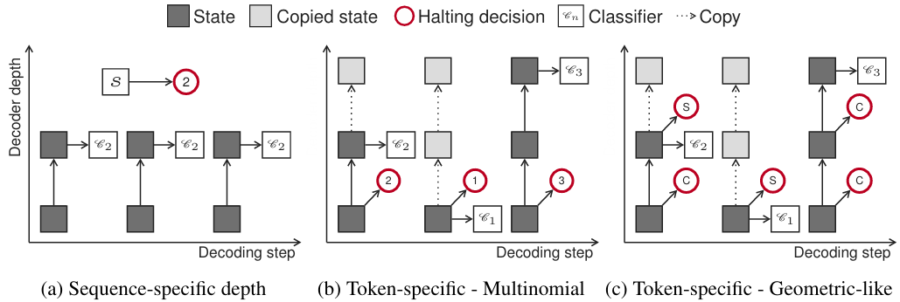
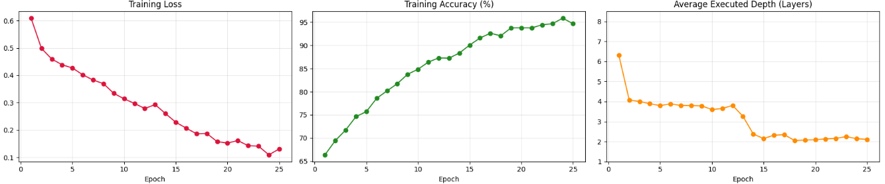
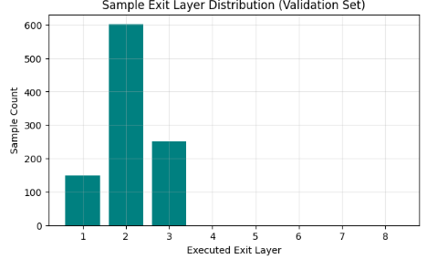
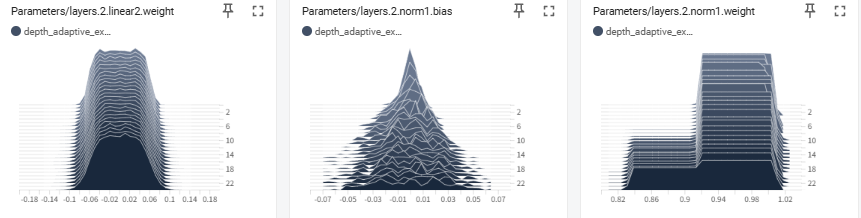
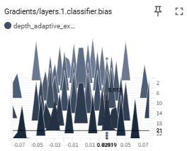

[LLMのレイヤを選択する手法として(レイヤの打ち切りを選択する手法として)DeeBERT](https://yoshishinnze.hatenablog.com/entry/2026/09/22/043000)を説明しました。
その後も問題に応じてレイヤを使い分けるという研究は続けられています。
本日説明するのはそんな後続手法で、現在につながるレイヤ選択の手法であるDepth-Adaptive Transformerです。

## 論文明細

[Depth-Adaptive Transformer](https://arxiv.org/abs/1910.10073) の論文明細を以下にまとめます。

### 論文情報

本論文はLLM関係のトップカンファレンスの一つICLRに採択されています。

| 項目 | 内容 |
|------|------|
| **タイトル** | Depth-Adaptive Transformer |
| **著者** | Maha Elbayad, Jiatao Gu, Édouard Grave, Michael Auli |
| **発表会議** | [ICLR 2020](https://iclr.cc/virtual/2020/poster/1770) (International Conference on Learning Representations) |
| **発表年** | 2020年 |
| **arXiv** | [1910.10073](https://arxiv.org/abs/1910.10073) |
| **OpenReview** | [forum?id=SJg7KhVKPH](https://openreview.net/forum?id=SJg7KhVKPH) |
| **著者所属** | Maha Elbayad: Univ. Grenoble Alpes（研究はFacebook AI Researchインターン中に実施）; Jiatao Gu, Édouard Grave, Michael Auli: Facebook AI Research |
| **Meta Research** | [research.facebook.com/publications/depth-adaptive-transformer](https://research.facebook.com/publications/depth-adaptive-transformer/) |
| **HAL（フランス学術アーカイブ）** | [inria.hal.science/hal-02422914](https://inria.hal.science/hal-02422914) |


### 補足

- **ICLR (International Conference on Learning Representations)** は、深層学習・表現学習分野における世界トップクラスの国際会議です。OpenReviewによるダブルブラインド査読(※)を採用しており、本論文も査読を経て採択されています。[ICML](https://iclr.cc/virtual/2020/poster/1770)
- 本論文は2019年10月22日に [arXiv](https://arxiv.org/abs/1910.10073) に先行公開された後、ICLR 2020に採択されました。
- 第一著者の Maha Elbayad 氏は、当時 Univ. Grenoble Alpes（フランス・グルノーブル大学）の博士課程学生で、Facebook AI Research（FAIR）でのインターンシップ中に本研究を行いました。
- 共著者の Michael Auli 氏、Édouard Grave 氏、Jiatao Gu 氏はいずれも FAIR（現 Meta AI）の研究者です。特に Michael Auli 氏は音声認識・機械翻訳分野で広く知られる研究者です。
- ICLRの論文は通常 proceedings として出版されますが、DOIの付与は論文によって異なります。本論文の主要な参照先は [arXiv:1910.10073](https://arxiv.org/abs/1910.10073) および [OpenReview](https://openreview.net/forum?id=SJg7KhVKPH) となります。<source-chip title="arXiv" url="https://arxiv.org/abs/1910.10073" />

※ダブルブラインド査読：
ダブルブラインド査読（double-blind peer review）とは、査読者（レビュアー）も投稿者（著者）も互いの身元を知らない状態で論文を査読する方式です。
著名大学や有名研究者の論文が、名前だけで有利に評価されることを防ぎます。
逆に、無名の研究者や新興機関の論文が不当に不利にならないよう保護します。

## 解決しようとした課題

[Depth-Adaptive Transformer](https://arxiv.org/abs/1910.10073) が解決しようとした課題は、**「すべての入力シーケンスに対して同じ計算量を使うことの非効率性」** です。具体的には以下の3つの課題が挙げられています。

### 1. 固定計算量による無駄

最先端のシーケンス・トゥ・シーケンスモデル（Transformer 等）は、**入力が簡単でも難しくても、すべてのサンプルに対して同じ数の層・同じ計算量を消費**します。例えば、機械翻訳で「Thank you」のような短いフレーズを翻訳するのに、数十億パラメータの巨大モデル全体を使う必要はありません。しかし、当時のモデルはこのような簡単な入力にも最大計算量を適用していました。<source-chip title="arXiv" url="https://arxiv.org/abs/1910.10073" />

### 2. 速度と精度のトレードオフ

大規模なモデルは難しい例を処理するために必要ですが、簡単な例に対しては過剰です。研究者は常に「精度を維持しつつ推論速度を上げたい」という課題に直面していましたが、モデルサイズを小さくすると難しい例の精度が落ちるというジレンマがありました。

### 3. 動的計算の構造化予測への未適用

動的計算（入力に応じて計算ステップ数を変える）のアイデア自体は [Graves (2016) の ACT](https://arxiv.org/abs/1603.08983) や [Universal Transformers](https://arxiv.org/abs/1808.08947) で既に存在していましたが、以下の問題がありました。

- **Universal Transformers**: 同じ層を繰り返し適用するだけで、**異なる層（異なる容量）を使い分ける**ことはできませんでした
- **早期終了（Early Exit）**: 画像分類では [Huang et al. 2017](https://arxiv.org/abs/1703.09877) などで研究されていましたが、**構造化予測（機械翻訳などのシーケンス生成）** への拡張は未解決でした
- 機械翻訳では、あるトークンで早期終了すると、後続のトークンの自己注意機構に影響が及ぶという**構造的な複雑性**がありました

### 論文が指摘した根本的な矛盾

> **「難しい例には深いモデルが必要だが、簡単な例には浅いモデルで十分。しかし現在のモデルは、どちらの例にも同じ深さを使っている」**

[Depth-Adaptive Transformer](https://arxiv.org/abs/1910.10073) は、**デコーダの各層に出口（output classifier）を設け、入力の難易度に応じて異なる層深さで予測を行う**ことで、この矛盾を解決しました。

## 提案手法

[Depth-Adaptive Transformer](https://arxiv.org/abs/1910.10073) が提案した手法は、**「デコーダの各層に出口を設け、入力の難易度に応じて異なる層深さで予測を行う」** というものです。以下に仕組みを段階的に説明いたします。


### 1. 基本的なアイデア：多層出口

標準の Transformer は、デコーダの最終層（$N$ 層目）の隠れ状態 $h_t^N$ だけから次のトークンを予測します。

$$p(y_{t+1} \mid h_t^N) = \text{softmax}(W h_t^N)$$

[Depth-Adaptive Transformer](https://arxiv.org/abs/1910.10073) では、**すべての層 $n = 1, \dots, N$ に独立した出力分類器 $W_n$ を設け**、どの層でも予測が可能にします。

$$\forall n: \quad p(y_{t+1} \mid h_t^n) = \text{softmax}(W_n h_t^n)$$

これにより、モデルは「浅い層で十分自信があればそこで出力し、なければ深い層まで進む」ことができるようになります。

### 2. 学習方法：2つの訓練レジーム

論文では、複数の出口を持つデコーダをどう学習するかについて、2つの手法を提案しています。

__2.1 Aligned Training（整列訓練）__

すべての層の出口を**同時に最適化**します。各層 $n$ に対して損失を計算し、重み付き平均を取ります。

$$\mathcal{L}_{\text{dec}} = -\frac{1}{\sum_n \omega_n} \sum_{n=1}^{N} \omega_n \cdot \log p(y_t \mid h_{t-1}^n)$$

- すべての層が「正解を予測できるよう」学習されます
- 実験の結果、**一様な重み**（$\omega_n = 1$）が最も BLEU が高かったと報告されています

**問題点**: 学習時はすべての層の隠れ状態が揃っている前提ですが、推論時はあるトークンが早期終了すると、後続のトークンの自己注意に影響が出ます。

__2.2 Mixed Training（混合訓練）__

学習・推論の不一致を解消するため、**ランダムにサンプリングした終了パターン**で訓練します。

- 各文に対して $M$ 通りの終了了層シーケンス $(n_1, \dots, n_{|y|})$ をランダムにサンプリング
- あるトークンが層 $n_t$ で終了した場合、それ以降の層の隠れ状態は**最後に計算された状態をコピー**します
- これにより、推論時と同じ「不完全な隠れ状態」条件下で学習できます

$$\mathcal{L}_{\text{dec}} = -\frac{1}{M} \sum_{m=1}^{M} \log p(y_t \mid h_{t-1}^{n_t^{(m)}})$$



### 3. 終了判定の方法

「どの層で止めるか」を決定するモジュールとして、論文では複数の設計を比較しています。

__3.1 シーケンス全体で統一（Sequence-level）__

**すべてのトークンを同じ層数で処理**します。

- **Multinomial Classifier**: デコーダの最初の隠れ状態から、終了層 $n \in \{1, \dots, N\}$ を多項分布で予測
- **Binomial Classifier**: 各層ごとに「ここで止めるか/止めないか」を二値分類し、累積して終了層を決定

__3.2 トークンごとに個別（Token-level）__

**トークンごとに異なる終了層**を選びます。

- **Score Thresholding**: 各層の出口ロジットのソフトマックス確率の最大値が閾値（例：0.9）を超えたら終了
- **Oracle Supervision**: 「この層で既に正解トークンが argmax になっているか」を教師信号として学習

### 4. 自己注意との整合性：状態コピー

機械翻訳のデコーダでは、トークン $t$ の計算に、過去のトークン $1, \dots, t-1$ の隠れ状態が必要です（自己注意）。

あるトークンが早期終了（例：層3で停止）した場合、後続のトークンは層4以降の「過去の隠れ状態」が存在しません。

**解決策**: 早期終了したトークンの層3の隠れ状態を、**層4以降にもコピー**します。ただし、各層固有の key/value 投影は適用します。

$$h_t^{k} = h_t^{n_t} \quad (\text{for } k > n_t)$$

これにより、自己注意機構が正常に機能しつつ、実際には浅い層の計算のみが行われたことになります。

### 5. 推論時の動作

推論時のフローは以下の通りです。

1. エンコーダは通常通り全層を実行
2. デコーダはトークンを1つずつ生成
3. 各トークンについて、層1から順に計算
4. 各層で出口分類器がロジットを出力 → 自信度を計算
5. 自信度が閾値を超えたら、その層の予測を採用して次のトークンへ
6. 閾値を超えなければ、次の層へ進む

## 実験

今回実施する実験は、入力されたデータの難易度に応じて推論に使用するトランスフォーマーの層数（深さ）を動的に変更する「Depth-Adaptive Transformer（動的層数適応型トランスフォーマー）」の構築と挙動検証を行うこととします。

実験の内容、アーキテクチャの構成、および使用したデータセットの詳細は以下の通りです。

元論文ではデコーダで終了するかの制御をしていますが、手法の以下のエッセンスはエンコーダであっても確認できると考えています。
本実験ではエンコーダでの終了判定で実験を行います。

- 表現の段階的集約: 深い層へ進むにつれて抽象度の高い表現が獲得されるため、「浅い層の時点で十分な確信度が得られれば計算を打ち切る」というアプローチ。
- 計算コストの動的削減: 難易度の低いサンプルには浅い層（少ないFLOPs）、難しいサンプルには全層（高いFLOPs）を割り振る。
- 微分不可能性の克服: 退出判定の離散的な分岐（Gumbel-Softmax等）を工夫して学習させる構造。

### 1. 実験の内容（学習メカニズム）

モデルが「高い正解率の維持」と「計算コスト（通過層数）の削減」を自律的に両立できるかを検証しました。

* **微分可能な動的ルーティング**: 各層で推論を「打ち切る（Exit）」か「継続する（Continue）」かの二値判定を行うにあたり、Gumbel-Softmax法を使用しました。これにより、離散的な分岐判定を維持したまま、ネットワーク全体をエンドツーエンドで誤差逆伝播（学習）できるようにしています。
* **2つの損失関数の同時最適化**: 正解を導くための「タスク損失（Cross Entropy）」と、通過した層数の期待値を最小化する「深度ペナルティ（Depth Loss）」を加算して最適化しました。
* **ウォームアップ・スケジューリング**: 学習初期からペナルティを与えると、モデルが「精度を諦めて全データを1層目で退出させる」という局所最適解に陥ることが判明したため、最初の12エポックはペナルティを0にして全8層で問題を解かせ、その後に徐々にペナルティを課す仕組み（Warmup）を導入して解決しました。

### 2. レイヤの構成（アーキテクチャ）

PyTorchベースの最大8層からなるカスタムTransformerエンコーダを構築しました。

* **基本仕様**: 隠れ層の次元数 `d_model=128`、アテンションヘッド数 `nhead=4`、フィードフォワード層次元数 `dim_ff=256`。
* **Depth-Adaptive Block（各層の内部構造）**:
通常のTransformerブロック（Multi-Head Attention + FFN + LayerNorm）に加え、以下の2つの専用モジュールを各層に内包しています。
* **Exit Gate（退出ゲート）**: 先頭トークンの表現を受け取り、線形層で「Exit（0）」か「Continue（1）」のロジットを計算します。
* **Classifier（分類器）**: その層で推論を打ち切った場合に、最終的なクラス分類（0か1か）を出力します。


* **推論フロー**: 入力データが各層を通過するたびにゲートが判定を行い、Exitの確率が高まった時点で実質的に計算が打ち切られ、その層の予測結果が最終出力として採用されます。

### 3. 使用したデータセット

モデルに「問題の難易度に応じて層の深さを使い分ける」ことを強制するため、長さ16のシーケンスデータ（語彙サイズ50）に対して、以下3つの難易度（Tier）を均等に混在させたアルゴリズム的合成データを生成して使用しました。

* **Tier 1: 局所判定タスク（Easy）**
* **ルール**: シーケンス内の特定の1要素（インデックス1の値）が閾値（25）より大きいかを判定します。
* **想定層数**: 1〜2層（局所的な参照のみで即答可能）。


* **Tier 2: 広域比較タスク（Medium）**
* **ルール**: シーケンスの前半部分の最大値と、後半部分の最小値を抽出して大小を比較します。
* **想定層数**: 3〜5層（シーケンス全体へのAttentionと、中間状態の比較が必要）。


* **Tier 3: 長距離状態走査タスク（Ultra-Hard）**
* **ルール**: 先頭から末尾まで要素を1つずつ読み込み、「奇数・偶数」によって次の状態（State）に対する計算ルール（加算や乗算のモジュロ演算）が切り替わる連鎖的なパリティ問題です。
* **想定層数**: 7〜8層（1回のAttentionホップでは原理的に解けず、層を重ねて状態を逐次更新し続けることが必須）。

このデータと学習手法を組み合わせたことで、学習終盤には簡単な問題は浅い層で、難しい問題は最深層まで使って回答する「3峰性の動的なレイヤー退出分布」が確認できる実験となりました。

### 4. 学習結果

学習段階のエポックごとのロスや正解率の推移は以下の通りです。



学習後のValidationのフェーズでのアウトプットは以下でした。
うーん。。。正解率が70%切ってますね。。。

```
=== 評価結果 ===
Validation Accuracy: 67.30%
Average Executed Layers: 2.10 / 8 layers
```

そしてこの状態でのレイヤでの打ち切りですが、以下のようになりました。
レイヤ2で打ち切りが最大ですが、レイヤ1やレイヤ3にも打ち切りがあり、問題に応じて打ち切りの判断を行っていることが確認出来ます。



因みに、ネットワークパラメータの分布をtensorboardで確認してました。
見方は奥が学習開始段階で、手前が学習終了段階です。
学習が進むにつれてロングテールと呼ばれる裾野が長い分布になっています。
特定の値だけ大きいという状態になると、特徴量一部にフォーカスすることを意味しますが、今回結果は扁平。




代わりにclassifierが特定の値に注目するという構図のようです。



### 論文で報告される実験結果

| 研究 | 課題 | Depth-Adaptive Transformer の改善点 |
|------|------|-----------------------------------|
| [ACT (Graves, 2016)](https://arxiv.org/abs/1603.08983) | RNN における動的計算 | Transformer に拡張し、**異なる層を使い分ける** |
| [Universal Transformers](https://arxiv.org/abs/1808.08947) | 同じ層を繰り返し適用 | **毎ステップ異なる層**を適用し容量も調整 |
| [SACT (Figurnov, 2017)](https://arxiv.org/abs/1612.02297) | 画像の領域ごとの計算調整 | **シーケンス生成（機械翻訳）**への拡張 |
| [早期終了 (Huang et al., 2017)](https://arxiv.org/abs/1703.09877) | 画像分類での早期終了 | デコーダの**自己注意と連動した動的深度制御** |

実験結果として、IWSLT14 ドイツ語-英語翻訳で、ベースライン Transformer と同等の精度を、**デコーダ層の4分の1以下の計算量**で達成したことが報告されています。

## 総括

本日記事のエッセンスを簡潔にまとめます。

__記事の内容を一言で__

本日扱ったDepth-Adaptive Transformerは **「Transformerのデコーダ各層に出口を設け、入力の難易度に応じて異なる深さで予測を打ち切る」** 手法です。

__解決した課題__
当時のTransformerは、簡単な文（「Thank you.」）も難しい文も同じ層数で処理していました。これは計算の無駄であり、速度と精度のトレードオフを悪化させていました。

__提案手法の核心__

1. **多層出口**: デコーダの各層 $n$ に独立した出力分類器 $W_n$ を設け、どの層でも予測可能にする
2. **終了判定**: ソフトマックス確率の自信度が閾値を超えたらその層で出力、超えなければ次の層へ
3. **状態コピー**: 早期終了したトークンの隠れ状態を上層にコピーし、自己注意機構を維持
4. **Mixed Training**: ランダムな終了パターンで学習し、学習・推論の不一致を解消

__実験結果__

**目的**: Depth-Adaptive Transformer のエッセンス（「難易度に応じて層を使い分ける」）を、エンコーダでの早期終了で再現・検証する。

**手法の核心**:
- 8層の Transformer エンコーダに、各層に Exit Gate（退出判定）と Classifier（分類器）を設置
- Gumbel-Softmax で微分可能な離散的退出判定を実現
- タスク損失（Cross Entropy）と深度ペナルティ（層数の期待値最小化）を同時最適化
- 学習初期（12エポック）はペナルティ0で全層を使わせる Warmup を導入（局所最適解回避のため）

**データ**: 難易度3段階の合成データ
- Tier 1（Easy）: 局所判定 → 1〜2層で解ける
- Tier 2（Medium）: 広域比較 → 3〜5層が必要
- Tier 3（Hard）: 長距離状態走査 → 7〜8層が必要

**結果**:
- 正解率 67.30% と課題は残るものの、**平均2.10層という浅い計算**で動作
- 退出分布が層1〜3に分散しており、**入力に応じて異なる層で打ち切る動作**を確認
- パラメータ分布は扁平（特徴量全体を使う）だが、**Classifier が特定の値に注目**する構**する構図が観測された

**結論**: 精度は未成熟ながら、「問題の難易度に応じて層の深さを使い分ける」という Depth-Adaptive の核心動作は実験的に確認できた。

