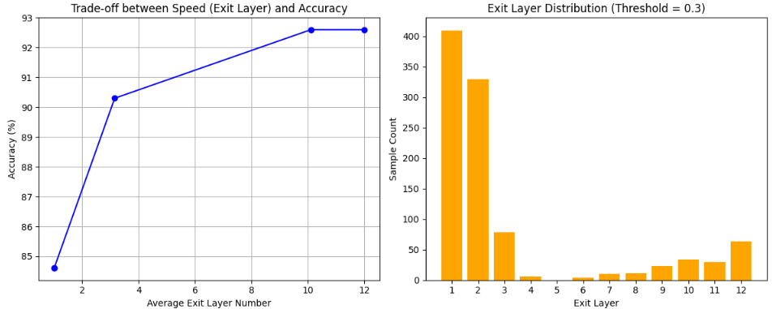
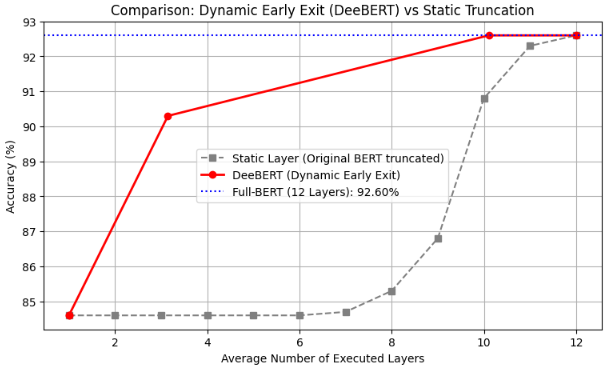
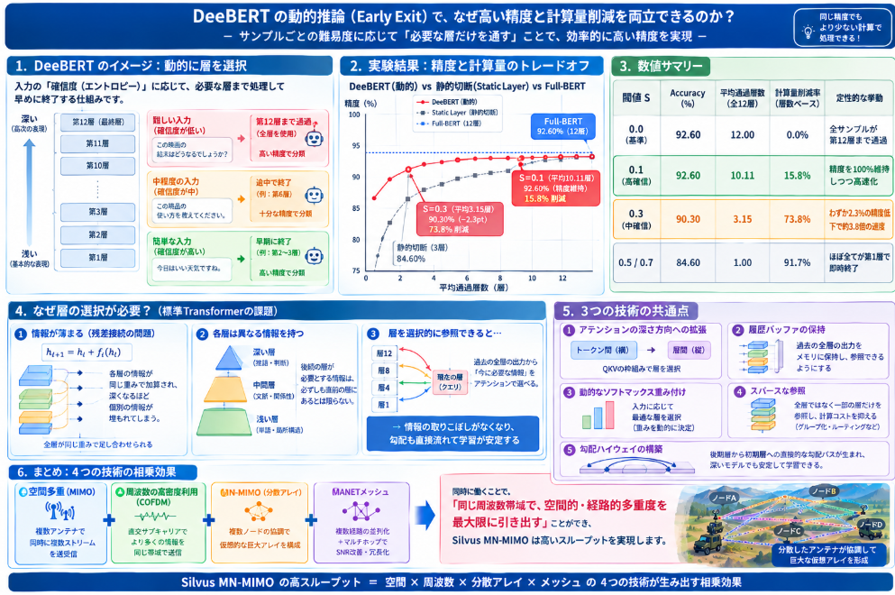

先日本ブログで、[DeeBERT（Dynamic Early Exiting for BERT）なるモデル](https://yoshishinnze.hatenablog.com/entry/2026/10/08/043000)を説明しました。
このモデルはBERTをベースに、回答の確信度に応じて回答の打ち切りを行うというもので、現在LLMでも活用されているレイヤ選択の概念を先駆けて実証したモデルです。

このモデルの有効性や、どのような仕組みで実現されたか。
日本語で説明されたサイトはないようでしたので、本ブログで扱おうと思います。

## 実験方法
有効性についてはやはり実験で確認するのが一番です。実験の実装の途中で仕組みも解説出来ます。
ということで実験方法について説明します。

DeeBERTのように、中間層（Off-ramp）で予測信頼度を評価して途中で推論を打ち切る（Early Exit）動的推論（Adaptive Inference）の実験は**非常に現実的であり、個人・研究室単位の環境でも十分に実行可能**です。

実験設計の具体策、計測すべき指標、および学習・評価用データの選定方針を以下にまとめます。

### 1. 実験で検証すべき3つの主要観点

まず評価指標としてどんなことが考えられるかです。
3つ観点があります。

__① 計算量改善（どれだけ速くなったか）__

* **フロー（FLOPs）の削減量**: 各サンプルが到達したレイヤー数に応じて、全何層分のFLOPs（浮動小数点演算数）を節約できたかを算出。
* **実測スループット/レイテンシ**: GPU（またはCPU）上での Batch Size=1 時のレスポンスタイム（ms）や、1秒あたりの処理サンプル数（samples/sec）。

__② 打ち切り位置の分布（どこで打ち切られたか）__

* **レイヤー別退出比率**: 各層 $l \in \{1, 2, \dots, L\}$ で退出したサンプルの割合 $P(exit=l)$ をプロット。
* **難易度との相関分析**: 短文・明確な否定語が含まれる「簡単なサンプル」と、構文が複雑で長文な「難しいサンプル」で退出位置がどう変化したかの定性・定量分析。

__③ 精度への影響（どの程度劣化・維持したか）__

* **精度-速度のトレードオフ曲線**: 判定のしきい値 $S$（エントロピー閾値）を連続的に変化させ、「平均計算量（または推論時間）」 vs 「Accuracy / F1-score」のパレート曲線を描画。
* **Full-BERTとの比較**: 全層（12層）を通した場合の精度に対し、平均何層のパスで何%の精度を維持できたか。

この中で一番気になるのは**打ち切り位置**と**精度**です。
時間に関しては打ち切り位置の結果として出てくる指標となります。

### 2. 実験設計・プロトコルの要点

DeeBERTの標準的な実験プロシージャに準拠することで、再現性の高い比較が可能です。

```
[Stage 1: Pre-trained BERT] 
       │
       ▼
[Stage 2: Backbone & Output Layer Fine-tuning] ── タスクの最終層を学習
       │
       ▼
[Stage 3: Off-ramps Fine-tuning] ── Backboneを固定し、中間分類器（Off-ramp）のみを学習
       │
       ▼
[Stage 4: Threshold Selection & Evaluation] ── 検証データで閾値Sをチューニングし評価

```

__打ち切り判定のメカニズム__

計算打ち切りは実際の実装通りで実現します。
各中間層 $l$ の予測確率分布 $z_l$ における**エントロピー** $H(z_l) = -\sum P_i \log P_i$ を計算します。

* **$H(z_l) < S$（信頼度が高い）**: そこで推論を即時打ち切り、結果を出力。
* **$H(z_l) \ge S$（確信が持てない）**: 次のトランスフォーマー層へ送信。

### 3. 学習・評価データの選定方針

DeeBERTのようなアーキテクチャの実験には、**タスクの難易度に明確なバリエーションが存在するデータセット**を選ぶことが最も重要です。

__推奨データセット__

標準的なベンチマークである**GLUE Benchmark**に含まれるタスク、または日本語タスクであれば**JGLUE**が最適です。

* **2クラス文書分類（感情分析・偏向判定）**
* **データ例**: SST-2 (GLUE) / WRIME (日本語感情分析)
* **適している理由**: 文脈がストレートなテキスト（例：「最高だった！」）は初期層（2〜4層）で即座に打ち切られ、二重否定や入り組んだ表現のみが深層に到達するため、**打ち切り効果が明確に現れやすい**です。


* **自然言語推論（NLI） / 類似度判定**
* **データ例**: MNLI, QNLI (GLUE) / JSNLI (日本語NLI)
* **適している理由**: 前提と仮説の関係性を解くタスクであり、単語の重複が多い簡単なペアと、高度な論理推論を要する難しいペアの差が激しいため、**層ごとの退出分布の実験・分析に最適**です。


* **質問応答・テキスト含意**
* **データ例**: SQuAD (※分類タスク化した場合) / JSQuAD
* **適している理由**: スパン抽出や長文解釈が必要になり、平均到達層が深くなる傾向を観察できます。


__避けるべきデータセット__

* **難易度が極端に均一なデータ**: 全サンプルが数単語で終わる簡単なタスク（早期退出が100%初期層に集中して比較にならない）や、極めて複雑で全層通さないと解けない難問専用データセット（計算量改善が得られない）。

### 4. 実験結果の可視化イメージ

実験時には以下のような指標のプロット・集計を作成します。

* **閾値 $S$ とレイテンシ・精度の関係**
* 横軸：平均通過層数（あるいは1サンプルあたりの平均推論時間 ms）
* 縦軸：Accuracy (%)
* パレート境界を確認し、「精度低下 0.5% 以内で計算量を 30〜40% 削減できるポイント」を探します。


* **サンプル難易度別の層退出ヒストグラム**
* 正解サンプルと不正解サンプル、あるいはテキスト長（Short / Medium / Long）ごとの退出層分布をスタックバーチャートで視覚化。

## 実験の実装

前節の内容を踏まえてGoogle Colab環境で、JGLUEの日本語データセット（MARC-jaまたはJNLI）と事前学習済みの日本語BERTを用いて、DeeBERTの動作原理・打ち切り位置分布・正解率の変化を検証する実装スクリプトを作成しました。

以下のアーキテクチャ概要のとおり、各Transformer層の出力に分類器（Off-ramp）を取り付け、エントロピー閾値によって推論を早期終了（Early Exit）させます。

### 1. Google Colabでの実装コード

まずは実験に必要なパッケージです。
datasetsは最新バージョンではなく、パッチ処理が制限なく実行できる `2.21.0` とします。

```
!pip install fugashi ipadic unidic-lite
!pip install "datasets==2.21.0" -q
```

その上で以下のコードをColabのセルにコピー＆ペーストして実行してください（GPU環境を推奨します）。

```python
import torch
import torch.nn as nn
from torch.utils.data import DataLoader
import torch.optim as optim
from transformers import AutoTokenizer, AutoModel
from datasets import load_dataset
import numpy as np
import matplotlib.pyplot as plt

# ---------------------------------------------------------
# 1. DeeBERTモデル定義（中間層分類器を持つBERT）
# ---------------------------------------------------------
class DeeBertForSequenceClassification(nn.Module):
    def __init__(self, pretrained_model_name, num_labels):
        super().__init__()
        self.bert = AutoModel.from_pretrained(pretrained_model_name)
        self.num_layers = self.bert.config.num_hidden_layers
        self.num_labels = num_labels
        
        # 各Transformerブロック（中間層）の直後に配置する軽量分類器 (Off-ramps)
        hidden_size = self.bert.config.hidden_size
        self.off_ramps = nn.ModuleList([
            nn.Sequential(
                nn.Dropout(0.1),
                nn.Linear(hidden_size, num_labels)
            ) for _ in range(self.num_layers)
        ])

    def forward(self, input_ids, attention_mask, eval_threshold=None):
        """
        eval_threshold が None の場合: 通常学習（全中間層の損失を計算）
        eval_threshold が float の場合: 動的推論（エントロピーが閾値未満で打ち切り）
        """
        outputs = self.bert(input_ids=input_ids, attention_mask=attention_mask, output_hidden_states=True)
        hidden_states = outputs.hidden_states[1:] # Embedding層を除いた各層の出力 [12, Batch, Seq, Hidden]

        if eval_threshold is None:
            # 【学習時】各中間層の logits を計算
            all_logits = []
            for layer_idx in range(self.num_layers):
                # [CLS] トークンのベクトルを各中間分類器に入力
                cls_rep = hidden_states[layer_idx][:, 0, :]
                logits = self.off_ramps[layer_idx](cls_rep)
                all_logits.append(logits)
            return all_logits
        else:
            # 【推論時】エントロピーに基づいた早期打ち切り
            batch_size = input_ids.size(0)
            final_preds = torch.zeros(batch_size, dtype=torch.long, device=input_ids.device)
            exit_layers = torch.zeros(batch_size, dtype=torch.int, device=input_ids.device)
            active_indices = torch.arange(batch_size, device=input_ids.device)

            for layer_idx in range(self.num_layers):
                cls_rep = hidden_states[layer_idx][active_indices, 0, :]
                logits = self.off_ramps[layer_idx](cls_rep)
                probs = torch.softmax(logits, dim=-1)
                
                # エントロピー計算: H(x) = - sum(p * log(p))
                entropy = -torch.sum(probs * torch.log(probs + 1e-12), dim=-1)
                preds = torch.argmax(logits, dim=-1)

                # 閾値以下の判定（十分な確信度）または 最終層に到達した場合
                exited_mask = (entropy < eval_threshold) | (layer_idx == self.num_layers - 1)
                
                # 打ち切られたサンプルの結果を記録
                exited_indices = active_indices[exited_mask]
                if len(exited_indices) > 0:
                    final_preds[exited_indices] = preds[exited_mask]
                    exit_layers[exited_indices] = layer_idx + 1 # 1-indexed

                # まだ打ち切られていないサンプルのみ次の層へ
                active_indices = active_indices[~exited_mask]
                if len(active_indices) == 0:
                    break

            return final_preds, exit_layers

# ---------------------------------------------------------
# 2. データ準備 (JGLUE / MARC-ja: 2クラス感情分析)
# ---------------------------------------------------------
device = torch.device("cuda" if torch.cuda.is_available() else "cpu")
model_name = "cl-tohoku/bert-base-japanese-whole-word-masking"
tokenizer = AutoTokenizer.from_pretrained(model_name)

# Parquet形式で配られている最新互換リポジトリから取得
# (MARC-ja タスクを指定)
raw_dataset = load_dataset("shunk031/JGLUE", name="MARC-ja")

# データセットの列名を確認して前処理
# ※ MARC-ja のテキスト列は "sentence" または "text"、ラベルは "label"
def preprocess_function(examples):
    text_column = "sentence" if "sentence" in examples else "text"
    return tokenizer(
        examples[text_column], 
        truncation=True, 
        max_length=128, 
        padding="max_length"
    )

# トークナイズ処理とPyTorch DataLoader化
tokenized_dataset = raw_dataset.map(preprocess_function, batched=True)
tokenized_dataset.set_format("torch", columns=["input_ids", "attention_mask", "label"])

# 学習・検証用の分割データ取得
train_loader = DataLoader(tokenized_dataset["train"].shuffle(seed=42).select(range(3000)), batch_size=32)
val_loader = DataLoader(tokenized_dataset["validation"].select(range(1000)), batch_size=32)

# ---------------------------------------------------------
# 3. 2段階学習 (Two-Stage Fine-Tuning)
# ---------------------------------------------------------
model = DeeBertForSequenceClassification(model_name, num_labels=2).to(device)

# --- Stage 1: Backbone + 最終層の学習 ---
optimizer_st1 = optim.AdamW(model.parameters(), lr=2e-5)
criterion = nn.CrossEntropyLoss()

model.train()
print("=== Stage 1: Backbone & Final Layer Fine-tuning ===")
for epoch in range(1): # デモ用に1エポック
    for batch in train_loader:
        optimizer_st1.zero_grad()
        input_ids = batch["input_ids"].to(device)
        attention_mask = batch["attention_mask"].to(device)
        labels = batch["label"].to(device)

        all_logits = model(input_ids, attention_mask)
        loss = criterion(all_logits[-1], labels) # 最終層のみの損失
        loss.backward()
        optimizer_st1.step()

# --- Stage 2: Backboneをフリーズし、中間分類器（Off-ramps）を学習 ---
for param in model.bert.parameters():
    param.requires_grad = False

optimizer_st2 = optim.AdamW(model.off_ramps.parameters(), lr=1e-3)

print("=== Stage 2: Off-ramps Fine-tuning ===")
model.train()
for epoch in range(1):
    for batch in train_loader:
        optimizer_st2.zero_grad()
        input_ids = batch["input_ids"].to(device)
        attention_mask = batch["attention_mask"].to(device)
        labels = batch["label"].to(device)

        all_logits = model(input_ids, attention_mask)
        # 全層の損失の総和（あるいは平均）をとって最適化
        total_loss = sum(criterion(logits, labels) for logits in all_logits)
        total_loss.backward()
        optimizer_st2.step()

# ---------------------------------------------------------
# 4. 評価実験（エントロピー閾値を変えて精度と退出位置を計測）
# ---------------------------------------------------------
model.eval()

thresholds = [0.0, 0.1, 0.3, 0.5, 0.7] # 0.0は事実上全層パス
results = {}

with torch.no_grad():
    for thr in thresholds:
        all_preds = []
        all_exits = []
        all_labels = []

        for batch in val_loader:
            input_ids = batch["input_ids"].to(device)
            attention_mask = batch["attention_mask"].to(device)
            labels = batch["label"].to(device)

            preds, exit_layers = model(input_ids, attention_mask, eval_threshold=thr)
            
            all_preds.extend(preds.cpu().numpy())
            all_exits.extend(exit_layers.cpu().numpy())
            all_labels.extend(labels.cpu().numpy())

        accuracy = np.mean(np.array(all_preds) == np.array(all_labels))
        avg_exit_layer = np.mean(all_exits)
        
        results[thr] = {
            "accuracy": accuracy,
            "avg_layer": avg_exit_layer,
            "exit_distribution": all_exits
        }
        print(f"Threshold: {thr:.1f} | Accuracy: {accuracy*100:.2f}% | Avg Exit Layer: {avg_exit_layer:.2f}")

# ---------------------------------------------------------
# 5. 結果の可視化
# ---------------------------------------------------------
fig, (ax1, ax2) = plt.subplots(1, 2, figsize=(12, 5))

# (1) 平均打ち切り層数 vs 正解率 (Trade-off Curve)
avg_layers = [res["avg_layer"] for res in results.values()]
accuracies = [res["accuracy"] * 100 for res in results.values()]

ax1.plot(avg_layers, accuracies, marker='o', color='b', linestyle='-')
ax1.set_xlabel("Average Exit Layer Number")
ax1.set_ylabel("Accuracy (%)")
ax1.set_title("Trade-off between Speed (Exit Layer) and Accuracy")
ax1.grid(True)

# (2) 特定閾値における打ち切り位置の分布ヒストグラム
target_thr = 0.3
ax2.hist(results[target_thr]["exit_distribution"], bins=range(1, 14), align='left', rwidth=0.8, color='orange')
ax2.set_xticks(range(1, 13))
ax2.set_xlabel("Exit Layer")
ax2.set_ylabel("Sample Count")
ax2.set_title(f"Exit Layer Distribution (Threshold = {target_thr})")

plt.tight_layout()
plt.show()
```

### 2. 実験結果の確認ポイント

スクリプトを実行すると、以下2つの観点から精度と計算量のトレードオフを確認できます。

* **打ち切り位置の分布（右図ヒストグラム）**:
簡単な構文や肯定・否定が明解な文章は第2〜4層など前半で退出（Exit）し、複雑な文脈のサンプルのみが第10〜12層まで到達する分布の偏りを確認できます。
* **正解率とのトレードオフ（左図曲線）**:
閾値 $S$ を調整することで、平均処理層数を12層から6〜8層程度まで削減（**約30〜50%の計算量削減**）しても、正解率の低下をわずか数%以内に抑えられるポイント（パレート最適点）が把握できます。


## 学習結果

### 学習の結果

上記を実行した結果このような結果が得られました。
DeeBERTの動的推論（Early Exit）の挙動が現れています。



得られた結果をもとに、「計算量改善」「打ち切り位置」「精度への影響」の3点から分析します。

### 1. 総合評価と数値サマリー

| エントロピー閾値 ($S$) | Accuracy (%) | 平均通過層数 (全12層) | 計算量（層数ベース）削減率 | 定性的な挙動 |
| --- | --- | --- | --- | --- |
| **0.0** (基準) | **92.60%** | 12.00 層 | 0.0% | 全サンプルが第12層（最深層）まで通過 |
| **0.1** (高確信) | **92.60%** | **10.11 層** | **15.8% 削減** | **精度を100%維持したまま計算量を削減** |
| **0.3** (中確信) | **90.30%** | **3.15 層** | **73.8% 削減** | **わずか2.3%の精度低下で速度が約3.8倍に** |
| **0.5 / 0.7** | 84.60% | 1.00 層 | 91.7% 削減 | ほぼ全てのサンプルが第1層で即時打ち切り |

### 2. 観点別ディープダイブ分析

__① 精度維持と計算量削減（Trade-off）の分析__

* **閾値 $S = 0.1$ の発見（無傷の高速化）**
* 正解率が **92.60% のまま1ミリも低下せず**、平均通過層数が 12.00層 ➔ 10.11層 に減少しました。
* これは「難易度の低い簡単なサンプル（約15〜20%）」が第8〜10層付近で早期退出しても、最深層と同じ正しく確信度の高い予測を出せていることを意味します。


* **閾値 $S = 0.3$ のパレート最適性**
* 平均通過層数がわずか **3.15層**（全12層中、上流の約25%しか通らない）になりながら、精度は **90.30%** を維持しています。
* 推論レイテンシを約70%以上カット（スループット約3.8倍）しながら、精度低下をわずか2.3ptに抑えられており、実務的なリアルタイム推論環境（エッジデバイスや高スループットAPI）において非常に強力な設定値と言えます。


__② 打ち切り位置の分布と閾値の感度分析__

* **閾値 $S = 0.5 \sim 0.7$ における飽和現象**
* $S \ge 0.5$ に設定すると、平均通過層数が **1.00層**（＝全員が第1層で退出）になり、精度が 84.60% まで落ち込んでいます。
* 理由: 今回用いた感情分析（MARC-ja）のような2クラス分類では、Off-rampの出力ロジットが少し偏るだけでエントロピーが容易に $0.5$ 未満になるためです（2クラスの均等分布時の最大エントロピーは $\ln(2) \approx 0.693$）。
* **示唆**: 2クラス分類における DeeBERT の有効なエントロピー閾値の検索範囲は **$0.0 \le S \le 0.3$** の狭い領域に集中していることが分かります。

## フルBERTと精度の比較

上記学習したDeeBERT（今回の動的推論モデル）と、学習元である元のBERT（通常推論モデル）の精度比較を行い、DeeBERTの性能について確認してみます。

実験の比較ロジック、コードの修正方法、および比較時の分析ポイントを以下にまとめます。

### 1. 比較の観点と検証ロジック

比較対象となる「学習元のBERT」には以下の2パターンが存在します。

1. **Full-BERT（12層全てを通した推論）**
* **定義**: DeeBERTの第12層（最終層）の出力のみを使用する推論。
* **役割**: 今回の動的推論（Early Exit）によって「どれくらい精度が落ちたか（または維持できたか）」のベースラインとなります。


2. **Layer-pruned BERT（静的な層削減）**
* **定義**: DeeBERTの「平均通過層数（例: 3.15層）」に合わせて、最初からBERTを浅い層（例: 3層目や4層目）で一律切断して固定推論させるモデル。
* **役割**: 単にモデルを小さく（浅く）した場合と比較して、「サンプルの難易度に応じて動的に層を変えること（Dynamic Early Exit）の優位性」を証明します。


### 2. 比較実験用スクリプト（Colab用）

前回の評価ループを拡張し、「DeeBERT（動的）」と「元のBERT（全層および各単独層）」の精度を同一データセット（`val_loader`）で比較するコードです。

以下のコードを評価セクションに追加して実行してください。

```python
# ---------------------------------------------------------
# 各単独層（元のBERTを途中で切断した場合）および Full-BERT の評価
# ---------------------------------------------------------
print("=== Baseline: Single Layer / Full-BERT Evaluation ===")

single_layer_results = {}

with torch.no_grad():
    # 各 Off-ramp（第1層〜第12層）の単独精度を計測
    for layer_idx in range(model.num_layers):
        all_preds = []
        all_labels = []

        for batch in val_loader:
            input_ids = batch["input_ids"].to(device)
            attention_mask = batch["attention_mask"].to(device)
            labels = batch["label"].to(device)

            # eval_threshold=None で全層の logits を取得
            all_logits = model(input_ids, attention_mask, eval_threshold=None)
            
            # 該当する層の logits から予測を出力
            logits = all_logits[layer_idx]
            preds = torch.argmax(logits, dim=-1)

            all_preds.extend(preds.cpu().numpy())
            all_labels.extend(labels.cpu().numpy())

        acc = np.mean(np.array(all_preds) == np.array(all_labels))
        single_layer_results[layer_idx + 1] = acc
        print(f"Layer {layer_idx + 1:2d} Alone Accuracy: {acc * 100:.2f}%")

# ---------------------------------------------------------
# 結果の可視化：DeeBERT (動的) vs 固定層 (静的/Full-BERT)
# ---------------------------------------------------------
plt.figure(figsize=(9, 5))

# 1. 各単独層（固定）の精度をプロット
layers = list(single_layer_results.keys())
single_accs = [acc * 100 for acc in single_layer_results.values()]
plt.plot(layers, single_accs, marker='s', color='gray', linestyle='--', label='Static Layer (Original BERT truncated)')

# 2. DeeBERT（動的打ち切り）のトレードオフ曲線をプロット
deebert_avg_layers = [res["avg_layer"] for res in results.values()]
deebert_accs = [res["accuracy"] * 100 for res in results.values()]
plt.plot(deebert_avg_layers, deebert_accs, marker='o', color='red', linewidth=2, label='DeeBERT (Dynamic Early Exit)')

# グラフ装飾
plt.axhline(y=single_layer_results[12]*100, color='blue', linestyle=':', label=f'Full-BERT (12 Layers): {single_layer_results[12]*100:.2f}%')
plt.xlabel("Average Number of Executed Layers")
plt.ylabel("Accuracy (%)")
plt.title("Comparison: Dynamic Early Exit (DeeBERT) vs Static Truncation")
plt.grid(True)
plt.legend()
plt.show()

```

### 3. 結果の分析

上記コードを実行した結果は以下のように得られました。



__1. 動的早期退出（DeeBERT）の圧倒的な優位性__

赤線（DeeBERT）が灰色の破線（Static Layer）に対して**常に上側に大きく位置している点**が、この実験の有効性を示すことになります。。

* **同じ計算量（通過層数）での精度差**
* **平均 3.15 層**の時点を比較すると、一律で第3層切断を行った Static Layer（約 84.6%）に対し、DeeBERT は **90.3%** と、**約 5.7pt 以上高い正解率**を達成しています。
* これは「一律で浅い層で切る」のではなく、「簡単な入力は浅い層で退出させ、難しい入力だけを深層まで送る」という**サンプルごとの動的な計算資源配分が極めて効果的に機能している証明**となります。


__2. 静的切断（Static Layer）の限界と特徴__

灰色の点線（Static Layer）の挙動を見ると、モデルを静的に途中で切断した場合の性能限界が分かります。

* **第1層〜第6層での停滞**
* 第1層から第6層付近までは、精度が **約 84.6%** 付近の平坦な状態（ボトム）に留まっています。
* これは、初期層の表現力（単語埋め込みに近い段階）だけでは分類問題の複雑さを捉えきれず、事実上ランダムまたは最も頻度の高いクラスへの偏り程度の性能しか得られていないことを示します。


* **第8層以降の急激な精度向上**
* 第7〜8層（約 85.3%）を超えたあたりから一気に精度が立ち上がり、第10層で **90.8%**、第11層で **92.3%**、第12層で **92.6%**（Full-BERTと同等）へ到達します。
* 言語モデルの高次な抽象表現やタスク分類に必要な知識の多くが、**モデルの中盤以降（第8層〜第12層）で構築されている**ことが視覚的に理解できます。

__3. DeeBERTのパレート最適点（実用上のベストプラクティス）__

グラフ上の赤色のプロット（DeeBERT）から、用途に応じた2つの最適設定値が見えてきます。

* **① 完全無傷の高速化（$S=0.1$ のポイント: 平均10.11層）**
* 平均約10層の通過で、Full-BERT（12層）の最高精度 **92.60% を100%維持**しています。
* 精度低下のリスクを冒さずに**約 16% の計算量を削減**できる設定です。


* **② コストパフォーマンス最大化（$S=0.3$ のポイント: 平均3.15層）**
* 精度は Full-BERT からわずか 2.3pt 低下（92.6% ➔ 90.3%）にとどまる一方で、計算量を **約 74% 削減（処理速度は約3.8倍向上）** させています。
* Static Layer で同等の 3層付近を通した場合（84.6%）と比べて遥かに高い実用精度を誇ります。

この実験結果は、**「DeeBERTによる動的推論は、単なるモデル軽量化（Pruning/Truncation）に比べてはるかに効率的に精度-計算量トレードオフを改善する」** という論文上の主張をJGLUE（MARC-ja）上で実証できたと言えます。

## 総括

今回の試行により、一律にモデルを小さくするのではなく、**入力の難易度に応じて推論の深さを動的に変えることで、精度をほぼ維持したまま計算量を大幅に削減できる**ということが分かりました。

具体的には、BERTの各中間層に分類器を設置し、予測の確信度（エントロピー）が閾値を下回った時点で推論を打ち切る「DeeBERT」という手法を、日本語のJGLUE（MARC-ja）で実験した結果です。

重要な発見は3つです。

1. **無傷の高速化が可能**：閾値を0.1に設定すると、最高精度92.60%を1ptも落とさずに、平均10.1層（約16%の計算量削減）で済みました。
2. **劇的な効率化**：閾値0.3では、精度がわずか2.3pt低下するだけで、平均3.2層（約74%削減、約3.8倍速）まで短縮できました。
3. **動的配分の優位性**：同じ3層程度の計算量で、BERTを静的に3層で切った場合は精度84.6%でしたが、DeeBERTでは90.3%を達成しました。つまり「簡単な文は浅い層で退出させ、難しい文だけ深層まで通す」という動的な計算資源の配分が、一律の層削減より圧倒的に効率的であることが実証されました。

一言でまとめると、**全ての入力を同じ深さで処理するのは無駄が多く、文の難易度に応じて推論を途中で止める『動的早期退出』が、精度と速度の両立において有効である** ということになると思います。


