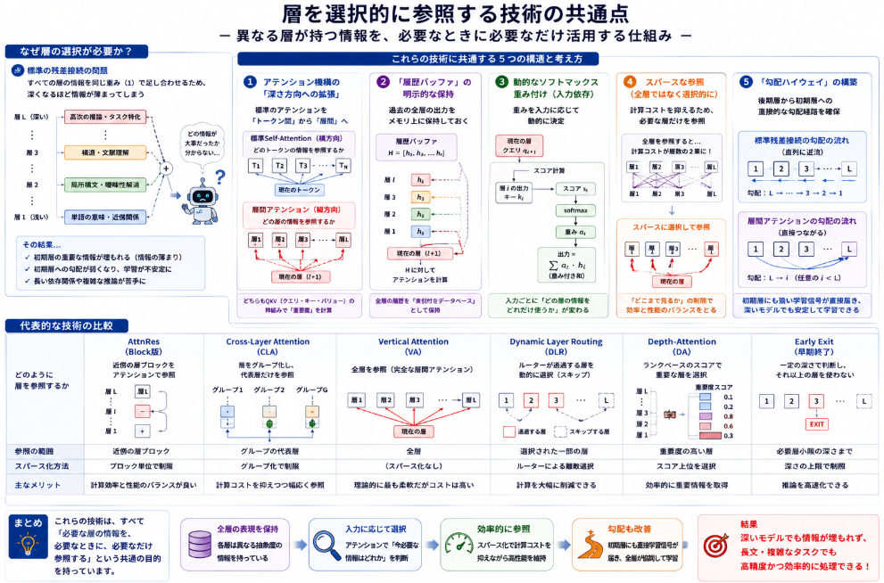

昨日話をした[Kimi K3](https://yoshishinnze.hatenablog.com/entry/2026/10/03/043000)に出てきたアイデアのうち 層を選択的に参照する アイデアである **AttnRes** という考えについて気になりました。
ニューラルネットワークの多層構造は思考の質を向上させるうえで重要ですが、本来問題の難易度に応じて制御されるべきです。
そんな層を選択的に参照する手法について調べてみました。

## アイデアの所在

**「層を選択的に参照する」というアイデア自体の原案・類似研究は複数存在します**。Attention Residuals（AttnRes）はこれらの流れを受けつつ、「残差接続そのものを層間アテンションで置き換える」という具体的な形で実装したものです。

以下に主な先行研究と、AttnResとの関係を整理します。

### 1. 層間アテンション・クロスレイヤー接続の先行研究

| 研究名 | 著者・年 | AttnResとの関係 |
|---|---|---|
| **Depth-Adaptive Transformer** | Elbayad et al. (2019/2020) | 入力の難易度に応じて「どの層で計算を終了するか」を動的に選択。AttnResの「深さ方向の動的な扱い」の先駆け。 |
| **Deep Transformers with Latent Depth** | Li et al. (2020) | 各層を確率的にスキップする「潜在変数による深さ制御」。層の「使い分け」の原案。 |
| **Cross-Layer Attention** | Brandon et al. (2024) | KVキャッシュを層間で共有・圧縮し、異なる層間でアテンションを取る仕組み。AttnResの「層間アテンション」の直接的な先行概念。 |
| **Vertical Attention** | Kojima et al. (2025/2026) | Transformerの「層間接続」を自動探索・学習する手法。AttnResの「層を選択的に繋ぐ」という発想と極めて近い。 |
| **Depth-Attention: Cross-Layer Value Mixing** | Zeng et al. (2026) | 後続の層が先行する層のValue表現を選択的に混合（Mixing）する手法。AttnResとほぼ同時期に独立して提案された類似アプローチ。 |


### 2. 動的深さ・レイヤールーティングの先行研究

層そのものを「スキップする」「繰り返す」「順序を変える」というアイデアも、AttnResの「選択的な層参照」と概念的に重なります。

- **DeeBERT / DynaBERT** (2020): 入力に応じて途中の層で推論を終了する「Early Exit」。「全層を必ず通す必要はない」という発想の先駆け。
- **Router-Tuning: Dynamic-Depth in Transformers** (2024): 各層を通過するかどうかを「ルーター」で動的に決定。
- **Radial Networks: Dynamic Layer Routing** (2024): 層の実行順序を動的に変更。
- **Dr.LLM: Dynamic Layer Routing in LLMs** (2025): 大規模言語モデルでの層ルーティング。
- **MACRO: Markov Chain Routing of Transformer Layers** (2026): マルコフ連鎖で層間の遷移を制御。

### 3. AttnResの新規性は何か

これらの先行研究がある中で、AttnResが独自の貢献とする点は以下の通りです（論文 arXiv:2603.15031 からの推定）。

**従来の残差接続の問題の定式化**

標準的な残差接続（PreNorm）は「全層の出力を固定された重み1で足し合わせる」ため、深さに比例して隠れ状態が線形に成長し、各層の個別の寄与が「薄まる（dilution）」ことを数学的に指摘しました。

**解決策：残差接続を「深さ方向のアテンション」に置き換える**

$$
h_{l+1} = \alpha_0 h_1 + \sum_{i=1}^{l} \alpha_i f_i(h_i)
$$

各層が「過去の全層の出力」に対してソフトマックスアテンションを計算し、動的に重み付けした加重和を取ることで、固定加算の代わりに「必要な層だけを選択的に参照」します。これは従来の「層をスキップする」系の研究とは異なり、**全層の情報を保持しつつ、その寄与を動的に調整する**点で新しいアプローチです。

### まとめると

「層を選択的に参照する」という概念自体は、Depth-Adaptive Transformer（2019）やCross-Layer Attention（2024）、Vertical Attention（2025）など、**少なくとも5年以上にわたる研究の流れの中に存在**していました。

AttnResの本質的な新規性は、「残差接続というTransformerの基盤構造そのものを、アテンション機構で置き換える」という**根本的な再設計**にあり、単なる層のスキップやルーティングではなく、「深さ方向の情報集約」を学習可能にした点にあります。

## なぜ層の選択が必要か？

そもそもですがニューラルネットワークにおいて層の選択的な参照が重要となるのでしょうか。
層を選択的に参照することが重要な理由は、**「異なる層が異なる情報を持っているのに、標準のTransformerは後続の層がその情報を自由に使えない」** という構造的な問題を解決するためです。以下に具体的な理由を整理します。

### 1. 標準の残差接続では「情報が薄まる」

Transformerの標準的な残差接続（PreNorm）は、各層の出力を**すべて同じ重み（1）で足し合わせて**次に渡します。

$$
h_{l+1} = h_l + f_l(h_l)
$$

これを展開すると、最終層の隠れ状態は「全層の出力の累積和」になります。問題は、**層が深くなるほど各層の個別の寄与が「薄まる（dilution）」**ことです。100層を超えるようなモデルでは、初期層が持つ重要な情報（例えば単語の基本意味や局所的な構造）が、後の層の膨大な加算の中で「埋もれて」しまい、実質的に参照できなくなります。

### 2. 各層は「異なる抽象度」の表現を持っている

Transformerの層を観察すると、以下のような傾向が知られています。

| 層の深さ | 担う情報の性質 |
|---|---|
| **浅い層（初期）** | 局所的な構文、単語の基本的な意味、近傍の関係性 |
| **中間層** | 句・節レベルの構造、照応関係、文脈的な曖昧性解消 |
| **深い層（後期）** | 高次の推論、論理関係、タスク特化の判断 |

つまり、**後期の層が判断を下す際に必要な情報は、必ずしも「すぐ前の層」にはない**のです。しかし標準の残差接続では「直前の層の出力 + α」しか見えないため、初期層の低次ながら決定的な情報に「振り返る」ことができません。

### 3. 後続の層が「必要な表現を検索できる」ようになる

層を選択的に参照できると、後続の層は「過去の全層の出力」を候補として持ち、**「今の判断に必要な表現はどれか」をアテンションで動的に選べます**。

これは人間が長文を読むときに「重要な箇所だけを振り返る」のと同じです。標準の残差接続は「教科書を1ページずつ順番に読んで、前のページの内容を思い出せなくなる」状態ですが、選択的参照は「いつでも前のページを索引付きで引ける」状態になります。

### 4. 勾配の流れも改善される（学習の安定化）

標準の残差接続では勾配は主に「直前の層」に逆流しますが、選択的参照では**後期の層から初期層への直接的な勾配パス**が生まれます。

- 初期層が「重要な特徴を捉えていれば」、後期層がそれを選んで大きな重みを与える
- その結果、初期層にも大きな学習信号が直接届く
- 深いモデルで起きやすい「初期層の勾配消失」が緩和され、**全層が協調して学習できる**

## アイデアの共通点

これらの技術には **「層を選択的に参照する」という目的を実現するための共通の構造と考え方**が存在します。以下に主要な共通点を整理します。

### 1. アテンション機構の「深さ方向への拡張」

最も根本的な共通構造は、**アテンションを「トークン間（横方向）」から「層間（縦方向）」へ拡張する**という考え方です。

- 標準のSelf-Attention: 「どのトークンの情報を参照するか」を選択
- 層間アテンション: 「どの層の表現を参照するか」を選択

どちらも**クエリ・キー・バリュー（QKV）の枠組み**を使います。AttnResでは「現在の層が発行するクエリ」と「過去の各層の出力をキー・バリューとして」照合し、ソフトマックスで重みを決定します。Cross-Layer AttentionやDepth-Attentionも同様のQKV構造を層間に適用しています。


### 2. 「履歴バッファ」の明示的な保持

選択的参照を実現するには、**過去の全層の出力をメモリ上に保持しておく**必要があります。

```
履歴バッファ H = [h_1, h_2, ..., h_l]  （各層の出力を蓄積）
現在の層 l+1 は、H に対してアテンションを計算
```

これは標準のTransformerでは「直前の層の出力しか保持しない」状態から、**全層の履歴を「索引付きデータベース」として保持する**構造的変更を意味します。AttnRes、Vertical Attention、Depth-Attentionいずれもこの「層の履歴バッファ」が前提となっています。

### 3. 動的なソフトマックス重み付け（入力依存の選択）

標準の残差接続では重みは固定（`+1`）ですが、これらの技術では**重みを入力に応じて動的に決定**します。

$$
\alpha_i = \text{softmax}(\text{score}(q_{l+1}, k_i))
$$

これにより「この入力に対しては初期層の情報が重要」「別の入力では中間層が重要」といった、**入力ごとに最適な層の組み合わせ**を柔軟に選べます。Dynamic Layer RoutingやDr.LLMも同様に「入力に応じた経路選択」を行いますが、ソフトマックスによる「重み付き和」を使うか「離散的なスキップ」を使うかが主な違いです。


### 4. スパースな参照（全層ではなく選択的に）

全層を常に参照すると計算コストが層数の2乗に比例して増大します。これを避けるための共通の工夫が**スパース化**です。

| 手法 | スパース化の方法 |
|---|---|
| **AttnRes（Block版）** | 近傍の層ブロックだけを参照（全層参照の近似） |
| **Cross-Layer Attention** | 層をグループ化し、代表層だけを参照 |
| **Dynamic Layer Routing** | ルーターが「通過する層」を少数だけ選択 |
| **Early Exit** | 必要な深さで計算を終了し、深い層を使わない |

「全層を見る」理想形と「計算コストを抑える」実用形の間で、**どこまで参照範囲を制限するか**が設計上の共通のトレードオフです。

### 5. 「勾配ハイウェイ」の構構築

層を選択的に参照することで、**後期層から初期層への直接的な勾配パス**が生まれます。

標準の残差接続では勾配は `l+1 → l → l-1 → ... → 1` と順に逆流しますが、層間アテンションでは `l+1 → i`（任意の i < l+1）への直接の勾配が流れます。これは構造的に**スキップ接続を多重度化した「勾配ハイウェイ」** と言えます。DeeBERTやDepth-Adaptive Transformerでも「浅い出口」が深い層への勾配を短絡させる役割を担っています。

### 6. まとめ：共通の構造を図式化すると



これらの技術は、**「Transformerは横方向（トークン間）には強いが、縦方向（層間）には弱い」** という構造的な非対称性を補うという、共通の問題意識から生まれています。

## 総括

層を選択的に参照するということの本質は、**「深さ方向の情報の非対称性」を解消し、モデルに「必要な知識を必要なときに取り出す自律性」を与えること**です。

具体的には3点に集約されます。

1. **情報の薄まりを防ぐ**: 深い層ほど初期層の情報が埋もれる「dilution」を解消し、どの深さの表現も等しく参照可能にする
2. **抽象度のミスマッチを解消する**: 後続の層が「今必要な抽象度」の表現（局所的な構文か高次の推論か）を、過去の全層から自由に検索・統合できるようにする
3. **計算を入力に応じて最適化する**: 問題の難易度に応じて「どの層の知識を使うか」を動的に決定し、無駄な深さの計算を避ける

一言で表せば、**「層を通過する列車から、各層がただ受け取るだけの受動的な管ではなく、過去の全層を索引付きで検索できる能動的な情報システムへと進化させること」** が本質です。

