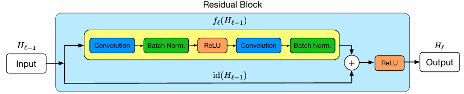
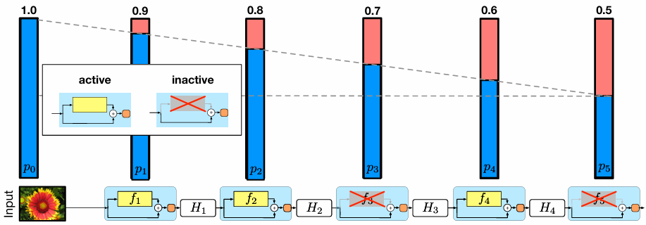

## 論文概要
まずは論文の概要です。

### 論文情報
論文の明細となる情報です。

| 項目 | 内容 |
|------|------|
| **タイトル** | Deep Networks with Stochastic Depth |
| **著者** | Gao Huang, Yu Sun, Zhuang Liu, Daniel Sedra, Kilian Q. Weinberger |
| **発表会議** | [ECCV 2016](https://mlanthology.org/eccv/2016/huang2016eccv-deep/) (European Conference on Computer Vision) |
| **発表年** | 2016年 |
| **ページ** | pp. 646–661 |
| **DOI** | [10.1007/978-3-319-46493-0_39](https://doi.org/10.1007/978-3-319-46493-0_39) |
| **arXiv** | [1603.09382](https://arxiv.org/abs/1603.09382) |
| **著者所属** | Cornell University, Tsinghua University |

- **ECCV (European Conference on Computer Vision)** は、コンピュータビジョン分野における世界トップクラスの国際会議です（CVPR・ICCVと並ぶ三大国際会議の一つ）。したがって、本論文は査読を経た高品質な学術論文として認められています。
- 本論文は2016年3月30日に[arXiv](https://arxiv.org/abs/1603.09382)に先行公開された後、同年のECCV 2016に採択されました。
- 著者のGao Huang氏は、その後も[Densely Connected Convolutional Networks (DenseNet, CVPR 2017 Best Paper)](https://arxiv.org/abs/1608.06993)など、深層学習分野で多大な貢献を続けている研究者です。
- 本論文は現在までに約**2,000回以上**の被引用を記録しており、現在のレイヤー選択・動的深度調整研究における最も重要な基盤論文の一つです。

当時のニューラルネットワークは現在のようなAIエージェントやLLMではなく画像でした。
画像のトップカンファレンスで採択された重要な論文だったと言えます。

## 解決しようとした課題

[Stochastic Depth (2016)](https://arxiv.org/abs/1603.09382) が解決しようとした課題は、**「非常に深いニューラルネットワークの学習が困難である」** という問題です。具体的には、以下の3つの課題が挙げられています。

### 1. 勾配消失（Vanishing Gradients）

非常に深いネットワークでは、勾配情報を逆伝播させる際に、多くの層を通過するたびに勾配が小さくなり、**浅い層（入力に近い層）に十分な学習信号が届かなくなります**。これにより、ネットワーク全体が効果的に学習できなくなります。

### 2. 特徴の消失（Diminishing Feature Reuse / Loss of Information Flow）

順伝播の方向でも同様の問題が発生します。入力や浅い層で計算された特徴が、多くの層を通過するうちに **「薄まって」しまい**、後の層が意味のある勾配方向を学習しにくくなります。これは勾配消失と対になる問題として、順方向の情報伝達における障害です。

### 3. 学習時間の長期化（Long Training Time）

ネットワークが深くなるほど、順伝播と逆伝播の計算量は層数に比例して増加します。例えば、当時の[ResNet-152](https://arxiv.org/abs/1512.03385)のようなモデルは、ImageNetデータセットでの学習に**数週間**を要し、実用上の大きなボトルネックとなっていました。

### 論文が指摘した根本的なジレンマ

本論文は、研究者が直面する次のような本質的な矛盾を明確にしています。

> **「テスト時には深いネットワーク（表現力が高い）が欲しいが、学習時には浅いネットワーク（学習しやすい・速い）が欲しい」**

通常、この二つは同時に満たせませんが、[Stochastic Depth](https://arxiv.org/abs/1603.09382) は、**学習時に層を確率的にドロップ（スキップ）して浅いネットワークとして学習し、テスト時にはすべての層を使って深いネットワークとして動作させる**ことで、このジレンマを解決しました。

### 補足：関連する先行研究との違い

本論文では、これらの課題に対する先行研究として以下が挙げられています。

- **[Batch Normalization](https://arxiv.org/abs/1502.03167)**: 勾配消失を軽減し、正則化効果もあるが、学習時間の問題を根本的には解決しない
- **[Highway Networks](https://arxiv.org/abs/1505.00387)**: パラメータ化されたスキップ接続で情報の流れを改善するが、追加のパラメータが必要
- **[Residual Networks (ResNet)](https://arxiv.org/abs/1512.03385)**: 恒等写像によるスキップ接続で勾配・特徴の流れを改善するが、深さが増すほど学習時間は依然として長い

[Stochastic Depth](https://arxiv.org/abs/1603.09382) は、これらの成果をさらに発展させ、**ResNetの残差ブロックをランダムにドロップする**という極めてシンプルな手法で、上記3つの課題を同時に解決することを示しました。

## 提案手法

[Stochastic Depth](https://arxiv.org/abs/1603.09382) で提案された解決策は、**「学習時に層を確率的にドロップ（スキップ）し、恒等写像でバイパスする」** という極めてシンプルな手法です。以下に詳細をご説明いたします。

### 手法の概要

ResNetの残差ブロックに対して、**各ミニバッチごとに独立に層をランダムにドロップ**します。ドロップされた層は恒等写像（identity function）で置き換えられ、入力がそのまま出力に渡されます。

__通常のResNetの順伝播__

$$H_\ell = \text{ReLU}(f_\ell(H_{\ell-1}) + \text{id}(H_{\ell-1}))$$

__Stochastic Depth による順伝播__

各層 $\ell$ に対して、生存確率 $p_\ell$ に基づくベルヌーイ確率変数 $b_\ell \in \{0, 1\}$ をサンプリングし：

$$H_\ell = \text{ReLU}(b_\ell \cdot f_\ell(H_{\ell-1}) + \text{id}(H_{\ell-1}))$$

- $b_\ell = 1$ のとき：通常通りその層を通過（生存）
- $b_\ell = 0$ のとき：その層をスキップ（恒等写像のみ）

### 生存確率の設定

論文では、層の深さに応じて生存確率を変える**線形減衰スケジュール（linear decay rule）** を提案しています。

$$p_\ell = 1 - \frac{\ell}{L}(1 - p_L)$$

- $\ell$：層のインデックス
- $L$：総層数
- $p_L$：最終層の生存確率（ハイパーパラメータ、通常 $p_L = 0.5$）

浅い層ほど高い確率で生存させ、深い層ほどドロップしやすくすることで、**浅い層の特徴が確実に後の層に伝わる**ように設計されています。

### テスト時の動作

学習時とは対照的に、**テスト時にはすべての層を使用**します。このとき、各層の出力を生存確率でスケーリングすることで、期待値を一致させます。

$$H_\ell = \text{ReLU}(p_\ell \cdot f_\ell(H_{\ell-1}) + \text{id}(H_{\ell-1}))$$

これにより、テスト時には**深くて表現力の高いネットワーク**として動作します。

### なぜこれが課題を解決するのか

__1. 学習時間の短縮__

学習時に層がドロップされるため、順伝播・逆伝播の計算量が減少します。特に深い層ほどドロップ確率が高いため、**期待深度が実際の深度より大幅に短くなり**、学習時間が短縮されます。

__2. 勾配消失と特徴消失の緩和__

層がスキップされることで、勾配や特徴が**短い経路で直接伝播する**ことが可能になります。これにより、浅い層にも強い学習信号が届きます。

__3. 正則化効果（アンサンブル効果）__

[Dropout](https://arxiv.org/abs/1207.0580) と同様に、異なる深度のサブネットワークが暗黙的にアンサンブルされる効果があります。Batch Normalization と併用しても正則化効果が確認されています。

## 実験

[Stochastic Depth](https://arxiv.org/abs/1603.09382) の実験内容と結果を、以下にまとめてご案内いたします。

### 実験で行ったこと

__使用したデータセット__

| データセット | 内容 |
|-----------|------|
| **CIFAR-10** | 10クラスの小型画像分類（50,000枚学習 / 10,000枚テスト） |
| **CIFAR-100** | 100クラスの小型画像分類 |
| **SVHN** | 街路番号認識データセット |
| **ImageNet** | 大規模画像分類（1,000クラス） |

__使用したモデル__

[ResNet](https://arxiv.org/abs/1512.03385) をベースに、以下の深度で実験を実施しました。

- **ResNet-110**（CIFAR-10 / CIFAR-100 / SVHN）
- **ResNet-1202**（CIFAR-10 / CIFAR-100）
- **ResNet-152**（ImageNet）

__比較条件__

| 条件 | 説明 |
|------|------|
| **Constant Depth（ベースライン）** | 通常のResNet（すべての層を常に使用） |
| **Stochastic Depth（線形減衰）** | 論文で提案した線形減衰ルールで層を確率的にドロップ |
| **Stochastic Depth（一様割り当て）** | すべての層で同じ生存確率を使用 |

生存確率の設定では、最終層の生存確率 $p_L$ を 0.2 から 0.8 の範囲で変化させ、その影響を分析しました。

### 実験結果

__1. CIFAR-10 の結果__

| モデル | 手法 | テスト誤差 |
|--------|------|-----------|
| ResNet-110 | Constant Depth | **6.41%** |
| ResNet-110 | Stochastic Depth | **5.25%** |
| ResNet-1202 | Stochastic Depth | **4.91%** |

- ResNet-110 で **1.16ポイント** の誤差削減を達成
- ResNet-1202（1,202層）では **4.91%** を記録し、深さを1,000層以上に拡張してもなお改善が確認されました

__2. CIFAR-100 / SVHN の結果__

- CIFAR-100 と SVHN の両方で、**Constant Depth より Stochastic Depth の方が一貫して低いテスト誤差** を記録
- 110層・1,202層の両方のモデルで同様の傾向が確認されました

__3. 学習時間の短縮__

| データセット | 短縮効果 |
|-----------|---------|
| CIFAR-10/100/SVHN | 学習時間が大幅に短縮（期待深度が大幅に減少） |
| ImageNet | **25%短縮** |

特に、ResNet-110（$L=110$, $p_L=0.5$）では、期待深度が約 **40層** に短縮され、学習時間が劇的に減少しました。

__4. ImageNet の結果__

| 条件 | 検証誤差 | 備考 |
|------|---------|------|
| Constant Depth | **23.06%** | 通常のResNet |
| Stochastic Depth | **23.38%** | 同じ学習時間で比較 |
| Stochastic Depth（同時間まで学習） | **21.98%** | 学習時間をConstant Depthと同じだけ延長 |

ImageNet では、同じ学習時間で比較すると誤差はほぼ同等ですが、**学習時間を25%短縮できる**という利点があります。さらに、学習時間を同じだけ延長して比較すると、**21.98%** と誤差が大幅に改善しました。

### 追加分析

__勾配の大きさ（Mean Gradient Magnitude）__

各エポックにおける勾配の平均大きさを測定した結果、**Stochastic Depth の方が Constant Depth より一貫して大きな勾配** を示しました。これは、層のドロップにより勾配消失が緩和されていることを実証しています。

__生存確率とネットワーク深度の影響__

- **線形減衰ルール** は **一様割り当て** より一貫して優れた結果を示しました
- $p_L$ が **0.4 から 0.8** の範囲であれば、線形減衰ルールは競争力のある結果を得られました
- $p_L = 0.2$ の場合でも良好な性能を維持しつつ、**学習時間を40%削減** できました
- ヒートマップ分析から、**十分に深いモデル** であれば、Stochastic Depth がベースラインを大きく上回ることが確認されました

## 総括

[Stochastic Depth (2016)](https://arxiv.org/abs/1603.09382) の立ち位置と主張の本質について、以下にまとめてご説明いたします。

### 1. 深層学習史における立ち位置

__「深さの限界」を押し広げた転換点__

2016年当時、深層学習界隈では [ResNet (2015)](https://arxiv.org/abs/1512.03385) の登場により「100層を超えるネットワークも学習できる」という認識が広まったばかりでした。しかし、ResNet でも152層を超えると学習が不安定になり、1,000層以上では性能がむしろ劣化するという「深さの壁」が存在していました。

[Stochastic Depth](https://arxiv.org/abs/1603.09382) は、この壁を**初めて実用的に突破した論文**です。ResNet-1202（1,202層）で4.91%という当時としては驚異的な精度を達成し、「理論上は深い方が表現力があるが、学習が難しい」というジレンマを、**学習アルゴリズムの側から解決**した点で画期的でした。

__系譜上の位置づけ__

| 時代 | 代表的研究 | 解決した問題 |
|------|----------|------------|
| 2015 | [ResNet](https://arxiv.org/abs/1512.03385) | 恒等写像で勾配・特徴の流れを確保 |
| **2016** | **[Stochastic Depth](https://arxiv.org/abs/1603.09382)** | **学習時の「実効的な深さ」を動的に制御** |
| 2019 | [LayerDrop](https://arxiv.org/pdf/1909.11556) | Transformerへの拡張・推論時プルーニング |
| 2024 | [Mixture-of-Depths](https://arxiv.org/abs/2404.02258) | トークン単位での動的計算配分 |

つまり、[Stochastic Depth](https://arxiv.org/abs/1603.09382) は **「層をスキップする」という発想の最初の学術的確立**であり、現在の LLM における動的深度調整・レイヤープルーニング・動的ルーティングの**直接的な思想的起源**となっています。

### 2. 論文の主張の本質

__核心的洞察：「学習時とテスト時で異なるネットワークを使え」__

本論文の最も本質的な主張は、以下の一文に集約されます。

> **「テスト時には深いネットワークが欲しいが、学習時には浅いネットワークが欲しい。この矛盾を、確率的に層をドロップすることで同時に実現できる」**

これは、当時の深層学習における暗黙の前提、すなわち **「学習したネットワーク構造と推論時の構造は同一であるべきだ」** という常識を覆すものでした。

__なぜこれが重要か__

深層学習では一般に、以下のトレードオフが存在します。

- **浅いネットワーク**：学習しやすい・速いが、表現力が不足
- **深いネットワーク**：表現力は高いが、勾配消失・学習時間の問題が深刻

[Stochastic Depth](https://arxiv.org/abs/1603.09382) は、このトレードオフを **「構造そのものを動的に変える」** ことで解消しました。これは単なるハイパーパラメータ調整や正則化技術の延長ではなく、**ネットワークの「深さ」という本質的な属性を確率的に操作する**という、パラダイム的な発想転換でした。

__正則化としての新しい次元__

[Dropout](https://arxiv.org/abs/1207.0580) は「ニューロン（幅）」をランダムに落とすことで共適応を防ぎましたが、[Stochastic Depth](https://arxiv.org/abs/1603.09382) は **「層（深さ）」をランダムに落とす**ことで、異なる深度のサブネットワークのアンサンブルを暗黙的に学習します。これは「ネットワークを細くする」のではなく「ネットワークを短くする」正則化であり、深さに起因する問題（勾配消失・学習時間）に直接対処する、より根本的なアプローチです。

### 3. 現在の研究への影響

本論文の主張は、以下の現在の研究トレンドの基盤となっています。

__動的深度調整（Adaptive Depth）__

[Mixture-of-Depths](https://arxiv.org/abs/2404.02258) や [Token-Select](https://arxiv.org/html/2605.05222v1) など、入力に応じて層をスキップする現在の最先端研究は、すべて **「すべての入力にすべての層を使う必要はない」** という [Stochastic Depth](https://arxiv.org/abs/1603.09382) の洞察を発展させたものです。

__学習時プルーニング（Training-time Pruning）__

[LayerDrop](https://arxiv.org/pdf/1909.11556) や [LaCo](https://aclanthology.org/2024.findings-emnlp.372.pdf) など、学習中に層の重要性を学習しつつ冗長な層を特定する手法は、[Stochastic Depth](https://arxiv.org/abs/1603.09382) の「学習時に層を落とす」という発想を、**確率的ドロップから学習可能な選択へ**と拡張したものです。

__計算効率の最適化__

現在の LLM における推論効率化の多くは、「どの層を使うか」を動的に決定することに依存しています。この方向性の最初の学術的証明が [Stochastic Depth](https://arxiv.org/abs/1603.09382) においてなされた、と言えるでしょう。

### まとめ

[Stochastic Depth (2016)](https://arxiv.org/abs/1603.09382) は、深層学習の歴史において **「ネットワークの深さを固定的な属性から確率的に操作可能な変数へと転換した」** 論文です。その主張の本質は、**「学習時とテスト時で異なるネットワーク構造を使うことで、深さのトレードオフを解消できる」** という洞察にあります。この一見シンプルなアイデアは、現在の動的深度調整・レイヤー選択・計算効率化研究の**思想的な原点**となっています。
