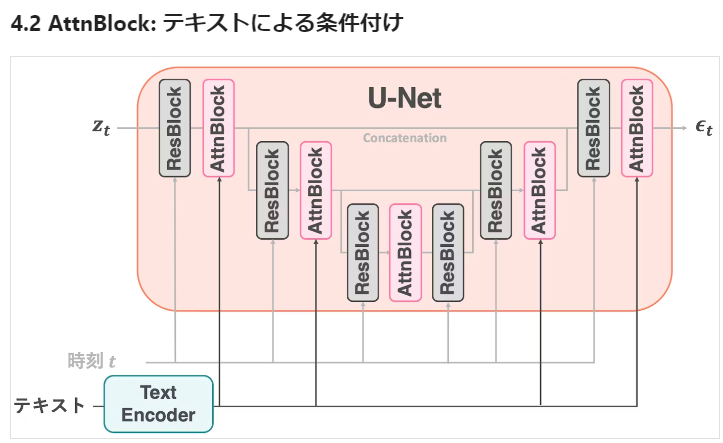
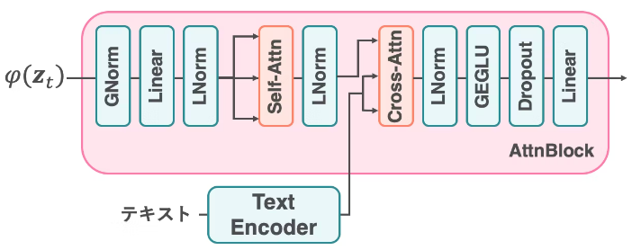
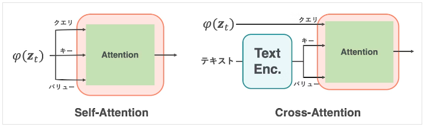
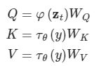

## 論文
A Multimodal Lightweight Approach to Fault Diagnosis of Induction Motors in High-Dimensional Dataset
https://arxiv.org/pdf/2501.03746v1

## 趣旨
産業環境における計画外のダウンタイムを減少させ、全体的なメンテナンスコストを削減するためのプロアクティブな保守強化に焦点を当てています。  
誘導モーターの一般的な故障の一つとして、破損したロータバー（BRB）故障があります。著者らは、これまでの研究が相対的に小規模なデータセットで学習されてきたため、産業環境でこれらのシステムを実装する際に過学習のリスクがあることを指摘しています。  
本論文では、Transfer Learningを活用した軽量なディープラーニングモデルであるShuffleNetV2を使用し、現在および振動信号データを用いて1から4個のロータバー故障を診断するための大規模データセットを使用することでこの課題を解決しています。  
このモデルは高次元データセットにおいて高い正確性を示し、実用的な診断システムの基盤を提供しています。  
大規模なデータセットを用いることで既存の過学習のリスクを軽減し、より産業適用可能な故障診断モデルを提案している点です。  
従来の方法では、比較的小規模なデータセットでのモデル学習が一般的であり、それが産業現場での実用化を妨げていました。  

しかし、この研究では57,500のスペクトル画像をデータセットとして使用し、そのうち47,500枚を訓練用、10,000枚をテスト用として分けています。また、モデルの演算コストを抑えつつ、98.856％という高い分類精度を達成していることも特筆すべき点です。従来の方法と比べてデータの一次元アップが図られたシステムを提案することで、より安定した性能が期待できるという点で画期的です。  

## 手法
この研究の核心となる技術は、Transfer Learningと軽量ディープラーニングモデルであるShuffleNetV2の組み合わせにあります。  
ShuffleNetV2は、計算コストを抑えながらも高い精度を狙ったモデルで、高次元データの分類に適しています。  
さらに、訓練およびテスト用のスペクトル画像を生成する際に短時間フーリエ変換(STFT)を使用することで、信号の時間-周波数特性を視覚化しモデルの訓練に役立てています。  
さらに、故障バーから生じる高調波の特性を視覚化するための高速フーリエ変換(FFT)も適用しており、データの詳細な分析が可能になっています。  
大規模データセットによって過学習のリスクを軽減していますが、異なる種類のモーターや故障モードに対する一般性についての議論は残されています。  
また、ShuffleNetV2のような軽量モデルが持つ限界についても検討の余地があり、さらなる最適化や他のアプローチとの比較が必要です。  
加えて、この研究は特定のモーターフォルトに特化しているため、より多様な故障モードへの拡張に関する考察も今後の課題として提案されています。  

## クロスモーダルアテンション
複数の異なるモダリティ（例えば、テキスト、画像、音声など）間で情報を相互に関連付けるためのメカニズムです。  
これにより、異なるモダリティからの情報を統合し、より豊かな表現を得ることができます。  

クロスモーダルアテンションの動作  
1. 特徴抽出
モーダリティより特徴を抽出。  
テキストからはBERTのようなエンコーダモデル。画像であれば、ResNetのようなCNNが一般的。  
2. アテンション機構
一報のモダリティの特徴をベースに、もう一方のモダリティの特徴に対してアテンションを計算する。  
これによりお互いの関連性を学習する。  
3. 結合表現の生成
アテンションの結果を用いて、異なるモダリティを統合した表現を生成することが出来る。  
これより、異なるモダリティより得られる情報より相互補完して、より豊かな表現が得られる。

## クロスアテンション
こっちが原文のものでした。。。  
注意機構には 2 種類ある。1 つは 自己注意機構（Self-Attention） 、もう 1 つは Cross-Attention である。異なる点は入力の違いである。自己注意機構では、 クエリ、キー、バリュー を同じベクトルから作成する。一方、Cross-Attention では、クエリを通常の入力から作成するが、 キーとバリューはエンコーダの出力 から作成する。最後に、 FeedForward ネットワーク がある。Transformers は常に同じ隠れ次元を維持するが、この 層だけは次元が異なる 。このブロックは 2 つの全結合層と 1 つの活性化関数からなり、最初の層で隠れ次元を 4 倍にする。活性化関数の後に、次元を元に戻す。

出力は処理された特徴量である。この 特徴量から、lm_head と呼ばれる層 を通して次のトークンを予測する。 lm_head は output_embeddings とも呼ばれ 、元論文では入力の埋め込み層と 同じパラメータ を使用している。これにより、モデル全体のパラメータ数を大幅に削減できる。学習時はすべてのトークンを使って損失を計算するが、推論時は最後のトークンの特徴量から次のトークンを予測する。

## クロスアテンションとセルフアテンション
考えるのはこのモデル  

AttnBlockの中身は上図のようになっています。ごちゃごちゃと書いてありますが、AttnBlockは、「Self-Attention」と「Cross-Attention」の2つが重要です（図中、橙色）13。それ以外はただの線形層やノーマライゼーション層です。  
CLIPによって学習されたText Encoderの出力は、Cross-Attentionで取り込まれています。テキストによる条件付けは、Cross-Attentionで行われています。  

  

zt: U-netの中間表現(を1次元ベクトル化したもの)  
y: M個のトークンを持つテキスト  

違い：Self-AttentionとCross-Attentionの違いは、キーおよびバリューの作り方だけです。　　
これにより、本体の中間表現が、テキストから条件に従っていると思われる表現に対して強調されるようになる。  

## メリット
情報の統合：異なるモダリティからの情報を統合することで、より豊かな表現が得られます。
関連性の学習：異なるモダリティ間の関連性を学習することで、タスクのパフォーマンスが向上します。
柔軟性：様々なタスク（画像キャプション生成、ビジュアル質問応答、マルチモーダル検索など）に適用可能です。

## その他参考情報

https://journal.ntt.co.jp/article/3085?_gl=1*1gq4tml*_ga*NTMzMjY5MDAuMTc0MzEyNjYzOQ..*_ga_5CBG7Y69V5*MTc0MzEyNjYzOS4xLjEuMTc0MzEyNjY2OC4wLjAuMA..

マルチモーダルデータセットについてさらっと触れてくれてます。
https://note.com/kudu6337/n/nf93dd299c1c9

マルチモーダル実装しているUniter
https://github.com/ChenRocks/UNITER/blob/master/model/model.py

