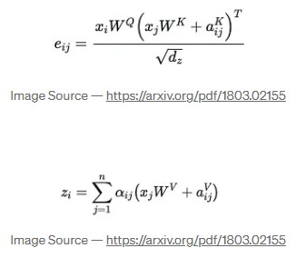
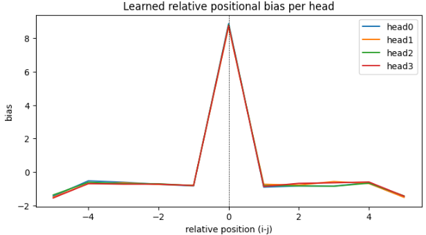

# 相対位置エンコーディング

相対位置を検出する **Relative Positional Encoding（相対位置エンコーディング）** の特徴を、わかりやすくまとめます。

## ✅ Relative Positional Encoding の特徴

### 1. **単語（token）の“相対的な距離”を学習する**

従来の **絶対位置埋め込み (absolute PE)** は

「1番目の単語」「2番目の単語」…のように **固定された順序** を渡しますが、

**相対位置埋め込み** は

「この単語の左に2個目にある単語」

「右隣の単語」

のように **距離関係** をモデルに教えます。

📌 **順番そのものではなく “間隔” を理解する**

> 間隔を理解するための位置関係を提供する

### 2. **文の長さが変わっても性能が安定**

絶対PEは

→ 長さが変わると位置がズレる

相対PEは

→ **距離で判断する**ので、文章長変化に強い

表形式データ、音声、コード理解、長文タスクに有利。

> 相対PEは距離で判断するので文章長変化に強い

### 3. **Attention計算の中に組み込む**

相対PEは、Attentionのスコアに直接足し込みます：

$$
Attention(Q,K) = QK^T + relative_{bias}
$$

📌 **位置を独立した embedding ではなく “Attention の一部” として扱う**

### 4. **順序の移動にロバスト**

「猫が魚を食べた」

「魚を猫が食べた」

のように語順が変わっても、

🍀 **"猫 → 魚"の相対関係** を理解しやすい。

---

### 5. **トランスフォーマーベースで主流になりつつある**

代表例：

| モデル         | 相対PE方式                     |
| -------------- | ------------------------------ |
| Transformer-XL | relative attention             |
| T5             | relative positional bias       |
| DeBERTa        | disentangled relative position |

---

## ✅ Absolute vs Relative の比較

| 観点       | 絶対PE          | 相対PE                |
| ---------- | --------------- | --------------------- |
| 何を学習？ | 位置そのもの    | 距離（相対関係）      |
| 長文耐性   | 弱い            | 強い                  |
| 汎用性     | 中              | 高（順序変化に強い）  |
| 実装場所   | Token embedding | Attention内に埋め込む |

---

## ✅ 直感的な理解例

> 文章を読むとき、
>
> 「この単語は文の3番目」より
>
> 「この単語は主語の近く」
>
> のほうが意味理解に役立つ

相対PEは  **自然な人間の理解方式に近い** 。

## ✨ まとめ

| 特徴                   | 内容                                 |
| ---------------------- | ------------------------------------ |
| 位置ではなく距離を学習 | 間隔＝意味手がかり                   |
| 長文に強い             | Transformer弱点の補強                |
| Attentionに統合        | より柔軟で直感的                     |
| 多くの最新モデルで採用 | 特に言語・視覚・マルチモーダルで有効 |

## 距離バケット

「距離バケット（distance bucket）」とは、**相対位置（relative position）の距離を離散的なカテゴリにまとめたもの**です。

相対位置埋め込み（Relative Position Encoding）やT5の相対バイアスで使われる概念です。

> 距離バケットとは相対位置の距離を離散的なカテゴリとまとめたもの。



### 🔍 なぜ距離バケットが必要？

Transformer では「トークン同士がどれくらい離れているか」を学習したい時があります。

例：

「隣の単語は重要」「遠い単語は関係弱い」など。

しかし、距離をそのまま使うと…

* 距離の種類が膨大になる（例：長い文章なら距離=100とかもあり得る）
* 全距離に対して別の埋め込みを持つと**パラメータが増えすぎる**

そこで、**距離を丸めてグループ化**します → これが「距離バケット」
(なんとなくわかっていたことが、隣会うような単語は正確な位置が重要だが、遠い単語は離れているという情報だけで十分だった。そこで距離をバケットに分類した)

### ✅ 例

`max_rel_pos = 4` の場合、考慮する相対距離は [-4, 4] です。

距離 → バケット

```
-4 → バケット0
-3 → バケット1
-2 → バケット2
-1 → バケット3
 0 → バケット4 (自分自身)
+1 → バケット5
+2 → バケット6
+3 → バケット7
+4 → バケット8
```

つまり：

| 相対距離 | バケット（カテゴリ）       |
| -------- | -------------------------- |
| -10      | バケット0 (≒すごく遠い左) |
| -2       | バケット2                  |
| 0        | バケット4*(同じ位置)*      |
| +3       | バケット7                  |
| +50      | バケット8*(すごく遠い右)*  |

### 🧠 概念的説明

**「近い」「少し遠い」「遠い」「かなり遠い」**

のように、距離をラベル付けして学習させる手法です。

- 近距離は正確に: 距離が非常に近い場合（例: 1, 2, 3, 4, 5...）、それぞれの距離に対して固有の値を割り当てます。
- 遠距離はまとめて: 距離が離れるにつれて、距離の範囲を対数的に（指数関数的に）大きくしていき、同じグループ（バケット）にまとめます。例えば、距離が10〜15の範囲は1つのバケット、16〜25は別のバケット、といった具合です。
- 方向も区別: 前後の方向も区別します（例: 前に5つ離れている、後ろに5つ離れている）。

### 📦 どこで使われている？

* T5
* DeBERTa
* Longformer等の長文Transformer
* ViTやVLMの相対位置埋め込み

### 🎯 直感

> 距離そのものを覚えるのではなく
>
> **距離の「範囲（グループ）」**を覚える

→ メモリ節約、長文に強い、一般化が良い

### もし図で表すと

距離 → そのまま

```
-10 -9 -8 -7 -6 -5 -4 -3 -2 -1 0 +1 +2 +3 +4 +5 +6 ...
```

↓ バケット化（例）

```
[すごく左] [-3] [-2] [-1] [0] [+1] [+2] [+3] [すごく右]
```

## `_relative_indexの意味`

`_relative_index` は、**各トークンペアの相対位置（距離）を表すインデックス行列を作る関数**です。

相対位置エンコーディング（Relative Positional Encoding / Relative Bias）のために必要な「距離バケット」のインデックスを生成します。

> トークンの相対位置を表すインデクス行列を作る関数。
>
> 相対位置エンコーディングのために必要な距離パケットのインデクスを生成する。

### 具体的に何をしている？

#### 目的：

`(seq, seq)` 形状の行列を返し、

位置 *i* の Query と 位置 *j* の Key の**相対距離 (i - j)** を表します。

* 例：トークン列長 = 5なら、位置0〜4
* 相対距離行列はこうなる：

| i\j         | 0     | 1      | 2      | 3      | 4      |
| ----------- | ----- | ------ | ------ | ------ | ------ |
| **0** | 0-0=0 | 0-1=-1 | 0-2=-2 | 0-3=-3 | 0-4=-4 |
| **1** | 1     | 0      | -1     | -2     | -3     |
| **2** | 2     | 1      | 0      | -1     | -2     |
| **3** | 3     | 2      | 1      | 0      | -1     |
| **4** | 4     | 3      | 2      | 1      | 0      |

### コード解説（逐行）

```python
idxs = torch.arange(seq_len, device=device)
```

トークン位置 `[0, 1, 2, ..., seq_len-1]` を作る

```python
rel = idxs[None, :] - idxs[:, None]
```

ブロードキャストして相対距離行列 `(seq, seq)` を作る

例（seq=3）

```
idxs = [0,1,2]
idxs[None,:] = [[0,1,2]]
idxs[:,None] = [[0],[1],[2]]
rel = [[0-0, 0-1, 0-2],
       [1-0, 1-1, 1-2],
       [2-0, 2-1, 2-2]]
    = [[0,-1,-2],
       [1, 0,-1],
       [2, 1, 0]]
```

```python
rel_clipped = rel.clamp(-self.max_rel_pos, self.max_rel_pos) + self.max_rel_pos
```

相対距離を範囲 `[-max_rel_pos, max_rel_pos]` に切り落とし、

負値を避けるため + `max_rel_pos` して **0 〜 2*max_rel_pos** のインデックスに変換。

例：max_rel_pos=2

* `-2~2` → clamp
* +2 → `0~4`

| 相対距離 rel | clamp | final index |
| ------------ | ----- | ----------- |
| -5           | -2    | 0           |
| -1           | -1    | 1           |
| 0            | 0     | 2           |
| +1           | +1    | 3           |
| +4           | +2    | 4           |

```python
return rel_clipped.long()  # shape: (seq, seq)
```

各 Query-Key ペアが **relative_bias テーブルのどの行を参照するか**の index行列になる。

### つまりどういう役割？

| 処理                   | 意味                                 |
| ---------------------- | ------------------------------------ |
| 相対距離(i-j)を計算    | どれくらい離れているか               |
| 距離を範囲内に切る     | 遠すぎる距離はまとめる（バケット化） |
| 正値インデックスに変換 | bias table 参照用にする              |
| 出力                   | (seq, seq) の「距離バケットID」行列  |

---

### なぜ必要？

T5型の相対位置バイアスは

```
Attention score += bias[head, relative_distance]
```

と **距離に応じた学習可能スカラー**を加算します。

そのときに

「i 番目→j 番目の attention の bias はどれか？」

を決めるために `_relative_index()` を使います。

---

### まとめ

`_relative_index` の役割：

> **各 Query-Token と Key-Token の相対距離を、relative bias テーブルを参照できるインデックス形式で生成する**

これによりモデルは

* 近い単語を見るヘッド
* 遠くを見るヘッド

  を学習できます。



