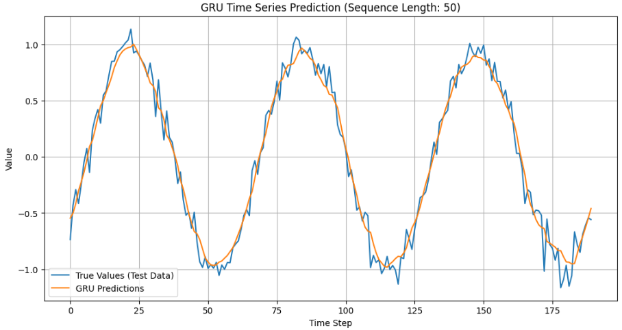

# Sequential Neural Network

Handling Sequential Data and Word Relationships
To process textual data, it's crucial to be able to handle sequential data. Furthermore, understanding the relationships between words within a sentence is also essential.

In this context, we will be focusing on neural networks designed to address these challenges.

## LSTM

### Key Characteristics of LSTM (Long Short-Term Memory Networks)

**1. Ability to Capture Long-Range Dependencies**
LSTM networks are specifically designed to overcome the vanishing and exploding gradient problems of traditional RNNs.
They maintain information over long time spans, enabling effective modeling of long-term temporal dependencies.

**2. Gated Architecture for Controlled Information Flow**
LSTM uses three gates:

* **Input gate** controls how much new information is added.
* **Forget gate** decides what information to discard.
* **Output gate** determines what information is passed to the next layer.
  These gates allow the model to regulate information retention and updates dynamically.

**3. Cell State as a Persistent Memory**
The cell state acts as a dedicated memory channel that runs through the network with minimal modification.
This allows the LSTM to carry context across many timesteps without significant degradation.

**4. Robustness to Noisy or Irregular Sequences**
Due to controlled memory updates and gating, LSTMs are more stable when processing sequences with noise, missing values, or variable lengths.

**5. Effectiveness in Sequential Prediction Tasks**
LSTMs have been widely used in:

* Natural language processing
* Speech recognition
* Time-series forecasting
* Sequential decision-making

**6. Reduced Need for Hand-Engineered Features**
LSTMs learn complex sequence patterns automatically, lowering reliance on manual feature extraction.

__Loss Curve (Loss Plot)__

The progression of loss during the training and evaluation phases is summarized below.
The loss converged not only during training but also during evaluation.

__Visualization of Sequence Examples__

It is expected that LSTM will be able to retain complex periodicities that are difficult for standard RNNs to handle.
The results of the actual prediction are shown below.
Although there are some areas where the prediction graph does not match the peak heights, it is believed to have largely traced the true waveform.

__sequential forecast__

An LSTM model was trained to predict a waveform composed of superimposed sine waves. The figure below shows the post-training results. It can be observed that the model predicts with a reasonable degree of accuracy, even with the presence of both low and high-frequency components.

__sentence classification__

An LSTM model was evaluated on a text classification task involving three categories and varying text lengths. The post-training classification results are presented below. A significant degradation in accuracy was observed as the sequence length increased.

## GRU

The Gated Recurrent Unit (GRU) is a type of **Recurrent Neural Network (RNN)** architecture introduced by Kyunghyun Cho et al. in 2014. It was designed to solve the **vanishing gradient problem** inherent in standard RNNs, making it highly effective for modeling sequential data like time series and natural language.

GRU achieves this by incorporating **gating mechanisms** similar to those in the Long Short-Term Memory (LSTM) network, but with a simpler structure and fewer parameters.

### 1. Key Components: The Two Gates

GRU simplifies the LSTM cell from three gates (input, forget, output) down to just two primary gates, which control the flow of information into the cell and determine how much of the past state should be carried forward.

#### A. Reset Gate ($r_t$)
The reset gate determines **how much of the previous hidden state ($h_{t-1}$) to forget or ignore** when calculating the *candidate* hidden state ($\tilde{h}_t$).

$$\boldsymbol{r}_t = \sigma(\boldsymbol{W}_r \cdot [\boldsymbol{h}_{t-1}, \boldsymbol{x}_t] + \boldsymbol{b}_r)$$

* If $r_t$ is close to 0, the previous hidden state is effectively ignored (reset), allowing the cell to start learning a new sequence pattern quickly.

#### B. Update Gate ($z_t$)
The update gate acts as a combination of LSTM's input and forget gates. It determines **how much of the previous hidden state ($h_{t-1}$) to keep** and **how much of the new candidate state ($\tilde{h}_t$) to incorporate** into the current hidden state ($h_t$).

$$\boldsymbol{z}_t = \sigma(\boldsymbol{W}_z \cdot [\boldsymbol{h}_{t-1}, \boldsymbol{x}_t] + \boldsymbol{b}_z)$$

### 2. Candidate Hidden State ($\tilde{h}_t$)

This state is calculated using the input $\boldsymbol{x}_t$ and the previous hidden state $\boldsymbol{h}_{t-1}$, but the previous state is first multiplied element-wise by the **reset gate** $\boldsymbol{r}_t$. This allows the model to selectively discard irrelevant information from the past.

$$\tilde{\boldsymbol{h}}_t = \tanh(\boldsymbol{W}_{\tilde{h}} \cdot [\boldsymbol{r}_t \odot \boldsymbol{h}_{t-1}, \boldsymbol{x}_t] + \boldsymbol{b}_{\tilde{h}})$$

### 3. Final Hidden State ($h_t$)

The final hidden state at time $t$ is a linear combination of the previous hidden state and the new candidate state, weighted by the update gate $\boldsymbol{z}_t$.

$$\boldsymbol{h}_t = (1 - \boldsymbol{z}_t) \odot \boldsymbol{h}_{t-1} + \boldsymbol{z}_t \odot \tilde{\boldsymbol{h}}_t$$

* If $z_t$ is close to 1, the model mostly keeps the new candidate information.
* If $z_t$ is close to 0, the model mostly retains the information from the previous hidden state, facilitating long-term memory flow.

### Summary: GRU vs. LSTM

GRU is preferred when **computational efficiency** and **reduced parameter count** are critical, as it generally performs comparably to LSTM in many tasks while being structurally simpler. GRU only maintains **one hidden state** ($\boldsymbol{h}_t$) rather than the two states (hidden state $\boldsymbol{h}_t$ and cell state $\boldsymbol{C}_t$) used in LSTM.

### Differences Between GRU and LSTM 

In tasks such as video recognition and language processing, where **medium to high-dimensional feature vectors** are utilized, **GRU (Gated Recurrent Unit) offers better computational efficiency.**

However, if the input feature vector is **low to medium-dimensional** and the sequence length is not excessively long—such as when analyzing raw 1D waveforms without prior feature extraction—**LSTM (Long Short-Term Memory) may be sufficient.**

Furthermore, GRU generally does not possess the same level of **long-term memory capability** as the original, unsimplified LSTM. Consequently, in scenarios where GRU fails to achieve satisfactory performance, **LSTM may yield better prediction accuracy.**

The conscious understanding of how to differentiate and deploy these two models is important.

| Feature | GRU (Gated Recurrent Unit) | LSTM (Long Short-Term Memory) |
| :--- | :--- | :--- |
| **Number of Gates** | 2 (Reset Gate, Update Gate) | 3 (Input Gate, Forget Gate, Output Gate) |
| **Internal States** | Only Hidden State ($h_t$) | Two types: Hidden State ($h_t$) and Cell State ($C_t$) |
| **Complexity** | Simpler than LSTM, fewer parameters | More complex than GRU, more parameters |
| **Computational Cost** | Lower than LSTM | Higher than GRU |
| **Performance** | Shows comparable performance to LSTM in many tasks | Exhibits very high representational power and performance |

The following shows the result of periodic time-series prediction performed using a GRU (Gated Recurrent Unit). Similar to LSTM, it was confirmed that the prediction is reasonably accurate.

## Summary of Challenges in Conventional Models for Text Processing

| Feature | RNN / LSTM | CNN | Transformer (LLM) |
| :--- | :--- | :--- | :--- |
| **Computational Process** | **Sequential (Slow, No Parallelization)** | Parallelizable | **Ultra-Parallel (High Speed)** |
| **Information Handling** | Compresses all past information into a single point | Local (Within a fixed window only) | **Self-Attention (Directly calculates relationships between all tokens)** |
| **Long-Term Dependency** | Poor (Vanishing Gradient) | Poor (Requires extremely deep layers) | **Excellent (Consistent regardless of distance)** |
| **Positional Information** | Implicitly maintained through sequential processing | Often lost with Pooling | **Explicitly defined with Positional Encoding** |
| **Scalability** | Difficult | Possible, but unsuitable for language tasks | **Extremely Easy (Laws of Scaling)** |
