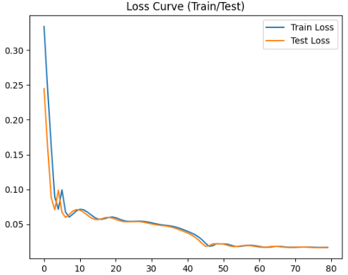
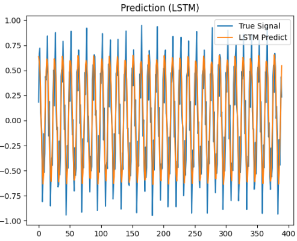
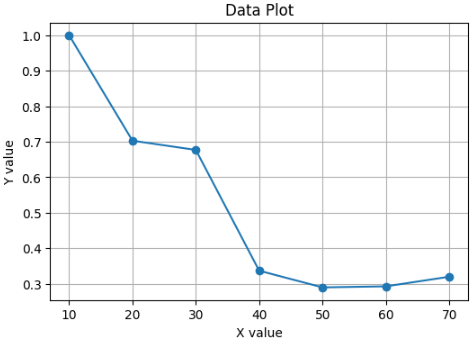

# Sequential Neural Network

Handling Sequential Data and Word Relationships
To process textual data, it's crucial to be able to handle sequential data. Furthermore, understanding the relationships between words within a sentence is also essential.

In this context, we will be focusing on neural networks designed to address these challenges.

## LSTM

### Key Characteristics of LSTM (Long Short-Term Memory Networks)

**1. Ability to Capture Long-Range Dependencies**
LSTM networks are specifically designed to overcome the vanishing and exploding gradient problems of traditional RNNs.
They maintain information over long time spans, enabling effective modeling of long-term temporal dependencies.

**2. Gated Architecture for Controlled Information Flow**
LSTM uses three gates:

* **Input gate** controls how much new information is added.
* **Forget gate** decides what information to discard.
* **Output gate** determines what information is passed to the next layer.
  These gates allow the model to regulate information retention and updates dynamically.

**3. Cell State as a Persistent Memory**
The cell state acts as a dedicated memory channel that runs through the network with minimal modification.
This allows the LSTM to carry context across many timesteps without significant degradation.

**4. Robustness to Noisy or Irregular Sequences**
Due to controlled memory updates and gating, LSTMs are more stable when processing sequences with noise, missing values, or variable lengths.

**5. Effectiveness in Sequential Prediction Tasks**
LSTMs have been widely used in:

* Natural language processing
* Speech recognition
* Time-series forecasting
* Sequential decision-making

**6. Reduced Need for Hand-Engineered Features**
LSTMs learn complex sequence patterns automatically, lowering reliance on manual feature extraction.

__Loss Curve (Loss Plot)__

The progression of loss during the training and evaluation phases is summarized below.
The loss converged not only during training but also during evaluation.

__Visualization of Sequence Examples__

It is expected that LSTM will be able to retain complex periodicities that are difficult for standard RNNs to handle.
The results of the actual prediction are shown below.
Although there are some areas where the prediction graph does not match the peak heights, it is believed to have largely traced the true waveform.

