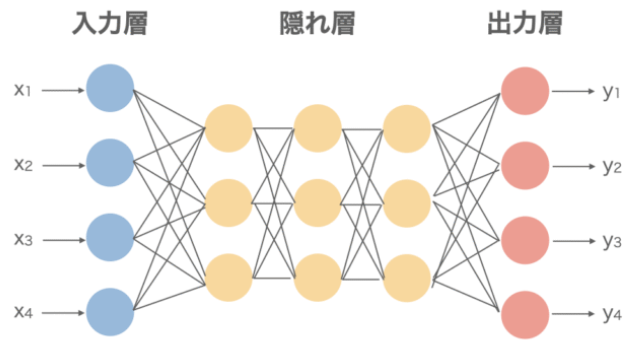
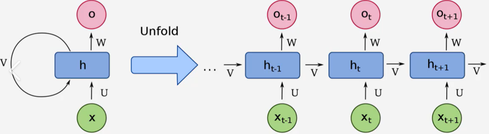

## RNN
まずは時系列情報を扱う初期の頃のニューラルネットワークであるRNNについて説明を行います。

#### RNN の概要

RNN（Recurrent Neural Network）は、**時系列データや文章のように「順番が重要なデータ」を扱うためのニューラルネットワーク**です。

従来のニューラルネットワーク（MLP / CNN）は、

* 入力を **すべて同時に処理**し
* **順序** という概念を持っていません

そのため、以下のような「過去 → 現在 → 未来」という流れを理解するのが苦手でした。

RNNはこれを解決するため、**1単語ずつ（1時刻ずつ）順番に入力を処理し、過去の情報（内部状態）を記憶しながら次の処理に進む構造**を持ちます。

図で表すとこうです：

!$$1765096384766$$(image/2-RNN/1765096384766.png)

* x1, x2, x3 …：文章や時系列の各要素
* h1, h2, h3 …：RNNが内部に保持する「記憶」

これにより、

✔ 「文章の前半の意味を踏まえて後半を処理する」
✔ 「1秒前の値と比較して判断する」

などが可能になります。

#### RNN が解決したかった課題

__課題1：順番を無視してしまう問題__

従来のニューラルネットワークは、文章を「順不同の特徴量」として扱っていました。

例えば、

* 「私は**犬が好き**です」
* 「犬は**私が好き**です」

は単語は似ていても意味が全く違います。

**順序（トークンの並び）なしでは意味を正確に理解できない**という問題がありました。

RNNは、

> 「前の単語を踏まえて次の単語を処理する」
> という仕組みを導入することで、この問題を解決しました。

__課題2：時系列データの依存関係を捉えられない__

従来のモデルでは、

* 昨日の気温 → 今日の気温
* 1フレーム前の音声 → 今の音声
  のような **連続した関係** を表すことが困難でした。

RNNは内部状態 h(t) に過去の情報を蓄積することで、

- 機械翻訳
- 音声認識
- 株価予測
- センチメント分析

など、「時間の流れで意味が変化するデータ」の扱いを可能にしました。

__課題3：入力長が可変のデータを扱えない__

従来のニューラルネットワークは、固定長のベクトルしか扱えません。

しかし、実際のデータは：

* 5単語の文もある
* 20単語の文もある
* 音声の長さもバラバラ

RNNは **1ステップずつ処理を繰り返す仕組み**のため、
入力の長さが自由でした。


#### RNN が持ち込んだ革新性（まとめ）

| 課題                | RNNがもたらした解決       |
| ----------------- | ----------------- |
| 単語の順序を扱えなかった      | 過去の情報を保持しながら順番に処理 |
| 時系列の依存関係を捉えられなかった | h(t) に時間に沿った記憶を保持 |
| 可変長データが扱えなかった     | 任意の長さのデータを処理可能に   |
| 文章・音声などの連続データが困難  | 翻訳・音声認識などが初めて高精度に |

---

# ◆ さらに分かりやすい例（直感的理解）

**文脈を覚えていないと意味が変わる例：**

▼文章A
「私は昨日スーパーで**肉を買った**。
その肉を今日の夕飯で食べた。」

▼文章B
「私は昨日スーパーで**肉を買った**。
その**犬を**今日の夕飯で食べた。」

後半だけ見たら
「犬を食べた」？？
意味が通らない。

RNNのように **前の文脈を覚えながら読む** ことが自然な理解につながります。

---

# ◆ まとめ

RNNは、

> **「過去の情報を記憶しながら順番に処理できるネットワークを作る」**

という目的で開発されました。

その結果、

✔ 文章
✔ 音声
✔ 時系列データ

など、人間にとって自然な「流れ・順序」のある情報を扱えるようになり、
現代の LSTM・GRU・Transformer、そして LLM の基盤となっていきました。

#### RNNの構造的な特徴

以下ではRNNの仕組み、構造の詳細について説明します。


__RNN の構造的な仕組み__

RNN は **「系列データ（文章・音声・時系列データなど）」を扱うために作られたニューラルネットワーク** です。
一番の特徴は、**過去の情報を“内部状態（隠れ状態: hidden state）”として保持しながら次の入力に渡す**という仕組みです。


__1. 入力が「順番に」処理されるネットワーク__

通常のニューラルネットワーク（多層パーセプトロン）は、
入力が一度きりで **固定長ベクトルに対する処理** しかできません。しかし文章や時系列は…

- 入力が1文字ずつ（または1単語ずつ）来る
- 長さも一定ではない
- 前の情報を覚えておく必要がある

そこで RNN は **1ステップずつ処理する流れ** を持っています。

__2. RNN の基本構造__

RNN の処理は次の式で表されます：
ステップ t の入力を xₜ、隠れ状態を hₜ とおいて

1. 現在の隠れ状態を計算

$$
h_t = \tanh(W_{xh} x_t + W_{hh} h_{t-1})
$$

過去の状態 hₜ₋₁ と 今の入力 xₜ が合わさって 次の状態 hₜ が決まる

2. 必要なら出力 yₜ を作る

$$
y_t = W_{hy} h_t
$$

これを **時系列の長さだけ繰り返す** 仕組みが RNN の骨格です。

3. これが意味すること

**過去の情報が内部に“流れる”

隠れ状態 hₜ が「メモリ」のような役割を果たす。

**系列の長さが変わっても処理可能**

文章が10単語でも100単語でも、ループで回すだけ。

**パラメータ量は一定**

入力が増えても

* Wₓₕ
* Wₕₕ
* Wₕᵧ
の3つの重みは変わらない。


4. 普通のNNとの違いを図でイメージ




```
通常のNN：
   x → $$NN$$ → y （1回だけの処理）

RNN：
   x1 →$$RNN$$→ h1 → y1
              ↓
   x2 →$$RNN$$→ h2 → y2
              ↓
   x3 →$$RNN$$→ h3 → y3
              ↓
             …
```

hₜ が次の hₜ₊₁ へ渡るので、**過去の記憶を持ち続ける**。

__3. RNN が当時解決したかった課題__

| 課題                   | RNNが解決したこと      |
| -------------------- | --------------- |
| 通常のNNでは系列を扱えない       | 時間方向にループする構造を導入 |
| 入力の長さが変化するデータに対応できない | 何ステップでも処理できる    |
| 文章や音声の“文脈”を理解できない    | 隠れ状態で文脈を保持      |

__4. RNN の弱点__

後の LSTM や Transformer が出る理由にもつながります：

* 長い文章では「記憶が消える」（勾配消失・爆発）
* 計算が逐次処理で遅い（並列化できない）

→ その後、LSTM・GRU → Transformer へ発展


