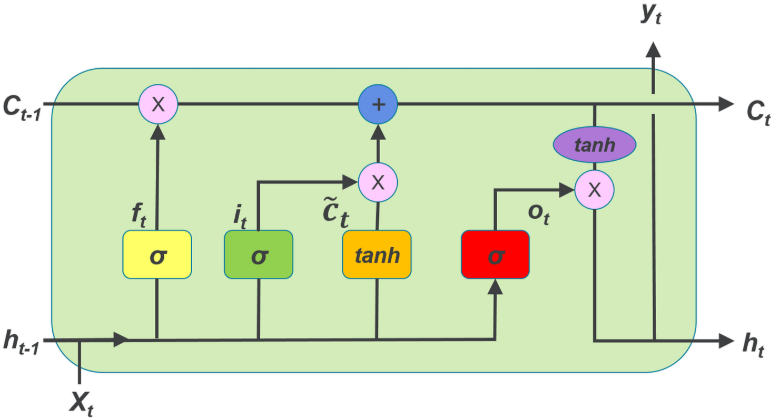

### LSTM
RNNで時系列情報が扱えることを説明しました。
ですが、RNNには長期記憶の保持が出来ないといった課題があります。
LSTMはこの課題に対する解決を試みたニューラルネットワークです。


#### LSTM の概要（Long Short-Term Memory）

LSTM（Long Short-Term Memory）は **RNN（再帰型ニューラルネットワーク）を改良したモデル**で、
**長い時系列データの依存関係を保ちながら学習できるようにした構造**を持っています。

普通の RNN は、文章や時系列データのような「順番のある情報」を扱えるものの、**長期依存問題（Long-Term Dependency）**という課題がありました。

普通の RNN では、

* 20単語前の情報
* 100ステップ前の時系列の動き

といった **遠い過去の情報がどんどん薄れていく（勾配消失）** という問題が発生します。

#### RNNの課題の原因

RNN の学習は「時間方向に逆伝播」しますが、
多くの時刻をまたぐと **勾配が指数的に小さくなる**ため、
過去の情報がほとんど反映されなくなるからです。

結果として、

* 文脈が長い文章が理解できない
* 遠い過去の値が重要な時系列に弱い

という欠点がありました。

#### LSTM が解決したかった課題

LSTM は以下の課題を解決するために作られました：

__1. 長い時系列の依存関係を保持したい__

文章例：

> 「太郎はリンゴが好きだと言った。**彼**はよく果物を買う。」

普通の RNNだと、「彼」が太郎を指していることを正しく保持できない。

LSTMでは長期的な情報（太郎）が保持可能。

__2. 勾配消失を防ぎたい__

RNN の「勾配が途中で消えてしまう問題」を
LSTM のセル状態（メモリ）が安定的に保持することで改善。


__3. 必要な情報だけを選んで残したい__

LSTMには「ゲート機構」がある：

* **忘却ゲート（Forget Gate）**
  　→ 不要な情報を消す
* **入力ゲート（Input Gate）**
  　→ 新しい情報をどれだけ追加するか決める
* **出力ゲート（Output Gate）**
  　→ 次のステップへ渡す情報を調整する

これらにより、「何を覚えて何を忘れるか」を柔軟に制御できるようになりました。

以下では **LSTM の構造と仕組み** を、できるだけ噛み砕いて説明します。
「RNN の弱点をどう補ったのか？」が理解できるように整理しています。


#### LSTM（Long Short-Term Memory）の構造と仕組み

LSTM は **RNN の「長期記憶を保てない」問題を解決するために作られたモデル** です。

RNN は時間ステップを進めるごとに勾配が消えてしまい、「前からずっと続いている重要な情報」を覚えていられないという弱点がありました。

LSTM はそのために **“忘れる仕組み” と “覚える仕組み”** を追加しています。

__LSTM が持つ 3つのゲート__

LSTM は RNN に以下の 3 つの「ゲート（情報の出入りを調整する扉）」を追加した構造です。

1. 遺忘ゲート（Forget Gate）

* どの情報を捨てるか？
* 過去のセル状態から「いらない情報」を忘れる。

例：
「10 文前の日時はもう不要だから忘れる」

2. 入力ゲート（Input Gate）

* どの新しい情報を覚えるか？
* 今の入力のうち何を記憶に入れるか決める。

例：
「新しい単語“誕生日”は重要だから覚える」

3. 出力ゲート（Output Gate）

* 現在の出力として何を外に出すか？
* 次のステップにどんな情報を渡すか決める。

例：
「今の文脈では“今日は誕生日だよ”を出力しよう」


__LSTM の内部にある “セル状態（Cell State）”__

ゲートの出入りを通して保存される「長期記憶」のようなベルトコンベアです。

* RNN：一つの隠れ状態しかない → すぐ忘れる
* LSTM：**セル状態** が長い距離を情報を運べる

LSTM の仕組みを図にすると



__LSTM の計算式__

理解したい人向けに簡略式だけ紹介：

* 遺忘ゲート
  **fₜ = σ(Wf · [hₜ₋₁ , xₜ] + bf)**

* 入力ゲート
  **iₜ = σ(Wi · [hₜ₋₁ , xₜ] + bi)**
  **gₜ = tanh(Wg · [hₜ₋₁ , xₜ] + bg)**（新しい候補記憶）

* 新しいセル状態
  **Cₜ = fₜ ⊗ Cₜ₋₁ + iₜ ⊗ gₜ**

* 出力ゲート
  **oₜ = σ(Wo · [hₜ₋₁ , xₜ] + bo)**
  **hₜ = oₜ ⊗ tanh(Cₜ)**

「f（忘れる）・i（覚える）・o（出力）」の3つのゲートにより
長期記憶 Cₜ を自在に調整できるのが LSTM の強みです。

__LSTM の構造のポイントまとめ__

| 機能      | 説明             |
| ------- | -------------- |
| セル状態    | 長期記憶を保存する      |
| 遺忘ゲート   | 不要な記憶を忘れる      |
| 入力ゲート   | 新しい情報を選択して記憶する |
| 出力ゲート   | 現在の状態を外部へ出す    |
| 勾配消失に強い | 長文や長期依存の学習が可能  |


__例題:__ Adding Problem（加算問題）

ここでは古典的な「**Adding Problem（加算問題）**」を使います — 長い系列の中で 2 箇所だけにマスクが入り、その位置の値の和を予測するタスクです。
このタスクは「長い距離の情報を取り出して保持する能力」がないと解けません。LSTM と 単純な RNN を比較することで、LSTM のゲートがなぜ有効かを可視化できます。

今回の問題の特徴は以下の通りです。
* Adding problem は「必要な情報（2つの値）が系列の任意の遠い位置にあり、その値を覚えて合計しなければならない」ため、**長期記憶がないと困難**。
* LSTM のゲート（入力ゲート・忘却ゲート・出力ゲート）は、重要な情報を選んで**長く保持する**ことができるため、このタスクに強い。
* 一方、単純な RNN は勾配消失／爆発の問題で「遠い過去の情報を扱いにくい」ため性能が落ちやすい。


```python
# 必要ライブラリ
import torch
import torch.nn as nn
import torch.optim as optim
import numpy as np
import matplotlib.pyplot as plt
from tqdm import tqdm
import random
torch.manual_seed(0)
np.random.seed(0)
random.seed(0)

# デバイス
device = torch.device("cuda" if torch.cuda.is_available() else "cpu")
print("Device:", device)

# ======== データ生成：Adding Problem ========
# 入力: 長さ T の系列、各ステップは (value, marker)
# - value: U(0,1)
# - marker: 0, ただしランダムに2箇所だけ1になる
# 目的: marker==1 のときの value を足したスカラーを予測

def generate_adding_dataset(n_samples, seq_len=100):
    X = np.random.rand(n_samples, seq_len).astype(np.float32)  # values
    markers = np.zeros((n_samples, seq_len), dtype=np.float32)
    targets = np.zeros((n_samples,), dtype=np.float32)
    for i in range(n_samples):
        idx = np.random.choice(seq_len, size=2, replace=False)
        markers[i, idx] = 1.0
        targets[i] = X[i, idx].sum()
    # combine channels: shape (n, seq_len, 2)
    inputs = np.stack([X, markers], axis=-1)
    return torch.tensor(inputs), torch.tensor(targets).unsqueeze(1)  # target shape (n,1)

# ハイパーパラメータ
SEQ_LEN = 100
N_TRAIN = 4000
N_VAL = 1000
BATCH = 128
EPOCHS = 60
LR = 0.001
HIDDEN = 128

X_train, y_train = generate_adding_dataset(N_TRAIN, seq_len=SEQ_LEN)
X_val, y_val = generate_adding_dataset(N_VAL, seq_len=SEQ_LEN)

train_ds = torch.utils.data.TensorDataset(X_train, y_train)
val_ds = torch.utils.data.TensorDataset(X_val, y_val)
train_loader = torch.utils.data.DataLoader(train_ds, batch_size=BATCH, shuffle=True)
val_loader = torch.utils.data.DataLoader(val_ds, batch_size=BATCH)

# ======== モデル定義: SimpleRNN と LSTM を比較 ========
class SeqRegressorRNN(nn.Module):
    def __init__(self, input_size=2, hidden_size=HIDDEN, num_layers=1):
        super().__init__()
        self.rnn = nn.RNN(input_size, hidden_size, num_layers=num_layers, batch_first=True, nonlinearity='tanh')
        self.head = nn.Linear(hidden_size, 1)
    def forward(self, x):
        # x: (batch, seq_len, 2)
        out, hn = self.rnn(x)  # out: (b, seq_len, hidden)
        last = out[:, -1, :]   # 末尾タイムステップの出力
        return self.head(last)

class SeqRegressorLSTM(nn.Module):
    def __init__(self, input_size=2, hidden_size=HIDDEN, num_layers=1):
        super().__init__()
        self.lstm = nn.LSTM(input_size, hidden_size, num_layers=num_layers, batch_first=True)
        self.head = nn.Linear(hidden_size, 1)
    def forward(self, x):
        out, (hn, cn) = self.lstm(x)
        last = out[:, -1, :]
        return self.head(last)

# ======== トレーニング関数 ========
def train_model(model, train_loader, val_loader, epochs=EPOCHS, lr=LR):
    model = model.to(device)
    opt = optim.Adam(model.parameters(), lr=lr)
    criterion = nn.MSELoss()
    train_losses = []
    val_losses = []
    for epoch in range(1, epochs+1):
        model.train()
        running = 0.0
        for xb, yb in train_loader:
            xb, yb = xb.to(device), yb.to(device)
            opt.zero_grad()
            pred = model(xb)
            loss = criterion(pred, yb)
            loss.backward()
            opt.step()
            running += loss.item() * xb.size(0)
        train_loss = running / len(train_loader.dataset)
        train_losses.append(train_loss)

        # validation
        model.eval()
        with torch.no_grad():
            running = 0.0
            for xb, yb in val_loader:
                xb, yb = xb.to(device), yb.to(device)
                pred = model(xb)
                loss = criterion(pred, yb)
                running += loss.item() * xb.size(0)
            val_loss = running / len(val_loader.dataset)
            val_losses.append(val_loss)

        if epoch % 5 == 0 or epoch==1:
            print(f"Epoch {epoch:03d}  Train MSE: {train_loss:.6f}  Val MSE: {val_loss:.6f}")
    return model, train_losses, val_losses

# ======== 実験: RNN vs LSTM ========
rnn_model = SeqRegressorRNN()
lstm_model = SeqRegressorLSTM()

print("Training simple RNN...")
rnn_trained, rnn_train_losses, rnn_val_losses = train_model(rnn_model, train_loader, val_loader)

print("\nTraining LSTM...")
lstm_trained, lstm_train_losses, lstm_val_losses = train_model(lstm_model, train_loader, val_loader)

# ======== 可視化: ロス推移 ========
plt.figure(figsize=(8,4))
plt.plot(rnn_train_losses, label="RNN Train")
plt.plot(rnn_val_losses, '--', label="RNN Val")
plt.plot(lstm_train_losses, label="LSTM Train")
plt.plot(lstm_val_losses, '--', label="LSTM Val")
plt.yscale('log')
plt.xlabel("Epoch")
plt.ylabel("MSE Loss (log scale)")
plt.legend()
plt.title("Training and Validation Loss: RNN vs LSTM")
plt.grid(True)
plt.show()

# ======== 可視化: 予測精度（散布図） ========
def eval_scatter(model, X, y, n_points=200):
    model.eval()
    with torch.no_grad():
        inp = X[:n_points].to(device)
        pred = model(inp).cpu().numpy().ravel()
    target = y[:n_points].numpy().ravel()
    plt.figure(figsize=(5,5))
    plt.scatter(target, pred, s=8, alpha=0.6)
    plt.plot([0,2],[0,2], 'k--')  # 理想線 y=x
    plt.xlabel("True sum")
    plt.ylabel("Predicted sum")
    plt.title(type(model).__name__)
    plt.axis('equal')
    plt.grid(True)
    plt.show()

print("RNN predictions scatter:")
eval_scatter(rnn_trained, X_val, y_val)
print("LSTM predictions scatter:")
eval_scatter(lstm_trained, X_val, y_val)

# ======== 可視化: 例を取って系列内部を表示（どの位置を参照しているか） ========
def show_example_prediction(model, seq_len=SEQ_LEN):
    model.eval()
    Xs, ys = generate_adding_dataset(1, seq_len=seq_len)
    Xs_t = Xs.to(device)
    with torch.no_grad():
        pred = model(Xs_t).cpu().numpy().ravel()[0]
    values = Xs[0,:,0].numpy()
    markers = Xs[0,:,1].numpy().astype(int)
    true_sum = ys.item()
    plt.figure(figsize=(10,2))
    plt.plot(values, label='value sequence')
    plt.scatter(np.where(markers==1)[0], values[markers==1], color='red', s=80, label='masked positions')
    plt.title(f"True sum={true_sum:.4f}, Predicted={pred:.4f}  ({type(model).__name__})")
    plt.xlabel("Time step")
    plt.legend()
    plt.show()

print("One example RNN:")
show_example_prediction(rnn_trained)
print("One example LSTM:")
show_example_prediction(lstm_trained)
```

__出力の結果__

* **ロス曲線（ログスケール）**

  * 多くの場合、単純な RNN は学習が遅く、バリデーション誤差が高いまま推移しやすい。
  * **LSTM はより速く収束**し、最終的な MSE が小さくなる（長期依存を学べるため）。
* **散布図（真値 vs 予測）**

  * 理想は y=x の直線上に点が乗ること。LSTM の方が y=x に近く集まるはず。
* **系列例の可視化**

  * 時系列中の 2 箇所のマスク位置（赤点）と値を表示。LSTM はその位置の値を正しく足し合わせられ、予測が真値に近いはず。


