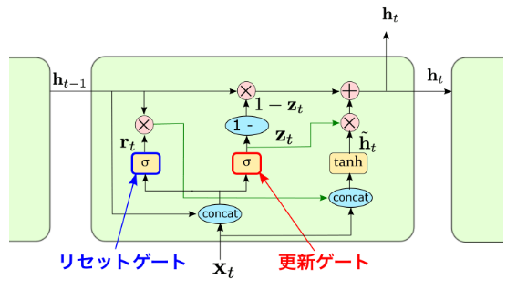

GRU（Gated Recurrent Unit）は、LSTM 以降に開発されたゲート付き RNN の一種で、**LSTM の弱点を解消しつつ性能はほぼ同等を狙った軽量モデル**です。
以下では、概要と GRU が解決したかった課題について整理します。

---

# GRU の概要

GRU は 2014 年に Cho らが提案した RNN アーキテクチャで、
**更新ゲート（update gate）** と **リセットゲート（reset gate）** の2つのゲートで隠れ状態を調節します。

これは LSTM の

* 入力ゲート
* 忘却ゲート
* 出力ゲート
* セル状態（memory cell）

などの構造を**大幅に簡素化**した設計で、計算コストを抑えながら長期依存を学習できるのが特長です。

---

# GRU が解決したかった課題

GRU が開発された背景には、RNN や LSTM の以下の課題があります。

---

## 1. LSTM が複雑すぎて重い

LSTM はゲートが3つ、セル状態が1つあり、
パラメータ数が多く、計算も重くなりがちです。

特に次の問題がありました。

* モデルが大きくメモリ消費が激しい
* 学習時間が長い
* 少量データでは過学習しやすい場合がある

GRU はゲートを2つに減らして構造をシンプルにし
**LSTM とほぼ同じ性能で計算量を削減**することを目的にしています。

---

## 2. RNN/LSTM の長期依存学習のさらなる改善

GRU は、LSTM と同様に**勾配消失問題に強く**、
次のような長期依存タスクを改善します。

* 長い文章の文脈保持
* 長い時系列の予測
* 途中で無関連な情報が入っても必要な情報だけ保持

GRU の update gate は
「どのくらい昔の情報を残すか」を直接コントロールできるため、
状態の更新がスムーズで学習しやすいという特徴があります。

---

## 3. LSTM より実装と最適化が容易

LSTM は

* セル状態 c
* 隠れ状態 h
  の2つを別々に管理する必要があるため実装が複雑。

GRU は
**状態ベクトルが1つ（h のみ）**で、構造が統一されています。

その結果、

* 実装が簡単
* チューニングしやすい
* GPU 最適化がしやすい

など、現場での運用性を向上させる目的があります。

---

# まとめ（Markdown 表）

| 項目        | 説明                                  |
| --------- | ----------------------------------- |
| アーキテクチャ   | 2つのゲート（更新・リセット）だけのシンプル構造            |
| 目的        | LSTM と同等の性能を、より少ない計算量で達成            |
| 解決したかった課題 | LSTM の複雑さと高コスト、RNN の勾配消失問題          |
| 特徴        | 長期依存保持、計算効率の向上、実装の容易さ               |
| 利点        | 軽量で高速、少量データでも安定、チューニングが簡単           |
| 欠点        | LSTM より若干表現力が低いケースあり（ただし多くのタスクでは同等） |

---

以下は、GRU（Gated Recurrent Unit）の構造を **数式ベース**で整理した解説です。
RNN の更新式との対比を意識して読むことで理解しやすくなります。

---

# GRU の数式ベースの構造

GRUは，LSTMの潜在変数メモリー部分を，少し簡易したモデル。
LSTMのゲート機構は，パラメータ数も多く，学習に時間がかかる原因ともなっていた．そこで，LSTMの各ゲートを結合し，2つのゲートから構成されるブロックへと単純化し，セルも用いず
だけで同等の働きを達成するようにし，LSTMよりも計算効率性を向上させた 。

GRU は以下の 2 つのゲートを使って隠れ状態を更新します。

1. 更新ゲート  ( z_t )
2. リセットゲート  ( r_t )

隠れ状態は ( h_t ) の1種類のみで、LSTM のようにセル状態 ( c_t ) を持ちません。

---

# 1. 更新ゲート update gate ( z_t )

更新ゲートは「過去の情報をどれだけ残すか」を決めるゲートです。

[
z_t = \sigma(W_z x_t + U_z h_{t-1})
]

意味：

* ( z_t \approx 1 ) なら
  → 過去の状態 ( h_{t-1} ) をほぼそのまま保持
* ( z_t \approx 0 ) なら
  → 今の入力 ( x_t ) を強く反映

LSTM の「忘却ゲート + 入力ゲート」に近い役割を **1つのゲートに集約**しています。

---

# 2. リセットゲート reset gate ( r_t )

リセットゲートは「どれだけ過去の情報を無視するか」を決めます。

[
r_t = \sigma(W_r x_t + U_r h_{t-1})
]

意味：

* ( r_t \approx 0 ) なら
  → 過去の状態をリセットして、新しい入力だけで計算
* ( r_t \approx 1 ) なら
  → 過去の状態をそのまま活用

特に「現在の入力と過去情報の関連が弱い場合」に機能します。

---

# 3. 候補状態 candidate activation ( \tilde{h}_t )

リセットゲートで調整された状態を使い、新しい候補の隠れ状態を計算します。

[
\tilde{h}*t = \tanh(W_h x_t + U_h (r_t \odot h*{t-1}))
]

ポイント：

* 過去を参照するとき、リセットゲート ( r_t ) によって絞られた情報だけを使う
* これにより、過去情報をほぼ無視した「リセットされた状態」も作れる

---

# 4. 隠れ状態の更新（GRU の本質）

最終的な隠れ状態は、過去の状態と新しい候補状態を **更新ゲート ( z_t )** を使って合成します。

[
h_t = (1 - z_t) \odot h_{t-1} + z_t \odot \tilde{h}_t
]

これは GRU の核心部分です。

意味：

* 更新ゲート ( z_t ) が大きいほど
  → 新しい情報（候補状態）が強く使われる
* 更新ゲート ( z_t ) が小さいほど
  → 過去の情報が維持される

---

# GRU の構造をまとめると

| 役割                 | 数式                                                   | 意味           |
| ------------------ | ---------------------------------------------------- | ------------ |
| 更新ゲート (z_t)        | (z_t=\sigma(W_z x_t+U_z h_{t-1}))                    | 過去をどれだけ保持するか |
| リセットゲート (r_t)      | (r_t=\sigma(W_r x_t+U_r h_{t-1}))                    | 過去情報をどれだけ使うか |
| 候補状態 (\tilde{h}_t) | (\tilde{h}*t=\tanh(W_h x_t + U_h(r_t\odot h*{t-1}))) | 今の時点の新しい情報   |
| 最終状態 (h_t)         | (h_t=(1-z_t)\odot h_{t-1} + z_t\odot \tilde{h}_t)    | 過去と新しい情報を融合  |

---

# LSTM との比較（構造面）

| 特徴     | LSTM           | GRU         |
| ------ | -------------- | ----------- |
| ゲート数   | 3つ（入力・忘却・出力）   | 2つ（更新・リセット） |
| 状態     | 隠れ状態 h とセル状態 c | h のみ        |
| パラメータ数 | 多い             | 少ない         |
| 計算量    | 重い             | やや軽い        |
| 表現力    | 高い             | LSTMに匹敵     |

## GRUとLSTMの違い
動画認識や言語処理などにおいて，中~高次元の特徴ベクトルを使う場合にはGRUの方が計算性効率が良い．
しかし，1次元の生波形をそのまま特徴化しないで解析する場合など，入力特徴ベクトルが低~中次元ベクトルであり，なおかつ系列長もあまり長くない対象であればLSTMで十分でもある．

またGRUは，省略前のLSTMほどの長期記憶性能は持ち合わせいないので，GRUだと性能が出ない場合には，LSTMのほうが予測性能が良くなる場合もある．

GRUは，省略前のLSTMほどの長期記憶性能は持ち合わせいないので，GRUだと性能が出ない場合には，LSTMのほうが予測性能が良くなる場合もある．2者の使い分け意識は大事である．

| 特徴 | GRU (Gated Recurrent Unit) | LSTM (Long Short-Term Memory) |
| :--- | :--- | :--- |
| **ゲート数** | 2つ (リセットゲート、更新ゲート) | 3つ (入力ゲート、忘却ゲート、出力ゲート) |
| **内部状態** | 隠れ状態のみ ($h_t$) | 隠れ状態 ($h_t$) とセル状態 ($C_t$) の2種類 |
| **複雑さ** | LSTMよりシンプルでパラメータ数が少ない | GRUより複雑でパラメータ数が多い |
| **計算コスト** | LSTMより少ない | GRUより多い |
| **性能** | 多くのタスクでLSTMと同等の性能を示す | 非常に高い表現力と性能を示す |

## Transformer以降

Vision and Languageや動画認識などで，引き続きGRUが系列モデル部に採用される傾向は続いた．Transformer・BERTは，そもそも大規模パラメータから成る巨大ネットワークであるので，系列長がどうこう言う以前に，大量データや大量タスクからの学習において威力を発揮する．

