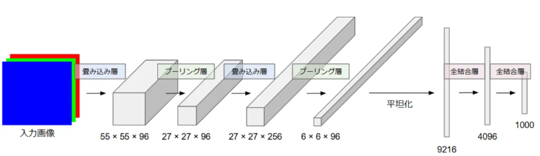
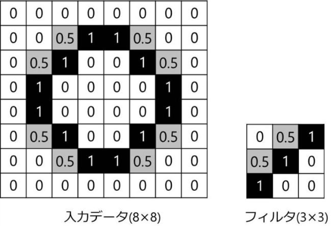

自然言語処理（特に LLM 開発の初期段階）で CNN が使われていた理由は、当時のモデル構造と計算機環境の制約を踏まえると非常に合理的でした。以下に、本質的な理由を体系的にまとめます。

---

# 1. **畳み込みは並列化でき、RNN より高速に学習できたため**

RNN や LSTM は本質的に逐次処理が必要です。

`t=1 → t=2 → t=3 → ...`

このため GPU の強みである「大規模並列計算」を活かしにくく、
学習が遅く、大規模データに向かなかったのが当時の課題でした。

一方、CNN は

* 畳み込み演算が完全に並列化可能
* GPU 向けに最適化されている
* バッチ計算が容易

という特徴があり、大規模データでも高速に学習できました。

LLM 以前の NLP はデータが急増していたため、「高速学習できる CNN」は魅力的な選択肢でした。

---

# 2. **局所的 n-gram パターン抽出に強く、文の特徴量を捉えやすかったため**

自然言語では

* 2〜5語程度の局所的な並び（n-gram）
* 特定のフレーズパターン
* ネガ・ポジ語の局所共起

が意味に大きく影響します。

CNN の畳み込みは
**「複数サイズのフィルタを使うことで、n-gram を自動抽出できる」**
という利点がありました。

例
3×1 のフィルタ → 3-gram
5×1 のフィルタ → 5-gram

これは RNN よりも強力に「局所特徴」を拾えることが多く、特に

* 文書分類
* 感情分析
* QA（初期）

などでは CNN が良い精度を出していました。

---

# 3. **RNN の勾配消失問題を回避しやすかったため**

RNN の初期型には深刻な問題がありました。

* 勾配消失
* 長距離依存の喪失
* 訓練が不安定
* 時間方向に深くすると壊滅的に学習が難しい

この頃は LSTM や GRU が登場して間もない段階で、まだ安定性の課題が大きかった時代です。

CNN には時系列依存を扱う構造はありませんが、逆に

* 勾配が消えにくい
* バッチノームなどで深いネットも安定
* 訓練が容易

という実用上のメリットが多かったため、研究者が積極的に選択していました。

---

# 4. **文長に依存しない処理が可能で、バッチ処理が簡単だったため**

RNN は

* 各サンプルで時系列長が違う
* パディング処理が必要
* バッチ化しにくい

という制約がありました。

一方 CNN は

* 長さが多少違っても畳み込みは簡単
* パディングが容易
* バッチ処理の恩恵が大きい

と、実務で使いやすかったため、自然言語の実プロダクトでも多く採用されました。

---

# 5. **文書分類モデル CNN-for-NLP が高い精度を出していたため（Kim CNN）**

2014 年の Kim(“CNN for Sentence Classification”) の成功が非常に大きく、
その後多くのモデルが CNN を採用しました。

Kim CNN は当時の主要タスク（感情分析・QA・主語分類）で

* シンプル
* 高速
* 高精度

という三拍子揃った成果を出したため、業界が真似する形で普及しました。

---

# 6. **初期 Transformer が登場するまでは、CNN が RNN の実質的代替手段だった**

Self-Attention が登場する以前（2017 年以前）には

* RNN は遅い
* LSTM は重い
* GRU もまだ発展途上

という状況だったため、CNN は

「並列化できる非RNNアーキテクチャ」

として注目されていました。

Transformer によってすべてが塗り替えられるまで、
「RNN以外の深層NLP」として有力だったのは CNN 系でした。

---

# まとめ（要点）

初期の LLM/NLP で CNN が使われた理由は以下のとおりです。

1. 並列化が容易で RNN より高速だった
2. n-gram の局所特徴抽出に優れ、文書分類で強かった
3. RNN の勾配消失問題の代替手段として有力だった
4. バッチ処理が容易で実務に向いていた
5. Kim CNN など成功事例が多かった
6. Transformer が登場するまでは RNN に代わる実用的な構造だった

---

必要であれば以下も作成できます。

・CNN と RNN の比較実験コード（Colab）
・CNN が文章をどのように処理しているかの可視化
・LLM の進化史（CNN → RNN → LSTM → Transformer）図解


## CNN
CNNは通常画像に用いられるアーキテクチャです。
ですがいくつかの特性があることで、LLMに用いられることがあります。
現在文章を扱うアーキテクチャとしてはTransformerが主流ですが、Transformer以前はCNNが文章を扱うアーキテクチャの主力となるとみられていました。

### CNNの概要

CNNは、局所領域の畳み込み、パラメータ共有、階層的な特徴抽出を核とし、空間的・時系列的なパターンを効率よく学習する深層ニューラルネットワークであり、位置不変性と高速な並列計算性能を備えたアーキテクチャです。
以下、アーキテクチャの特徴について説明します。


1. 局所受容野に基づく階層的な特徴抽出アーキテクチャ

CNNは、入力データに対して小さな領域（例：3×3、5×5といったパッチ）を畳み込む「畳み込み演算」を用いて、局所的なパターンを検出する構造を持っています。
画像だけでなく、文章のように並び順を持つデータに対しても、局所的な特徴を抽出し、層を重ねることでより抽象化された特徴へと変換することができます。



>__畳み込み層とは__
人間の視覚が画像内の特定の特徴（例えば、線の向き、角、色、形など）を捉える仕組みを模倣したレイヤです。
仕組みは以下のような入力データに対するフィルタ（カーネル）を用いることで表現されます。
>
>1. フィルタの使用
>畳み込み層の核心は、「フィルター」（または「カーネル」と呼ばれる小さな行列）です。
このフィルターは、画像から特定の特徴を抽出するために設計されています。例えば、あるフィルターは「縦の線」だけを検出し、別のフィルターは「水平な線」だけを検出するように学習されます。
>2. 「畳み込み」の計算
>フィルターは画像の上をスライドしながら、画像内の対応するピクセル値とフィルターの値を掛け合わせて足し合わせる計算（数学的な「畳み込み」演算）を行います。
特徴の強調: この計算により、画像内の「フィルターが探している特徴」と一致する領域があれば、出力値が大きくなります。一致しない領域では値が小さくなります。
>3. 特徴マップの生成
>フィルターが画像全体をスライドし終わると、新しい小さな画像のようなデータが生成されます。これを「特徴マップ」（Feature Map）と呼びます。
特徴マップは、「元の画像のどの位置に、特定のパターン（特徴）があったか」を示しています。
>4. 複数フィルターによる多角的な特徴抽出
>実際には、1つの畳み込み層で何十、何百もの異なるフィルター（縦線検出用、横線検出用、角検出用など）を同時に使用します。
これにより、入力画像から多種多様な特徴マップが生成され、次の層へと送られます。


2. パラメータ共有とスパース接続による高い効率性

畳み込み層では、同じフィルタ（カーネル）を入力の全体に適用するため、場所によらず同じパラメータを共有します。
これにより、

* 全結合層と比べて大幅にパラメータ数が少ない
* 学習に必要な計算量が少ない
* 勾配計算が安定しやすい
  といった利点があります。
  自然言語処理では、CNNが n-gram 的な局所パターンを効率よく学習できる理由にもなっています。

3. プーリングによる位置不変性の獲得

max-pooling や average-pooling を利用することで、「重要な特徴がどこに現れても同じである」とみなす位置不変性を持つ表現を得られます。
文章においても、重要なフレーズが文頭か文末かという位置に左右されず扱える点がメリットです。

4. 高い並列処理性能を持つ計算構造

畳み込みは時系列依存を持たないため、GPUによる大規模な並列処理を行いやすい構造になっています。
その結果、

* 学習速度が速い
* 長い文や大規模データに対してもスケールしやすい
  といった実用的な利点が得られます。
  これは、逐次処理が必要なRNNやLSTMと比較した際に大きな強みです。

5. 階層構造による抽象度の異なる特徴の統合

浅い層では n-gram のような局所パターンを捉え、深い層では文レベルのより抽象的な特徴を表現できるようになります。
こうした階層構造は、深層学習による特徴表現の核となる考え方であり、Transformerの前段階における重要な基盤にもなりました。


### CNNを用いるメリット

LLM（大規模言語モデル）の研究全体の中で見ると、現在の主流は Transformer ベースですが、**CNN を併用するメリットは依然として存在します**。特に、最新の研究（ConvBERT、gMLP、RetNet、RWKV など）では、CNN 的な構造が再評価されています。

以下にそのメリットを体系的にまとめます。


1. **並列化が容易で高速に学習できる**

CNN は RNN と異なり、各時刻ステップに依存しません。

* 畳み込みは完全に並列化可能
* GPU の SIMD 性能を最大限に活かせる
* バッチサイズを大きく取りやすい

そのため、

**大規模データをもう少し軽く処理したい場合、CNN は高速化手段として有効**
（特に Pre-LN Transformer と相性が良い）。

特に近年の **RetNet や RWKV（RNN×CNN×Attention のハイブリッド）** でも
高速化の要として畳み込みが使われています。

2. **局所文脈の抽出に非常に強い**

自然言語では

* フレーズ単位のまとまり
* n-gram
* 局所依存

が意味に大きく関わります。

Self-Attention は全体依存を捉えるのが得意ですが、
**ローカルなパターン抽出は CNN の方が強い**ことが多いです。

実際に BERT 系改良モデル **ConvBERT** では

* Long-range Attention
* Local Convolution Module

を併用しており、BERT より高精度かつ効率的です。

3. **パラメータ効率が良く、軽量モデルに向いている**

CNN は

* 重みがフィルタ内だけに局所接続されている
* Self-Attention より計算量が小さい

ため、以下のような場面で効果的です。

* モバイル・エッジデバイス用 LLM
* パラメータ数を抑えたい小型モデル
* 推論コストを抑えたいリアルタイムアプリ

近年の Efficient Transformer 系（Longformer、ConvBERT、Lite Transformer）では
**Attention の一部を CNN で置換して軽量化**しています。

4. **長文処理コストを削減できる**

Self-Attention の計算量は

**O(n^2)**（シーケンス長の2乗で増加）

であり、長文処理でボトルネックになります。

一方 CNN は

**O(n)**（線形）

の計算量で済むため、

* 文章が極端に長いタスク
* 要約・検索・生成で長文を扱う場合

に有効です。

この思想を取り入れたモデルとして

* **RetNet（Recurrent CNN + 注意機構）**
* **RWKV（RNN + CNN + Attention）**

が高速・省メモリな LLM として注目されています。

5. **Attention の「局所バイアス」を補助できる**

Self-Attention は全単語を同等に扱うため、
文法的にはあまり意味のない箇所に注意を向ける場合があります。

CNN は局所的な構造を強制するため

* 主語–述語の距離が近い
* 修飾語が近接している
* テンプレート型文章

などで **ノイズを除去し、意味構造を安定化**できます。

これは Transformer が欠けている inductive bias（帰納的バイアス）を補う重要な役割です。

6. **学習を安定化させる効果**

CNN フィルタは

* 勾配消失に強い
* 短距離情報を保持しやすい
* 最初期層で情報を整える役割にもなる

という特徴があり、特に

* 生成モデルの初期層
* エンコーダの shallow block

に CNN を組み込むことで学習が安定するケースがあります。

GPT 系モデルにも「local convolution」や「depthwise convolution」を入れる研究があります。


__例題:__ CNNを用いた文章分類タスク

自然言語処理における **CNNベースの文章分類タスクの例題** と、そこから理解できる **CNNを使う際に表面化する課題** を確認します。

__例題設定__

**タスク:** 映画レビューの感情分類（Positive / Negative）
**データ:** IMDB Movie Review（短文から長文まで混在）
**手法:** TextCNN (Yoon Kim, 2014)

文章を単語ID列に変換し、畳み込みフィルタ(例: 3,4,5 ワード幅)を適用し、局所的な n-gram 特徴を抽出して分類する構造。

実装にあたりtorchtext を使わず、独自前処理で軽量化し、CNNの本質のみに焦点を当てます。

1. データ準備（簡易サンプル）

```python
import torch
import torch.nn as nn
import torch.optim as optim
from sklearn.model_selection import train_test_split
from sklearn.metrics import accuracy_score
import re

# サンプルデータ（非常に簡略化）
texts = [
    "This movie was fantastic and I loved it",
    "I really like this film it was great",
    "Absolutely wonderful story and characters",
    "Terrible movie I hated everything",
    "The film was boring and disappointing",
    "Bad acting and horrible plot",
]

labels = [1, 1, 1, 0, 0, 0]  # 1: positive, 0: negative

# 前処理
def tokenize(text):
    text = text.lower()
    text = re.sub(r"[^a-z ]", "", text)
    return text.split()

tokenized = [tokenize(t) for t in texts]

# 語彙作成
vocab = {}
for sent in tokenized:
    for w in sent:
        if w not in vocab:
            vocab[w] = len(vocab) + 1  # 0 はパディング用

# ID化
def encode(tokens):
    return [vocab[w] for w in tokens]

encoded = [encode(s) for s in tokenized]

# 長さを揃える
max_len = max(len(s) for s in encoded)
padded = [s + [0]*(max_len - len(s)) for s in encoded]

# Tensor 化
X = torch.tensor(padded)
y = torch.tensor(labels)
```

2. TextCNN モデル定義

```python
class TextCNN(nn.Module):
    def __init__(self, vocab_size, embed_dim=50, num_classes=2):
        super().__init__()
        self.embedding = nn.Embedding(vocab_size + 1, embed_dim)
        self.convs = nn.ModuleList([
            nn.Conv2d(1, 100, (k, embed_dim)) for k in [3,4,5]
        ])
        self.dropout = nn.Dropout(0.3)
        self.fc = nn.Linear(100 * 3, num_classes)

    def forward(self, x):
        x = self.embedding(x)             # (B, L, D)
        x = x.unsqueeze(1)                # (B, 1, L, D)

        conv_out = []
        for conv in self.convs:
            h = torch.relu(conv(x)).squeeze(3)        # (B, 100, L-k+1)
            h = torch.max_pool1d(h, h.size(2)).squeeze(2)   # (B, 100)
            conv_out.append(h)

        out = torch.cat(conv_out, 1)     # (B, 300)
        out = self.dropout(out)
        return self.fc(out)
```

3. 学習

```python
model = TextCNN(len(vocab))
criterion = nn.CrossEntropyLoss()
optimizer = optim.Adam(model.parameters(), lr=0.01)

for epoch in range(20):
    model.train()
    optimizer.zero_grad()
    out = model(X)
    loss = criterion(out, y)
    loss.backward()
    optimizer.step()
    pred = out.argmax(1)
    acc = accuracy_score(y, pred)
    print(f"epoch {epoch}, loss={loss.item():.4f}, acc={acc:.3f}")
```

4. 評価

```python
# すでに学習済みの model, vocab, max_len を利用する前提
# model.eval() にして推論モードへ
model.eval()


# -----------------------------
# 前処理: tokenize
# -----------------------------
def tokenize(text):
    text = text.lower()
    text = re.sub(r"[^a-z ]", "", text)
    return text.split()


# -----------------------------
# 前処理: encode
# -----------------------------
def encode(tokens, vocab):
    ids = []
    for w in tokens:
        if w in vocab:
            ids.append(vocab[w])
        else:
            ids.append(0)  # 未知語は 0（PAD扱い）
    return ids


# -----------------------------
# 推論関数
# -----------------------------
def predict_sentiment(sentence, model, vocab, max_len):

    tokens = tokenize(sentence)
    encoded = encode(tokens, vocab)

    # 長さを揃える
    if len(encoded) < max_len:
        encoded += [0] * (max_len - len(encoded))
    else:
        encoded = encoded[:max_len]

    X = torch.tensor([encoded])  # バッチ化（1文 → shape=[1, max_len]）

    with torch.no_grad():
        out = model(X)
        pred = torch.argmax(out, dim=1).item()

    return "Positive" if pred == 1 else "Negative"


# -----------------------------
# 例：実際に文章を分類
# -----------------------------
test_sentences = [
    "I thought the movie was amazing and full of surprises",
    "The plot was extremely boring and I wanted to stop watching",
    "It was not bad but not great either",
    "I really hated the ending of the film",
    "The acting and story were both wonderful",
]

for s in test_sentences:
    label = predict_sentiment(s, model, vocab, max_len)
    print(f"{s}  -->  {label}")
```

__出力の結果__

学習後、別の文章を分類してみました。
結果は以下です。
2番目と4番目はNegativeが正しいと思われますが、モデルは間違えてます。

```
I thought the movie was amazing and full of surprises  -->  Positive
The plot was extremely boring and I wanted to stop watching  -->  Positive
It was not bad but not great either  -->  Positive
I really hated the ending of the film  -->  Positive
The acting and story were both wonderful  -->  Positive
```


CNN は高速で強力ですが、文章特有の問題が浮上します。

1. 長距離依存を扱えない

CNNは局所的な n-gram 特徴しか見ません。
フィルタサイズが3,4,5なら3〜5語だけが認識範囲です。

例:
"映画はよかったが、最後だけは本当にひどかった"
CNNは

* 文頭の肯定
* 文末の否定
  の関係性を結びつけられません。

結果として、長文や複文の分類精度が下がることがあります。

2. 語順情報の消失

max-pooling によって、特徴の「存在」は保存されるものの、「どこにあったか」が失われます。

例:

* "not good"
* "good not"

CNN は同じ特徴ベクトルを生成する可能性があります。

3. 文脈を動的に解釈できない

RNNやTransformerのような、文脈に応じた動的表現がありません。
CNN は固定フィルタで「静的な局所特徴」しか取れないため、
意味の曖昧性を文脈で解消する能力が弱いです。

4. 大域的な構造を捉えるには深い層が必要

長距離依存を表現するには、

* 多層CNN
* Dilated CNN
  などが必要になり、モデルが複雑化します。


