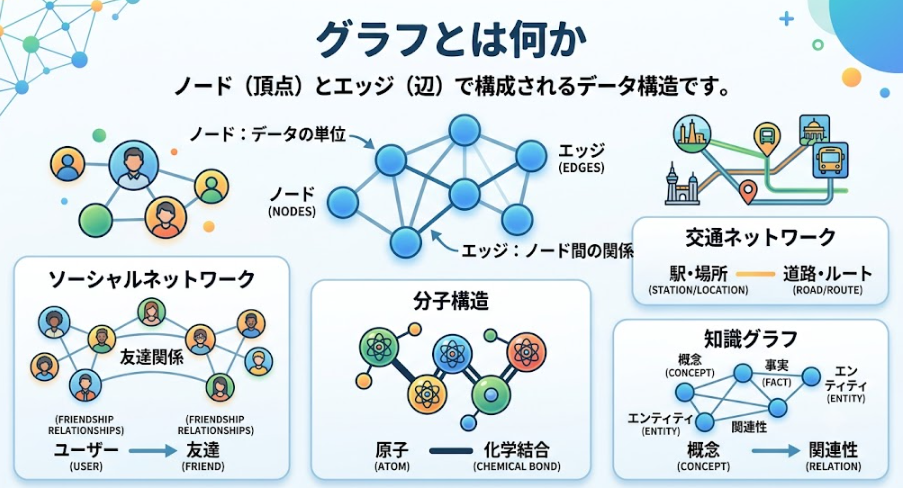
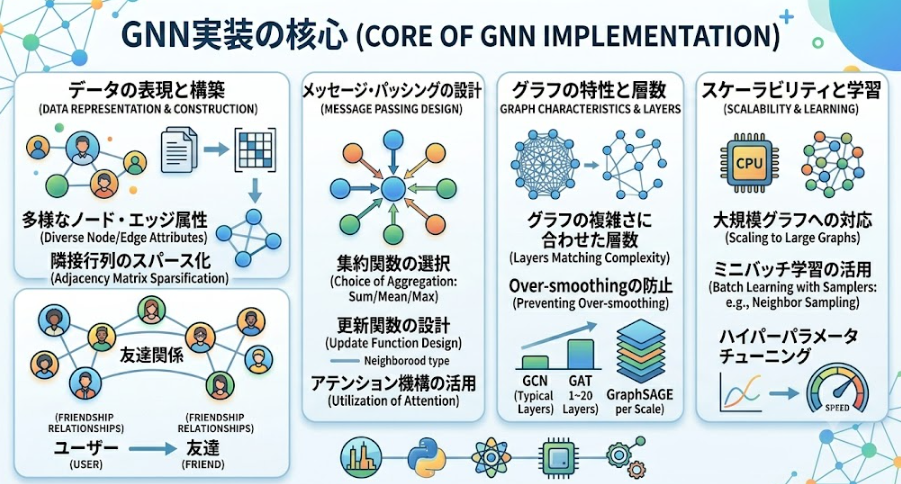

最近因果推論関係の話で情報を集めています。
職場でグラフニューラルネットワークの使用を聞いて、実態が何か知りたくなりました。

本日テーマ：

> グラフニューラルネットワークが何か調べて、使えそうな用途について想像してみる

グラフニューラルネットワーク（Graph Neural Network, GNN）は、**グラフ構造（ノードとエッジの集合）を入力として扱えるニューラルネットワーク**の総称です。

## 概要

そもそもGNNとは何でしょうか。
ということについて説明します。

### グラフとは何か

グラフは「ノード（頂点）」と「エッジ（辺）」で構成されるデータ構造です。

- **ノード**：データの単位（例：ユーザー、分子の原子、論文）
- **エッジ**：ノード間の関係（例：友達関係、化学結合、引用関係）

ソーシャルネットワーク、分子構造、交通ネットワーク、知識グラフなど、多くの現実世界のデータは自然にグラフとして表現できます。

### GNNの基本的な考え方

GNNの主なアイデアは、**「近傍の情報を集めてノードの特徴を更新する」** ことです。

1. 各ノードは初期の特徴ベクトル（例：ユーザーの属性、原子の種類など）を持ちます。
2. 各ステップで、ノードは「自分の近傍（隣接ノード）」から情報を集めます。
3. 集めた情報と自分自身の特徴を組み合わせて、新しい特徴ベクトルに更新します。
4. これを何回か繰り返すことで、各ノードは「周囲の構造」を反映した表現（埋め込み）を獲得します。

この「近傍から情報を集める」操作を**メッセージパッシング（message passing）** と呼びます。

### 代表的なGNNモデル

GNNモデルにはバリュエーションがあります。
上記の考え方に則るネットワーク構造は派生形も存在するということになります。

__1. GCN（Graph Convolutional Network）__

- 各ノードが、隣接ノードの特徴を平均的に集めて更新するタイプのGNNです。
- 比較的シンプルで、多くのタスクでよく使われます。

__2. GAT（Graph Attention Network）__

- 隣接ノードからの情報を「同じ重み」ではなく、「重要度（アテンション）」に応じて重み付けして集めます。
- どの近傍が重要かを学習できるため、より柔軟な表現が可能です。

__3. GraphSAGE__

- 近傍からランダムサンプリングして情報を集める方式で、大規模グラフにもスケールしやすい設計です。

__4. MPNN（Message Passing Neural Network）__

- 「メッセージパッシング」の枠組みを一般化したモデル群で、多くのGNNはこの枠組みに含まれます。

### GNNでできること（タスクの例）

__ノードレベルタスク__

- 例：ソーシャルネットワークでの「ユーザーの興味分類」「不正アカウント検出」
- 各ノード（ユーザー）ごとにラベルを予測します。

__エッジレベルタスク__

- 例：推薦システムでの「ユーザーと商品の関係予測」「リンク予測」
- どのノード間にエッジが存在すべきかを予測します。

__グラフレベルタスク__

- 例：分子の性質予測（毒性、溶解度など）、プログラムのバグ検出
- グラフ全体を1つのベクトルにまとめ、そのグラフ全体の性質を予測します。

## GNNの構造

GNNの構造的な特徴は、主に「**グラフ構造を直接扱う**」という点に集約されます。以下に代表的な特徴を挙げます。

### 1. 入力が「ノード＋エッジ」のグラフ構造

- 通常のニューラルネットワークは、画像（グリッド）やテキスト（系列）など**規則的な構造**を前提とします。
- GNNは、**ノード（頂点）とエッジ（辺）で表される不規則なグラフ**を直接入力とします。
- 各ノードは特徴ベクトルを持ち、エッジは関係性（有向・無向、重み付きなど）を表現します。

### 2. メッセージパッシング（近傍集約）が基本構造

- GNNのコアは「**近傍から情報を集めてノードを更新する**」操作です。
- 各層で、各ノードは
  1. 隣接ノードからメッセージ（特徴）を受け取る
  2. それらを集約する
  3. 自分の特徴と組み合わせて新しい特徴に更新する
- このプロセスを**メッセージパッシング**と呼び、GNNの構造の中心です。

### 3. 層の役割：局所構造から大域構造へ

- 浅い層：**近傍（1-hop）** の情報を反映した表現を学習します。
- 深い層：**より広い範囲（k-hop）** の情報を集約し、局所だけでなくグラフ全体の構造も反映した表現を獲得します。
- ただし、層を深くしすぎると**過平滑化（over-smoothing）** という問題が起きやすく、各ノードの特徴が似通ってしまう傾向があります。

### 4. パラメータ共有（ノード間で同じ変換を使う）

- 多くのGNNでは、**すべてのノードに対して同じ重みの変換（線形層など）を適用**します。
- これにより、ノード数が変わっても同じモデルが使え、**位置不変性（どのノードでも同じ関係性を同じように扱う）** が保たれます。

### 5. グラフ全体の表現を得るための「読み出し（readout）」構造

- ノードレベルのタスクだけでなく、**グラフ全体の性質**を予測する場合があります（例：分子の毒性予測）。
- その場合、すべてのノード表現を**集約（sum, mean, max poolingなど）** して1つのベクトルにまとめる「readout層」が構造に含まれます。
- より高度なモデルでは、アテンションを用いた集約も使われます。

### 6. スケーラビリティとサンプリング構造

- 大規模グラフでは、全ノード・全エッジを一度に扱うと計算量・メモリが膨大になります。
- そのため、**サブグラフ抽出**や**近傍サンプリング**を行う構造がよく使われます。
- 例：GraphSAGEでは、各ノードごとに近傍をランダムサンプリングしてメッセージパッシングを行います。

### 7. エッジ特徴や異種グラフへの拡張

- 基本のGNNは「ノード特徴＋エッジの有無」を扱いますが、拡張として
  - **エッジ特徴**（関係の種類・重みなど）を扱う構造
  - **異種グラフ（heterogeneous graph）** で、ノードタイプ・エッジタイプごとに異なる変換を行う構造
    などがあります。

## GNNの特徴

GNNとTransformerはどちらも「関係性を扱う」モデルですが、**扱うデータ構造の前提**が異なります。その違いから、メリット・デメリットが生まれます。

### 1. 扱うデータ構造の違い

__GNN（Graph Neural Network）__

- **前提**：グラフ構造（ノードとエッジ）
- 例：ソーシャルネットワーク、分子構造、交通ネットワーク、知識グラフ
- **接続関係が明示的に与えられる**データに向いています。

__Transformer__

- **前提**：系列（sequence）構造
- 例：テキスト、時系列データ、画像（パッチ列として扱う）
- **順序（位置）** を前提とし、すべての要素間の関係を潜在的に学習します。

### 2. GNNのメリット（Transformerと比較して）

__(1) グラフ構造を自然に扱える__

- GNNは「**どのノードがどのノードとつながっているか**」を直接入力として扱います。
- 分子構造やソーシャルネットワークなど、**接続関係が本質的なデータ**では、GNNの方が自然で強い表現力を持ちます。

__(2) スパースな関係性を効率的に扱える__

- 多くの現実のグラフはスパース（疎）です（例：SNSのフォロー関係）。
- GNNは**近傍だけにメッセージを送る**ため、スパースな関係を効率的に扱えます。
- Transformerは、系列長に対して**計算量がO(N²)** になるため、大規模でスパースなグラフをそのまま扱うと非効率です。

__(3) 位置不変性・構造不変性が自然に保たれる__

- グラフには「1番目、2番目」という順序がありません。
- GNNは**ノードの順序に依存せず**、接続関係だけで表現を学習します。
- Transformerは位置エンコーディングで順序を入れますが、**順序が本質でないデータ**では不自然なバイアスになり得ます。

__(4) 大規模グラフへのスケーリング手法が豊富__

- GraphSAGEのような**近傍サンプリング**やサブグラフ抽出により、巨大なグラフでも学習可能です。
- Transformerは系列長が長くなると計算コストが急増し、工夫（ローカルアテンション、Linformerなど）が必要です。

### 3. GNNのデメリット（Transformerと比較して）

__(1) 表現力の限界（グラフ同型性など）__

- GNNは**Weisfeiler–Lehmanテスト**と同等の表現力を持つとされ、それ以上の表現力は基本的にありません。
- つまり、**同型なグラフを区別できない**場合があります（理論的な限界）。
- Transformerは系列全体の関係を潜在的に学習するため、より複雑なパターンを捉えられる可能性があります。

__(2) 深い層での「過平滑化（over-smoothing）」__

- 層を深くすると、遠くのノードからも情報が集まりすぎて、**ノード表現が似通ってしまう**問題があります。
- Transformerも深くなると勾配消失などの問題はありますが、GNN特有の「過平滑化」は構造的な制約として強く現れます。

__(3) 系列・グリッド構造への適用が不自然__

- テキストや画像のような**規則的な系列・グリッド**を無理やりグラフとして扱うと、GNNは冗長で非効率になります。
- Transformerは系列をそのまま扱えるため、NLPや画像パッチ列などに非常に適しています。

__(4) 汎用性・転移性の低さ__

- GNNは**グラフ構造に強く依存**するため、異なるグラフ間での転移が難しい場合があります。
- Transformerは「系列→系列」の汎用フレームワークとして、言語・画像・音声などに広く適用できます。

### 4. Transformerのメリット（GNNと比較して）

__(1) 系列・グリッドに最適__

- テキスト、時系列、画像パッチ列など、**順序を持つデータ**に非常に強いです。
- 自己回帰生成や翻訳など、系列間の変換タスクで圧倒的な性能を発揮します。

__(2) 長距離依存を直接捉えられる__

- アテンションにより、**任意の2要素間の関係**を直接モデル化できます。
- GNNは近傍から情報を伝播させるため、長距離依存を捉えるには層を深くする必要があります。

__(3) 汎用性が高い__

- 言語モデル、画像生成、音声認識など、**多様なモダリティ**に同じアーキテクチャを適用できます。
- GNNは基本的に「グラフ専用」の設計です。

### 5. Transformerのデメリット（GNNと比較して）

__(1) 計算量が系列長の2乗__

- 系列長Nに対して**O(N²)** の計算量・メモリが必要です。
- 長い系列や大規模グラフをそのまま扱うと非現実的です。
- GNNはスパースな接続を前提とするため、**O(|E|)**（エッジ数に比例）で済む場合が多いです。

__(2) グラフ構造を明示的に扱うのが不自然__

- グラフを系列にフラット化してTransformerに入れると、**接続関係の情報が失われる**か、位置エンコーディングで無理やり表現する必要があります。
- GNNのように「近傍だけから情報を集める」という構造的帰納バイアスがありません。

## GNNの応用例

GNNは「関係性が重要なデータ」を自然に扱えるため、**金融、医療、EC、交通、ソフトウェア解析**など、さまざまな分野で実際に使われています。以下に代表的な応用事例を分野別に紹介します。

### 1. 金融・不正検知

__クレジットカード不正利用検知__

- **データ**：ユーザー、取引、店舗、IPアドレスなどをノードとし、取引関係をエッジとしたグラフ
- **GNNの役割**：
  - 不正な取引パターン（例：短時間に複数国で高額決済）を**グラフ上の異常なサブグラフ**として検出
  - 1件ずつの取引を見るのではなく、「誰がどこでどのように取引しているか」という**関係性のパターン**を学習
- **企業例**：Mastercard、Visa、各種FinTech企業がGNNベースの不正検知システムを研究・導入していると報告されています[NVIDIA Developer](https://developer.nvidia.com/gnn-frameworks)。

__マネーロンダリング・AML（反マネーロンダリング）__

- **データ**：口座、送金、企業、個人をノードとする送金ネットワーク
- **GNNの役割**：
  - 複数の口座を経由した複雑な資金移動を**経路探索＋異常検出**としてモデル化
  - 従来のルールベースでは捉えにくい**新たな手口**を学習的に検出

### 2. 医療・創薬

__分子・薬剤設計（Drug Discovery）__

- **データ**：原子をノード、化学結合をエッジとする分子グラフ
- **GNNの役割**：
  - 分子の物性（毒性、溶解度、活性など）を**グラフ回帰**として予測
  - 新しい候補化合物のスクリーニングを高速化
- **企業例**：大手製薬企業やバイオテック企業が、GNNを組み込んだ創薬パイプラインを構築しています[Kumo.ai](https://kumo.ai/research/graph-neural-networks-gnn)。

__薬物相互作用・副作用予測__

- **データ**：薬剤、タンパク質、副作用、疾患などをノードとする知識グラフ
- **GNNの役割**：
  - 複数の薬を併用したときの**相互作用や副作用リスク**を予測
  - 臨床試験前のリスク評価に活用

__疾患予測・バイオマーカー探索__

- **データ**：遺伝子、タンパク質、代謝物などをノードとする生物学的ネットワーク
- **GNNの役割**：
  - 疾患に関連する**サブネットワーク（パスウェイ）** を特定
  - 個人の遺伝子変異と疾患リスクの関係をグラフとしてモデル化

### 3. 推薦システム・EC

__商品推薦（Eコマース）__

- **データ**：ユーザー、商品、カテゴリ、ブランドなどをノードとし、購入・閲覧・類似関係をエッジとするグラフ
- **GNNの役割**：
  - ユーザーと商品の**潜在的な関係**を学習し、より精度の高い推薦を実現
  - 「この商品を買った人はこれも買っている」といった**高次元の関係パターン**を捉える
- **企業例**：Alibaba、Amazon、PinterestなどがGNNベースの推薦システムを導入していると報告されています[AssemblyAI Blog](https://www.assemblyai.com/blog/ai-trends-graph-neural-networks)。

__コンテンツ推薦（SNS・動画）__

- **データ**：ユーザー、投稿、ハッシュタグ、コメントなどをノードとするソーシャルグラフ
- **GNNの役割**：
  - ユーザーの興味・関係性をグラフとして捉え、**タイムライン推薦**や**関連コンテンツ推薦**に活用
  - Pinterestの「関連ピン」推薦などが有名な例です[AssemblyAI Blog](https://www.assemblyai.com/blog/ai-trends-graph-neural-networks)。

### 4. 交通・物流

__交通流予測__

- **データ**：道路セグメントや交差点をノード、道路接続をエッジとする道路ネットワーク
- **GNNの役割**：
  - 過去の交通量データから、**将来の渋滞や交通流**を予測
  - 都市全体の交通最適化（信号制御、経路推薦）に活用

__配送ルート最適化__

- **データ**：配送拠点、顧客、道路をノードとする物流ネットワーク
- **GNNの役割**：
  - 需要予測とネットワーク構造を組み合わせ、**効率的な配送ルート**を提案
  - リアルタイムの交通状況を反映した動的ルーティング

### 5. ソフトウェア解析・セキュリティ

__コード解析・バグ検出__

- **データ**：プログラムの抽象構文木（AST）や制御フローグラフをグラフとして表現
- **GNNの役割**：
  - コードの**構造的なパターン**からバグや脆弱性を検出
  - コードの自動要約や類似コード検索にも応用
- **企業例**：AWS などが、ソフトウェア解析タスクにGNNを活用していると報告されています[Amazon Science](https://www.amazon.science/blog/how-aws-uses-graph-neural-networks-to-meet-customer-needs)。

__マルウェア検知__

- **データ**：実行ファイルのAPI呼び出しグラフや制御フローグラフ
- **GNNの役割**：
  - マルウェア特有の**実行パターン**をグラフとして学習し、検知精度を向上

### 6. 知識グラフ・検索

__検索ランキング・質問応答__

- **データ**：Wikipediaや企業内の知識グラフ（エンティティと関係）
- **GNNの役割**：
  - クエリとエンティティの関係をグラフ上で推論し、**関連度の高いエンティティ**をランキング
  - 質問応答システムで、複数の事実を組み合わせた推論を行う

__レコメンデーション＋知識グラフ__

- **データ**：ユーザー、商品、カテゴリ、ブランドに加え、知識グラフ（例：ブランドの親会社、製品ライン）を統合
- **GNNの役割**：
  - 「このブランドの親会社の別ブランド商品もおすすめ」といった**高次の関係**を考慮した推薦

## 総括

グラフニューラルネットワーク（GNN）は、**「ノード（頂点）とエッジ（辺）で表されるグラフ構造」を直接入力として扱うニューラルネットワーク**です。

### 1. GNNの本質：メッセージパッシング

- 各ノードは初期特徴（例：ユーザー属性、原子の種類）を持ちます。
- 各層で、**隣接ノードから情報を集めて自分を更新**します（メッセージパッシング）。
- これを繰り返すことで、**周囲の構造を反映したノード表現**を獲得します。

### 2. 代表的なモデルと特徴

- **GCN**：近傍の特徴を平均的に集約するシンプルなモデル。
- **GAT**：近傍に「重要度（アテンション）」を付けて集約する、より柔軟なモデル。
- **GraphSAGE**：近傍をサンプリングして集約し、大規模グラフにスケールしやすいモデル。

**構造的特徴**：

- 入力が不規則なグラフ（ノード＋エッジ）
- パラメータ共有により、ノード数が変わっても同じモデルが使える
- 深い層では「過平滑化」に注意が必要

### 3. GNNでできること（タスク）

- **ノードレベル**：ユーザーの興味分類、不正アカウント検出など
- **エッジレベル**：推薦（ユーザー–商品）、リンク予測など
- **グラフレベル**：分子の性質予測、プログラムのバグ検出など

### 4. Transformerとの比較（ざっくり）

- **GNN**：グラフ（接続関係が明示）に強い。スパースな関係を効率的に扱える。
- **Transformer**：系列（順序があるデータ）に強い。長距離依存を直接捉えられる。
- どちらが優れているかは**データの本質的な構造**に依存します。

### 5. 実際の応用分野（例）

- **金融**：不正取引検知、マネーロンダリング検出
- **医療・創薬**：分子の物性予測、薬物相互作用・副作用予測
- **EC・SNS**：商品推薦、コンテンツ推薦（Pinterestなど）
- **交通・物流**：交通流予測、配送ルート最適化
- **ソフトウェア解析**：コードのバグ・脆弱性検出、マルウェア検知
- **知識グラフ**：検索ランキング、質問応答
