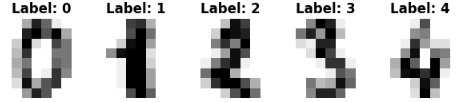
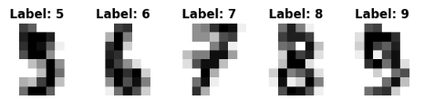

前回触れたGNNについて、実際にどんなことが出来るかということを確認してみようと思います。

本日テーマ：
>GNNの学習をさせてみて、出来ることを確認してみる

## 実験

本日テーマは、"手書き数字画像（Digits）をグラフとして扱い、GNN（GCN）でノード分類を行う"とします。

### 詳細

__使うデータ__

機械学習ではおなじみの手書き文字を使います。

「手書き数字画像（Digits）をグラフとして扱い、GNN（GCN）でノード分類を行う」 実験です。

__実験の内容__

各画像（ノード）間のユークリッド距離を計算し、「似ている画像トップ5」同士をエッジで結ぶことでグラフを作ります。
これにより、
- ノード：各画像（1797枚）
- エッジ：似ている画像同士の接続という類似度グラフができます。

### 実験内容

ノードのうち

- 訓練用（train_mask）：100ノード → ラベルが分かっている（教師あり）
- テスト用（test_mask）：1000ノード → ラベルは分かっていないが、グラフ構造は見える（教師なし）
- 残りのノード：この実験では使っていません（無視）

つまり、100ノードだけが「正解ラベル付き」だが、それ以外のノードは「ラベルなしだが、グラフ構造（誰と誰が似ているか）は見える」という半教師あり学習（semi-supervised learning） の設定を行い、テスト用ノードを近傍の関係性から正解ラベルを当てるという問題です。

## なんでこんなことができる？

「似ている画像同士をエッジで結んだグラフ」上で、GNNが分類を実現できる理由は、**GNNが「近傍からの情報を集約してノードを更新する」という構造を持っているから**です。

### 1. GNNの基本：メッセージパッシング

GNNのコアは、各ノードが

1. **自分の近傍（隣接ノード）から情報を集める**
2. **その情報と自分の特徴を組み合わせて新しい特徴に更新する**

という操作（メッセージパッシング）を繰り返すことです。

この実験では：

- ノード：各手書き数字画像
- エッジ：**似ている画像同士**（距離が近いトップ5）

というグラフを作っています。  
つまり、**「似ている画像同士がつながっている」** 状態です。

### 2. 「似ている画像」から情報を集める効果

__(1) ラベルが近いノードは、特徴も近いことが多い__
- 同じ数字（例：すべて「3」）の画像は、画素パターンが似ているため、**距離が近くなりやすい**です。
- その結果、**同じクラスの画像同士がエッジで結ばれやすく**なります。

__(2) GNNは「近傍のラベル情報」を間接的に伝播させる__
- GNNの1層目：**直接の近傍（1-hop）**から情報を集めます。
  - 例：ある「3」の画像は、他の「3」の画像から情報を受け取る。
- GNNの2層目：**2-hop先**（近傍の近傍）からも情報が伝わります。
  - 例：ある「3」の画像は、「3」の近傍を通じて、さらに別の「3」の情報も間接的に受け取る。

このように、**「似ている画像（＝同じクラスになりやすい画像）」から情報が集まる**ため、各ノードの表現は「周囲のラベル分布」を反映したものになります。

### 3. 半教師あり学習の効果

この実験では、

- 訓練用：100ノードだけラベルあり
- テスト用：1000ノードはラベルなし（評価時のみ使う）

という**半教師あり学習**の設定です。

GNNは、

1. ラベルありノードから学習した情報を、**エッジを通じてラベルなしノードに伝播**させます。
2. ラベルなしノードも、近傍のラベルありノードから情報を受け取ることで、**自分のラベルを推定しやすく**なります。

つまり、**「少数のラベルから、グラフ全体にラベル情報を広げる」** ことができます。

### 4. なぜ「画像同士の距離」でグラフを作るのか

- 通常のCNNは「画素の空間配置（グリッド構造）」を前提にします。
- この実験では、**「画像同士の類似度（距離）」をグラフ構造として扱い**、GNNでその関係性を利用しています。

これにより、

- **「似ている画像は同じクラスである可能性が高い」** という仮定を、
- GNNのメッセージパッシングで**自動的に活用**できます。

