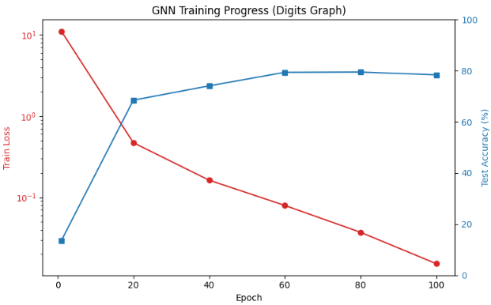
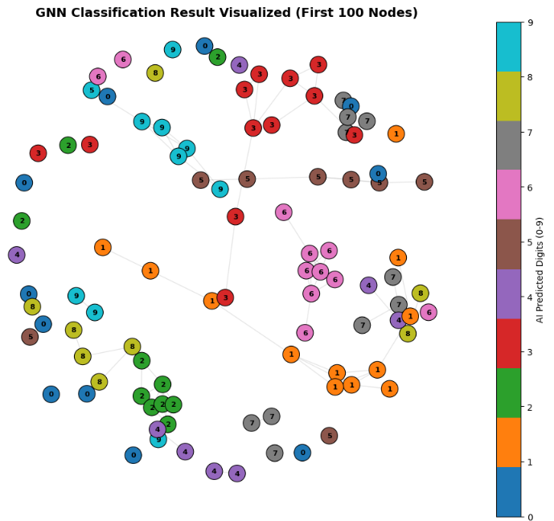

前回触れたGNNについて、実際にどんなことが出来るかということを実験を通じて確認してみようと思います。

本日テーマ：
>実験的にGNNの学習をさせてみて、出来ることを確認してみる

## 実験

本日テーマは、"手書き数字画像（Digits）をグラフとして扱い、GNN（GCN）でノード分類を行う"とします。

### 詳細

__使うデータ__

機械学習ではおなじみの手書き文字を使います。


「手書き数字画像（Digits）をグラフとして扱い、GNN（GCN）でノード分類を行う」 実験です。

__実験の内容__

各画像（ノード）間のユークリッド距離を計算し、「似ている画像トップ5」同士をエッジで結ぶことでグラフを作ります。
これにより、
- ノード：各画像（1797枚）
- エッジ：似ている画像同士の接続という類似度グラフができます。

### 実験内容

ノードのうち

- 訓練用（train_mask）：100ノード → ラベルが分かっている（教師あり）
- テスト用（test_mask）：1000ノード → ラベルは分かっていないが、グラフ構造は見える（教師なし）
- 残りのノード：この実験では使っていません（無視）

つまり、100ノードだけが「正解ラベル付き」だが、それ以外のノードは「ラベルなしだが、グラフ構造（誰と誰が似ているか）は見える」という半教師あり学習（semi-supervised learning） の設定を行い、テスト用ノードを近傍の関係性から正解ラベルを当てるという問題です。

## なんでこんなことができる？

「似ている画像同士をエッジで結んだグラフ」上で、GNNが分類を実現できる理由は、**GNNが「近傍からの情報を集約してノードを更新する」という構造を持っているから**です。


### 1. GNNの基本：メッセージパッシング

GNNのコアは、各ノードが

1. **自分の近傍（隣接ノード）から情報を集める**
2. **その情報と自分の特徴を組み合わせて新しい特徴に更新する**

という操作（メッセージパッシング）を繰り返すことです。

この実験では：

- ノード：各手書き数字画像
- エッジ：**似ている画像同士**（距離が近いトップ5）

というグラフを作っています。  
つまり、**「似ている画像同士がつながっている」** 状態です。

### 2. 「似ている画像」から情報を集める効果

__(1) ラベルが近いノードは、特徴も近いことが多い__
- 同じ数字（例：すべて「3」）の画像は、画素パターンが似ているため、**距離が近くなりやすい**です。
- その結果、**同じクラスの画像同士がエッジで結ばれやすく**なります。

__(2) GNNは「近傍のラベル情報」を間接的に伝播させる__
- GNNの1層目：**直接の近傍（1-hop）**から情報を集めます。
  - 例：ある「3」の画像は、他の「3」の画像から情報を受け取る。
- GNNの2層目：**2-hop先**（近傍の近傍）からも情報が伝わります。
  - 例：ある「3」の画像は、「3」の近傍を通じて、さらに別の「3」の情報も間接的に受け取る。

このように、**「似ている画像（＝同じクラスになりやすい画像）」から情報が集まる**ため、各ノードの表現は「周囲のラベル分布」を反映したものになります。

### 3. 半教師あり学習の効果

この実験では、

- 訓練用：100ノードだけラベルあり
- テスト用：1000ノードはラベルなし（評価時のみ使う）

という**半教師あり学習**の設定です。

GNNは、

1. ラベルありノードから学習した情報を、**エッジを通じてラベルなしノードに伝播**させます。
2. ラベルなしノードも、近傍のラベルありノードから情報を受け取ることで、**自分のラベルを推定しやすく**なります。

つまり、**「少数のラベルから、グラフ全体にラベル情報を広げる」** ことができます。

### 4. なぜ「画像同士の距離」でグラフを作るのか

- 通常のCNNは「画素の空間配置（グリッド構造）」を前提にします。
- この実験では、**「画像同士の類似度（距離）」をグラフ構造として扱い**、GNNでその関係性を利用しています。

これにより、

- **「似ている画像は同じクラスである可能性が高い」** という仮定を、
- GNNのメッセージパッシングで**自動的に活用**できます。

## 実装

実際の実装コードは以下レポジトリの"train_example_v2.py"をご参考下さい。

https://github.com/Shinichi0713/LLM-fundamental-study/tree/main/sequential_nn/src/graph_nn/src

### 1. データ設計（Data Design）

__(1) データソース__
- `sklearn.datasets.load_digits()`：8×8ピクセルの手書き数字画像（0〜9）。
- 1797枚の画像、各画像は64次元ベクトル（8×8をフラット化）。

__(2) ノード特徴（Node Features）__
- `features = torch.tensor(digits.data, dtype=torch.float32)`
- 各ノード（画像）は64次元の画素値ベクトルを持つ。

__(3) グラフ構造（エッジ）の設計__
- **類似度ベースのk近傍グラフ**：
  - 各画像間のユークリッド距離を計算。
  - 各ノードについて、**最も近い（似ている）5枚の画像**とエッジを張る。
  - 無向グラフとして扱う（`adj_matrix[i, n] = 1.0; adj_matrix[n, i] = 1.0`）。
- これにより、「似ている画像同士がつながったグラフ」が構築される。

__(4) ラベルとマスク設計（半教師あり）__
- `labels`：各ノードの真の数字クラス（0〜9）。
- `train_mask`：先頭100ノードを訓練用（ラベルあり）。
- `test_mask`：続く1000ノードをテスト用（ラベルなしで学習、評価時のみ使用）。
- 残りのノードはこの実験では使わない（無視）。

**設計意図**：
- 少数のラベル（100ノード）から、グラフ構造を利用して多くのノードを分類できるかを見る。
- テスト用ノードは学習時にはラベルを使わず、**グラフ構造だけを利用**する。

### 2. モデル設計（Model Design）

__(1) GCNLayer（1層）__
- 入力：`x`（ノード特徴）、`adj`（隣接行列）
- 処理：
  1. 自己ループ付き隣接行列 `adj_tilde = adj + I`
  2. 次数行列 `D` を計算し、**対称正規化** `D^{-1/2} A~ D^{-1/2}` を計算
  3. `A_norm @ (x @ W)` でメッセージパッシング（近傍集約）
- これは**標準的なGCNの1層**の実装です。

__(2) DigitsGNN（2層GCN）__
- 構造：
  - `GCNLayer(64, 32)` → ReLU → Dropout(0.5)
  - `GCNLayer(32, 10)` → `log_softmax`
- 出力：各ノードの10クラスに対する対数確率。

**設計意図**：
この構造は、**「2層GCNによる半教師ありノード分類モデル」** です。

__1. 構造の要点__

- **入力**：各ノード（画像）の64次元ベクトル（画素値）
- **第1層（GCN1）**：  
  - 近傍（自分＋隣接ノード）の情報を集約して、64次元→32次元に変換
  - ReLUで非線形化
  - Dropout(0.5)で過学習防止
- **第2層（GCN2）**：  
  - さらに近傍情報を集約して、32次元→10次元（0〜9の各クラススコア）に変換
  - log_softmaxで10クラスの対数確率を出力

__2. 設計のポイント__

- **2層GCN**：  
  - 1層目で「1-hop（自分＋直接の近傍）」、2層目で「2-hop（近傍の近傍）」まで見る。
- **正規化隣接行列**：  
  - 自己ループ付き＋次数正規化で、次数の大きいノードの影響を抑え、安定した情報伝播を実現。
- **Dropout**：  
  - 訓練時にランダムにニューロンを無効化し、過学習を抑制。
- **log_softmax + NLLLoss**：  
  - 多クラス分類の標準的な損失設計。

__3. 直感的な意味__

- 各ノードは「似ている画像同士がつながったグラフ」上で、  
  **「自分＋近傍＋近傍の近傍」の情報を集約して数字を予測**する構造です。  
- これにより、**少数のラベル（100ノード）から、グラフ構造を利用して多くのノードを分類**できるようになっています。


### 3. 学習設計（Training Design）

__(1) 損失関数と最適化__
- 損失：`NLLLoss`（負の対数尤度）  
  → `log_softmax` 出力と組み合わせてクロスエントロピー損失として機能。
- 最適化：`Adam(lr=0.01, weight_decay=5e-4)`  
  → 学習率とL2正則化（weight decay）を設定。

__(2) 学習ループ__
- エポック数：100
- 各エポックで：
  - `model.train()` で訓練モードに
  - `optimizer.zero_grad()` で勾配リセット
  - 全ノードに対して `model(features, adj_matrix)` を計算
  - **訓練マスク上のノードだけ**で損失を計算（`output[train_mask]`）
  - `loss.backward()` → `optimizer.step()`

**設計意図**：
- グラフ全体に対してメッセージパッシングを行うが、**損失計算はラベルありノードのみ**。
- これにより、ラベルなしノードもグラフ構造を通じて間接的に学習される。

### 4. 評価設計（Evaluation Design）

__(1) 評価タイミング__
- エポック1, 20, 40, 60, 80, 100で評価ログを出力。

__(2) 評価方法__
- `model.eval()` で評価モードに切り替え。
- `with torch.no_grad():` で勾配計算をオフ。
- `output.max(1)[1]` で各ノードの予測クラスを取得。
- **テストマスク上のノード**について、正解ラベルと比較して正解率を計算。

**設計意図**：
- 学習時には使っていないテスト用ノードのラベルを使って、**未知データに対する汎化性能**を評価。
- 半教師あり学習の効果（少数のラベルから多くのノードを分類できるか）を確認。

```python

# =====================================================================
# データの「中身の形状（次元）」もテキストで確認
# =====================================================================
print("\n=== データ構造の詳細 ===")
print(f"1枚目の画像（行列）の形状: {digits.images[0].shape} (縦8ピクセル × 横8ピクセル)")
print(f"GNNに入力した説明変数（1次元化）の形状: {digits.data[0].shape} (64次元のベクトル)")
print(f"1枚目の画像の実データ（ピクセル値の一例）:\n{digits.data[0].round().astype(int).reshape(8,8)}")

# 説明変数 X: 各ノード（画像）のプロフィール（8x8マスのピクセル値 = 64次元）
features = torch.tensor(digits.data, dtype=torch.float32)

# 目的変数 Y: 各ノードの正解ラベル（0 〜 9 の数字クラス）
labels = torch.tensor(digits.target, dtype=torch.long)

num_nodes = features.shape[0]   # 1797枚の画像ノード
input_dim = features.shape[1]   # 64次元の説明変数
num_classes = 10                # 10クラス分類

print(f"データ読み込み完了! 画像数(ノード): {num_nodes}, 説明変数の次元: {input_dim}, クラス数: {num_classes}")

print("画像同士の類似度からネットワーク（エッジ）を構築中...")
# 各画像間の距離を計算し、「特に見た目が似ている画像トップ5」同士を線（エッジ）で結ぶ
dist_matrix = pairwise_distances(digits.data, metric='euclidean')
adj_matrix = torch.zeros((num_nodes, num_nodes), dtype=torch.float32)

top_k = 5
for i in range(num_nodes):
    # 自分自身を除外して、最も近い（似ている）インデックスを取得
    nearest_neighbors = np.argsort(dist_matrix[i])[1:top_k+1]
    for n in nearest_neighbors:
        adj_matrix[i, n] = 1.0
        adj_matrix[n, i] = 1.0 # 無向グラフ

# 訓練用（100個）とテスト用（残りの1000個）のマスクを作成
train_mask = torch.zeros(num_nodes, dtype=torch.bool)
train_mask[:100] = True
test_mask = torch.zeros(num_nodes, dtype=torch.bool)
test_mask[100:1100] = True

# =====================================================================
# 2. GCNモデルの定義
# =====================================================================
class GCNLayer(nn.Module):
    def __init__(self, in_features, out_features):
        super().__init__()
        self.weight = nn.Parameter(torch.FloatTensor(in_features, out_features))
        nn.init.xavier_uniform_(self.weight)

    def forward(self, x, adj):
        # 対称正規化隣接行列の計算
        adj_tilde = adj + torch.eye(adj.size(0))
        degree = torch.sum(adj_tilde, dim=1)
        D_inv_sqrt = torch.diag(torch.pow(degree, -0.5))
        D_inv_sqrt[torch.isinf(D_inv_sqrt)] = 0.0
        adj_norm = torch.mm(torch.mm(D_inv_sqrt, adj_tilde), D_inv_sqrt)

        # メッセージパッシング
        return torch.mm(adj_norm, torch.mm(x, self.weight))

class DigitsGNN(nn.Module):
    def __init__(self, input_dim, hidden_dim, num_classes):
        super().__init__()
        self.gcn1 = GCNLayer(input_dim, hidden_dim)
        self.gcn2 = GCNLayer(hidden_dim, num_classes)

    def forward(self, x, adj):
        x = F.relu(self.gcn1(x, adj))
        x = F.dropout(x, p=0.5, training=self.training)
        x = self.gcn2(x, adj)
        return F.log_softmax(x, dim=1)

# =====================================================================
# 3. 訓練と評価の実行
# =====================================================================
# 64次元(画素値) -> 32次元(隠れ層) -> 10次元(予測数字)
model = DigitsGNN(input_dim=input_dim, hidden_dim=32, num_classes=num_classes)
optimizer = optim.Adam(model.parameters(), lr=0.01, weight_decay=5e-4)
criterion = nn.NLLLoss()

print("\nGNNの学習を開始します...")
for epoch in range(1, 101):
    model.train()
    optimizer.zero_grad()

    output = model(features, adj_matrix)
    loss = criterion(output[train_mask], labels[train_mask])

    loss.backward()
    optimizer.step()

    if epoch % 20 == 0 or epoch == 1:
        model.eval()
        with torch.no_grad():
            preds = output.max(1)[1]
            correct = preds[test_mask].eq(labels[test_mask]).sum().item()
            acc = correct / test_mask.sum().item()
            print(f"Epoch: {epoch:03d} | 訓練データの損失: {loss.item():.4f} | 未知のデータに対する予測精度: {acc*100:.1f}%")
```

### 5. 学習と実験結果

ロスの推移は以下のようになりました。
まあ、収束してるように思います。



そして実際に出来たグラフを表示するとこんな感じです。
7のクラスタが分かれていたり集まりきってないノードが存在していますが、関係性の強さからクラスタが自動でできたことが確認出来ます。



## 総括

今回の実験を踏まえると、GNNについてはまずはこの辺りです。

1. 良いと感じた点

- 互いの関係性でラベリングが出来るという点は面白いと感じました。
- ノードの関係性が自由であり、密集するノードもあれば、疎になるノードも存在できるという点は、TransformerやRNNとは異なります。
- 今回教師としたのは、全データの10%程度で、それ以外の関係性は近いか、そうでないかという情報のみで構築できた。→学習用のデータの負担は小さい

2. デメリットと感じた点

- 今回のグラフはあくまで手書き文字のみで成り立つもの
- LLMのような汎用性は持たない
- 精度が高いとは思えない。精度が80%程度だったが、同じデータを画像認識でやると90%オーバーになる

とは言え、GNNのネットワークも簡素なものだったので、より精度を向上させる手法はあるはずです。
