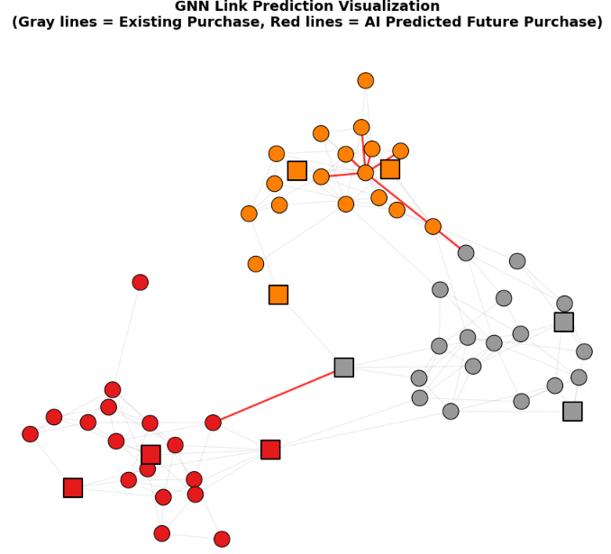

[先日扱ったGNN](https://yoshishinnze.hatenablog.com/entry/2026/06/21/043000)ですが、手書き文字を関係性から推論できたこと自体は面白いのですが、精度であればCNNのネットワークの方がよかったです。
そこで先日扱ったGNNの実験に対して、もう少しGNNの特徴を活かした実験にしようと思います。

本日テーマ：
>GNNの特徴を活かした実験を行う

## GNNの得意分野

先日は手書き文字を、文字の特徴の関係性からラベルを当てに行くという予測を行いました。
ですが、文字の特徴であれば画像関係の処理の方が高精度です。

そもそも、LLMや画像関係のニューラルネットワークではできないことで、GNNだからできることは何でしょう？

ずばり「繋がり（構造）そのものを学習し、未来のリンクや未知の隠れた関係性をあぶり出す」という強みです。
この強味を極限まで活かすなら、さらに適した推論タスクが3つあります。

GNNの特性に最もマッチした、実社会で大活躍している応用例は以下のようなものではないでしょうか。

### 1. リンク予測（Link Prediction）：次に「あわせて買いたい」と思われる商品の予測

商品のカテゴリ（ジャンル）を当てるのではなく、「まだ繋がっていないノード同士の間に、新しく線（エッジ）が生まれる確率」を予測するタスクです。

* **GNNが最強である理由**：
GNNはノード周辺の「ネットワークの形状（三角形の閉じ方やハブの存在など）」をベクトル化するのが得意です。
「商品AとBを一緒に買った人は、Cも買っている」「商品DとBを買った人も、Cを買っている」という構造から、「じゃあ、まだ誰も試していないけれど、商品AとDも一緒に買われる潜在的ニーズ（隠れたリンク）があるはずだ」という高精度なレコメンデーション（次に売れる組み合わせ）を直接予測できます。Amazonなどのレコメンドエンジンの裏側はまさにこれです。

### 2. 影響度・波及予測：ある商品がヒットした際、次にドミノ倒しで売れる商品の予測

1つのノードに起きた変化（購入された、炎上した、ウイルスに感染したなど）が、**ネットワークを伝ってどのように他のノードへ伝播・波及するか**を推論するタスクです。

* **GNNが最強である理由**：
GNNの基本原理は「メッセージパッシング（情報の口コミ効果）」そのものです。
例えば、「スマホ（ノードA）」が爆発的に売れたとき、その1歩隣にある「スマホケース（ノードB）」、さらにその隣にある「スマホ用スタンド（ノードC）」へと、購買意欲のエネルギーがネットワークの線をどう伝わっていくか（トレンドの拡散経路）をシミュレーション・推論することができます。サプライチェーンの需要予測や、SNSのインフルエンサーマーケティングの波及効果予測に最適です。

### 3. 異常検知（Fraud Detection）：サクラレビューや不正転売ネットワークのあぶり出し

商品そのものではなく、「不正な取引や、不自然な繋がり方をしているノード」を見つけ出すタスクです。

* **GNNが最強である理由**：
「価格が1,000円、評価4.5」というプロフィール（説明変数）単体で見たら、普通の商品に見えます。しかしグラフ構造で見ると、**「特定の怪しいグループ（アカウント）の間だけで、不自然に超高速に共同購入（エッジ）が繰り返されている」** という、構造の歪みが一発で分かります。
GNNは、ノード単体の見た目に騙されず、**「周囲との付き合い方の怪しさ（リンクの異常性）」** を学習できるため、クレカの不正利用、サクラ業者の摘発、チケットの不正転売botの検知において、従来のAIを圧倒する成果を上げています。

## 実験

### 実験内容

商品の既知の購入関係から、未来に一緒に購入されると思われる商品のペアを見つけるGNNを構築してみます。
用いる商品の購入関係は人工的につくる擬似データです。
あくまで、テーマに則ったデータセットを模したものとしてみてください。

### 学習＋テストデータ作成

今回使うデータは、実在のECサイトの購買履歴などではなく、プログラム上でランダムに生成したダミーデータです。

__1. どんなデータか__

- **ノード（商品）**：60個の商品
- **ノード特徴量**：各商品につき2次元のダミープロフィール（数値ベクトル）
- **ノードラベル**：3つのカテゴリ（0, 1, 2）に分かれている
- **エッジ（リンク）**：商品同士の「一緒に買われた」関係
- **データ分割**：
  - 学習用：全リンクの80%（現在観測されているリンク）
  - テスト用：全リンクの20%（未来に現れるリンクとして隠す）
- **負例**：本来リンクが存在しない商品ペア（絶対に一緒に買われないペア）

つまり、**「商品カテゴリと特徴量に基づいて、一緒に買われやすい／買われにくい関係を人工的に作り、その一部を未来のリンクとして隠して予測する」**という設定です。

__2. ノードデータ（商品）の作り方__

__2-1. 商品数とカテゴリ__

```python
num_products = 60
labels_np = np.array([0]*20 + [1]*20 + [2]*20)  # 3カテゴリ、各20個
```

- 商品は60個。
- カテゴリは 0, 1, 2 の3種類で、それぞれ20個ずつ。

__2-2. 特徴量（ダミープロフィール）__

```python
features = torch.tensor(np.random.randn(num_products, 2) * 2 + 3, dtype=torch.float32)
```

- 各商品に2次元の特徴ベクトルを付与。
- 正規分布 `N(3, 2^2)` からランダムにサンプリングした数値です。
- 実務では「価格帯」「人気度」「カテゴリ別スコア」などに相当する情報ですが、ここでは単なるダミー数値です。

__3. エッジデータ（一緒に買われた関係）の作り方__

__3-1. すべてのリンク（グラウンドトゥルース）の生成__

```python
edges = []
for i in range(num_products):
    for j in range(i + 1, num_products):
        if labels_np[i] == labels_np[j] and np.random.rand() < 0.3:
            edges.append((i, j))
        elif labels_np[i] != labels_np[j] and np.random.rand() < 0.01:
            edges.append((i, j))
```

- すべての商品ペア `(i, j)` について、以下のルールでリンクを生成：
  - **同じカテゴリ**の場合：確率 0.3 でリンクを作る（一緒に買われやすい）。
  - **異なるカテゴリ**の場合：確率 0.01 でリンクを作る（一緒に買われにくい）。
- これにより、「同じカテゴリ内ではリンクが密、異なるカテゴリ間ではリンクが疎」という現実的なネットワーク構造を模倣しています。

__3-2. 「現在（学習用）」と「未来（テスト用）」の分割__

```python
shuffled_indices = np.random.permutation(num_edges)
train_edge_idx = shuffled_indices[:int(num_edges * 0.8)]
test_edge_idx = shuffled_indices[int(num_edges * 0.8):]

train_edges = all_edges[train_edge_idx]
test_edges = all_edges[test_edge_idx]
```

- 全リンクをランダムにシャッフルし、
  - 80% を `train_edges`（現在観測されているリンク）
  - 20% を `test_edges`（未来に現れるリンクとして隠す）
- 学習時には `test_edges` は使わず、評価時にのみ使用します。

__3-3. 学習用の隣接行列（現在のネットワーク）__

```python
adj_train = torch.zeros((num_products, num_products), dtype=torch.float32)
for u, v in train_edges:
    adj_train[u, v] = 1.0
    adj_train[v, u] = 1.0
```

- `adj_train` は、**現在観測されているリンクのみを含む隣接行列**です。
- 隠された未来のリンク（`test_edges`）は含まれていません。
- GNNはこの `adj_train` と `features` だけを見て、未来のリンクを予測します。

### ネットワークの構築

前回のコードでは、**「商品同士の共同購入関係」を模したネットワーク（グラフ）** を、以下の手順で構築しています。

__1. ノード（商品）の定義__

- **ノード数**：`num_products = 60` 個の商品。
- **ノードラベル**：3カテゴリ（0, 1, 2）に分かれています。
  ```python
  labels_np = np.array([0]*20 + [1]*20 + [2]*20)
  ```
- **ノード特徴量**：各商品に2次元のダミープロフィール（数値ベクトル）を付与。
  ```python
  features = torch.tensor(np.random.randn(num_products, 2) * 2 + 3, dtype=torch.float32)
  ```

これにより、**60個のノード（商品）** が定義されます。

__2. エッジ（リンク）の生成ルール__

「一緒に買われた」関係を表すエッジは、以下のルールで生成されています。

```python
edges = []
for i in range(num_products):
    for j in range(i + 1, num_products):
        if labels_np[i] == labels_np[j] and np.random.rand() < 0.3:
            edges.append((i, j))
        elif labels_np[i] != labels_np[j] and np.random.rand() < 0.01:
            edges.append((i, j))
```

- **同じカテゴリの商品ペア**：
  - 確率 0.3 でリンクを作成（一緒に買われやすい）。
- **異なるカテゴリの商品ペア**：
  - 確率 0.01 でリンクを作成（一緒に買われにくい）。

これにより、**「同じカテゴリ内はリンクが密、異なるカテゴリ間はリンクが疎」という現実的なネットワーク構造**が作られます。

__3. 「現在のネットワーク」と「未来のリンク」の分割__

生成した全リンクを、**「現在観測されているネットワーク」** と **「未来に現れるリンク（隠す）」** に分割します。

```python
all_edges = np.array(edges)
num_edges = len(all_edges)

shuffled_indices = np.random.permutation(num_edges)
train_edge_idx = shuffled_indices[:int(num_edges * 0.8)]
test_edge_idx = shuffled_indices[int(num_edges * 0.8):]

train_edges = all_edges[train_edge_idx]
test_edges = all_edges[test_edge_idx]
```

- **train_edges**：全リンクの80%（現在観測されているリンク）
- **test_edges**：全リンクの20%（未来に現れるリンクとして隠す）

__4. 学習用の隣接行列（現在のネットワーク）の構築__

GNNに入力する「現在のネットワーク構造」は、**隣接行列 `adj_train`** として構築されます。

```python
adj_train = torch.zeros((num_products, num_products), dtype=torch.float32)
for u, v in train_edges:
    adj_train[u, v] = 1.0
    adj_train[v, u] = 1.0
```

- サイズ：`(60, 60)` の正方行列。
- `(u, v)` が `train_edges` に含まれる場合のみ `1` を設定（無向グラフなので `(v, u)` も1）。
- `test_edges` に含まれるリンクは、この `adj_train` には含まれません（未来のリンクとして隠されている）。

これが、GNNが実際に見る「現在のネットワーク構造」です。

### 学習

作成したダミーデータの20%を学習用データとして、残り80%を予測していきます。

学習コードは以下レポジトリを参考下さい。

https://github.com/Shinichi0713/LLM-fundamental-study/tree/main/sequential_nn/src/graph_nn/src

学習と検証の結果は以下の通りとなりました。

```
隠された未来の購入リンクを予測する学習を開始...
Epoch: 030 | Train Loss: 1.3681 | 未来のリンク予測精度 (AUC): 57.5%
Epoch: 060 | Train Loss: 1.2285 | 未来のリンク予測精度 (AUC): 61.3%
Epoch: 090 | Train Loss: 1.3069 | 未来のリンク予測精度 (AUC): 58.3%
Epoch: 120 | Train Loss: 1.2551 | 未来のリンク予測精度 (AUC): 59.5%
Epoch: 150 | Train Loss: 1.2773 | 未来のリンク予測精度 (AUC): 61.8%

=== AIが見つけた【未来のあわせて買いたいペア】TOP 5 ===
商品 23 と 商品 35 -> AIの予測共同購入確率: 87.5%  (正解: 実際に未来で購入された)
商品 33 と 商品 37 -> AIの予測共同購入確率: 84.4%  (正解: 実際に未来で購入された)
商品 21 と 商品 25 -> AIの予測共同購入確率: 78.5%  (正解: 実際に未来で購入された)
商品 35 と 商品 36 -> AIの予測共同購入確率: 78.4%  (正解: 実際に未来で購入された)
商品 00 と 商品 10 -> AIの予測共同購入確率: 71.3%  (正解: 実際に未来で購入された)
```

学習済みのGNNが確率80%以上であると予言した『未来の購入リンク』の数7本を可視化してみました。
(全部実際に購入されたエッジです。)


予測確率が高いものはさすがに正解しているようです。(特徴から高い確率で共同購入しているとおもされるため)

## 総括

今回の要点を絞ってまとめます。

### GNNの得意技

__(1) リンク予測（Link Prediction）__

- **タスク**：まだ繋がっていないノード同士の間に、新しくエッジが生まれる確率を予測。
- **例**：Amazonの「あわせて買いたい」商品のレコメンド。
- **GNNの強み**：
  - 「AとBを一緒に買った人はCも買っている」といった**ネットワーク形状**から、潜在的なニーズ（隠れたリンク）を高精度に予測できる。
  - ノードの属性だけでなく、**周辺の構造パターン**を直接学習するため、レコメンド精度が高い。

__(2) 影響度・波及予測（Influence / Diffusion Prediction）__

- **タスク**：あるノードの変化（購入、炎上、感染など）が、ネットワークを伝って他ノードにどう波及するかを推論。
- **例**：スマホがヒットしたとき、次に売れるスマホケースやスタンドの予測。
- **GNNの強み**：
  - GNNの基本原理は「メッセージパッシング（情報の口コミ効果）」そのもの。
  - トレンドの拡散経路やサプライチェーンの需要連鎖を、**グラフ構造に沿ってシミュレーション**できる。

__(3) 異常検知（Fraud Detection）__

- **タスク**：不正な取引や不自然な繋がり方（サクラレビュー、不正転売ネットワークなど）を検知。
- **GNNの強み**：
  - 単体のプロフィール（価格・評価など）では普通に見えるが、**周囲との付き合い方の怪しさ（リンクの異常性）**を検出できる。
  - クレカ不正利用、サクラ業者、ボットネットワークの摘発で高い成果。

### GNNの本質的な価値

- **構造学習**：ノード単体ではなく、「誰とどう繋がっているか」を直接学習できる。
- **未来の関係予測**：まだ観測されていないリンクや、潜在的なニーズを高精度に予測。
- **波及・異常の検出**：情報の伝播経路や不自然な繋がり方を、グラフ構造からあぶり出す。

このように、GNNは **「関係性そのもの」を扱うタスク** において、LLMや画像モデルでは代替できない強力なツールと言えると思います。

