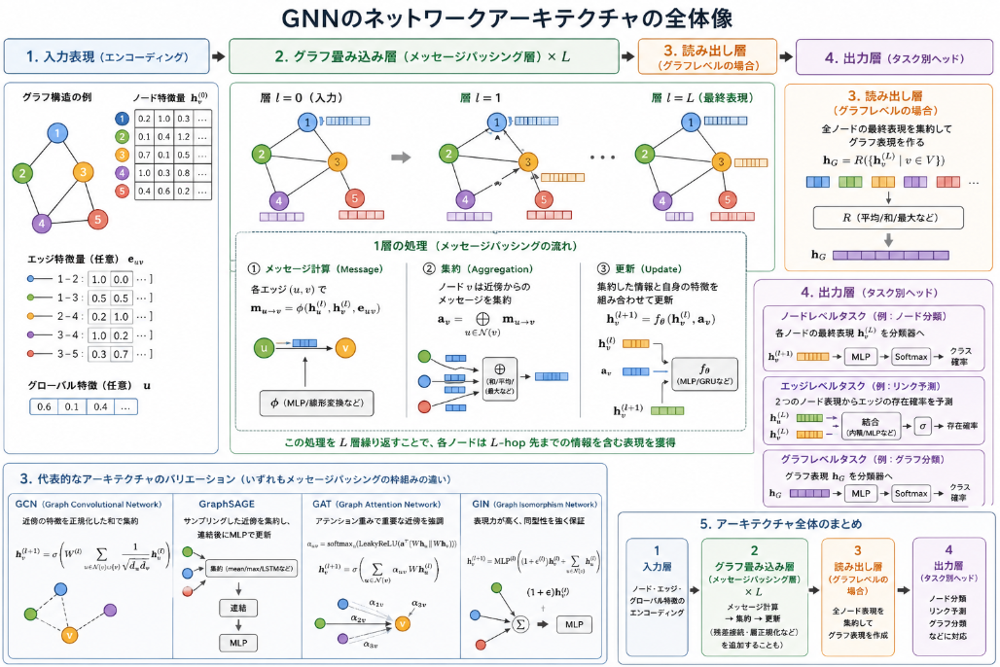

ここ2回グラフニューラルネットワーク(以下GNNと略します)のtestを行ってきました。
GNNの特徴は直接的に関係性を理解することが出来ること。
ですが、ネットワークアーキテクチャの特徴について説明してきませんでした。

本日テーマ：
>GNNのネットワークアーキテクチャについて理解する


## ネットワークアーキテクチャ

GNNの「ネットワークアーキテクチャ」は、グラフ構造（ノードとエッジ）を入力として、その構造を活かしながら特徴量を更新していく一連の層の組み合わせとして設計されます。典型的な構成は次のようになります。

### 1. 入力表現（グラフのエンコーディング）

まず、グラフをニューラルネットワークが扱える形に変換します。

- **ノード特徴量**  
  各ノード $v$ に対し、初期の特徴ベクトル $\mathbf{h}_v^{(0)}$ を用意します。  
  例：ユーザー属性、分子の原子種、文書の単語埋め込みなど。

- **エッジ特徴量（必要に応じて）**  
  エッジの種類や重みをベクトル $\mathbf{e}_{uv}$ として表現します。

- **グラフ全体の特徴量（グローバル特徴）**  
  グラフ全体の属性（例：分子のラベル）を $\mathbf{u}$ として扱うこともあります。

### 2. メッセージパッシング層（グラフ畳み込み層）

GNNの中核は「メッセージパッシング」または「グラフ畳み込み」層です。  
1層ごとに、各ノードは「隣接ノードからの情報」を集約し、自身の表現を更新します。

__典型的な1層の処理__

1. **メッセージ計算**  
   各エッジ $(u, v)$ について、送信元ノード $u$ の特徴とエッジの特徴から「メッセージ」を計算します。
   $$
   \mathbf{m}_{u \to v} = \phi\left(\mathbf{h}_u, \mathbf{h}_v, \mathbf{e}_{uv}\right)
   $$
   ここで $\phi$ は小さなニューラルネット（MLP）や線形変換などです。

2. **集約（Aggregation）**  
   ノード $v$ は、近傍ノードからのメッセージを集約します。
   $$
   \mathbf{a}_v = \bigoplus_{u \in \mathcal{N}(v)} \mathbf{m}_{u \to v}
   $$
   $\bigoplus$ は和・平均・最大値など、順序不変な演算です。

3. **更新（Update）**  
   集約した情報と自身の特徴を組み合わせて、新しいノード表現を計算します。
   $$
   \mathbf{h}_v^{(l+1)} = f_\theta\left(\mathbf{h}_v^{(l)}, \mathbf{a}_v\right)
   $$
   ここで $f_\theta$ もMLPやGRUなどが使われます。

このような層を $L$ 回繰り返すことで、各ノードは「$L$-hop先までの情報」を含んだ表現を持つようになります。

### 3. 代表的なアーキテクチャのバリエーション

「グラフ畳み込み」の具体的な実装にはいくつかの代表的な方式があります。

- **GCN（Graph Convolutional Network）**  
  近傍の特徴を正規化した和で集約し、線形変換＋非線形活性化を行うシンプルな形式です。

- **GraphSAGE**  
  サンプリングした近傍から集約し、連結後にMLPで更新します。大規模グラフに適します。

- **GAT（Graph Attention Network）**  
  隣接ノードにアテンション重みを付けて集約します。重要度の高い近傍を強調できます。

- **GIN（Graph Isomorphism Network）**  
  グラフ同型性を理論的に強く保証できる集約方法で、表現力の高いモデルです。

これらはいずれも「メッセージパッシング＋集約＋更新」という枠組みのバリエーションです。

### 4. 出力層（タスクに応じたヘッド）

メッセージパッシングを何層か重ねた後、タスクに応じて出力を設計します。

__ノードレベルタスク（例：ノード分類）__

- 各ノードの最終表現 $\mathbf{h}_v^{(L)}$ をそのまま分類器（MLP＋Softmaxなど）に入力します。

__エッジレベルタスク（例：リンク予測）__

- 2つのノード表現 $\mathbf{h}_u^{(L)}, \mathbf{h}_v^{(L)}$ から、内積やMLPでエッジの存在確率を計算します。

__グラフレベルタスク（例：グラフ分類）__

- **読み出し（Readout）層**で、全ノードの表現を集約してグラフ全体の表現を作ります。
  $$
  \mathbf{h}_G = R\left(\{\mathbf{h}_v^{(L)} \mid v \in V\}\right)
  $$
  $R$ は平均・和・最大値など、順序不変な関数です。
- その後、$\mathbf{h}_G$ をMLPなどに入れてグラフラベルを予測します。

### 5. アーキテクチャ全体のまとめ

典型的なGNNアーキテクチャは、以下のような「レイヤー構成」になります。

1. **入力層**：ノード・エッジ・グローバル特徴のエンコーディング
2. **グラフ畳み込み層（メッセージパッシング層） × L**  
   - メッセージ計算 → 集約 → 更新  
   - 必要に応じて残差接続や層正規化を追加
3. **読み出し層（グラフレベルタスクの場合）**  
   - 全ノード表現を集約してグラフ表現を作成
4. **出力層（タスク別ヘッド）**  
   - ノード分類／リンク予測／グラフ分類などに対応するMLPや線形層

このように、GNNのネットワークアーキテクチャは「グラフ構造を活かしたメッセージパッシング」を何層も重ね、最後にタスクに応じたヘッドで出力する、という形で設計されるのが一般的です。


## 実装法

以下では、PyTorchを使って「GCN風のグラフニューラルネットワーク」をステップバイステップで実装します。  
（実際のGCN論文の正規化まで含めた完全な再現ではなく、「メッセージパッシング＋集約＋更新」の構造を理解するための最小構成です。）

### 1. 前提：必要なライブラリとデータ形式

まず、PyTorchと簡単なグラフデータを用意します。

```python
import torch
import torch.nn as nn
import torch.nn.functional as F

# 簡単なグラフ例：4ノード、エッジは 0-1, 1-2, 2-3, 3-0
edge_index = torch.tensor([[0, 1, 2, 3],
                           [1, 2, 3, 0]], dtype=torch.long)  # shape: (2, num_edges)

# 各ノードの特徴量（例：2次元）
x = torch.tensor([[1.0, 0.0],
                  [0.0, 1.0],
                  [1.0, 1.0],
                  [0.0, 0.0]], dtype=torch.float)

num_nodes = x.size(0)
```

ここでは、`edge_index` は `[source, target]` の形でエッジを表し、`x` は各ノードの特徴ベクトルです。

### 2. ステップ1：メッセージパッシング層の実装

GNNの中核である「メッセージパッシング層」を1つ実装します。  
ここでは、以下の処理を行います。

1. 各エッジについてメッセージを計算（ここでは単純に送信元ノードの特徴を線形変換）
2. 各ノードについて、隣接ノードからのメッセージを集約（ここでは単純な和）
3. 集約結果を線形変換して新しいノード表現に更新

```python
class SimpleMessagePassingLayer(nn.Module):
    def __init__(self, in_dim, out_dim):
        super().__init__()
        # メッセージ計算用の線形層（送信元ノード特徴を変換）
        self.msg_lin = nn.Linear(in_dim, out_dim)
        # 更新用の線形層（集約メッセージ＋自己ループを変換）
        self.update_lin = nn.Linear(in_dim + out_dim, out_dim)

    def forward(self, x, edge_index):
        """
        x: (num_nodes, in_dim)
        edge_index: (2, num_edges)
        """
        src, dst = edge_index  # src -> dst のエッジ

        # 1. メッセージ計算：各エッジについて送信元ノードの特徴を変換
        msg = self.msg_lin(x[src])  # (num_edges, out_dim)

        # 2. 集約：各ノードが受け取るメッセージを合計
        agg = torch.zeros(x.size(0), msg.size(1), device=x.device)
        agg = agg.index_add_(0, dst, msg)  # dstノードごとにmsgを加算

        # 3. 更新：自身の特徴と集約メッセージを結合して変換
        #    ここでは自己ループとして元の特徴 x も使う
        combined = torch.cat([x, agg], dim=-1)  # (num_nodes, in_dim + out_dim)
        new_x = self.update_lin(combined)

        return new_x
```

この層は、1-hop分の情報を集約してノード表現を更新する、ごく単純なGNN層です。

### 3. ステップ2：多層GNNのアーキテクチャ

次に、上記のメッセージパッシング層を複数重ねた「グラフネットワーク」を定義します。

```python
class SimpleGNN(nn.Module):
    def __init__(self, input_dim, hidden_dim, output_dim, num_layers=2):
        super().__init__()
        self.num_layers = num_layers

        # 入力層（最初のメッセージパッシング層）
        self.layers = nn.ModuleList()
        self.layers.append(SimpleMessagePassingLayer(input_dim, hidden_dim))

        # 中間層
        for _ in range(num_layers - 2):
            self.layers.append(SimpleMessagePassingLayer(hidden_dim, hidden_dim))

        # 出力層（最後のメッセージパッシング層）
        if num_layers > 1:
            self.layers.append(SimpleMessagePassingLayer(hidden_dim, output_dim))
        else:
            # num_layers == 1 の場合は input_dim -> output_dim
            self.layers.append(SimpleMessagePassingLayer(input_dim, output_dim))

    def forward(self, x, edge_index):
        h = x
        for layer in self.layers:
            h = layer(h, edge_index)
            # 非線形活性化（ReLUなど）を挟む
            h = F.relu(h)
        return h
```

このモデルは、`num_layers` 個のメッセージパッシング層を積み重ね、各層の後にReLUを適用するシンプルなGNNです。

### 4. ステップ3：モデルのインスタンス化とフォワード計算

実際にモデルを作成し、先ほどのグラフデータでフォワード計算を行います。

```python
# モデル定義
model = SimpleGNN(
    input_dim=2,   # xの特徴次元
    hidden_dim=16,
    output_dim=8, # 最終的なノード表現の次元
    num_layers=2
)

# フォワード計算
node_embeddings = model(x, edge_index)

print("入力特徴量 shape:", x.shape)           # (4, 2)
print("出力ノード埋め込み shape:", node_embeddings.shape)  # (4, 8)
```

これで、各ノードの特徴量が「グラフ構造を考慮して変換された」埋め込みベクトルになります。

### 5. ステップ4：グラフレベルタスク用の読み出し層（Readout）

グラフ分類など「グラフ全体」を1つのベクトルにまとめたい場合は、**読み出し層（Readout）** を追加します。

```python
class SimpleGNNWithReadout(nn.Module):
    def __init__(self, input_dim, hidden_dim, node_out_dim, graph_out_dim):
        super().__init__()
        # ノード表現を学習するGNN
        self.gnn = SimpleGNN(input_dim, hidden_dim, node_out_dim, num_layers=2)
        # グラフ読み出し用MLP（全ノードを集約してグラフ表現に変換）
        self.readout_mlp = nn.Sequential(
            nn.Linear(node_out_dim, graph_out_dim),
            nn.ReLU()
        )

    def forward(self, x, edge_index, batch=None):
        """
        x: (num_nodes, input_dim)
        edge_index: (2, num_edges)
        batch: 各ノードが属するグラフID（単一グラフの場合はNoneでOK）
        """
        # 1. ノード表現をGNNで更新
        node_emb = self.gnn(x, edge_index)  # (num_nodes, node_out_dim)

        # 2. グラフ読み出し（ここでは全ノードの平均を取る）
        if batch is None:
            # 単一グラフの場合：全ノード平均
            graph_emb = node_emb.mean(dim=0, keepdim=True)  # (1, node_out_dim)
        else:
            # 複数グラフが1つのバッチにまとまっている場合：グラフごとに平均
            # ここでは簡略化のため省略（実際は scatter_mean などを使う）
            raise NotImplementedError("batch処理は省略しています")

        # 3. グラフ表現をMLPで変換
        graph_out = self.readout_mlp(graph_emb)  # (1, graph_out_dim)

        return graph_out
```

このように、`SimpleGNN` でノード表現を学習し、その後に `mean` などの順序不変な集約関数でグラフ表現を作るのが一般的です。

### 6. まとめ：このアーキテクチャの構成

今回実装したGNNアーキテクチャは、以下のステップで構成されています。

1. **入力表現**  
   - ノード特徴量 `x` とエッジリスト `edge_index` を用意
2. **メッセージパッシング層（SimpleMessagePassingLayer）**  
   - メッセージ計算 → 集約（`index_add_`） → 更新（線形層）  
   - 各層の後にReLUを適用
3. **多層GNN（SimpleGNN）**  
   - 上記の層を `num_layers` 個重ねる
4. **読み出し層（Readout）**  
   - 全ノード表現を平均などで集約し、MLPでグラフ表現に変換

このコードは「GNNの基本構造」を理解するための最小構成です。  
実際の研究・実務では、以下のような拡張がよく行われます。

- 正規化（LayerNorm, BatchNorm）や残差接続の追加
- GCN, GAT, GraphSAGE など論文に基づいた正確な集約式の実装
- ミニバッチ処理（複数グラフを1バッチにまとめる）
- Dropoutや重み初期化の調整



## 総括

以下では、GNNの**アーキテクチャの構成要素**と**実装のキーポイント**をコンパクトにまとめます。

### 1. GNNアーキテクチャの構成要素（設計の基本）

GNNのネットワークアーキテクチャは、以下の要素の組み合わせとして設計されます。

__(1) 入力表現（グラフのエンコーディング）__

- **ノード特徴量**  
  各ノード $v$ に初期特徴ベクトル $\mathbf{h}_v^{(0)}$ を割り当てる（ユーザ属性、原子種、単語埋め込みなど）。
- **エッジ特徴量（任意）**  
  エッジの種類・重みをベクトル $\mathbf{e}_{uv}$ で表現。
- **グローバル特徴（任意）**  
  グラフ全体の属性（例：分子ラベル）を $\mathbf{u}$ として扱う。

__(2) メッセージパッシング層（グラフ畳み込み層）__

1層ごとに、各ノードは「隣接ノードからの情報」を集約し、自身の表現を更新します。

- **メッセージ計算**  
  $$
  \mathbf{m}_{u \to v} = \phi(\mathbf{h}_u, \mathbf{h}_v, \mathbf{e}_{uv})
  $$
  $\phi$：小さなMLPや線形変換など。
- **集約（Aggregation）**  
  $$
  \mathbf{a}_v = \bigoplus_{u \in \mathcal{N}(v)} \mathbf{m}_{u \to v}
  $$
  $\bigoplus$：和・平均・最大値など、順序不変な演算。
- **更新（Update）**  
  $$
  \mathbf{h}_v^{(l+1)} = f_\theta(\mathbf{h}_v^{(l)}, \mathbf{a}_v)
  $$
  $f_\theta$：MLPやGRUなど。

この層を $L$ 回繰り返すことで、各ノードは「$L$-hop先までの情報」を含んだ表現を持ちます。

__(3) 代表的なバリエーション__

- **GCN**：正規化した近傍和＋線形変換＋活性化。
- **GraphSAGE**：サンプリング近傍から集約し、連結後にMLPで更新。
- **GAT**：アテンション重み付き集約で重要近傍を強調。
- **GIN**：グラフ同型性を理論的に保証できる強い表現力を持つ集約。

いずれも「メッセージパッシング＋集約＋更新」の枠組みのバリエーションです。

__(4) 出力層（タスク別ヘッド）__

- **ノードレベル**：各ノードの最終表現 $\mathbf{h}_v^{(L)}$ を分類器に入力。
- **エッジレベル**：2ノード表現から内積やMLPでエッジ存在確率を計算。
- **グラフレベル**：全ノード表現を読み出し関数 $R$（平均・和・最大など）で集約し、MLPでグラフラベルを予測。

### 2. 実装のキーポイント（PyTorchでの最小構成）

__(1) データ形式__

- `x`：ノード特徴量テンソル `(num_nodes, input_dim)`
- `edge_index`：エッジリスト `(2, num_edges)`（`[source, target]`）

__(2) メッセージパッシング層の実装ポイント__

- **メッセージ計算**：`x[src]` を線形変換して各エッジのメッセージを作る。
- **集約**：`torch.zeros(...).index_add_(0, dst, msg)` で、各ノードが受け取るメッセージを合計。
- **更新**：元の特徴 `x` と集約結果 `agg` を結合し、線形層で新しいノード表現を計算。
- 各層の後にReLUなどの非線形活性化を挟む。

__(3) 多層GNNの構成__

- `nn.ModuleList` で複数のメッセージパッシング層を積み重ねる。
- 入力次元 → 隠れ次元 → … → 出力次元と段階的に変換。
- 必要に応じて残差接続や正規化（LayerNormなど）を追加。

__(4) グラフレベルタスク用の読み出し（Readout）__

- 全ノード表現を `mean` などで集約し、グラフ全体のベクトルを作成。
- そのベクトルをMLPで変換してグラフラベルを予測。
- 複数グラフをバッチ処理する場合は、`batch` 引数と `scatter_mean` などでグラフごとに集約。

