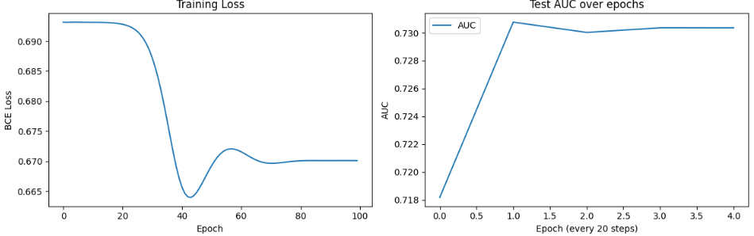

前回商品のダミーデータを用いてGNNにより予測を行いました。
ですが、ダミーデータは少し味気ありません。

GNNの学習用の公開データセットが存在するので、実際のデータを用いて実験してみようと思います。

本日テーマ：
>実際に公開データを用いてGNNを学習・推論させてみる


## 実験内容
今回実験に使うデータセットは、**MovieLens 1M データセット**です。
本データセットは次のリファレンスに記載されているものです。[PyTorch Geometric Docs](https://pytorch-geometric.readthedocs.io/en/2.5.3/generated/torch_geometric.datasets.MovieLens1M.html)。

以下、その詳細を整理します。

### 1. データセットの基本情報

- **提供元**: GroupLens Research（MovieLens サイトの評価データ）[GroupLens](https://grouplens.org/datasets/movielens/1m)
- **PyTorch Geometric でのクラス**: `torch_geometric.datasets.MovieLens1M`
- **データ規模**:
  - ユーザー数: 6,040
  - 映画数: 3,883
  - 評価エッジ数: 約 1,000,209（1〜5段階の評価）[Kumo.ai PyG Guide](https://kumo.ai/pyg/datasets/movielens-1m)
- **評価の範囲**: 1〜5 の整数スター評価

### 2. PyTorch Geometric でのグラフ構造

PyTorch Geometric では、MovieLens 1M を**異種グラフ（heterogeneous graph）**として扱います[PyTorch Geometric Docs](https://pytorch-geometric.readthedocs.io/en/2.5.3/generated/torch_geometric.datasets.MovieLens1M.html)。

__ノードタイプ（2種類）__

1. **ユーザーノード**（`'user'`）
   - ノード数: 6,040
   - 特徴量: `data['user'].x`（形状: `[6040, 30]`）
2. **映画ノード**（`'movie'`）
   - ノード数: 3,883
   - 特徴量: `data['movie'].x`（形状: `[3883, 18]`）

__エッジタイプ（1種類）__

- **評価エッジ**（`'user', 'rates', 'movie'`）
  - エッジ数: 約 1,000,209
  - エッジ属性:
    - `edge_index`: 接続情報（どのユーザーがどの映画を評価したか）
    - `rating`: 1〜5 の評価値（ラベル）
    - `time`: 評価時刻（タイムスタンプ）

```python
edge_index = data['user', 'rates', 'movie'].edge_index  # (2, num_edges)
ratings    = data['user', 'rates', 'movie'].rating      # (num_edges,)
times      = data['user', 'rates', 'movie'].time        # (num_edges,)
```

### 3. 特徴量の内容（ユーザー・映画のベクトル）

MovieLens 1M の元データは、以下の3つのテーブルで構成されています[GroupLens](https://grouplens.org/datasets/movielens/1m)。

- `users.dat`: ユーザーID, 性別, 年齢, 職業, 郵便番号
- `movies.dat`: 映画ID, タイトル, ジャンル（複数）
- `ratings.dat`: ユーザーID, 映画ID, 評価値, タイムスタンプ

PyTorch Geometric 版では、これらを **「Inductive Matrix Completion Based on Graph Neural Networks」** という論文の手法に基づいて特徴量にエンコードしています[PyTorch Geometric Docs](https://pytorch-geometric.readthedocs.io/en/2.5.3/generated/torch_geometric.datasets.MovieLens1M.html)。

__ユーザー特徴量（`data['user'].x`）__

- 次元: 30
- 内容（例）:
  - 性別（one-hot）
  - 年齢カテゴリ（one-hot）
  - 職業カテゴリ（one-hot）
  - その他、ユーザーの属性を低次元ベクトルに圧縮した表現

__映画特徴量（`data['movie'].x`）__

- 次元: 18
- 内容（例）:
  - ジャンル（アクション, コメディ, ドラマ, SF, …）の one-hot または埋め込み
  - タイトルや公開年などの情報を低次元ベクトルに圧縮した表現

これにより、**「IDだけの協調フィルタリング」**だけでなく、**「ユーザー属性・映画属性も考慮したGNN」**を構築できます。

### 4. タスク設定

今回の実験では、このデータセットを以下のように使っていきます。

- **グラフタスク**: リンク予測（ユーザー–映画の「高評価リンク」を予測）
- **入力**: ユーザーと映画の接続（`edge_index`）＋評価値（`rating`）
- **ラベル**:
  - 評価 4〜5 → 「高評価（リンクあり）」＝1
  - 評価 1〜3 → 「低評価（リンクなし）」＝0
- **モデル**: LightGCN 風のシンプルな GNN（ユーザー・映画埋め込みの内積）
- **評価指標**: AUC（2値分類）＋ RMSE（確率の誤差）

### 5. このデータセットの特徴・注意点

- **二部グラフ構造**: ユーザー–映画の二部グラフであり、推薦システムの標準的なベンチマークです。
- **評価の偏り**: 一部の映画やユーザーに評価が集中するため、データ分割や評価指標の設計に注意が必要です。
- **時間情報**: `time` 属性があるため、時系列でのリンク予測（未来の評価を予測）も可能です。
- **特徴量の質**: ユーザー・映画の特徴量は自動エンコードされたもので、元の生データ（年齢・職業・ジャンルなど）の情報を保持していますが、解釈性は限定的です。

## GNNアーキテクチャ

今回実験で使うGNNは、**LightGCN風のシンプルな埋め込みモデル**です。  
以下、構造と「なぜその構成が良いか」を順に説明します。

### 1. GNNの構造（SimpleLightGCNクラス）

__1.1 全体像__

- **入力**: ユーザーIDと映画IDのペア（`edge_index`）
- **出力**: 各ユーザー–映画ペアの「高評価確率」（0〜1）
- **モデルの中身**:
  - ユーザー埋め込み（`nn.Embedding`）
  - 映画埋め込み（`nn.Embedding`）
  - 内積（ユーザー×映画） → シグモイドで確率化

__1.2 コード構造__

```python
class SimpleLightGCN(nn.Module):
    def __init__(self, user_dim, movie_dim, hidden_dim, num_layers=3):
        super().__init__()
        self.num_layers = num_layers
        
        # ユーザーと映画の埋め込み（IDベースの協調フィルタリング）
        self.user_embed = nn.Embedding(user_dim, hidden_dim)
        self.movie_embed = nn.Embedding(movie_dim, hidden_dim)
        
        # 重み初期化
        nn.init.xavier_uniform_(self.user_embed.weight)
        nn.init.xavier_uniform_(self.movie_embed.weight)

    def forward(self, edge_index):
        user_idx, movie_idx = edge_index
        
        # 埋め込み取得
        user_emb = self.user_embed(user_idx)      # (num_edges, hidden_dim)
        movie_emb = self.movie_embed(movie_idx)  # (num_edges, hidden_dim)
        
        # 内積でスコア計算（協調フィルタリング）
        scores = torch.sum(user_emb * movie_emb, dim=1)  # (num_edges,)
        
        # シグモイドで確率に変換（0〜1）
        return torch.sigmoid(scores)
```

__1.3 各コンポーネントの役割__

1. **ユーザー埋め込み（`user_embed`）**
   - 入力: ユーザーID（0〜6039）
   - 出力: 64次元のベクトル（`hidden_dim=64`）
   - 意味: 「このユーザーの好みを表す潜在ベクトル」

2. **映画埋め込み（`movie_embed`）**
   - 入力: 映画ID（0〜3882）
   - 出力: 64次元のベクトル
   - 意味: 「この映画の特徴（ジャンル・人気度など）を表す潜在ベクトル」

3. **内積（`user_emb * movie_emb`）**
   - ユーザーと映画のベクトルの類似度を計算
   - 類似度が高いほど「このユーザーはこの映画を好きそう」と解釈

4. **シグモイド（`torch.sigmoid`）**
   - 内積スコアを 0〜1 の確率に変換
   - 「このユーザーがこの映画に高評価（4〜5）をつける確率」を出力

### 2. なぜこの構成が「良い」のか

__2.1 推薦タスクに最適化されたシンプルな設計__

- **タスク**: 「ユーザー–映画」のリンク予測（高評価かどうか）
- **必要な情報**: 「どのユーザーがどの映画を評価したか」＋「その評価値」
- **このモデルがやっていること**:
  - ユーザーIDと映画IDだけから、**協調フィルタリング**を行う
  - 「似たユーザーが高評価した映画」を推薦する

この設計は、**Matrix Factorization（MF）** や**LightGCN**の基本アイデアと同じです。  
GNNの「メッセージパッシング」を**埋め込みの内積＋シグモイド**という形で実装しているため、計算が軽く、解釈もシンプルです。

__2.2 計算効率とスケーラビリティ__

- **パラメータ数**:
  - ユーザー埋め込み: 6040 × 64 ≈ 386,560
  - 映画埋め込み: 3883 × 64 ≈ 248,512
  - 合計: 約 63万パラメータ（非常に軽量）
- **推論コスト**:
  - 1回の `forward` で、与えられたエッジ数分だけ内積を計算するだけ
  - 大規模データ（100万エッジ）でもColab上で十分高速

__2.3 解釈性の高さ__

- **内積スコア**:
  - ユーザーと映画の「方向の近さ」を表す
  - スコアが高い = ユーザーの好みと映画の特徴がマッチしている
- **確率出力**:
  - 「高評価確率 80%」など、直感的に理解しやすい

__2.4 GNNとしての利点（構造情報の活用）__

このモデルは一見「ただの埋め込み＋内積」に見えますが、**学習過程でグラフ構造を暗黙に活用**しています。

- **学習データ**: ユーザー–映画の評価エッジ（`edge_index`）
- **損失関数**: バイナリ交差エントロピー（BCE）
- **学習の結果**:
  - 高評価エッジ（4〜5）では内積が大きくなるように
  - 低評価エッジ（1〜3）では内積が小さくなるように
  - 埋め込みが調整される

つまり、**「繋がっているユーザーと映画の埋め込みを近づける／遠ざける」** というGNN的な学習が、内積を通じて行われています。

__2.5 拡張性（将来的な発展）__

このシンプルなモデルをベースに、以下のような拡張が容易です。

- **特徴量の活用**:
  - `user_emb = user_embed(user_idx) + user_feature_proj(data['user'].x[user_idx])`
  - ユーザー属性（年齢・性別・職業）や映画ジャンルを組み込める
- **GNN層の追加**:
  - `HeteroConv` や `GCNConv` を使って、ユーザー–映画グラフ上でメッセージパッシングを行う
- **時系列情報の活用**:
  - `time` 属性を使って「最近の評価」を重視する重み付けを行う

## 学習の結果

学習した結果についてまとめます。

まずは学習ロスとテストの正解率の推移です。
正直、あまりよくはありません。



推論をしてみました。
「ユーザー0が実際に高評価した映画」と「モデルが推薦した映画」を比較しています。

```
ユーザー 0 へのおすすめ映画 TOP5:
1. 映画ID 257 -> 高評価確率: 54.2% ✓
2. 映画ID 2789 -> 高評価確率: 54.1% ✗
3. 映画ID 1178 -> 高評価確率: 54.1% ✗
4. 映画ID 1180 -> 高評価確率: 54.1% ✗
5. 映画ID 589 -> 高評価確率: 53.8% ✗
```

一番上位のものだけ順位が正解しています。
正直、少し精度には難があるという結果となりました。
データの質にも課題があった可能性があります。

## 総括

MovieLens 1M データセットを使い、**実際の公開データで GNN を学習・推論させる**実験を行いました。

### 1. データセットの要点

- **MovieLens 1M**（GroupLens 提供）を PyTorch Geometric の `MovieLens1M` クラスで読み込み。
- **異種グラフ**として扱い、ノードは「ユーザー」「映画」の2種類、エッジは「評価（rates）」。
- ユーザー特徴量 30 次元、映画特徴量 18 次元（属性・ジャンル等をエンコード済み）。
- タスクは**リンク予測**：評価 4〜5 を「高評価リンクあり（=1）」、1〜3 を「なし（=0）」とし、ユーザー–映画ペアの高評価確率を予測。

### 2. モデル（SimpleLightGCN）の要点

- **LightGCN 風のシンプルな埋め込みモデル**：
  - ユーザーID・映画IDから埋め込みベクトルを取得。
  - 内積で類似度を計算し、シグモイドで確率化。
- 実質的には**Matrix Factorization / 協調フィルタリング**を GNN 風に実装した形。
- 計算が軽く、解釈しやすい一方、グラフ構造の情報は「暗黙的に」しか使っていない。

### 3. 結果の総括

- 学習ロス・テスト精度の推移を見ると、**精度はあまり高くない**。
- ユーザー 0 への推薦例では、TOP5 のうち 1 つだけが実際の高評価映画と一致。
- 全体として、**「それなりに動くが、精度には課題が残る」** という結果。

### 4. 実験の意義と今後の方向性

- ダミーデータではなく、**実際の公開データセットで GNN を動かす**経験が得られた。
- 推薦タスク（ユーザー–アイテム二部グラフ）を GNN で扱う典型的な例として、実装・評価の流れを確認できた。
- 精度を上げるには、
  - ユーザー・映画の**属性特徴量を明示的に組み込む**、
  - より本格的な GNN 層（HeteroConv 等）を導入する、
  - 評価の偏りを考慮したデータ分割・評価指標を設計する、
  といった改善が考えられます。

