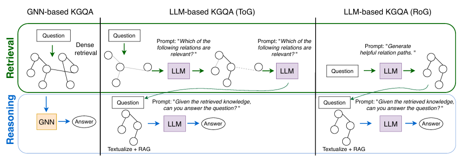
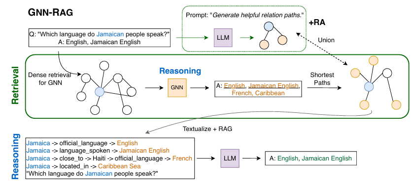

以前本ブログで何度か出てきていた[グラフニューラルネットワーク(GNN)](https://yoshishinnze.hatenablog.com/entry/2026/06/25/043000)を用いて相関性やユーザレコメンドを行うことが出来ることを確認しました。

https://yoshishinnze.hatenablog.com/entry/2026/06/30/043000

https://yoshishinnze.hatenablog.com/entry/2026/07/03/043000

今日は知識グラフというRAGに用いるグラフDBにGNNを活用するという論文を見つけました。
内容が結構わくわくしたので論文解説してみます。

## 概要

### 一言で言うと

**知識グラフ（KG）からの情報検索を、軽量なGNNに任せることで、マルチホップ・複数エンティティを含む複雑な質問に対しても、LLMを何度も呼び出さずに高精度な検索と推論を実現するフレームワーク** です。

### 背景にある問題

従来の KGQA（知識グラフ質問応答）における RAG では、以下の問題がありました。

- **LLMベースの検索は高コスト**：グラフを探索するたびに LLM を呼び出す必要があり、マルチホップ質問では検索空間が指数関数的に膨張する
- **既存の検索器は構造を活かしきれない**：NLP ベースの検索器や古典的なグラフアルゴリズムでは、KG の構造的な関連性を十分に捉えられない
- **長文脈推論はノイズが多い**：深いホップまで広げると大量の無関係なノードが混入し、LLM の文脈を圧迫する

### GNN-RAG のアプローチ

GNN-RAG は、検索プロセスを **「GNNによるグラフ検索フェーズ」** と **「LLMによる自然言語推論フェーズ」** の2段階に分離します。

1. **GNN による関連ノードのスコアリング**
   - 質問に関連するノードの埋め込みを学習し、各ノードに「この質問に対する重要度」を重みとして割り当てます
   - 多層 GNN を用いることで、質問エンティティから遠く離れたノード（深いホップ）の文脈も考慮したスコアリングが可能になります

2. **最短経路の検索と言語化**
   - GNN が高スコアとした回答候補ノードまでの **最短経路** をグラフ上で抽出します
   - 抽出した経路（トリプル列）を自然言語に言語化（verbalize）し、LLM に文脈として提供します

3. **LLM による最終推論**
   - LLM は、GNN が絞り込んだ高品質なグラフ文脈だけを受け取り、最終的な回答を生成します

### 主な成果

| 指標 | 結果 |
|------|------|
| **複雑な質問での改善** | マルチホップ・マルチエンティティ質問で、既存の LLM ベース検索手法を **F1 で 8.9〜15.5% ポイント上回る** |
| **LLM の性能を小モデルで達成** | 7B パラメータのチューニング済み LLM で **GPT-4 相当以上の性能** を達成 |
| **トークン効率** | 長文脈推論と比較して **9 分の 1 の KG トークン数** で同等以上の性能 |
| **追加 LLM 呼び出しなし** | 既存の SOTA KGQA 手法が複数回の LLM 呼び出しを必要とするのに対し、GNN-RAG は追加の LLM 呼び出しを不要とする |


### 技術的なポイント

- **GNN は「グラフ構造の専門家」、LLM は「言語推論の専門家」** という役割分離
- GNN と LLM のモダリティの不一致（潜在空間の違い）を、**「検索結果を言語化して渡す」** ことで回避
- 深層 GNN（多層）を用いることで、遠方ノードの文脈を検索段階で考慮


### 関連リソース

- 論文 (PDF): [GNN-RAG @ ACL 2025 Findings](https://aclanthology.org/2025.findings-acl.856.pdf)
- コード: [github.com/cmavro/GNN-RAG](https://github.com/cmavro/GNN-RAG)

## 解決しようとした課題

GNN-RAG が解決しようとした課題は、主に以下の3つです。

### 1. 「LLMを検索器として使う」ことの非効率性

既存の KGQA RAG 手法の多くは、グラフ内の関係パスを生成したり、KG を走査したりするために **LLM を繰り返し呼び出す** 必要がありました。

- マルチホップ質問や複数エンティティを含む質問では、グラフの探索空間が **深いホップほど指数関数的に膨張** します
- LLM はこの膨大なグラフ構造を直接処理するのが苦手で、コストも時間もかかる
- 結果として、**複雑な質問ほど検索が非効率で不正確** になる

### 2. グラフ構造を活かせない「的外れな検索」

既存の検索アプローチには以下の限界がありました。

- **NLP ベースの検索器**：テキストの類似性だけで検索し、KG の **構造的な関連性（どのノードがどのノードと繋がっているか）** を無視する
- **古典的なグラフアルゴリズム**：最短経路などの固定的な指標で検索するため、**質問の意味に応じた柔軟な関連性スコアリング** ができない
- これらは KGQA 向けに最適化された検索ではないため、**質問に無関係なノイズが多く混入** し、LLM の文脈を圧迫する

### 3. GNN と LLM の「モダリティの不一致」

GNN と LLM を単純に融合しようとする既存手法では、以下の問題がありました。

- GNN は **グラフ構造の潜在空間** で情報を扱い、LLM は **自然言語の潜在空間** で情報を扱う
- この **モダリティの不一致** により、2つのモデルを直接結合して学習させるのが難しく、知識集約タスクで性能が出にくい
- 教師あり設定でもこの不一致は解消しにくい



## 仕組み

GNN-RAG の仕組みは、**「探偵（GNN）が手がかりを絞り込み、弁護士（LLM）が最終判断を下す」** という2段階の協働パイプラインです。

以下、処理の流れを順に説明します。

### 全体の流れ（4ステップ）

```
【入力】質問文 + 知識グラフ（KG）
   ↓
① GNN が「質問に関連するノード」にスコアを付ける
   ↓
② 高スコアのノードまでの「最短経路」を抽出
   ↓
③ 経路を自然言語に変換（言語化）
   ↓
④ LLM がその文脈を読んで回答を生成
【出力】回答文
```



### ステップ①：GNN が「重要なノード」を探す

質問に含まれるエンティティ（例：「スティーブ・ジョブズ」）をグラフ上のノードとして特定し、**GNN がグラフ全体を巡回して関連度を計算** します。

- 質問ノードから近いノードほど高い関連性を持つ
- GNN は多層（深い）構造なので、**遠く離れたノードの文脈も伝播** して考慮できる
- 最終的に、各ノードに「この質問に対する回答らしさ」のスコアが割り当てられる

> **イメージ**：質問を「投げ込む」と、グラフ内で波のように関連性が伝播し、回答候補のノードが浮かび上がってくる。

### ステップ②：回答候補までの「最短経路」を抽出

GNN が高スコアとしたノード（回答候補）について、**質問エンティティからそのノードまでの最短パス** をグラフ上で抽出します。

- 例：`スティーブ・ジョブズ → founded → Apple → headquartered in → Cupertino`
- この経路が「なぜそのノードが回答なのか」の根拠（根拠パス）になる

> **イメージ**：地図アプリで「現在地から目的地までの最短ルート」を表示するように、グラフ上の道筋を引く。

### ステップ③：経路を自然言語に変換（言語化）

抽出したグラフの経路（トリプルの列）を、**テンプレートやルールに基づいて自然言語文に変換** します。

- `(スティーブ・ジョブズ, founded, Apple)` → 「スティーブ・ジョブズはAppleを設立した」
- `(Apple, headquartered in, Cupertino)` → 「Appleの本社はCupertinoにある」

> **イメージ**：グラフ構造（機械が読む形式）を、LLM が理解しやすい「人間の言葉」に翻訳する。

### ステップ④：LLM が最終推論

言語化された経路情報を文脈（コンテキスト）として LLM に渡し、**LLM が最終的な回答を生成** します。

- LLM はグラフ構造を直接見る必要がなく、**すでに絞り込まれた高品質な事実だけを読めばよい**
- 複数の経路があれば、LLM がそれらを統合・比較して複雑な推論も可能

> **イメージ**：探偵が整理した証拠リストを読み、弁護士が「これで無罪だ」と結論を述べる。

### なぜこの構成が効くのか

| 役割 | GNN | LLM |
|------|-----|-----|
| **得意なこと** | グラフ構造の理解・関連ノードの探索 | 自然言語の理解・論理的推論 |
| **苦手なこと** | 言語の微妙なニュアンス | 大規模グラフの直接探索 |
| **GNN-RAG での役割** | グラフの「意味的な絞り込み」 | 絞り込まれた情報の「言語的推論」 |

**GNN と LLM を「直接融合」させるのではなく、「GNN が検索、LLM が推論」というパイプラインで分離** することで、モダリティの不一致問題を回避しつつ、両者の強みを活かしています。

### 補足：検索の強化テクニック

論文ではさらに以下の工夫も行っています。

- **Retrieval Augmentation**：GNN のスコアリングに加え、ベースラインの検索結果も併用して網羅性を高める
- **Routing**：複数の質問エンティティがある場合、それぞれに対して検索を行い、結果を統合

これにより、マルチホップ・マルチエンティティの複雑な質問にも対応しています。

## 実験

以下に、GNN-RAG の実験設定と結果をまとめます。

### 実験の問題設定

__使用データセット__

2 つの標準的な KGQA ベンチマークを使用しました。

| データセット | 特徴 |
|-----------|------|
| **WebQSP** | 比較的単純な質問が中心だが、マルチホップ推論を含むものも存在 |
| **CWQ (Complex Web Questions)** | 複雑なマルチホップ・マルチエンティティ質問が多数を占める難易度の高いデータセット |

__評価指標__

- **F1 スコア**：予測した回答エンティティ集合と正解集合の一致度を測定
- **検索効率**：LLM に渡す KG トークン数（文脈の圧縮率）

__比較手法__

以下の既存アプローチと比較しました。

- **LLM ベース検索**：GPT-4 などを用いて関係パスを生成・探索する手法
- **UniqIR / TransferNet** などの既存 KGQA モデル
- **RoG (Reasoning on Graphs)** などの LLM によるグラフ探索手法
- **長文脈推論**：関連サブグラフ全体をそのまま LLM に入力するベースライン

### 主な実験結果

__1. 複雑な質問での大幅な性能向上__

マルチホップ・マルチエンティティを含む複雑な質問において、GNN-RAG は既存の LLM ベース検索手法を **F1 で 8.9〜15.5% ポイント上回りました**。

- 特に CWQ のような複雑なデータセットで差が顕著
- LLM がグラフを直接探索する際に発生する「深いホップでのノイズ混入」を GNN が抑制した結果

__2. 小規模 LLM で GPT-4 相当の性能__

- **7B パラメータのチューニング済み LLM** を使用した GNN-RAG が、**GPT-4 を検索器として使う既存手法と同等以上** の F1 を達成
- これは「GNN が高品質に検索を絞り込むため、LLM の規模を小さくしても推論品質が維持できる」ことを示しています

__3. トークン効率：9 倍の圧縮__

長文脈推論（サブグラフ全体を LLM に入力）と比較して、**KG トークン数を約 9 分の 1 に削減** しながら、それ以上の回答精度を達成しました。

- グラフ全体ではなく、GNN が絞り込んだ最短経路だけを言語化して渡すため、LLM の文脈窓を圧迫しない

__4. 検索強化（Retrieval Augmentation）の効果__

GNN のスコアリングに加えて、ベースラインの検索結果を併用する **Retrieval Augmentation** を行うことで、さらに性能が向上しました。

- GNN 単体で見落としがちなエッジケースを補完
- 特に WebQSP では安定的な改善が確認されました

### 実験が示した結論

| 検証したこと | 結果 |
|------------|------|
| GNN は LLM よりグラフ検索が得意か | はい。複雑な質問で LLM ベース検索を大きく上回る |
| 小さい LLM で十分か | はい。7B モデルで GPT-4 級の KGQA 性能が達成可能 |
| 文脈はどれだけ圧縮できるか | 長文脈の約 1/9 のトークンで同等以上の精度 |
| マルチホップは改善するか | はい。8.9〜15.5% の F1 向上を確認 |

以上より、**「GNN にグラフ検索を任せ、LLM に自然言語推論だけを任せる」** という分離アーキテクチャが、コスト・精度・効率の全てにおいて優位性があることが実験的に示されました。

## 総括

GNN-RAG の本質は、**「グラフ構造の理解と言語推論という2つの異なるモダリティを無理に融合させるのではなく、GNN に『構造的な絞り込み』を任せ、その結果を言語化して LLM に『言語的な判断』だけを集中させることで、両者の強みを損なわずに結合した」** 点にあります。

以下、本質を構造的に整理します。

### 1. 本質を貫く3つの洞察

__① モダリティ不一致を「融合」ではなく「パイプライン分離」で解決__

既存研究の多くは「GNN の潜在ベクトルを LLM に注入する」方向でモダリティの壁に挑んでいましたが、GNN-RAG は **「グラフ空間で検索 → 言語空間に変換 → 言語モデルで推論」** という段階的ハンドオフに徹することで、この壁を迂回しました。これは「異なる表現空間を無理に一致させる」より、「境界での翻介質を設計する」方が効果的であることを示しています。

__② 検索と推論という「異なる計算コストの作業」を分離__

LLM にとってグラフ探索は **O(ブランチング因子^ホップ数)** の指数関数的コストを持ちますが、GNN にとっては **O(層数 × エッジ数)** の線形・局所伝播で済みます。GNN-RAG はこの計算量の非対称性を逆手に取り、**「安い計算（GNN）で候補を絞り込み、高い計算（LLM）で最終判断する」** という経済性を実現しました。

__③ 最短経路の言語化が「構造的根拠」を LLM に提供__

単なる回答候補の列挙ではなく、**「質問エンティティから回答までの最短経路」** を言語化して渡すことで、LLM に「なぜその回答か」という構造的根拠（faithful reasoning path）を明示的に与えています。これにより、LLM は暗黙の推論に頼る必要がなく、提示された論理路線を検証・統合するだけで済み、幻覚（hallucination）も抑制されます。

### 2. 技術的教訓

| 従来アプローチの限界 | GNN-RAG の教訓 |
|-------------------|--------------|
| LLM にグラフ探索を任せるとコストが爆発する | **構造探索は GNN の帰納バイアスに任せる** |
| GNN と LLM の潜在空間を直接結合すると性能が出にくい | **言語化（verbalization）を介在させてモダリティを橋渡しする** |
| 長文脈（サブグラフ全体）を LLM に入れるとノイズが増える | **最短経路に圧縮することで、文脈窓を節約しつつ精度を維持する** |
| 大規模 LLM がないと複雑な質問に弱い | **検索品質を高めれば、7B クラスの軽量 LLM でも GPT-4 級の推論が可能** |

### 3. 以前の議論（GraphRAG・迷路探索）との接続

この本質は、以前ご議論いただいた2つのテーマと深く共鳴します。

- **迷路探索での「局所バイアスの重要性」**：Transformer のグローバル Attention では局所的な価値伝播が捉えにくいのと同様に、LLM のグローバルな言語理解だけではグラフの局所的・構造的な関連性が捉えにくい。GNN はまさにこの「局所構造の専門家」です。

- **GraphRAG への新規ノード配置**：GNN-RAG が示した「GNN で構造的理解し、LLM で言語化する」という分離アーキテクチャは、**動的に成長する GraphRAG においても、新規ノードの関連性スコアリングと既存グラフへの意味的統合を GNN に任せ、その結果を LLM の文脈として渡す** という設計思想に直接応用可能です。

### 一言でまとめると

> **「知識グラフという構造世界と自然言語という記号世界の間に、GNN を『構造的理解の翻訳者』として配置し、両者のモダリティを無理に融合させるのではなく段階的に橋渡しすることで、計算効率・推論精度・解釈可能性の三つ巴を同時に達成した」**

これが、GNN-RAG が単なる「GNN と LLM をくっつけた手法」ではなく、**アーキテクチャ設計のパラダイムを示唆する研究** である所以です。
