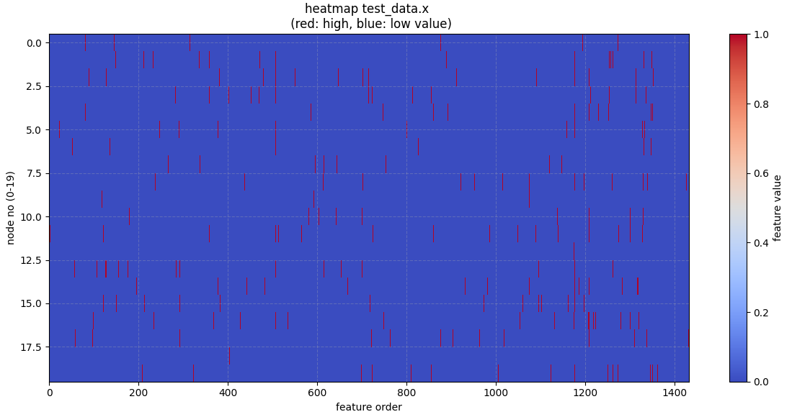

先日[Cora問題でノード分類](https://yoshishinnze.hatenablog.com/entry/2026/07/03/043000)を扱いました。
前回は問題の分かりやすさからテーマを設定していましたが、まだ解いていないが、ニーズがありそうな引用ネットワーク予測を扱っていきます。

本日テーマ：
>Coraを使って、論文の引用予測を行ってみる。

## 問題設定

Cora でのリンク予測タスクは、**「まだ引用されていない論文ペアのうち、将来引用される可能性が高いペアを予測する」** 問題として設定できます。

以下、具体的な問題設定を整理します。

### 1. タスクの定義

- **グラフ**: Cora 引用ネットワーク
  - ノード: 論文
  - エッジ: 引用関係（論文 A → 論文 B）
- **タスク**: リンク予測（Link Prediction）
  - 与えられた 2 つの論文ノード $(u, v)$ について、
  - 「将来、$u$ が $v$ を引用するかどうか」を予測する（2値分類）

### 2. 入力と出力

__2.1 入力__
- **ノード特徴量**:
  - 各論文の単語ベクトル（Bag-of-Words）: `data.x`
- **既存の引用エッジ**:
  - `data.edge_index`（学習用に一部を隠す場合もある）
- **ノードペア**:
  - 予測対象の論文ペア $(u, v)$

__2.2 出力__
- **スコアまたは確率**:
  - 例: 「論文 $u$ が論文 $v$ を引用する確率」$p(u \to v)$
- **2値分類として扱う場合**:
  - 1: 引用あり（リンクが存在する／将来存在する）
  - 0: 引用なし（リンクが存在しない）

### 3. データの分割（Train / Val / Test）

リンク予測では、**エッジを分割**します。

- **学習用エッジ（正例）**:
  - 既存の引用エッジの一部（例: 80%）を「正例」として使用。
- **検証・テスト用エッジ（正例）**:
  - 残りの引用エッジ（例: 10% + 10%）を隠し、モデルの性能評価に使う。
- **負例（Non-links）**:
  - 実際には引用されていない論文ペアを「負例」としてサンプリング。
  - 学習・検証・テストそれぞれで、正例と同数（またはバランスを考慮した数）の負例を用意。

### 4. モデルの役割

- **GNN モデル**:
  - 各論文ノードの埋め込み（潜在表現）を学習。
  - 例: GCN, GAT, GraphSAGE など。
- **スコア関数**:
  - 2 つのノード埋め込みから「リンクの有無」を判定する関数。
  - 例:
    - 内積: $ \text{score}(u, v) = \mathbf{z}_u^\top \mathbf{z}_v $
    - MLP: $ \text{score}(u, v) = \text{MLP}([\mathbf{z}_u; \mathbf{z}_v]) $
- **出力**:
  - シグモイドなどで 0〜1 の確率に変換し、2値分類として学習。

### 5. 評価指標

- **AUC-ROC**:
  - 「引用あり／なし」をどれだけうまく識別できているか。
- **AUC-PR**:
  - 正例が少ない場合（スパースなリンク）に有用。
- **Hit@k**, **MRR** など:
  - 推薦タスクとして扱う場合（「この論文に似た論文はどれか？」など）。

### 6. Cora での注意点

- **有向グラフ**:
  - 引用は方向を持つ（A → B）ため、**有向リンク予測**として扱うのが自然。
- **スパース性**:
  - 実際の引用数は全ペアに比べて非常に少ないため、負例サンプリングの設計が重要。
- **時間情報**:
  - Cora には公開年などの時間情報は含まれていないため、
  - 「将来の引用」を厳密に時間順で予測するのは難しい。
  - 代わりに、「まだ引用されていないペアのうち、引用されそうなペア」を予測する設定が一般的。

## 有向リンク予測問題の注意点

**無向グラフ**と**有向グラフ**では、GNN 上での扱いが**若干変わります**。  
主な違いは以下の通りです。

### 1. モデル設計の違い

__1.1 無向グラフの場合__
- **エッジの向きがない**ため、隣接行列は対称（$A = A^\top$）。
- GCN などの多くの標準的な GNN は、**無向グラフを前提**に設計されています。
- メッセージパッシングは「双方向」に自然に解釈される。

__1.2 有向グラフの場合__
- **エッジの向きがある**ため、隣接行列は非対称（$A \neq A^\top$）。
- そのまま GCN を適用すると、「入ってくる隣接」と「出ていく隣接」を区別せずに集約してしまう。
- 必要に応じて、
  - 入次数・出次数を分けて扱う
  - 有向 GNN（Directed GCN, D-GCN など）を使う
  - エッジタイプを分ける（異種グラフとして扱う）
  といった工夫が必要になる場合があります。

### 2. メッセージパッシングの違い

__2.1 無向グラフ__
- 各ノードは「隣接ノード全体」から情報を集約。
- 例（GCN）:
  $$
  h_i^{(l+1)} = \sigma\left( \sum_{j \in \mathcal{N}(i)} \frac{1}{\sqrt{\deg(i)\deg(j)}} W^{(l)} h_j^{(l)} \right)
  $$
  - $\mathcal{N}(i)$ はノード $i$ の隣接集合（向きなし）。

__2.2 有向グラフ__
- **入隣接（in-neighbors）** と**出隣接（out-neighbors）** を区別する必要がある場合があります。
- 例:
  - 入隣接からのメッセージのみを集約（「誰から引用されているか」を重視）
  - 出隣接からのメッセージのみを集約（「誰を引用しているか」を重視）
  - 両方を別々に集約し、最後に結合する

### 3. 実装上の扱い（PyTorch Geometric の場合）

__3.1 無向グラフ__
- `edge_index` は `[2, num_edges]` で、`(src, dst)` のペアを格納。
- 無向グラフとして扱う場合は、**両方向のエッジを入れる**ことが多いです。
  - 例: `edge_index = torch.cat([edge_index, edge_index.flip(0)], dim=1)`

__3.2 有向グラフ__
- `edge_index` はそのまま**有向エッジ**として扱われます。
- GCNConv などはデフォルトで「隣接ノード」を集約するため、
  - 有向グラフをそのまま渡すと、「出隣接」のみを集約する形になります。
- 入隣接も考慮したい場合は、
  - 転置した隣接行列を追加する（無向化に近い）
  - 別の GNN 層で入隣接を集約する
  などの対応が必要です。

### 4. Cora での具体例

- Cora は**有向グラフ**（論文 A → 論文 B）ですが、
  - ノード分類タスクでは、多くの実装で**無向グラフとして扱われている**ことが多いです。
  - 理由: 「引用関係がある＝互いに近い」と解釈し、双方向に情報を伝播させた方が性能が良いことが多いため。
- リンク予測タスクでは、
  - **有向リンク**として扱う（A → B と B → A は別物）
  - そのため、モデル設計で「方向」を意識する必要があります。

## 実装

Cora でのリンク予測を行うには、

1. データ読み込み
2. 正例・負例エッジの生成（Train/Val/Test 分割）
3. GNN モデル構築（ノード埋め込み学習）
4. リンクスコア関数の定義（内積など）
5. 学習・評価ループ

という流れで進めていきます。


### 1. データ読み込みと前処理

まずはデータロード。
ここはいつも通りです。

```python
import torch
from torch_geometric.datasets import Planetoid
from torch_geometric.utils import negative_sampling

# Cora データセットの読み込み
dataset = Planetoid(root='./data', name='Cora')
data = dataset[0]

print(f"ノード数: {data.num_nodes}")
print(f"エッジ数: {data.edge_index.size(1)}")
print(f"特徴量次元: {data.num_features}")
```

### 2. リンク予測用の正例・負例エッジ生成

エッジの引用の存在があるか、ないかを明確に分けることが必要となるため、
正例・負例エッジが必要となります。
→正例・負例エッジがどの程度の比率か確認していきます。

```python
# 既存のエッジを正例とする
pos_edge_index = data.edge_index  # 形状: [2, num_edges]

# 負例エッジをサンプリング（既存エッジと被らないように）
neg_edge_index = negative_sampling(
    edge_index=pos_edge_index,
    num_nodes=data.num_nodes,
    num_neg_samples=pos_edge_index.size(1)  # 正例と同数
)

print(f"正例エッジ数: {pos_edge_index.size(1)}")
print(f"負例エッジ数: {neg_edge_index.size(1)}")
```

因みに、半々です。

```
正例エッジ数: 10556
負例エッジ数: 10556
```

>__**正例**と**負例**__
>リンク予測における**正例**と**負例**の違いは、**「そのエッジ（リンク）が実際に存在するかどうか」** です。
>Cora の引用ネットワークを例に、具体的に説明します。
>__1. 正例（Positive Examples）__  
>- **定義**:
>  - **実際に存在する引用エッジ**です。
>  - 例: 論文 A が論文 B を引用している → エッジ (A → B) は正例。
>- **Cora での意味**:
>  - `data.edge_index` に含まれるすべてのエッジが正例です。
>- **タスクでの役割**:
>  - モデルに「このような引用関係は存在する（=1）」と学習させるための**正の教師信号**です。
>__2. 負例（Negative Examples）__
>- **定義**:
>  - **実際には存在しない引用エッジ**です。
>  - 例: 論文 C と論文 D の間に引用関係がない → エッジ (C → D) は負例。
>- **Cora での意味**:
>  - 全ノードペアのうち、`edge_index` に含まれないペアが候補になります。
>- **タスクでの役割**:
>  - モデルに「このような引用関係は存在しない（=0）」と学習させるための**負の教師信号**です。
>- **サンプリングの注意点**:
>  - 全ノードペア数は非常に多いため、**ランダムに一部をサンプリング**して負例とします。
>  - PyTorch Geometric の `negative_sampling` や `RandomLinkSplit` がこれを自動で行ってくれます。
>__3. リンク予測タスクでの扱い__
>- **入力**: ノードペア $(u, v)$
>- **ラベル**:
>  - 正例: 1（リンクが存在する）
>  - 負例: 0（リンクが存在しない）
>- **モデルの出力**:
>  - スコアまたは確率 $p(u \to v)$（0〜1）
>- **学習**:
>  - 正例ではスコアを 1 に近づける
>  - 負例ではスコアを 0 に近づける


### 3. Train / Val / Test 分割

学習用データ、検証用データ、テスト用データで分割していきます。
有向グラフとして扱うので `is_undirected` は `False` とます。

```python
from torch_geometric.transforms import RandomLinkSplit

# リンク予測用の分割変換
transform = RandomLinkSplit(
    num_val=0.1,  # 検証用 10%
    num_test=0.1, # テスト用 10%
    is_undirected=False,  # Cora は有向グラフとして扱う
    add_negative_train_samples=True  # 学習用に負例も追加
)

train_data, val_data, test_data = transform(data)

print("=== 分割後のエッジ数 ===")
print(f"学習用 正例: {train_data.edge_index.size(1)}")
print(f"学習用 負例: {train_data.edge_label_index.size(1) - train_data.edge_index.size(1)}")
print(f"検証用 正例: {val_data.edge_label_index.size(1) // 2}")
print(f"検証用 負例: {val_data.edge_label_index.size(1) // 2}")
print(f"テスト用 正例: {test_data.edge_label_index.size(1) // 2}")
print(f"テスト用 負例: {test_data.edge_label_index.size(1) // 2}")
```


Cora の元データは、以下のような情報を持っています。
- 論文（ノード）:
  - ID
  - タイトル
  - アブストラクト（要約）
  - 研究分野（ラベル）

引用関係（エッジ）:
- 論文 A が論文 B を引用している、という情報

PyTorch Geometric 版の Cora では、このうちタイトルとアブストラクト中の単語を特徴量としたものです。
データの中身を可視化してみるとこんな分布になります。
まあ、すかすかですね。



### 4. GNN モデル（ノード埋め込み学習）

推論を行うGNNモデルの構築です。
一旦一番シンプルなモデルで行きますが、推論の精度が良くなければ上位モデルとしていこうと思います。

```python
import torch.nn as nn
import torch.nn.functional as F
from torch_geometric.nn import GCNConv

class GCNEncoder(nn.Module):
    def __init__(self, in_channels, hidden_channels, out_channels):
        super().__init__()
        self.conv1 = GCNConv(in_channels, hidden_channels)
        self.conv2 = GCNConv(hidden_channels, out_channels)

    def forward(self, x, edge_index):
        x = self.conv1(x, edge_index)
        x = F.relu(x)
        x = F.dropout(x, training=self.training)
        x = self.conv2(x, edge_index)
        return x

# モデルとデバイス設定
device = torch.device('cuda' if torch.cuda.is_available() else 'cpu')
model = GCNEncoder(
    in_channels=dataset.num_features,
    hidden_channels=128,
    out_channels=64
).to(device)

train_data = train_data.to(device)
val_data = val_data.to(device)
test_data = test_data.to(device)
```

### 5. リンクスコア関数（内積ベース）

GNNから出力されるノード埋め込み z からエッジの「類似度スコア（内積）」を計算する関数です。

- 内積が大きい → 2つのノードの埋め込みが似た方向を向いている → 「つながりやすい（引用関係がありそう）」とモデルが判断。
- 内積が小さい（負） → 埋め込みが異なる方向 → 「つながりにくい（引用関係はなさそう）」と判断。

```python
def decode(z, edge_index):
    # ノード埋め込みからリンクスコア（内積）を計算
    src, dst = edge_index
    return (z[src] * z[dst]).sum(dim=1)

# 例: 学習用エッジのスコアを計算
z = model(train_data.x, train_data.edge_index)
pos_score = decode(z, train_data.edge_index)
neg_score = decode(z, train_data.edge_label_index[:, train_data.edge_label_index.size(1)//2:])
```

### 6. 学習ループ（BCE 損失）

実際に学習していきます。

```python
optimizer = torch.optim.Adam(model.parameters(), lr=0.01)

def train():
    model.train()
    optimizer.zero_grad()
    
    # ノード埋め込みを取得
    z = model(train_data.x, train_data.edge_index)
    
    # 正例・負例のスコアを計算
    pos_score = decode(z, train_data.edge_index)
    neg_score = decode(z, train_data.edge_label_index[:, train_data.edge_label_index.size(1)//2:])
    
    # ラベル（正例=1, 負例=0）
    pos_labels = torch.ones(pos_score.size(0), device=device)
    neg_labels = torch.zeros(neg_score.size(0), device=device)
    
    scores = torch.cat([pos_score, neg_score], dim=0)
    labels = torch.cat([pos_labels, neg_labels], dim=0)
    
    # BCE 損失
    loss = F.binary_cross_entropy_with_logits(scores, labels)
    loss.backward()
    optimizer.step()
    return loss.item()

@torch.no_grad()
def test(data):
    model.eval()
    z = model(data.x, data.edge_index)
    
    # 正例・負例のスコア
    pos_score = decode(z, data.edge_label_index[:, :data.edge_label_index.size(1)//2])
    neg_score = decode(z, data.edge_label_index[:, data.edge_label_index.size(1)//2:])
    
    scores = torch.cat([pos_score, neg_score], dim=0).cpu().numpy()
    labels = torch.cat([
        torch.ones(pos_score.size(0)),
        torch.zeros(neg_score.size(0))
    ], dim=0).cpu().numpy()
    
    # AUC-ROC を計算（scikit-learn を使用）
    from sklearn.metrics import roc_auc_score
    return roc_auc_score(labels, scores)

# 学習ループ
for epoch in range(1, 101):
    loss = train()
    if epoch % 10 == 0:
        train_auc = test(train_data)
        val_auc = test(val_data)
        print(f'Epoch: {epoch:03d}, Loss: {loss:.4f}, Train AUC: {train_auc:.4f}, Val AUC: {val_auc:.4f}')
```

全然精度良かったです。

```
Epoch: 010, Loss: 0.6408, Train AUC: 0.9018, Val AUC: 0.8660
Epoch: 020, Loss: 0.5236, Train AUC: 0.9419, Val AUC: 0.9156
Epoch: 030, Loss: 0.4434, Train AUC: 0.9667, Val AUC: 0.9409
Epoch: 040, Loss: 0.4008, Train AUC: 0.9827, Val AUC: 0.9530
Epoch: 050, Loss: 0.3686, Train AUC: 0.9903, Val AUC: 0.9556
Epoch: 060, Loss: 0.3401, Train AUC: 0.9946, Val AUC: 0.9532
Epoch: 070, Loss: 0.3167, Train AUC: 0.9964, Val AUC: 0.9507
Epoch: 080, Loss: 0.2932, Train AUC: 0.9977, Val AUC: 0.9465
Epoch: 090, Loss: 0.2745, Train AUC: 0.9985, Val AUC: 0.9426
Epoch: 100, Loss: 0.2424, Train AUC: 0.9989, Val AUC: 0.9356
```


### 7. テスト評価

```python
test_auc = test(test_data)
print(f'最終テスト AUC: {test_auc:.4f}')
```

学習した状態のモデルで予測したAUC-ROCの結果です。
いうことないくらい良いですね。
確信度の閾値がそこそこでも良い精度が出ていると判断できる値です。

```
最終テスト AUC: 0.9567
```

## 総括

今回の記事の内容をまとめます。

### タスク設定

- **グラフ**: Cora 引用ネットワーク
  - ノード: 論文
  - エッジ: 引用関係（有向）
- **タスク**: リンク予測（Link Prediction）
  - 与えられた 2 つの論文ノード $(u, v)$ について、
  - 「将来、$u$ が $v$ を引用するかどうか」を予測する 2 値分類問題。

### 結果
- Cora のリンク予測タスクは、
  - **ノード特徴量（単語 BoW）**と**引用ネットワーク構造**を GNN で統合し、
  - ノード埋め込みの内積をリンクスコアとして用いることで、
  - 「まだ引用されていない論文ペアのうち、引用されそうなペア」を高い精度で予測できる。
- 実装は PyTorch Geometric を用い、GCN + 内積デコーダ + BCE 損失というシンプルな構成で十分な性能が得られることが確認できました。

