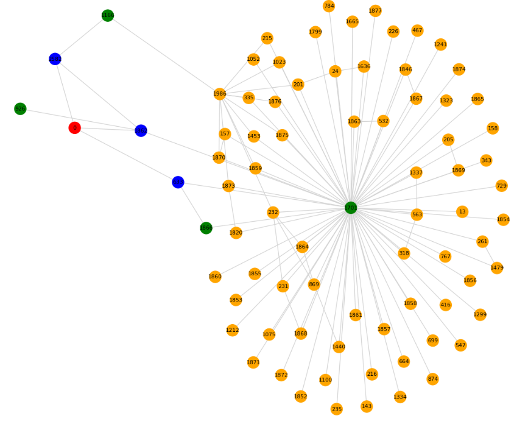

本日扱うのはGNNの練習問題シリーズの第４弾です。
今回扱うデータセットはCoraです。

本日テーマ：
>coraデータセットを用いた学習と推論を行ってみます。

## Coraとは

Cora は、**GNN（Graph Neural Network）の練習・評価で最もよく使われる代表的な引用ネットワークデータセット**です。

### 1. データの概要

- **ノード**: 科学論文（約 2,708 本）
- **エッジ**: 論文間の「引用関係」
  - 論文 A が論文 B を引用している → エッジ（A → B）
- **ノード特徴量（`x`）**:
  - 各論文の**タイトル・アブストラクト中の単語**をベースにした Bag-of-Words ベクトル
  - 次元数は約 1,433（出現した単語の有無を 0/1 で表現）
- **ノードラベル（`y`）**:
  - 論文の**研究分野（カテゴリ）**
  - 例: Case-Based, Genetic Algorithms, Neural Networks, Probabilistic Methods, Reinforcement Learning, Rule Learning, Theory
  - 合計 7 クラス

### 2. タスク設定（典型的な使い方）

- **タスク**: ノード分類（semi-supervised node classification）
- **入力**:
  - グラフ構造（どの論文がどの論文を引用しているか）
  - ノード特徴（単語ベクトル）
- **目的**:
  - 一部の論文にだけラベル（研究分野）が与えられており、
  - 残りの論文の研究分野を予測する
- **評価指標**: テストノードの分類精度（Accuracy）

### 3. GNN 練習における特徴

- **サイズが扱いやすい**:
  - ノード数 2,708、エッジ数 5,429 程度で、Colab やローカル PC でも十分動く。
- **構造がシンプル**:
  - 無向グラフとして扱うことが多く、GCN・GAT などの基本モデルの動作確認に最適。
- **特徴量がわかりやすい**:
  - Bag-of-Words ベクトルなので、「どの単語が効いているか」をある程度解釈できる。
- **ベンチマークとして確立**:
  - 多くの論文で性能比較に使われており、**自分の実装が標準的な性能に達しているか**を確認しやすい。

### 4. PyTorch Geometric での読み込み例（参考）

```python
from torch_geometric.datasets import Planetoid

dataset = Planetoid(root='./data', name='Cora')
data = dataset[0]

print(f"ノード数: {data.num_nodes}")
print(f"エッジ数: {data.num_edges}")
print(f"特徴量次元: {data.num_features}")
print(f"クラス数: {dataset.num_classes}")
```

## データをDL→サンプル抽出

### 1. パッケージインストール

```
# PyTorch Geometric のインストール（Colab の場合）
!pip install torch torchvision torchaudio
!pip install torch_geometric
!pip install pyg_lib torch_scatter torch_sparse torch_cluster torch_spline_conv -f https://data.pyg.org/whl/torch-2.3.0+cu121.html
```




