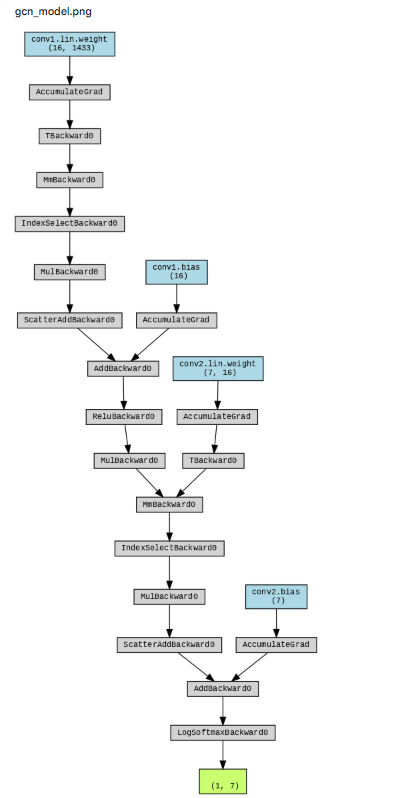
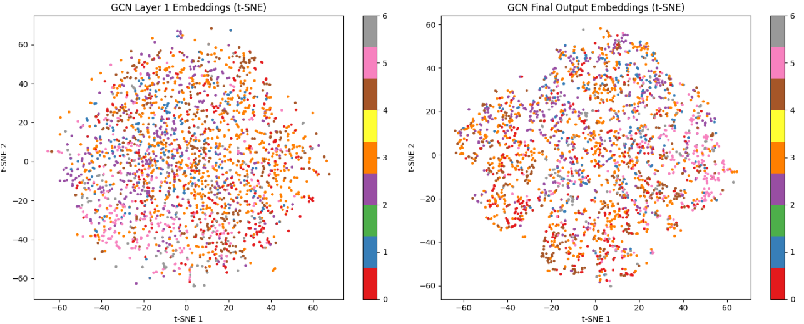
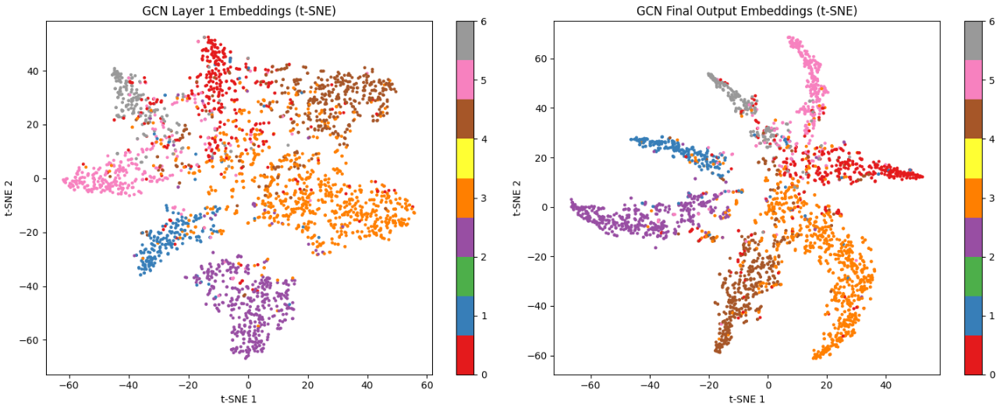

本日扱うのはGNNの練習問題シリーズの第４弾です。
今回扱うデータセットはCoraです。

本日テーマ：
>coraデータセットを用いた学習と推論を行ってみます。

## Coraとは

Cora は、**GNN（Graph Neural Network）の練習・評価で最もよく使われる代表的な引用ネットワークデータセット**です。

### 1. データの概要

- **ノード**: 科学論文（約 2,708 本）
- **エッジ**: 論文間の「引用関係」
  - 論文 A が論文 B を引用している → エッジ（A → B）
- **ノード特徴量（`x`）**:
  - 各論文の**タイトル・アブストラクト中の単語**をベースにした Bag-of-Words ベクトル
  - 次元数は約 1,433（出現した単語の有無を 0/1 で表現）
- **ノードラベル（`y`）**:
  - 論文の**研究分野（カテゴリ）**
  - 例: Case-Based, Genetic Algorithms, Neural Networks, Probabilistic Methods, Reinforcement Learning, Rule Learning, Theory
  - 合計 7 クラス

### 2. タスク設定（典型的な使い方）

- **タスク**: ノード分類（semi-supervised node classification）
- **入力**:
  - グラフ構造（どの論文がどの論文を引用しているか）
  - ノード特徴（単語ベクトル）
- **目的**:
  - 一部の論文にだけラベル（研究分野）が与えられており、
  - 残りの論文の研究分野を予測する
- **評価指標**: テストノードの分類精度（Accuracy）

### 3. GNN 練習における特徴

- **サイズが扱いやすい**:
  - ノード数 2,708、エッジ数 5,429 程度で、Colab やローカル PC でも十分動く。
- **構造がシンプル**:
  - 無向グラフとして扱うことが多く、GCN・GAT などの基本モデルの動作確認に最適。
- **特徴量がわかりやすい**:
  - Bag-of-Words ベクトルなので、「どの単語が効いているか」をある程度解釈できる。
- **ベンチマークとして確立**:
  - 多くの論文で性能比較に使われており、**自分の実装が標準的な性能に達しているか**を確認しやすい。

### 4. PyTorch Geometric での読み込み例（参考）

```python
from torch_geometric.datasets import Planetoid

dataset = Planetoid(root='./data', name='Cora')
data = dataset[0]

print(f"ノード数: {data.num_nodes}")
print(f"エッジ数: {data.num_edges}")
print(f"特徴量次元: {data.num_features}")
print(f"クラス数: {dataset.num_classes}")
```

## データをDL→サンプル抽出

### 1. パッケージインストール

```
# PyTorch Geometric のインストール（Colab の場合）
!pip install torch torchvision torchaudio
!pip install torch_geometric
!pip install pyg_lib torch_scatter torch_sparse torch_cluster torch_spline_conv -f https://data.pyg.org/whl/torch-2.3.0+cu121.html
```

### 2. データロード

```python
import torch
from torch_geometric.datasets import Planetoid

# Cora データセットのダウンロード
dataset = Planetoid(root='./data', name='Cora')
data = dataset[0]

print(f"データセット名: {dataset}")
print(f"グラフ数: {len(dataset)}")
print(f"ノード数: {data.num_nodes}")
print(f"エッジ数: {data.num_edges}")
print(f"特徴量次元: {data.num_features}")
print(f"クラス数: {dataset.num_classes}")
print(f"学習用マスク数: {data.train_mask.sum().item()}")
print(f"検証用マスク数: {data.val_mask.sum().item()}")
print(f"テスト用マスク数: {data.test_mask.sum().item()}")
```

サンプル的にロードしたデータからノード0の3ホップ(3つ先)の論文までをグラフ構造で可視化してみました。


3つ先の論文の一つはかなり参照しまくったという感じのようです。

## テーマの選定

Cora データセットを使った GNN の学習・予測テーマは、主に以下の 3 つに大別できます。

### 1. ノード分類（Node Classification）

- **何を予測するか**:
  - 各論文ノードの**研究分野（カテゴリ）** を予測します。
- **入力**:
  - ノード特徴量（単語ベクトル）
  - 引用ネットワーク（エッジ）
- **タスクの意味**:
  - 「引用関係と単語情報から、この論文がどの分野に属するかを自動分類する」
- **典型的なモデル**:
  - GCN, GAT, GraphSAGE など

### 2. リンク予測（Link Prediction）

- **何を予測するか**:
  - 「まだ引用されていない論文ペアのうち、**将来引用される可能性が高いペア**」を予測します。
- **入力**:
  - 既存の引用エッジ
  - ノード特徴量
- **タスクの意味**:
  - 「この論文は、将来的にどの論文を引用しそうか？」を予測する
- **典型的なモデル**:
  - ノード埋め込みの内積や、GNN ベースのリンク予測モデル

### 3. グラフ分類（Graph Classification）※少し応用

- **何を予測するか**:
  - Cora 全体を 1 つのグラフと見なし、「この引用ネットワーク全体がどのような性質を持つか」を分類する（例：分野の偏りなど）。
- **入力**:
  - Cora 全体のグラフ構造＋ノード特徴
- **タスクの意味**:
  - 「この引用ネットワーク全体が、どの研究分野に偏っているか」などを判定する
- **典型的なモデル**:
  - グラフプーリング＋全結合層など

### 4. 今回のテーマに合うのは？

**ノード分類**が最も直感的で、「引用関係と単語情報から論文の分野を予測する」というタスクが、可視化したグラフ構造と自然に結びつきます。

## モデル構築

今回実験で構築する GCN ノード分類モデル構築の**キーポイント**を、設計意図ごとに整理します。

### 1. モデル設計のキーポイント

__1.1 2層 GCN の採用理由__
- **1層目**: `GCNConv(in → hidden)` + ReLU + Dropout  
  - 入力特徴（単語ベクトル）を、グラフ構造（引用関係）を考慮しながら**低次元の隠れ表現**に変換。
  - ReLU で非線形性を入れ、Dropout で過学習を抑制。
- **2層目**: `GCNConv(hidden → out)`  
  - 隠れ表現を**クラス数分のスコア**に変換。
- **なぜ 2 層か**:
  - Cora は比較的小規模で、2 層程度で十分な表現力が得られることが多い。
  - 層を増やしすぎると過学習や勾配消失のリスクが増えるため、**シンプルさと性能のバランス**を取っています。

__1.2 `log_softmax` 出力の理由__
- 最終出力に `F.log_softmax` を使い、**対数確率**を出力。
- 損失関数に `NLLLoss`（負の対数尤度）を使うため、**確率分布として扱いやすく、数値的にも安定**します。

### 2. 学習ループのキーポイント

__2.1 `train_mask` のみで損失計算__
- `loss = criterion(out[data.train_mask], data.y[data.train_mask])`
- Cora は**半教師あり学習（semi-supervised）**の設定で、
  - 一部のノード（`train_mask=True`）だけラベルが与えられ、
  - 残りのノードはラベルなしでグラフ構造を通じて情報を伝播させる。
- 学習時は**ラベル付きノードだけ**で損失を計算し、GNN がグラフ全体に情報を広げるように学習させます。

__2.2 Adam + Weight Decay__
- `torch.optim.Adam(model.parameters(), lr=0.01, weight_decay=5e-4)`
- Adam は学習率調整が自動で行われるため、**安定した学習**が期待できます。
- `weight_decay=5e-4` で L2 正則化を入れ、**過学習を抑制**します。

### 3. 評価・早期終了のキーポイント

__3.1 マスクごとの精度計算__
- `train_mask`, `val_mask`, `test_mask` それぞれで精度を計算。
- **学習用・検証用・テスト用**の精度を分けて確認することで、
  - 過学習（train は高いが val/test が低い）
  - 学習不足（すべて低い）
  を判別しやすくなります。

__3.2 早期終了（Early Stopping）__
- `patience=20` で、「検証精度が 20 エポック連続で改善しなければ打ち切り」。
- **過学習を防ぎつつ、十分な学習回数**を確保するための一般的な手法です。
- 検証精度が最も良かった時点のモデルを採用する（必要なら保存）ことで、**テスト精度の安定性**を高めます。


モデル単体はこういう感じになります。


```python
import torch
import torch.nn as nn
import torch.nn.functional as F
from torch_geometric.nn import GCNConv

class GCN(nn.Module):
    def __init__(self, in_channels, hidden_channels, out_channels):
        super().__init__()
        self.conv1 = GCNConv(in_channels, hidden_channels)
        self.conv2 = GCNConv(hidden_channels, out_channels)

    def forward(self, x, edge_index):
        # 1層目: 入力特徴 → 隠れ表現
        x = self.conv1(x, edge_index)
        x = F.relu(x)
        x = F.dropout(x, training=self.training)

        # 2層目: 隠れ表現 → クラススコア
        x = self.conv2(x, edge_index)
        return F.log_softmax(x, dim=1)
```

モデルを図示すると以下になります。




## 結果

### 学習
ではいざ学習です。

モデルの埋め込み表現を次元圧縮して可視化した結果です。

こちらは学習前



こちらは学習後です。
学習したことで特徴の傾向を理解した形状となったと思います。



### 学習済みモデルで予測
学習したモデルで、テスト用のノードを推論してみます。

```
# モデルを評価モードに
model.eval()

# 全ノードの出力を取得（log_softmax 済み）
with torch.no_grad():
    out = model(data.x, data.edge_index)  # shape: [num_nodes, num_classes]

# ノード 0 の予測結果を確認
node_id = 0

# 各クラスの対数確率 → 確率に変換
log_probs = out[node_id]
probs = torch.exp(log_probs)  # log_softmax の逆変換

# 予測ラベル（最大確率のクラス）
pred_label = out[node_id].argmax().item()
true_label = data.y[node_id].item()

# クラス名の対応（Cora の 7 クラス）
class_names = [
    "Case-Based",
    "Genetic Algorithms",
    "Neural Networks",
    "Probabilistic Methods",
    "Reinforcement Learning",
    "Rule Learning",
    "Theory"
]

# いくつかのノードについて一覧表示
node_ids = [0, 10, 100, 500, 1000]

print("=== 複数ノードの予測結果一覧 ===")
for node_id in node_ids:
    pred_label = out[node_id].argmax().item()
    true_label = data.y[node_id].item()
    match = "✓" if pred_label == true_label else "✗"
    print(f"ノード {node_id:4d}: 予測 {pred_label} ({class_names[pred_label]:20s}) | "
          f"正解 {true_label} ({class_names[true_label]:20s}) | {match}")
```

上記により予測した結果は以下通りです。
今回は全問正解です。
出木スギですね。

```
=== 複数ノードの予測結果一覧 ===
ノード    0: 予測 3 (Probabilistic Methods) | 正解 3 (Probabilistic Methods) | ✓
ノード   10: 予測 0 (Case-Based          ) | 正解 0 (Case-Based          ) | ✓
ノード  100: 予測 0 (Case-Based          ) | 正解 0 (Case-Based          ) | ✓
ノード  500: 予測 3 (Probabilistic Methods) | 正解 3 (Probabilistic Methods) | ✓
ノード 1000: 予測 3 (Probabilistic Methods) | 正解 3 (Probabilistic Methods) | ✓
```

本コードは以下レポジトリに保管しています。

https://github.com/Shinichi0713/LLM-fundamental-study/tree/main/sequential_nn/src/graph_nn/src/cora


## 総括

Cora での GCN ノード分類が**良い結果（全問正解に近い精度）** になった理由は、主に以下の 4 点が考えられます。

### 1. Cora データセットが「GNN 向き」である

- **引用ネットワーク＋単語特徴**という構造が、GNN の強み（近傍ノードの情報を集約する）と非常に相性が良い。
- 同じ分野の論文は、
  - 似た単語（アブストラクト）を使い、
  - 互いに引用し合う傾向があるため、
  - GCN が「引用関係＋単語情報」を組み合わせることで、**分野のクラスタをうまく捉えられる**。

### 2. GCN の設計がタスクに最適だった

- **2層 GCN** は、Cora のような中規模グラフに対して、
  - 1-hop 近傍（直接引用）と 2-hop 近傍（間接引用）の情報をバランスよく集約できる。
- `ReLU` + `Dropout` により、
  - 非線形性を入れつつ、
  - 過学習を適度に抑制。
- `log_softmax` + `NLLLoss` の組み合わせが、**多クラス分類タスクに適した安定した学習**を実現。

### 3. 学習設定（Adam + Weight Decay + Early Stopping）が適切だった

- **Adam オプティマイザ**:
  - 学習率調整が自動で行われるため、安定した収束。
- **Weight Decay (L2 正則化)**:
  - 過学習を抑え、汎化性能を高める。
- **Early Stopping**:
  - 検証精度が改善しなくなった時点で打ち切ることで、**過学習前に最良モデルを採用**。

これらにより、**「学習不足でもなく、過学習でもない」ちょうど良い状態**で学習が止まり、高いテスト精度が得られました。

### 4. Cora は「よく研究されたベンチマーク」である

- Cora は長年 GNN のベンチマークとして使われており、
  - データのクオリティが高く、
  - ラベル付けも比較的信頼できる。
- そのため、**標準的な GCN モデルでも、文献通りの高い精度が出やすい**傾向があります。

ということで少し手ごたえを感じたGNNの実験でした。


