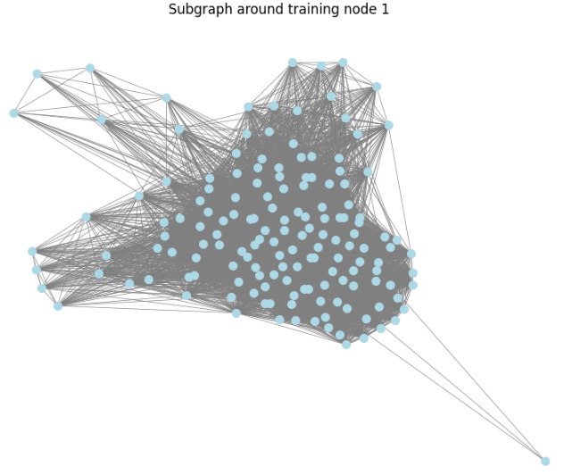
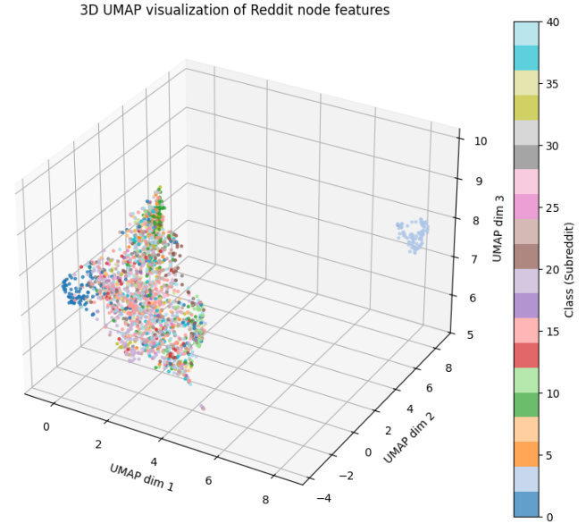

最近続けている[GNNの例題シリーズ](https://yoshishinnze.hatenablog.com/entry/2026/06/25/043000)について話していきます。
今回はネットワークで比較的大きなデータセットを使ってみたいということでRedditというデータセットを使ってみます。

本日テーマ：
>Redditを使った学習について取り組んでみる

## Redditとは

Reddit データセットは、**大規模グラフ上での GNN のスケーラビリティを評価するための代表的なベンチマーク**です。  
PyTorch Geometric では `torch_geometric.datasets.Reddit` として提供されています[PyTorch Geometric Docs](https://pytorch-geometric.readthedocs.io/en/2.6.0/generated/torch_geometric.datasets.Reddit.html)。

### 1. データセットの由来

- 元論文：**“Inductive Representation Learning on Large Graphs”**（Hamilton et al., 2017）  
- 目的：大規模グラフ上で GNN を学習するための**スケーラビリティ評価用ベンチマーク**として設計されました。

### 2. グラフの構造（ノードとエッジ）

- **ノード**：Reddit の投稿（post）  
  - ノード数：約 **232,965** ノード[Kumo.ai PyG Guide](https://kumo.ai/pyg/datasets/reddit)。
- **エッジ**：投稿間の「共コメント（co-comment）」関係  
  - エッジ数：約 **114,615,892** エッジ（約 1.14 億）[Kumo.ai PyG Guide](https://kumo.ai/pyg/datasets/reddit)。
  - 同じスレッド内で同じユーザーがコメントした投稿同士をリンクさせたものとされています。

### 3. ノード特徴量

- 特徴量次元：**602 次元**
- 内容：各ノード（投稿）の **Bag-of-Words（BoW）表現**  
  - 投稿テキストを単語単位でベクトル化したもの（単語の出現頻度など）です[Kumo.ai PyG Guide](https://kumo.ai/pyg/datasets/reddit)。

### 4. ラベルとタスク

- **クラス数**：**41 クラス**
- ラベルの意味：投稿が属する **Reddit のコミュニティ（サブレディット）**  
  - 例：`r/aww`, `r/funny`, `r/AskReddit` など、人気の高いサブレディット群。
- **タスク**：ノード分類（コミュニティ分類）  
  - 各投稿（ノード）がどのサブレディットに属するかを予測する、**マルチクラス分類問題**です。

### 5. マスク（学習・検証・テスト分割）

- `train_mask` / `val_mask` / `test_mask` が付与されています。
- それぞれ `[num_nodes]` の `bool` テンソルで、対応するノードが学習・検証・テストに使われるかを示します。
- タスク設定は**inductive（帰納的）**：  
  - 学習時に見たノードと、テスト時に評価するノードが明確に分かれています。

### 6. データセットの特徴・用途

- **大規模かつスパース**：  
  - ノード数 23 万、エッジ数 1.1 億と非常に大きく、**フルバッチ学習では GPU メモリに載りきらない**ため、  
    GraphSAGE や ClusterGCN、GraphSAINT などの**サンプリング・ミニバッチ手法**の評価に適しています[Kumo.ai PyG Guide](https://kumo.ai/pyg/datasets/reddit)。
- **コミュニティ構造がはっきりしている**：  
  - サブレディットごとに話題が分かれているため、GNN がうまくコミュニティを捉えられれば高い精度が出やすいです。
- **GNN スケーラビリティ研究の標準ベンチマーク**：  
  - 「Reddit でうまく動く手法は、実運用レベルの大規模グラフにも応用できる」という位置づけでよく使われます[Kumo.ai PyG Guide](https://kumo.ai/pyg/datasets/reddit)。


## データの可視化

このデータセットですが
- 非常に特徴量が多く(602次元)
- ラベルが多い(Reddit のコミュニティに相当で41クラス)

ちょっとイメージが難しい面があります。

### グラフ全体の統計情報の確認

パッとデータ全貌を確認するのであれば、以下コードを実行下さい。

```python
print(f'ノード数: {data.num_nodes}')
print(f'エッジ数: {data.num_edges}')
print(f'特徴量次元: {data.num_node_features}')
print(f'クラス数: {dataset.num_classes}')

if hasattr(data, 'train_mask'):
    print(f'train_mask shape: {data.train_mask.shape}')
    print(f'train ノード数: {data.train_mask.sum().item()}')
if hasattr(data, 'val_mask'):
    print(f'val_mask shape: {data.val_mask.shape}')
    print(f'val ノード数: {data.val_mask.sum().item()}')
if hasattr(data, 'test_mask'):
    print(f'test_mask shape: {data.test_mask.shape}')
    print(f'test ノード数: {data.test_mask.sum().item()}')

# エッジが無向か有向か
print(f'エッジインデックスの形状: {data.edge_index.shape}')
print(f'エッジ属性の有無: {hasattr(data, "edge_attr")}')
```

これにより、Reddit データセットが

- 約 23 万ノード
- 約 1.1 億エッジ

であることが分かります[PyTorch Geometric Docs](https://pytorch-geometric.readthedocs.io/en/2.6.0/generated/torch_geometric.datasets.Reddit.html)[Kumo.ai PyG Guide](https://kumo.ai/pyg/datasets/reddit)。


### サブグラフの可視化（NetworkX を使う例）

グラフ全体は大きすぎるので、**学習用ノードの一部とその近傍だけを取り出して可視化**します。

```python
import networkx as nx
import matplotlib.pyplot as plt

# 学習ノードのうち最初の 1 つを選ぶ
train_idx = data.train_mask.nonzero(as_tuple=False).view(-1)
center_node = train_idx[0].item()

# 1-hop 近傍を取得（NeighborLoader の仕組みを真似る）
edge_index = data.edge_index
center_mask = (edge_index[0] == center_node)
neighbors = edge_index[1, center_mask].unique()

# 中心ノードとその近傍だけを含むノード集合
sub_nodes = torch.cat([torch.tensor([center_node]), neighbors])

# サブグラフのエッジを抽出
sub_mask = torch.isin(edge_index[0], sub_nodes) & torch.isin(edge_index[1], sub_nodes)
sub_edge_index = edge_index[:, sub_mask]

# NetworkX のグラフに変換
G = nx.Graph()
G.add_edges_from(sub_edge_index.t().tolist())

# 可視化
plt.figure(figsize=(8, 6))
pos = nx.spring_layout(G, seed=42)
nx.draw(G, pos, node_size=50, node_color='lightblue', edge_color='gray', width=0.5)
plt.title(f'Subgraph around training node {center_node}')
plt.show()
```

- これにより、ある投稿（ノード）と、その投稿にコメントした他の投稿（近傍ノード）のつながりを可視化できます。
- ノード数が多すぎる場合は、`neighbors = neighbors[:50]` のように近傍数を制限してください。

かなりエッジの多い構造であることが分かります。
これがRedditというSNSの特性かもしれません。



### ラベルの例

```python
# 最初の 10 ノードのラベル
print("最初の 10 ノードのラベル（クラスID）:")
print(data.y[:10])

# 各クラスに属するノード数の分布（おおまか）
print("\n各クラスのノード数（上位 10 クラス）:")
unique, counts = torch.unique(data.y, return_counts=True)
for cls, cnt in zip(unique[:10], counts[:10]):
    print(f"クラス {cls.item()}: {cnt.item()} ノード")
```

- ラベルは 0〜40 の整数で、どのサブレディット（コミュニティ）に属するかを表します。


### 次元圧縮
次元圧縮して少しイメージしやすくなるかと期待してumapで3D散布図にしてみました。



クラス0のみがかなり孤立していますが、それ以外は分離しているとは言いづらい状態です。
特徴量のみで分類ということが難しいということが伝わるようなデータセットです。

## 実験

Reddit データセットに GNN を適用して、ラベル(クラス)の実験をしてみようと思います。

### 1. Reddit データセットでよく使われるタスク

Reddit データセットでは、主に以下のようなタスクが考えられます。

1. **ノード分類（Node Classification）**  
   - 各ノード（投稿）がどのコミュニティ（サブレディット）に属するかを予測する。
   - 例：ある投稿が `r/aww` なのか `r/funny` なのかを予測。

2. **リンク予測（Link Prediction）**  
   - まだ存在しないエッジ（投稿間の共コメント関係）を予測する。
   - 例：「この 2 つの投稿は将来的に同じユーザーからコメントされるか？」を予測。

3. **グラフ分類（Graph Classification）**  
   - Reddit 全体ではなく、スレッド単位の小さなグラフを作り、そのグラフがどのカテゴリか（例：政治系・娯楽系）を分類する。

この中で、**ノード分類が最も直感的で、GNN の効果が分かりやすい**と思いました。

### 2. 手順
以下のフローでノード分類の学習の実験をしてみます。

1. データのロードと前処理  
Reddit データセットをロードし、GPU に転送。
2. ミニバッチ用サンプラの準備  
NeighborLoader で学習・検証・テスト用のミニバッチを作成。
3. GNN モデルの定義  
例：2 層 GCN。
4. 学習ループ  
ミニバッチごとに順伝播・損失計算・逆伝播。
5. テストセットでの評価  
学習済みモデルでテストノードの精度を計算。

## 実装
手順で記載した流れで学習してみます。
Colab でそのまま実行できる形でまとめます。


### 1. データのロードと前処理

必要なパッケージのインストールです。

```
# 1. 現在のPyTorchとCUDAのバージョンを取得して環境変数に入れる
import torch
import os
torch_version = torch.__version__.split('+')[0]

# CUDAが利用可能ならそのバージョン、なければcpuとする
if torch.cuda.is_available():
    cuda_version = "cu" + torch.version.cuda.replace('.', '')
else:
    cuda_version = "cpu"

os.environ['TORCH'] = torch_version
os.environ['CUDA'] = cuda_version

print(f"Detected PyTorch: {torch_version}, CUDA: {cuda_version}")
!pip install pyg_lib torch_scatter torch_sparse torch_cluster torch_spline_conv -f https://data.pyg.org/whl/torch-${TORCH}+${CUDA}.html
!pip install torch_geometric
```

データをロードしていきます。
今回通常のニューラルネットワークとは異なり`NeighborLoader`を用いたデータローダを作成します。

```python
import torch
from torch_geometric.datasets import Reddit
from torch_geometric.loader import NeighborLoader
import torch.nn.functional as F

# データセットのダウンロード
dataset = Reddit(root='/tmp/Reddit')
data = dataset[0]

# GPU に転送
device = torch.device('cuda' if torch.cuda.is_available() else 'cpu')
data = data.to(device)

print(f'ノード数: {data.num_nodes}')
print(f'エッジ数: {data.num_edges}')
print(f'特徴量次元: {data.num_node_features}')
print(f'クラス数: {dataset.num_classes}')
```
>__NeighborLoader__  
>NeighborLoader は、PyTorch Geometric (PyG) に用意されている、巨大なグラフデータをメモリ効率よくミニバッチ学習（あるいは推論）するための非常に強力なデータローダーです。
>通常のディープラーニングにおける DataLoader はデータを単にシャッフルして分割しますが、グラフデータではノードどうしがエッジで繋がっているため、単純にブツ切りにすると「周りのつながり（構造情報）」が消えてしまいます。
>これを解決するのが NeighborLoader です。
>__どんな仕組みなのか？（ノードサンプリング）__  
>NeighborLoader は、指定されたバッチサイズ分だけノードをランダムに選び（これをルートノードと呼びます）、そのノードからエッジを逆にたどって周辺の近傍ノード（Neighbors）を芋づる式に集めて小さなサブグラフ（ミニバッチ）を作ります。
>このとき、周辺ノードを無限に集めると結局グラフ全体が loading されてしまうため、各ステップ（ホップ）で集める上限数を設定します。
>外側に向かって指定した数だけ「部分的に」グラフを切り出すことで、巨大なグラフの構造を壊さずに小さなデータサイズに収めていきます。結果、グラフの構造を維持したまま、メモリをクラッシュさせるほどのメモリ占有することなく、データを取り出すことが出来るということになります。


### 2. ミニバッチ用サンプラの準備（NeighborLoader）

Reddit は巨大なので、全グラフを一度に GPU に載せるのではなく、近傍サンプリングでミニバッチ学習します。

```python
# 学習用サンプラ
train_loader = NeighborLoader(
    data,
    num_neighbors=[10, 5],  # 1-hop で 10 ノード、2-hop で 5 ノードをサンプル
    batch_size=1024,
    input_nodes=data.train_mask,
    shuffle=True
)

# 検証用サンプラ
val_loader = NeighborLoader(
    data,
    num_neighbors=[10, 5],
    batch_size=1024,
    input_nodes=data.val_mask
)

# テスト用サンプラ（後で使う）
test_loader = NeighborLoader(
    data,
    num_neighbors=[10, 5],
    batch_size=1024,
    input_nodes=data.test_mask
)
```

- `num_neighbors` や `batch_size` は GPU メモリに応じて調整してください。

### 3. GNN モデルの定義（例：2 層 GCN）

前回も使ったGCNと呼ばれるシンプルなGNNを用います。

```python
from torch_geometric.nn import GCNConv

class GCN(torch.nn.Module):
    def __init__(self, in_channels, hidden_channels, out_channels):
        super().__init__()
        self.conv1 = GCNConv(in_channels, hidden_channels)
        self.conv2 = GCNConv(hidden_channels, out_channels)

    def forward(self, x, edge_index):
        x = self.conv1(x, edge_index).relu()
        x = F.dropout(x, p=0.5, training=self.training)
        x = self.conv2(x, edge_index)
        return x

model = GCN(
    in_channels=data.num_node_features,
    hidden_channels=128,
    out_channels=dataset.num_classes
).to(device)
```


### 4. 学習ループの実装

```python
optimizer = torch.optim.Adam(model.parameters(), lr=0.01, weight_decay=5e-4)

def train():
    model.train()
    total_loss = 0
    for batch in train_loader:
        optimizer.zero_grad()
        out = model(batch.x, batch.edge_index)
        # 学習マスク部分のみで損失を計算
        loss = F.cross_entropy(out[batch.train_mask], batch.y[batch.train_mask])
        loss.backward()
        optimizer.step()
        total_loss += float(loss)
    return total_loss / len(train_loader)

@torch.no_grad()
def eval_loader(loader, mask_name='val_mask'):
    model.eval()
    correct = total = 0
    for batch in loader:
        out = model(batch.x, batch.edge_index)
        pred = out.argmax(dim=-1)
        # mask_name に応じてマスクを選択
        mask = getattr(batch, mask_name)
        correct += int((pred[mask] == batch.y[mask]).sum())
        total += int(mask.sum())
    return correct / total

# 学習実行（例: 50 エポック）
for epoch in range(1, 51):
    loss = train()
    val_acc = eval_loader(val_loader, mask_name='val_mask')
    if epoch % 10 == 0:
        print(f'Epoch: {epoch:02d}, Loss: {loss:.4f}, Val Acc: {val_acc:.4f}')
```

### 5. テストセットでの評価

学習が終わったら、テスト用サンプラで精度を確認します。

```python
test_acc = eval_loader(test_loader, mask_name='test_mask')
print(f'Test Accuracy: {test_acc:.4f}')
```

- Reddit データセットでは、GCN でおおよそ 93% 前後、GraphSAGE や ClusterGCN で 95〜97% 程度の精度が報告されています[Kumo.ai PyG Guide](https://kumo.ai/pyg/datasets/reddit)。


## 学習の結果

まずは学習させた結果ですが。
おおよそ85～86%程度の分類性能を持っていることが確認されます。

```
Epoch: 01, Loss: 1.2822, Val Acc: 0.8602
Epoch: 05, Loss: 1.1750, Val Acc: 0.8608
Epoch: 10, Loss: 1.1717, Val Acc: 0.8515
Test Accuracy: 0.8512
```

ランダムにデータを取り出して分類の採点してみました。

```python
import random

def test_inference_step(num_samples=10):
    model.eval()
    
    # 1. 全ノードの中からランダムに10個のインデックスを選択
    all_indices = list(range(data.num_nodes))
    sampled_indices = random.sample(all_indices, num_samples)
    
    # 2. 選択したノードを起点として、小さなサブグラフをサンプリング
    # (NeighborLoaderを内部で1ステップだけ手動で動かすイメージです)
    single_loader = NeighborLoader(
        data,
        num_neighbors=[5, 3],
        batch_size=num_samples,
        input_nodes=torch.tensor(sampled_indices),
        shuffle=False
    )
    
    # 1バッチ分だけ取得して推論
    batch = next(iter(single_loader))
    batch = batch.to(device)
    
    with torch.no_grad():
        out = model(batch.x, batch.edge_index)
        preds = out.argmax(dim=-1)
    
    # 3. 結果の見易い表示
    print(f"=== お試し推論 (サンプル数: {num_samples}個) ===")
    for i in range(num_samples):
        node_idx = sampled_indices[i]
        true_label = int(batch.y[i])
        pred_label = int(preds[i])
        
        # 正誤判定マーク
        status = "◯ 正解" if true_label == pred_label else "× 不正解"
        
        print(f"サンプル [{i+1}] 元のノードID: {node_idx:6d} | 正解クラス: {true_label:2d} -> 予測: {pred_label:2d} ({status})")

# 実行
test_inference_step(num_samples=10)
```

10問中7問正解。
test時の正解率ほどではないにせよきちんと正解を選択しています。

```
=== お試し推論 (サンプル数: 10個) ===
サンプル [1] 元のノードID:  32121 | 正解クラス: 34 -> 予測: 34 (◯ 正解)
サンプル [2] 元のノードID:  59787 | 正解クラス:  8 -> 予測:  8 (◯ 正解)
サンプル [3] 元のノードID: 228462 | 正解クラス: 30 -> 予測: 19 (× 不正解)
サンプル [4] 元のノードID:  17002 | 正解クラス: 16 -> 予測: 16 (◯ 正解)
サンプル [5] 元のノードID:  54946 | 正解クラス:  7 -> 予測:  7 (◯ 正解)
サンプル [6] 元のノードID:   9865 | 正解クラス:  2 -> 予測:  4 (× 不正解)
サンプル [7] 元のノードID: 134311 | 正解クラス:  3 -> 予測:  3 (◯ 正解)
サンプル [8] 元のノードID: 125132 | 正解クラス:  2 -> 予測:  2 (◯ 正解)
サンプル [9] 元のノードID:  20293 | 正解クラス:  1 -> 予測:  6 (× 不正解)
サンプル [10] 元のノードID:  13374 | 正解クラス:  8 -> 予測:  8 (◯ 正解)
```

## 今回結果の考察

今回結果はずばり、高次元空間でtmap（またはt-SNE/UMAPなど）で見るとグチャグチャに混ざり合っているのに、GCNなどのGNN（グラフニューラルネットワーク）に通すと80%もの高精度で分類できる。

なぜ今回の結果につながったか考察してみました。

### 1. 「特徴量（Node Features）」と「構造（Topology）」の相乗効果

tmapなどの次元圧縮手法が可視化しているのは、あくまで「600次元の特徴量空間における距離」だけです。つまり、「単語の出現傾向」や「プロフィールの数値」が似ているかどうかしか見ていません。

しかし、GNNは以下の**2つの異なる情報源**を掛け合わせて学習します。

- 600次元の「特徴量」
- 誰と誰が繋がっているかという「エッジ（構造情報）」

例えるなら、tmapで見ているのは **「趣味や見た目がなんとなく似ている人を無理やり近くに並べた図」** です。当然、見た目が似ていても全然違うコミュニティの人（クラスタの競合）が混ざるため、可視化するとグチャグチャになります。
一方でGNNは、 **「見た目はバラバラでも、実際に毎日会話している（エッジがある）から同じコミュニティだ」という強い繋がり（構造）** を認識できるため、特徴量が重なっている以上の情報を学習できていることになります。

### 2. グラフの「同質性（Homophily）」の恩恵

グラフデータ、特にRedditのようなSNSや論文リンクのデータセットには、「類は友を呼ぶ（Homophily: 同質性）」という強い統計的性質があります。

> **同質性（Homophily）とは**
> 「同じクラス（カテゴリ）に属するノード同士は、エッジで繋がりやすい」という傾向。

GCNConvのメッセージパッシング（層を通過する際の処理）は、数学的には **「近傍ノードの特徴量のローカルな滑らかさ（平滑化）」** を行っています。
1ホップ、2ホップと近傍の情報を集約するプロセスにより、競合していた600次元のノード特徴量が、**「周囲の繋がっている仲間の平均的な特徴量」** へとマイルドに書き換え（リファイン）られます。これにより、特徴量空間の境界線上にいて判別が難しいノードをつながりという特徴を使って分類することにつながります。

### 3. 高次元（600次元）の壁をGNNの層が解決した

600次元という空間は非常に広大で、ただの距離ベースの圧縮（tmap）では「本質的に重要な10次元」と「ノイズになっている590次元」を綺麗に区別できず、クラスタが潰れてしまいがちです。

しかし、今回使用したGCNの第1層：

```python
self.conv1 = GCNConv(in_channels, hidden_channels) # hidden_channels=64

```

ここでは、600次元の特徴量を、グラフ構造のフィルターを通しながら「本質的な64次元」へと一気に圧縮（特徴抽出）しています。

GNNの畳み込み層は、単なる次元削減ではなく「つながっている隣人たちを最も綺麗に分類できるような、新しい低次元空間へのマッピング」を逆伝播（Adamオプティマイザ）によって自動で学習します。そのため、人間の目（tmap）には混ざって見えた境界線を、AIは64次元の隠れ層の中で見事に分離することに成功したと言えます。

### 結論を一言でいうと

> **「特徴量だけでは敵味方の区別がつかない乱戦状態（tmapの見た目）だったが、GNNが『通信記録（エッジ）』を解析したことで、誰がどの陣営（クラスタ）かが明確に判明した」**

というのが、今回の80%という高い正解率の背景にあるロジックです。
データの「繋がり」がいかに強力な情報であるかが確認できる実験結果でした。

