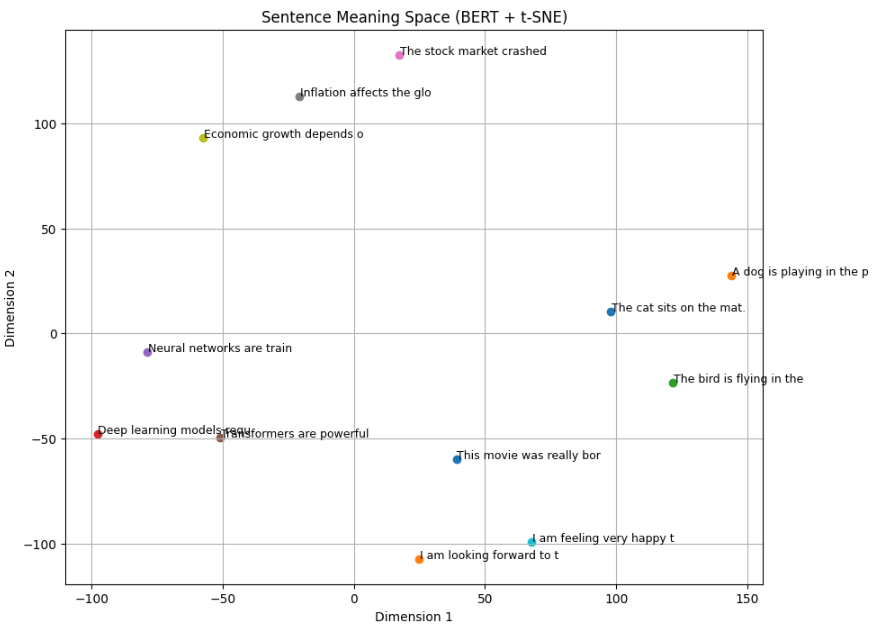

以下は、**「文章 → トークン → ベクトル → 可視化」**の流れを
**実際に目で見て理解できる最小かつ教育的な実装例**です。

目的は「精度」ではなく、
**LLM内部で何が起きているかを直感的に理解すること**にあります。

---

# 全体像（まず概念）

```
文章
 ↓
トークナイザ（サブワード分割）
 ↓
トークンID
 ↓
Embedding層
 ↓
高次元ベクトル（例：768次元）
 ↓
次元削減（PCA / t-SNE）
 ↓
2次元プロットで可視化
```

---

# 使用するライブラリ

* transformers（BERT）
* torch
* scikit-learn
* matplotlib

Colab / ローカルどちらでも動作します。

---

# 1. ライブラリの準備

```python
import torch
import numpy as np
import matplotlib.pyplot as plt

from transformers import BertTokenizer, BertModel
from sklearn.decomposition import PCA
```

---

# 2. 可視化したい文章

```python
sentence = "The cat sits on the mat."
```

---

# 3. トークナイズの可視化

```python
tokenizer = BertTokenizer.from_pretrained("bert-base-uncased")

tokens = tokenizer.tokenize(sentence)
token_ids = tokenizer.convert_tokens_to_ids(tokens)

print("Tokens:")
for t, i in zip(tokens, token_ids):
    print(f"{t:>10} -> {i}")
```

### 出力例（重要）

```
the        -> 1996
cat        -> 4937
sits       -> 7719
on         -> 2006
the        -> 1996
mat        -> 13523
.          -> 1012
```

ここで理解すべき点：

* 単語 ≠ トークンID
* 同じ単語（the）は同じID
* モデルは **文字列を直接理解していない**

---

# 4. BERTでトークンをベクトル化

```python
model = BertModel.from_pretrained("bert-base-uncased")
model.eval()

inputs = tokenizer(sentence, return_tensors="pt")

with torch.no_grad():
    outputs = model(**inputs)

# last_hidden_state: [batch, seq_len, hidden_dim]
embeddings = outputs.last_hidden_state[0]  # [seq_len, hidden_dim]
```

確認：

```python
print("Embedding shape:", embeddings.shape)
```

```
Embedding shape: torch.Size([8, 768])
```

👉 **各トークンが768次元ベクトルになっている**

---

# 5. 高次元ベクトルを2次元に圧縮（PCA）

```python
pca = PCA(n_components=2)
embeddings_2d = pca.fit_transform(embeddings.numpy())
```

---

# 6. ベクトルの可視化（核心）

```python
plt.figure(figsize=(8, 6))

for i, token in enumerate(tokens):
    x, y = embeddings_2d[i]
    plt.scatter(x, y)
    plt.text(x + 0.01, y + 0.01, token)

plt.title("Token Embeddings Visualization (PCA)")
plt.xlabel("PC1")
plt.ylabel("PC2")
plt.grid(True)
plt.show()
```

---

# 7. 何が「見えている」のか

このプロットで理解できること：

### ① 意味の近い単語は近くに配置される

* `the` 同士が近い
* 機能語と内容語が分かれる傾向

---

### ② 文脈依存でベクトルが変わる

BERTは **文脈依存Embedding** なので、

```text
bank (river)
bank (money)
```

は **異なる位置** になります。

---

### ③ トークンは「点」ではなく「意味ベクトル」

LLMは

> 単語を覚えている
> ではなく
> 単語の意味空間上の位置を操作している

---

# 8. CLSトークン（文章全体ベクトル）の可視化

```python
cls_embedding = embeddings[0]  # [CLS]
print("CLS vector shape:", cls_embedding.shape)
```

* `[CLS]` は **文章全体の要約**
* 文分類・検索で使われる

---

# 9. 応用：複数文を並べて可視化

```python
sentences = [
    "The cat sits on the mat.",
    "A dog lies on the floor.",
    "I love deep learning."
]

all_embeddings = []
labels = []

for s in sentences:
    inputs = tokenizer(s, return_tensors="pt")
    with torch.no_grad():
        out = model(**inputs)
    cls = out.last_hidden_state[0][0]
    all_embeddings.append(cls.numpy())
    labels.append(s)

pca = PCA(n_components=2)
emb_2d = pca.fit_transform(np.array(all_embeddings))

plt.figure(figsize=(8,6))
for i, label in enumerate(labels):
    x, y = emb_2d[i]
    plt.scatter(x, y)
    plt.text(x+0.01, y+0.01, label[:15])

plt.title("Sentence Embeddings (CLS token)")
plt.show()
```

👉 **意味の近い文が近くに配置される**

---

# 10. 一言でまとめると

> **LLMは文章を「単語の集合」ではなく
> 「意味ベクトルの軌跡」として処理している**

* トークナイズ：離散化
* Embedding：連続空間へ写像
* Attention：ベクトル同士の関係計算




