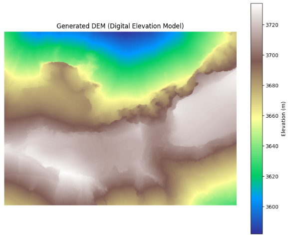

3次元点群を扱っていると3次元的に地形を理解したいという要望を頂くことがあります。
3次元的に地形を理解するという上では3D点群データを用いることで実現できますが、3D点群データは使ってみると、情報がありすぎるからか、どこにフォーカスするか分かりづらいという面があります。

そんな時、位置と高さを俯瞰してみたい場合に用いるデータがDEMと呼ばれるものです。

## DEMの概要

DEM（Digital Elevation Model）は、**地表の高さ（標高）をデジタル表現したデータ**です。  
簡単に言うと、「地面の高さを格子状に並べた標高マップ」です。

### DEMの基本イメージ

- 地図上の各点（ピクセル）に**標高値（Z値）** が入っている。
- 山や谷、平地など、地形の起伏を数値として持つ。
- 通常は**2Dグリッド（格子）** または**不規則な点群**として表現されます。

__主な種類__

1. **DSM（Digital Surface Model）**  
   - 地表＋建物・樹木など**すべての表面の高さ**を含む。  
   - オルソ画像生成や都市解析でよく使われます。

2. **DTM（Digital Terrain Model）**  
   - 建物・樹木を除去した**地面そのものの高さ**だけを表す。  
   - 水の流れ解析（水文解析）や地形形状の把握に使われます。

一般に「DEM」というと、DSM/DTMの総称として使われることが多いです。

__主な用途__

- **地形の可視化（陰影図・標高段彩図）**  
- **傾斜・斜面方向の計算**  
- **水の流れ・浸水範囲のシミュレーション**  
- **道路・鉄道のルート検討、土量計算**  
- **オルソ画像生成時の歪み補正**（地形の高さを考慮して写真を正射投影）

__作成方法の例__

- **航空写真＋ステレオマッチング**  
- **レーザー測量（LiDAR）**  
- **SAR（合成開口レーダー）**  
- **既存の地形図からの等高線読み取り**

## DEMの特徴・用途

DEMは「地面の高さを数値で表現したデータ」で、ずばり高さ付きの地図という形容が出来ると思います。
DEMには、主に以下の特徴と用途があります。

### 主な特徴

- **標高を数値で持つ**  
  地図上の各点（ピクセル）に標高値（Z値）が入っており、山・谷・平地の起伏を表現します。

- **2Dグリッドまたは点群で表現**  
  規則的な格子（ラスター）や不規則な点群として扱われます。

- **DSMとDTMの区別**  
  - **DSM**：地表＋建物・樹木など「最表面」の高さ  
  - **DTM**：建物・樹木を除いた「地面だけ」の高さ  
  一般に「DEM」は両者の総称として使われます。

### 主な用途

- **地形の可視化**  
  陰影図・標高段彩図などで地形の起伏を分かりやすく表示します。

- **傾斜・斜面方向の計算**  
  道路設計や地すべりリスク評価などに利用します。

- **水の流れ・浸水シミュレーション**  
  河川氾濫や浸水範囲の予測に使われます。

- **都市計画・インフラ計画**  
  道路・鉄道のルート検討、土量計算、建物配置の検討など。

- **オルソ画像生成の補正**  
  地形の高さを考慮して航空写真を正射投影し、歪みを除去します。

- **農業・林業・環境モニタリング**  
  農地の区画管理、森林の樹高・成長状況の把握など。


## DEM生成の内部処理

LAS/LAZファイルからDEM（地表面標高モデル）を作成する内部処理は、「3次元の散乱した点から、地表の高さだけを抜き出して綺麗な2D方眼紙（メッシュ）に当てはめる作業」です。

全体の処理は、大きく**4つのステップ**で進みます。

### 内部処理の4ステップ

```
[ 1. フィルタリング ]   地表以外の点（建物・木など）を取り除く
         ↓
[ 2. グリッド分割 ]     2Dの方眼紙（メッシュ）を準備する
         ↓
[ 3. 標高の決定 ]       各マス目の代表となる標高値を決める
         ↓
[ 4. 穴埋め・補間 ]     点が足りないマス目を周囲から埋める

```

__ステップ1: フィルタリング（地表点の抽出）__

LASデータにはレーザーが当たったすべての点（屋根、木の葉、電線、地表）が含まれています。DEMに必要なのは**地表（Ground）の点だけ**です。

* **タグがある場合:** データ内に `Class = 2`（Ground）のタグがあれば、その点だけを抽出します。
* **タグがない場合（内部アルゴリズム）:**
**CSF (Cloth Simulation Filter)** などのアルゴリズムを裏で動かします。これは「点群全体を上下逆さまにし、上から柔らかい布を被せたときに、布が触れる場所を地表とみなす」というシミュレーションを行う処理です。

__ステップ2: 2Dグリッド分割（方眼紙の作成）__

点群の最小・最大座標（X, Y）からデータ全体の範囲を求め、作成したい解像度（例: 1m×1m）で2次元のマス目（配列）を作成します。

各点群の (X, Y) 座標を計算し、「この点は方眼紙の何行・何列目のマスに入るか」を割り当てていきます。

__ステップ3: ピクセル内の標高決定（ラスタライズ）__

1つのマス目（1m×1m）の中に、複数の点が入ることがあります。そのマス目の代表となる標高（Z値）を1つに決定します。

代表値を決める主なルール：

* **最小値（Minimum）:** マス目の中で一番低いZ値を採用（地表の高さとして最も標準的）。
* **平均値（Mean）:** マス目内の点の平均値を採用。
* **逆距離加重法（IDW）:** マス目の中心に近い点ほど影響度（重み）を大きくして標高を計算。

__ステップ4: 穴埋め・補間（Interpolation）__

樹木が鬱蒼と茂っている場所や建物の真下など、レーザーが届かず点が1つも入らなかった空白のマス目（NaN）が生じます。

この「穴」を埋めるために、周囲のマス目の標高を使って補間計算を行います。

* **最近傍補間（Nearest Neighbor）:** 一番近いマス目の標高をそのままコピー（処理が高速）。
* **TIN（三角網）補間:** 周囲の点同士を結んで三角形の面をつくり、その傾きから標高を計算（最も自然で滑らか）。

__最終出力__

補間が終わった2D配列に、位置情報（座標系や1ピクセルの大きさ）をヘッダー情報として付加し、**GeoTIFF形式**などの画像・GISデータとして書き出します。これがDEMデータの正体です。


## LAZからDEM生成

LAZファイルからのDEM（Digital Elevation Model：デジタル標高モデル）生成は、GIS処理や点群解析において最も標準的なユースケースの一つです。

LAZ点群データには、建物・樹木・地表などすべての点が含まれています。ここから地表面（Ground）の点だけを抽出（フィルタリング）してラスタライズ（格子化）することでDEMを作成できます。

### LAZデータの必要条件

LAS/LAZファイルからDEMを作成するには以下の条件が必要です。

* **Ground（地表）タグの有無:**
データに `Class 2`（地表点）が付与されているか。付与されていない場合は、自前で建物や樹木を除去するフィルタリング処理（CSF等）が必要です。
* **平面直角座標系（メートル単位）:**
データに位置情報（CRS）が含まれ、緯度経度ではなく**メートル単位の座標系**になっていること（1mメッシュなどの格子化を正確に行うため）。
* **十分な点群密度:**
作成したいDEMの解像度（例: 1mメッシュ）に対して、1㎡あたり1点以上の点群密度があること。密度が低い場所は補間処理で埋める必要があります。

### 2つの作成アプローチ

点群の分類情報（Classification）の有無によって、処理方法が分かれます。

1. **データ内に「Ground（地表面）」分類がすでに含まれている場合:**
`las.classification == 2`（ASPRS規格で 2 = Ground）の点のみを抽出し、そのZ値（標高）をグリッド化します。オープンデータのLAZ/LASファイルの多くは、すでにこの分類が付与されています。
2. **未分類のデータの場合:**
`CSF (Cloth Simulation Filter)` などのアルゴリズムを使って、プログラム上で地表面とそれ以外（建物・樹木）を分離してからグリッド化します。

### 実験設定

以下の公開された富士山の点群データ(las形式)を用いてLAS点群データからDEMを生成してみようと思います。

公開元データの配布場所：https://gsj-seamless.jp/pointCloud/sample/crater/


ダウンロードした3D点群を立体的に可視化したい場合以下コードを使ってください。

```python
import laspy
import numpy as np
import plotly.graph_objects as go

las = laspy.read("08ME3562.las")

# 描画負荷を軽くするため100点に1点抽出（ダウンサンプリング）
skip = 100
x = las.x[::skip]
y = las.y[::skip]
z = las.z[::skip]

# RGBカラーの生成 (0-255表記に変換)
r = (las.red[::skip] / 256).astype(int)
g = (las.green[::skip] / 256).astype(int)
b = (las.blue[::skip] / 256).astype(int)
color_strings = [f'rgb({r_i},{g_i},{b_i})' for r_i, g_i, b_i in zip(r, g, b)]

# Plotlyで3D散布図を描画
fig = go.Figure(data=[go.Scatter3d(
    x=x, y=y, z=z,
    mode='markers',
    marker=dict(
        size=1.5,
        color=color_strings,
        opacity=0.8
    )
)])

fig.update_layout(
    scene=dict(aspectmode='data'),
    title="富士山火口 3D点群プレビュー (Plotly)"
)

fig.show()
```


### Pythonによる実装コード例（Google Colab対応）

以下は、LASファイルから**地表面（Ground）の点を抽出し、1mメッシュのGeoTIFF形式DEM（標高画像）を出力する**コードです。

事前に必要なライブラリをインストールしてください：

```bash
pip install laspy[lazrs] numpy rasterio

```

```python
import laspy
import numpy as np
import rasterio
from rasterio.transform import from_origin
import matplotlib.pyplot as plt

# 1. LAS/LAZファイルの読み込み
las_file = "08ME3562.las"  # または sample.laz
las = laspy.read(las_file)

# 2. 地表面（Ground: Classification 2）の点を抽出
# ※もし地表分類が付与されていないデータの場合は、全点 (las.z) を使用します
ground_mask = (las.classification == 2)

if np.sum(ground_mask) > 0:
    print(f"地表点（Ground）を抽出しました: {np.sum(ground_mask):,} 点")
    x = las.x[ground_mask]
    y = las.y[ground_mask]
    z = las.z[ground_mask]
else:
    print("地表分類タグが見つかりませんでした。全点群を使用してDEMを生成します。")
    x, y, z = las.x, las.y, las.z

# 3. 2Dグリッド（DEM）の設定
pixel_size = 1.0  # DEMの解像度（1ピクセル = 1m）

x_min, x_max = np.min(x), np.max(x)
y_min, y_max = np.min(y), np.max(y)

width = int(np.ceil((x_max - x_min) / pixel_size))
height = int(np.ceil((y_max - y_min) / pixel_size))

# ピクセル座標の計算
col_idx = np.floor((x - x_min) / pixel_size).astype(int)
row_idx = np.floor((y_max - y) / pixel_size).astype(int)

col_idx = np.clip(col_idx, 0, width - 1)
row_idx = np.clip(row_idx, 0, height - 1)

# 4. グリッドへの標高値（Z値）の割り当て
# 初期値はNaN（データなし）に設定
dem = np.full((height, width), np.nan, dtype=np.float32)

# 各ピクセル内で「最も標高が低い点（Minimum Z）」を採用して地表高とする
# ※単純な上書きではなく、同じセルに複数点ある場合の統計値をとります
for r, c, z_val in zip(row_idx, col_idx, z):
    if np.isnan(dem[r, c]) or z_val < dem[r, c]:
        dem[r, c] = z_val

# 5. 空白セル（データのない穴）の単純補間（Nearest Neighbor）
# 点群の隙間がある場合は近傍の値で埋める処理
nan_mask = np.isnan(dem)
if np.any(nan_mask):
    from scipy.ndimage import distance_transform_edt
    indices = distance_transform_edt(nan_mask, return_distances=False, return_indices=True)
    dem = dem[tuple(indices)]

# 6. GeoTIFF形式でDEMを保存
transform = from_origin(x_min, y_max, pixel_size, pixel_size)
output_dem_tif = "output_dem.tif"

with rasterio.open(
    output_dem_tif,
    'w',
    driver='GTiff',
    height=height,
    width=width,
    count=1,
    dtype=dem.dtype,
    crs=las.header.parse_crs() if las.header.parse_crs() else "EPSG:6676",
    transform=transform,
    nodata=-9999.0
) as dst:
    dst.write(dem, 1)

print(f"DEM（GeoTIFF）の保存が完了しました: {output_dem_tif}")

# 7. DEMのプレビュー表示（カラーマップによる起伏可視化）
plt.figure(figsize=(10, 8))
plt.imshow(dem, cmap='terrain')
plt.colorbar(label='Elevation (m)')
plt.title("Generated DEM (Digital Elevation Model)")
plt.axis('off')
plt.show()

```

上記を実行した結果は以下通りとなります。




### DEM作成時の重要なポイント

* **DSMとDEMの違い:**
* **DSM (Digital Surface Model):** 建物や樹木の頂部を含めた最表面の標高モデル。`las.z` の最高値（Maximum Z）を格子化して作成します。
* **DEM/DTM (Digital Elevation/Terrain Model):** 建物や樹木を取り除いた純粋な地表の標高モデル。Ground点を抽出し、最低値（Minimum Z）や平均値を格子化して作成します。


* **補間（Interpolation）の選択:**
実務レベルで高品質なDEMを作る場合は、`scipy.interpolate.griddata`（TIN補間）や `PDAL` の `writers.gdal` モジュールを使用すると、地形の凹凸を滑らかに補間できます。

## 総括

LAZ/LASからDEMを作るキーポイントは、**「地表点だけを選び、格子に落として穴を埋める」** ことです。

- **地表点だけ使う**：Groundタグ（Class=2）かCSFで地表を抽出。
- **格子化**：1mメッシュなどでピクセルを作り、各マス目の最低標高を採用。
- **穴埋め**：点が届かない箇所は周囲から補間（最近傍・TINなど）。
- **DSM/DTMの区別**：DSMは最表面（建物・樹木含む）、DEMは地面だけ。

これで「地面の高さだけの地図（DEM）」ができます。

LAS/LAZの点群データを取得の上、Pythonパッケージの`rasterio`を使うことで生成自体は上記の通り行うことが出来ます。
というお話でした。
