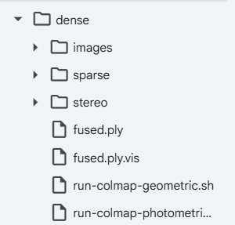

はい、**Colab上で結果を可視化することは可能**です。  
GUIが使えない代わりに、**Pythonライブラリを使って3D点群を可視化**します。

---

### 1. 生成された結果ファイルの確認

まず、`/content/south-building/dense/` 以下に以下のファイルが生成されているか確認します。

```bash
! ls -la /content/south-building/dense/
```

- `fused.ply`：デンス点群（3D点＋色情報）
- `meshed.ply`：メッシュ化されたモデル（あれば）

警告メッセージは「一部の画像が存在しないため無視した」という意味で、**処理自体は完了している**可能性が高いです。

---

### 2. PythonでPLYファイルを可視化（Colab内）

Colabでは `open3d` や `matplotlib` を使って3D点群を表示できます。

#### (1) `open3d` を使う方法（推奨）

```python
!pip install open3d
```

```python
import open3d as o3d

# PLYファイルを読み込み
pcd = o3d.io.read_point_cloud("/content/south-building/dense/fused.ply")

# 点群を表示
o3d.visualization.draw_geometries([pcd])
```

- `open3d` は3D点群・メッシュの可視化に特化しており、Colab上でも比較的安定して動作します。

#### (2) `matplotlib` を使う方法（軽量）

```python
import numpy as np
import matplotlib.pyplot as plt
from mpl_toolkits.mplot3d import Axes3D

# PLYファイルを自前で読み込む（簡易版）
def read_ply_simple(ply_path):
    with open(ply_path, 'r') as f:
        lines = f.readlines()
    # 頂点情報の開始行を探す
    for i, line in enumerate(lines):
        if "end_header" in line:
            vertex_start = i + 1
            break
    # 頂点データを読み込む
    vertices = []
    for line in lines[vertex_start:]:
        parts = line.strip().split()
        if len(parts) >= 3:
            x, y, z = map(float, parts[:3])
            vertices.append([x, y, z])
    return np.array(vertices)

points = read_ply_simple("/content/south-building/dense/fused.ply")

# 3Dプロット
fig = plt.figure(figsize=(10, 10))
ax = fig.add_subplot(111, projection='3d')
ax.scatter(points[:, 0], points[:, 1], points[:, 2], s=1, alpha=0.5)
ax.set_xlabel('X')
ax.set_ylabel('Y')
ax.set_zlabel('Z')
plt.show()
```

- 点群が大きいと重くなるので、サンプリングして表示するのも有効です。

---

### 3. ローカルで可視化する場合

Colab上で表示が重い、またはより高機能な可視化をしたい場合は、**PLYファイルをダウンロードしてローカルで可視化**します。

#### (1) PLYファイルをダウンロード

```python
from google.colab import files

# fused.ply をダウンロード
files.download("/content/south-building/dense/fused.ply")
```

#### (2) ローカルで可視化するツール

- **MeshLab**（無料・軽量・高機能）
  - https://www.meshlab.net/
  - PLYファイルをドラッグ＆ドロップするだけで3D表示可能
- **Blender**（無料・高機能）
  - https://www.blender.org/
- **CloudCompare**（無料・点群処理に特化）
  - https://www.cloudcompare.org/

---

### 4. 警告メッセージについて

```
W0712 02:17:46.410111 59944 fusion.cc:209] Ignoring image P1180193.JPG, because input does not exist.
```

この警告は、**MVS（デンス再構成）の段階で、一部の画像ファイルが見つからなかった**ことを意味します。  
原因としては：

- 画像ファイル名が変更されている
- 画像パスが間違っている
- SfMの段階でその画像が除外された

などが考えられますが、**他の画像で再構成が成功していれば、全体としては問題なく3Dモデルが生成されている**ことが多いです。

---

### まとめ

1. `fused.ply` が生成されているか確認
2. Colab上では `open3d` または `matplotlib` で可視化
3. ローカルで高機能に可視化したい場合は、PLYファイルをダウンロードして MeshLab / Blender / CloudCompare で表示

`! ls -la /content/south-building/dense/` の結果を貼っていただければ、どのファイルが生成されているか確認し、具体的な可視化コードを案内します。




