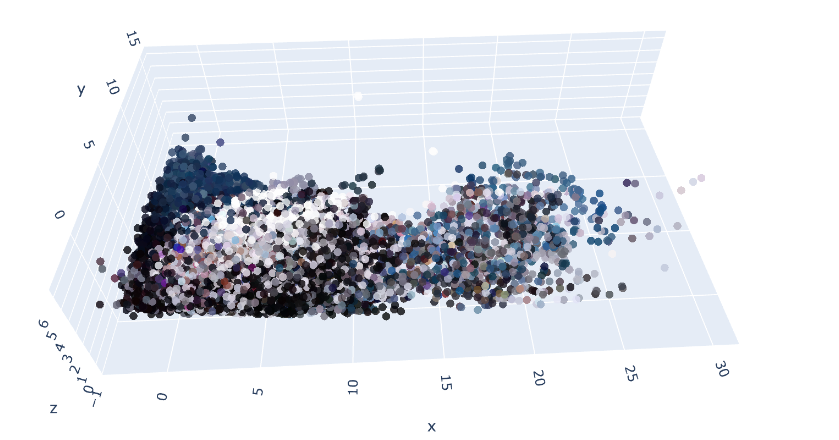

画像で収集した情報を基に3D点群と呼ばれる仮想空間上に3Dの世界を構築する技術があります。
その中でもリアルタイム性と精度を両立する手法として深層学習を用いるSLAMなるジャンルの手法が存在します。

本日テーマ：
>深層学習を応用したSLAM手法であるDroidSlamを試行してみる

## DroidSlamとは
DroidSlam（DROID-SLAM）は、**深層学習を活用した高精度な視覚SLAM（Simultaneous Localization and Mapping）手法**です。  
単眼（monocular）、ステレオ（stereo）、RGB-Dカメラのいずれにも対応し、**ロバストなカメラ姿勢推定と3次元マップ構築**を同時に行うことを目的としています。

### 1. 基本コンセプト

- **SLAM**：カメラが動きながら、自分の位置・姿勢（Localization）と周囲の3D環境（Mapping）を同時に推定する問題です。
- DroidSlamは、従来の特徴点ベースSLAM（ORB-SLAMなど）と異なり、**ディープラーニングによる特徴抽出とマッチング**を中核に据えています。
- 特に、**時系列的な視覚情報を利用した強力なトラッキング**と、**グラフ最適化による高精度なバンドル調整**を組み合わせている点が特徴です。

>__バンドル調整__  
>バンドル調整（Bundle Adjustment, BA）は、**カメラの姿勢（位置・向き）と3次元点群の位置を同時に最適化する手法**です。
>- 入力：複数の画像から得た**対応点（マッチングされた特徴点）**
>- 出力：各カメラの**姿勢**と、対応する3D点の**座標**
>__直感的なイメージ__  
>- カメラが複数の場所から同じ物体を撮影したとします。
>- 各画像で対応する点（例：ある角の点）を結びつけます。
>- バンドル調整は、「**すべてのカメラ姿勢と3D点の位置を、観測された2D画像上の位置と最もよく一致するように調整する**」最適化です。
>__数式的なイメージ（簡略）__  
>- 観測誤差（再投影誤差）を最小化します：
$$
\min_{\text{カメラ姿勢}, \text{3D点}} \sum \left\| \text{観測された2D点} - \text{再投影された2D点} \right\|^2
$$
>- ここで「再投影された2D点」は、現在のカメラ姿勢と3D点の推定値から計算した、画像平面上の位置です。
>__特徴__  
>- **同時最適化**：カメラと3D点の両方を一度に調整するため、誤差が全体に分散され、一貫性の高い解が得られます。
>- **SLAM/SfMの最終段階**：トラッキングで得た粗い推定を、バンドル調整で精密化します。
>- **計算コストが高い**：点とカメラが増えると計算量が大きくなるため、実用上は局所的なBAやインクリメンタルな手法が使われます。


### 2. 主な特徴

1. **マルチモーダル対応**
   - 単眼カメラ、ステレオカメラ、RGB-Dカメラのいずれでも動作可能です。
   - 入力画像から**深層特徴**を抽出し、それを基にカメラ姿勢と3D構造を推定します。

2. **強力なトラッキング**
   - フレーム間の**稠密（dense）な特徴マッチング**と、**グラフベースの最適化**により、動きの激しいシーンやテクスチャの少ない環境でも安定したトラッキングを実現します。
   - 時間方向の情報を積極的に利用し、**長期的な対応関係**を維持できることが強みです。

3. **バンドル調整（Bundle Adjustment）**
   - 抽出した特徴点とカメラ姿勢を、**グラフ最適化の枠組みで連続的に更新**します。
   - これにより、局所的な誤差を抑えつつ、全体として一貫性の高い地図と軌跡を得ることができます。

4. **スケール不変性・ロバスト性**
   - 単眼カメラの場合でも、**スケールのドリフトを抑える工夫**が組み込まれており、長時間のシーケンスでも安定した推定が可能です。
   - オクルージョンや動的物体が混在するシーンに対しても、ある程度ロバストに動作するよう設計されています。

### 3. アルゴリズムの流れ（概要）

1. **特徴抽出**
   - 各フレームからCNN等を用いて**高次元の視覚特徴**を抽出します。

2. **フレーム間マッチング**
   - 現在フレームと過去フレームの間で、特徴マッチングを行い、**対応点ペア**を生成します。

3. **ポーズ推定（トラッキング）**
   - 対応点ペアを用いて、カメラの相対姿勢を推定します。
   - 複数フレームにまたがる対応関係を**グラフ構造**で管理し、最適化します。

4. **マップ更新（バンドル調整）**
   - カメラ姿勢と3D点群を同時に最適化し、**一貫した地図と軌跡**を更新します。

5. **ループクローズ**
   - 過去に訪れた場所を再訪した際に検出し、**軌跡と地図の誤差を補正**するループクローズ機構も備えています。

### 4. 従来手法との違い

- **ORB-SLAM系**：手作りの特徴点（ORBなど）＋幾何ベースの最適化が中心。
- **DroidSlam**：**深層特徴＋グラフ最適化**を組み合わせることで、より複雑なシーンや低テクスチャ環境でも高い精度とロバスト性を実現しています。

### 5. 用途

- ロボットの自律ナビゲーション
- AR/VRにおける環境理解
- 動画からの3Dシーン再構築
- 自動運転・ドローンの環境認識

## 実装

Google ColabでDroidSlamを実行するまでの実装コードを整理していきます。

### 1. 環境構築とデータの準備

GPU環境であることを確認した上で、DROID-SLAMのクローン、依存ライブラリ（`torch-scatter` や `lietorch`）のビルド、およびサンプルデータ（TUM RGB-D）のダウンロードを一気に行います。

```python
# ==========================================
# 1-1. DROID-SLAMのクローンとPythonパッケージの導入
# ==========================================
%cd /content
!git clone --recursive https://github.com/princeton-vl/DROID-SLAM.git
%cd DROID-SLAM

- !pip install open3d trimesh plotly tqdm

# ==========================================
# 1-2. torch-scatter のインストール（バージョン自動適合）
# ==========================================
import torch
pyt_version = torch.__version__.split('+')[0]
cuda_version = torch.version.cuda.replace('.', '')
!pip install torch-scatter -f https://data.pyg.org/whl/torch-{pyt_version}+cu{cuda_version}.html

# ==========================================
# 1-3. C++/CUDA拡張（lietorchおよび本体）のビルド
# ==========================================
%cd thirdparty/lietorch
!python setup.py install
%cd /content/DROID-SLAM
!python setup.py install

# ==========================================
# 1-4. サンプルデータセット（TUM RGB-D）のDL
# ==========================================
!mkdir -p /content/datasets/TUM_RGBD
%cd /content/datasets/TUM_RGBD
!wget https://vision.in.tum.de/rgbd/dataset/freiburg1/rgbd_dataset_freiburg1_xyz.tgz
print("データセット解凍中...")
!tar -xf rgbd_dataset_freiburg1_xyz.tgz && rm rgbd_dataset_freiburg1_xyz.tgz

%cd /content/DROID-SLAM

```

### 2. 欠落ファイルの補完（重み・キャリブレーション）

droid slamの事前学習済みのネットワークパラメータのダウンロードと、TUM fr1用のカメラキャリブレーション（校正）ファイルを強制作成します。
今回はhugging faceに公開されているパラメータを用います。

```python
# ==========================================
# 2-1. 安定したミラーから重みファイル（droid.pth）を取得
# ==========================================
!mkdir -p /content/DROID-SLAM/checkpoints
%cd /content/DROID-SLAM/checkpoints
!rm -f droid.pth
!wget --no-check-certificate -O droid.pth "https://huggingface.co/vslamlab/droidslam/resolve/main/droid.pth?download=true"

# 容量確認（正常なら数十MB以上あります）
print("重みファイルのサイズ確認:")
!ls -lh droid.pth

# ==========================================
# 2-2. キャリブレーションファイルの作成 (fx fy cx cy)
# ==========================================
%cd /content/DROID-SLAM
import os
os.makedirs('calib', exist_ok=True)
with open('calib/tum1.txt', 'w') as f:
    f.write("517.3 516.5 318.6 255.3")

print("欠落ファイルの補完が完了しました。")

```

### 3. DROID-SLAMによる3D生成の実行

ColabのCLI環境および最新の引数仕様に合わせたコマンドです。GUI表示を無効化（`--disable_vis`）し、点群ファイルを出力します。

```python
# 最新の引数仕様（--reconstruction_path）に準拠して実行
!python demo.py \
  --imagedir=/content/datasets/TUM_RGBD/rgbd_dataset_freiburg1_xyz/rgb \
  --calib=calib/tum1.txt \
  --weights=checkpoints/droid.pth \
  --reconstruction_path=scene.ply \
  --disable_vis

```

### 4. reconstruction.pth の内容確認

生成された `reconstruction.pth` の中身を確認します。

```python
import torch

scene = torch.load(
    "/content/DROID-SLAM/reconstruction.pth",
    map_location="cpu"
)

print(scene.keys())
```

表示例：
```text
dict_keys([
'tstamps',
'images',
'disps',
'poses',
'intrinsics'
])
```

- `tstamps`：タイムスタンプ
- `images`：画像パス
- `disps`：逆深度マップ（低解像度）
- `poses`：カメラ姿勢
- `intrinsics`：カメラ内部パラメータ

### 5. reconstruct.py の準備

`reconstruct.py` を `/content/DROID-SLAM/` に保存します。

- このスクリプトは `reconstruction.pth` から `scene.ply`（カラー点群）を生成します。

```python
import torch
import numpy as np
import open3d as o3d
import cv2
from scipy.spatial.transform import Rotation


# --------------------------
# load
# --------------------------

scene = torch.load("reconstruction.pth", map_location="cpu")

images = scene["images"].numpy()
disps = scene["disps"].numpy()
poses = scene["poses"].numpy()
intrinsics = scene["intrinsics"].numpy()

N = images.shape[0]

print("Frames:", N)


# --------------------------
# point cloud
# --------------------------

pcd = o3d.geometry.PointCloud()

all_xyz = []
all_rgb = []


for i in range(N):

    img = images[i].transpose(1,2,0)

    disp = disps[i]

    fx,fy,cx,cy = intrinsics[i]

    h,w = disp.shape

    # disparity -> depth
    depth = np.zeros_like(disp)

    mask = disp > 1e-6

    depth[mask] = 1.0 / disp[mask]

    # RGBをDepth解像度へ縮小
    img_small = cv2.resize(
        img,
        (w,h),
        interpolation=cv2.INTER_LINEAR
    )

    u,v = np.meshgrid(np.arange(w),np.arange(h))

    X = (u-cx)*depth/fx
    Y = (v-cy)*depth/fy
    Z = depth

    xyz = np.stack([X,Y,Z],axis=-1).reshape(-1,3)

    rgb = img_small.reshape(-1,3)/255.

    valid = np.isfinite(xyz).all(axis=1)
    valid &= (xyz[:,2]>0)
    valid &= (xyz[:,2]<20)

    xyz = xyz[valid]
    rgb = rgb[valid]

    # pose
    t = poses[i,:3]

    q = poses[i,3:]

    R = Rotation.from_quat(q).as_matrix()

    xyz = xyz @ R.T + t

    all_xyz.append(xyz)
    all_rgb.append(rgb)


points = np.concatenate(all_xyz,axis=0)
colors = np.concatenate(all_rgb,axis=0)

print(points.shape)


pcd.points = o3d.utility.Vector3dVector(points)
pcd.colors = o3d.utility.Vector3dVector(colors)


print("Voxel Downsample...")

pcd = pcd.voxel_down_sample(0.02)


print("Remove Outlier...")

pcd,_ = pcd.remove_statistical_outlier(
    nb_neighbors=20,
    std_ratio=2.0
)

print("Estimate Normal...")

pcd.estimate_normals()


o3d.io.write_point_cloud("scene.ply",pcd)

print("saved scene.ply")
```

### 6. Colab上での3D可視化

```python
import open3d as o3d
import numpy as np
import plotly.graph_objects as go

pcd = o3d.io.read_point_cloud("/content/DROID-SLAM/scene.ply")

pts = np.asarray(pcd.points)
cols = np.asarray(pcd.colors)

# 50000点だけ表示（Colabでは十分）
idx = np.random.choice(len(pts), 50000, replace=False)

pts = pts[idx]
cols = cols[idx]

rgb = [
    f"rgb({int(r*255)},{int(g*255)},{int(b*255)})"
    for r,g,b in cols
]

fig = go.Figure(
    go.Scatter3d(
        x=pts[:,0],
        y=pts[:,1],
        z=pts[:,2],
        mode="markers",
        marker=dict(
            size=2,
            color=rgb,
            opacity=0.8
        )
    )
)

fig.update_layout(
    width=900,
    height=700,
    scene=dict(aspectmode="data")
)

fig.show()
```


### 5. 結果

出力される3D点群データは以下のようなものです。
精度はよくありませんが、一旦処理はできることが確認出来ました。



## 総括

Droid Slamを用いて画像から3D点群を生成できることは確認出来ました。
環境構築には結構な時間がかかりますが、処理は非常に高速でリアルタイムの名に恥じません。

他方、点群精度は未だよくないので、今後使えるレベルとなるように改修を行っていきたいと思います。

